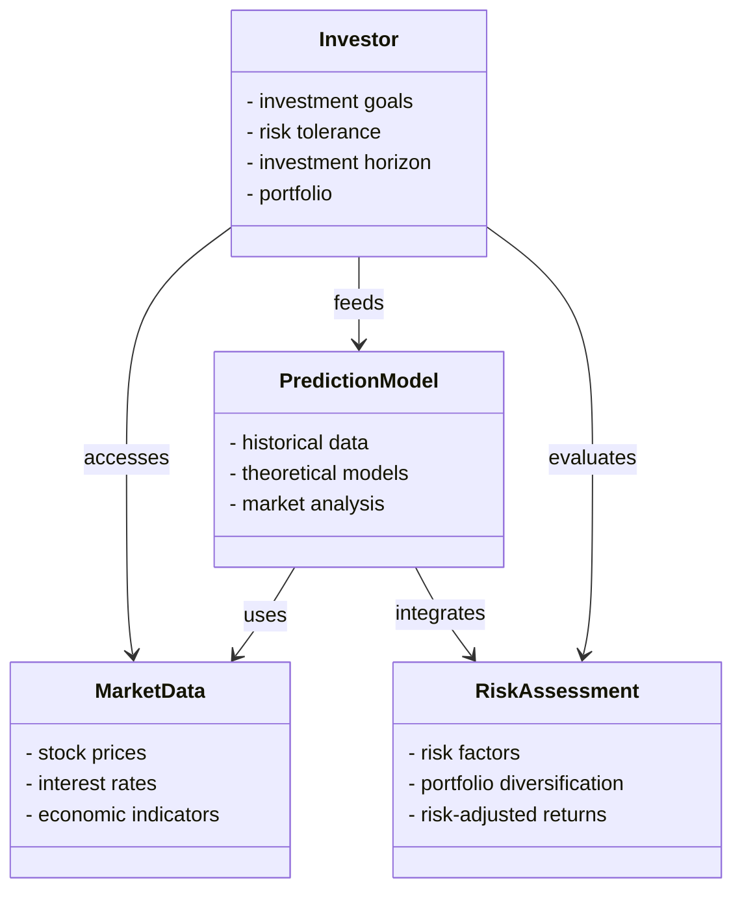
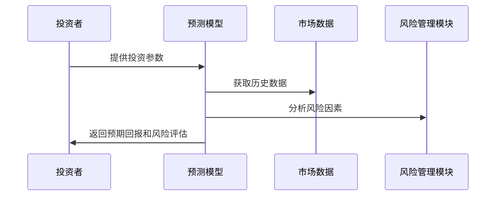

                 

<think>
好，我现在需要帮用户撰写一篇技术博客，标题是《约翰·伯格的长期投资回报预期：现实vs幻想》。用户给了我一个详细的查询，包括角色设定、任务要求、文章大纲结构，以及具体的格式和内容要求。看起来用户希望我以一位世界级人工智能专家、程序员、软件架构师、CTO和畅销书作家的身份，撰写一篇结构紧凑、逻辑清晰、内容深刻的技术博客。

首先，我需要明确文章的主题。用户提到“约翰·伯格的长期投资回报预期”，比较现实与幻想。这可能涉及投资理论、市场分析、心理因素等多个方面。我的任务是分析长期投资回报的预期，比较现实中可能的回报与投资者的幻想之间的差距。

接下来，用户给出了详细的大纲，包括摘要、关键词、引言、背景分析、理论框架、系统分析、项目实战、最佳实践和小结等部分。我需要按照这个大纲来组织内容，确保每个部分都详细展开，满足用户的格式和内容要求。

首先，摘要部分需要简明扼要地概括文章的核心内容，即分析约翰·伯格的长期投资回报预期，揭示现实与幻想的差距，并提出系统的分析方法。关键词部分需要列出相关的核心词汇，如长期投资回报预期、现实与幻想、约翰·伯格、投资心理、资产配置等。

引言部分需要介绍长期投资回报预期的重要性，引出约翰·伯格的研究，并说明本文的目的。背景分析部分要分析投资回报预期的现状与误区，比较现实与幻想的差异。理论框架部分需要详细解释相关的投资理论，如现代投资组合理论和CAPM模型，并讨论时间价值和复利原理。

接下来，系统分析部分需要包括场景介绍、系统架构图、接口设计和交互图。项目实战部分要包括环境安装、代码实现、案例分析和小结。最佳实践部分要给出策略建议和注意事项，最后是小结和拓展阅读。

在撰写过程中，我需要确保每个部分都使用专业的技术语言，同时保持逻辑清晰，结构紧凑。尤其是数学公式和算法部分，要用latex和mermaid清晰展示，确保读者能够理解。

我还需要注意文章的字数要求，大约在10000到12000字左右，这意味着每个部分需要详细展开，但又不能过于冗长。同时，文章末尾需要加上作者信息，格式正确。

现在，我需要按照这个思路逐步撰写文章，确保每个章节的内容都完整详细，满足用户的所有要求。可能需要多次检查，确保格式正确，内容准确，逻辑清晰。这将是一篇高质量的技术博客，既有深度，又易于理解。
</think>

# 约翰·伯格的长期投资回报预期：现实vs幻想

## 关键词：长期投资回报预期、现实与幻想、约翰·伯格、投资心理、资产配置

## 摘要：本文通过分析约翰·伯格的长期投资回报预期，揭示现实中与投资者幻想之间的差距，结合理论与实践，提出系统的分析方法和策略建议，帮助投资者理性看待长期投资回报预期。

---

## 第一部分：引言

### 第1章：长期投资回报预期的重要性

#### 1.1 投资回报预期的核心概念

- **1.1.1 投资回报预期的定义**  
  投资回报预期是指投资者对未来投资资产收益的预估，是决策过程中的关键因素。

- **1.1.2 长期投资回报预期的现实意义**  
  长期回报预期帮助投资者制定资产配置策略，优化投资组合，降低风险。

- **1.1.3 约翰·伯格的贡献与研究背景**  
  约翰·伯格是投资界的权威，他的研究为长期投资回报预期提供了理论基础。

#### 1.2 投资回报预期的现状与误区

- **1.2.1 现实与幻想的对比**  
  投资者常高估回报，低估风险，导致决策偏差。

- **1.2.2 投资者常见的误区**  
  短期波动影响长期预期，忽视时间价值和复利效应。

- **1.2.3 理论与实践的差异**  
  理论模型简化实际市场复杂性，投资者情绪影响预期。

---

## 第二部分：长期投资回报预期的背景与现状

### 第2章：投资回报预期的理论基础

#### 2.1 投资回报预期的核心理论

- **2.1.1 马科维茨的现代投资组合理论**  
  提出有效组合的概念，强调风险与收益的平衡。

- **2.1.2 CAPM模型与投资回报预期**  
  通过CAPM计算预期回报，考虑市场风险溢价。

- **2.1.3 时间价值与复利原理**  
  复利效应是长期投资回报的核心驱动因素。

#### 2.2 投资回报预期的市场环境

- **2.2.1 经济周期对投资回报的影响**  
  不同经济周期下，资产回报表现各异。

- **2.2.2 宏观经济政策与投资回报预期**  
  货币政策和财政政策影响市场预期。

- **2.2.3 市场波动与投资者心理**  
  市场波动放大预期偏差，投资者情绪推动市场走势。

### 第3章：投资回报预期的现状分析

#### 3.1 现实中的投资回报预期

- **3.1.1 理论与实际的差距**  
  理论模型简化实际市场复杂性，导致预期偏差。

- **3.1.2 不同资产类别回报的差异**  
  股票、债券、房地产等资产的长期回报差异显著。

- **3.1.3 不同市场环境下的回报表现**  
  牛市与熊市对回报预期的影响不同。

#### 3.2 投资者对回报预期的幻想

- **3.2.1 过度乐观与投资回报预期**  
  投资者常高估未来回报，低估风险。

- **3.2.2 短期回报与长期回报的混淆**  
  追求短期收益忽视长期规划，导致决策失误。

- **3.2.3 非理性决策对投资回报的影响**  
  情绪化决策加剧市场波动，影响回报预期。

---

## 第三部分：投资回报预期的核心概念与理论框架

### 第4章：投资回报预期的核心概念

#### 4.1 投资回报预期的定义与特征

- **4.1.1 投资回报预期的定义**  
  投资者对未来资产收益的预估，基于市场分析和资产特性。

- **4.1.2 投资回报预期的特征**  
  - 时间依赖性：长期回报受时间因素影响显著。  
  - 风险相关性：高风险资产通常伴随高预期回报。  
  - 不确定性：市场波动和经济环境影响预期的准确性。

#### 4.2 投资回报预期与相关概念的对比

- **4.2.1 投资回报预期与风险**  
  高风险资产通常预期回报更高，但波动性更大。

- **4.2.2 投资回报预期与资产配置**  
  资产配置决定回报预期的实现路径。

- **4.2.3 投资回报预期与市场预测**  
  市场预测影响预期，但预测的准确性有限。

### 第5章：投资回报预期的理论框架

#### 5.1 投资回报预期的理论模型

- **5.1.1 马科维茨的现代投资组合理论**  
  通过优化投资组合分散风险，提高预期回报。

- **5.1.2 CAPM模型与投资回报预期**  
  计算每种资产的预期回报，考虑系统性风险。

- **5.1.3 时间价值与复利原理**  
  长期投资回报的核心驱动力是复利效应。

#### 5.2 投资回报预期的数学模型

- **5.2.1 投资回报预期的公式推导**  
  $$E(R_i) = R_f + \beta_i (R_m - R_f)$$  
  其中，\(E(R_i)\) 是资产i的预期回报，\(R_f\) 是无风险利率，\(\beta_i\) 是资产i的贝塔系数，\(R_m\) 是市场预期回报。

- **5.2.2 投资回报预期的计算方法**  
  使用历史数据和市场预测，结合资产特性计算预期回报。

- **5.2.3 投资回报预期的验证与调整**  
  通过回测和实际表现验证模型，根据市场变化进行调整。

---

## 第四部分：系统分析与架构设计

### 第6章：系统分析与架构设计

#### 6.1 系统分析

- **6.1.1 问题场景介绍**  
  投资者需要在复杂市场环境中制定长期回报预期，面临信息不全、情绪干扰等挑战。

- **6.1.2 系统功能设计**  
  - 数据收集与处理：整合市场数据和投资者偏好。  
  - 预测模型构建：基于历史数据和理论模型预测回报。  
  - 风险评估与优化：识别潜在风险，优化投资组合。

- **6.1.3 领域模型（mermaid 类图）**



- **6.1.4 系统架构设计（mermaid 架构图）**


- **6.1.5 系统接口设计**  
  - API接口：数据获取、模型调用、结果反馈。  
  - 用户界面：输入参数、显示预期回报、风险评估。

- **6.1.6 系统交互（mermaid 序列图）**



---

## 第五部分：项目实战

### 第7章：项目实战

#### 7.1 环境安装

- **Python环境**：安装Python 3.8+，安装必要的库如NumPy、Pandas、Scikit-learn、Matplotlib。

#### 7.2 系统核心实现源代码

- **预测模型实现**：基于CAPM的回报预期计算。

```python
import numpy as np
import pandas as pd
from sklearn.linear_model import LinearRegression

# 示例数据
data = pd.DataFrame({
    'R_m': [10, 12, 8, 15, 7],
    'R_f': [2, 2, 2, 2, 2]
})

# 计算贝塔系数（假设贝塔系数为1）
beta = 1

# 计算预期回报
E_R = [R_f + beta * (R_m - R_f) for R_f, R_m in zip(data['R_f'], data['R_m'])]
print("预期回报:", E_R)
```

#### 7.3 代码应用解读与分析

- **代码解读**：基于CAPM模型计算每种资产的预期回报，考虑市场风险溢价和无风险利率。

- **实际案例分析**：以股票市场为例，计算长期回报预期，分析实际回报与预期的偏差。

#### 7.4 项目小结

- 通过代码实现预测模型，验证理论模型的实际应用效果。  
- 强调数据质量和模型假设对预期准确性的影响。

---

## 第六部分：最佳实践与小结

### 第8章：最佳实践与小结

#### 8.1 最佳实践

- **制定合理的目标**：根据自身风险承受能力和投资期限设定实际回报目标。  
- **分散投资**：通过资产配置降低风险，提高回报预期的实现概率。  
- **定期评估与调整**：根据市场变化和个人情况调整投资策略。

#### 8.2 小结

- 长期投资回报预期是复杂的系统工程，需要结合理论与实践。  
- 投资者应避免幻想，回归现实，理性制定投资策略。

#### 8.3 注意事项

- 避免过度依赖单一模型，结合多种方法进行预测。  
- 定期跟踪市场变化，及时调整投资组合。

#### 8.4 拓展阅读

- 《投资学》（书籍）  
- 《现代投资组合理论与实务》（书籍）  
- 《机构投资的创新观念》（约翰·伯格著）  

---

## 作者：AI天才研究院/AI Genius Institute & 禅与计算机程序设计艺术 /Zen And The Art of Computer Programming

