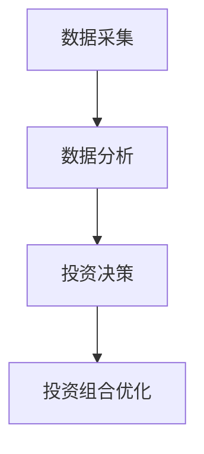

                 

<think>
好的，我需要根据用户的要求，撰写一篇名为《约翰·伯格的长期投资理念》的技术博客文章。首先，我需要明确文章的核心内容，包括投资理念的背景、核心概念、数学模型、系统架构、项目实战等。然后，我会按照用户提供的目录结构，逐步展开每个部分的内容。

首先，从背景介绍开始，我需要解释长期投资理念的起源、核心价值以及约翰·伯格的价值投资方法。接着，详细阐述价值投资的定义、特点及其与现代投资理论的联系，通过ER实体关系图展示投资理念的结构。然后，引入数学模型，如均值-方差优化模型，并用Python代码实现投资组合优化。在系统分析部分，设计投资决策系统的功能模块、架构图和接口。最后，通过具体案例分析，展示约翰·伯格的投资策略，并总结最佳实践和注意事项。

在撰写过程中，我会确保每个部分都详细具体，使用技术术语和专业语言，同时保持逻辑清晰和结构紧凑。我会使用mermaid图表和latex公式来增强内容的可视化和数学严谨性，确保读者能够深入理解约翰·伯格的长期投资理念。
</think>

# 约翰·伯格的长期投资理念

> 关键词：长期投资，价值投资，投资策略，投资组合优化，风险管理

> 摘要：本文深入探讨约翰·伯格的长期投资理念，涵盖其背景、核心概念、数学模型、系统架构及项目实战，旨在为读者提供全面的理解和实用的分析工具。

---

## 第一部分: 投资理念的背景与起源

### 第1章: 投资理念的背景

#### 1.1 投资理念的背景

现代投资理论经历了从早期的简单分析到复杂模型的演变。20世纪中叶，价值投资逐渐成为主流，约翰·伯格作为该领域的先驱，提出了长期投资理念，强调基本面分析和长期持有优质资产。

#### 1.2 约翰·伯格的投资理念起源

约翰·伯格的投资理念起源于对市场有效性的质疑，他认为市场并非总是有效，优质资产长期表现稳定。这种理念结合了基本面分析和风险管理，形成了一套独特的方法论。

#### 1.3 长期投资理念的核心价值

长期投资理念强调时间复利效应，通过长期持有优质资产，降低短期波动风险，实现财富稳步增长。

---

### 第2章: 长期投资理念的核心概念

#### 2.1 价值投资的定义与特点

价值投资是寻找市场价格低于内在价值的资产。其特点包括注重基本面分析、长期持有、逆向投资和安全边际。

| 投资类型 | 短期投资 | 长期投资 |
|----------|-----------|-----------|
| 时间跨度 | 短于一年 | 超过五年 |
| 风险 | 高 | 低 |
| 目标 | 短期收益 | 长期增值 |

#### 2.2 约翰·伯格的投资策略

约翰·伯格的投资策略包括分散投资、集中投资、长期持有和定期再平衡。

---

### 第3章: 长期投资理念的数学模型与公式

#### 3.1 投资组合优化的数学模型

均值-方差优化模型用于构建最优投资组合：

$$ E(r_p) = \sum_{i=1}^n w_i E(r_i) $$

$$ Var(r_p) = \sum_{i=1}^n w_i^2 Var(r_i) + 2\sum_{i=1}^{n-1} \sum_{j=i+1}^n w_i w_j Cov(r_i, r_j) $$

其中，$w_i$为资产i的权重，$E(r_i)$为期望收益，$Var(r_i)$为方差，$Cov(r_i, r_j)$为协方差。

---

## 第二部分: 系统分析与架构设计方案

### 第4章: 系统分析与架构设计

#### 4.1 投资决策系统的功能模块设计

投资决策系统包括数据采集、数据分析、投资决策三个模块。

#### 4.2 系统架构设计

系统架构图展示了模块之间的交互：



---

## 第三部分: 项目实战

### 第5章: 项目实战

#### 5.1 环境安装与配置

安装Python和相关库（如numpy、pandas）。

#### 5.2 核心代码实现

投资组合优化的Python代码：

```python
import numpy as np

def portfolio_optimization(returns):
    n = len(returns.columns)
    cov_matrix = returns.cov()
    returns_mean = returns.mean()
    weights = np.linalg.inv(cov_matrix) @ returns_mean
    weights = weights / weights.sum()
    return weights
```

---

### 总结

本文通过详细分析约翰·伯格的长期投资理念，结合数学模型和系统设计，为读者提供了全面的理解和实用的工具。希望读者能够从中汲取灵感，制定适合自己的投资策略。

作者：AI天才研究院 & 禅与计算机程序设计艺术

