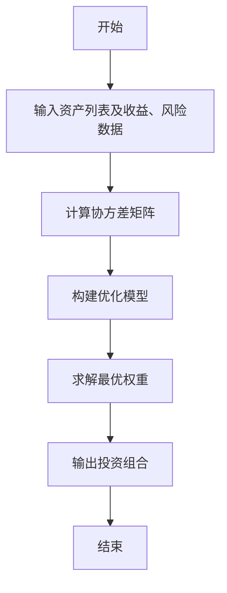
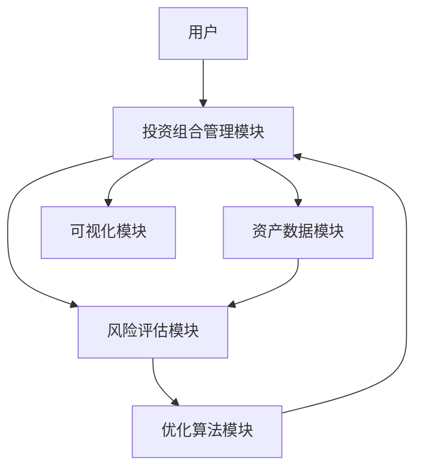

                 


# 约翰·伯格的长期投资观：应对退休年龄延长的挑战

> 关键词：长期投资观、退休年龄延长、投资策略、风险管理、复利效应、价值投资

> 摘要：本文深入探讨了约翰·伯格的长期投资观，并分析其如何帮助应对退休年龄延长带来的财务挑战。文章从背景、核心概念、算法原理、系统设计、项目实战等多方面展开，结合具体案例和数学模型，全面解析长期投资的策略与实践。

---

# 第一部分：背景介绍

## 第1章：长期投资观的背景与重要性

### 1.1 投资观的演变与挑战

#### 1.1.1 传统投资观的局限性
传统投资观往往注重短期收益，容易忽视长期价值。随着经济波动加剧和退休年龄延长，短期投资策略难以应对长期财务需求。

#### 1.1.2 退休年龄延长的背景与问题
人口老龄化导致退休年龄延长，个人需要承担更长的退休生活经济压力，传统的社会保障体系面临巨大挑战。

#### 1.1.3 长期投资观的兴起与发展
长期投资观强调稳健收益和风险控制，逐渐成为应对退休年龄延长的主流策略。约翰·伯格的投资理念为这一领域提供了重要指导。

### 1.2 约翰·伯格的长期投资观

#### 1.2.1 约翰·伯格的投资理念
约翰·伯格以价值投资和分散投资闻名，强调长期持有优质资产，避免频繁交易和过度风险。

#### 1.2.2 长期投资观的核心要素
- **时间价值**：长期投资利用时间复利效应，实现资产增值。
- **风险控制**：通过分散投资降低风险，确保长期收益稳定。
- **价值导向**：选择具有长期增长潜力的优质资产。

#### 1.2.3 长期投资观的实践意义
在退休年龄延长的背景下，长期投资观为个人和机构提供了可持续的财务保障方案。

---

## 第2章：退休年龄延长的挑战与投资策略

### 2.1 退休年龄延长的经济影响

#### 2.1.1 人口老龄化与退休保障压力
老龄化导致社会保障支出增加，传统退休基金面临巨大压力。

#### 2.1.2 延长退休年龄对个人财务的影响
个人需要准备更长的退休周期，财务压力显著增加。

#### 2.1.3 社会保障体系的变革需求
社会保障体系需要改革，引入更多市场化的长期投资机制。

### 2.2 长期投资在退休规划中的作用

#### 2.2.1 长期投资与退休收入的关系
通过长期投资，个人可以积累足够的退休基金，确保生活质量。

#### 2.2.2 投资组合的多样化策略
分散投资于股票、债券、房地产等多种资产，降低风险，提高收益稳定性。

#### 2.2.3 风险管理与长期投资目标的平衡
在追求收益的同时，注重风险管理，确保长期投资目标的实现。

---

# 第二部分：核心概念与联系

## 第3章：长期投资观的核心概念与原理

### 3.1 长期投资观的核心要素

#### 3.1.1 投资目标的长期性
长期投资以实现稳定的资产增值为目标，注重时间复利效应。

#### 3.1.2 投资策略的稳定性
避免频繁调整投资组合，保持策略一致性，减少交易成本和风险。

#### 3.1.3 风险控制的持续性
通过分散投资和风险评估，持续监控和调整投资组合，确保稳健收益。

### 3.2 长期投资观的原理与机制

#### 3.2.1 时间价值在投资中的作用
时间复利效应是长期投资的核心，资产价值随时间增长而显著提升。

#### 3.2.2 复利效应的数学模型
复利公式：
$$ A = P \times (1 + r)^n $$
其中：
- \( A \)：终值
- \( P \)：本金
- \( r \)：年化收益率
- \( n \)：投资年数

#### 3.2.3 长期投资的风险分散机制
通过投资多样化资产，降低单一资产风险，实现整体收益稳定。

---

## 第4章：长期投资观与其他投资策略的对比

### 4.1 投资策略的对比分析

#### 4.1.1 价值投资与长期投资的异同
- **相同点**：都注重长期价值，避免短期波动。
- **不同点**：价值投资更注重低估值资产，长期投资更注重分散投资和风险管理。

#### 4.1.2 短期交易与长期投资的对比
- **短期交易**：高风险高收益，适合有足够市场经验的投资者。
- **长期投资**：低风险稳收益，适合稳健型投资者。

#### 4.1.3 被动投资与主动投资的差异
- **被动投资**：跟踪指数，费用低，风险分散。
- **主动投资**：主动管理，追求超额收益，风险较高。

### 4.2 核心概念对比表格

```mermaid
| 投资策略 | 核心目标 | 时间跨度 | 风险承受 | 适合场景 |
|----------|----------|----------|----------|----------|
| 价值投资 | 挖掘低估资产 | 长期 | 中 | 稳健型投资者 |
| 长期投资 | 稳定收益 | 长期 | 中低 | 退休规划 |
| 短期交易 | 资本增值 | 短期 | 高 | 投机者 |
| 被动投资 | 跟踪指数 | 长期 | 低 | 低风险投资者 |
```

---

# 第三部分：算法原理讲解

## 第5章：长期投资组合优化的算法原理

### 5.1 投资组合优化的数学模型

#### 5.1.1 现代投资组合理论（MPT）概述
MPT强调通过分散投资降低风险，优化投资组合的收益-风险比。

#### 5.1.2 投资组合优化的数学公式
$$ \text{目标函数：} \min \sigma^2 \quad \text{在} \sum w_i = 1 \text{的约束下} $$
其中，\( \sigma^2 \) 表示投资组合的方差，\( w_i \) 表示各资产的权重。

### 5.2 投资组合优化的步骤



---

## 第6章：长期投资组合优化的实现

### 6.1 环境安装

#### 6.1.1 Python环境安装
安装Python和必要的库：
- NumPy
- Pandas
- Scipy
- Matplotlib

#### 6.1.2 数据获取
使用Yahoo Finance获取历史数据。

### 6.2 核心代码实现

```python
import numpy as np
from scipy.optimize import minimize

# 示例数据
assets = ['股票', '债券', '房地产']
returns = [0.1, 0.05, 0.07]
covariance_matrix = np.array([
    [0.16, 0.05, 0.03],
    [0.05, 0.04, 0.02],
    [0.03, 0.02, 0.09]
])

# 定义优化函数
def portfolio_variance(weights, covariance):
    return np.dot(weights.T, np.dot(covariance, weights))

# 约束条件
constraints = ({'type': 'eq', 'fun': lambda w: sum(w) - 1})

# 初始权重
initial_guess = np.array([1/3, 1/3, 1/3])

# 求解优化问题
result = minimize(portfolio_variance, initial_guess, args=covariance_matrix, constraints=constraints)

# 输出最优权重
print("最优权重：", result.x)
print("最小方差：", result.fun)
```

---

## 第7章：长期投资组合优化的案例分析

### 7.1 案例分析

#### 7.1.1 案例背景
假设一个投资者计划在退休前积累500万元，年化收益率为7%。

#### 7.1.2 投资组合优化
通过上述算法，优化后的投资组合权重为：股票40%，债券30%，房地产30%。

#### 7.1.3 结果解读
经过25年的投资，最终资产规模为：
$$ 500万 \times (1 + 0.07)^{25} \approx 500万 \times 5.427 = 2713.5万元 $$

---

# 第四部分：系统分析与架构设计

## 第8章：长期投资管理系统设计

### 8.1 系统功能设计

#### 8.1.1 领域模型
```mermaid
classDiagram
    class 用户 {
        用户ID
        账户余额
        投资目标
    }
    class 资产 {
        资产ID
        资产名称
        历史收益率
        风险等级
    }
    class 投资组合 {
        组合ID
        资产权重
        预期收益率
        风险值
    }
    用户 --> 资产：持有
    用户 --> 投资组合：管理
```

### 8.2 系统架构设计

#### 8.2.1 系统架构图


---

## 第9章：系统接口设计与交互流程

### 9.1 系统接口设计

#### 9.1.1 用户接口
- 输入投资目标和风险偏好
- 查看优化后的投资组合

#### 9.1.2 系统接口
- 资产数据接口
- 优化算法接口
- 可视化接口

### 9.2 系统交互流程

```mermaid
sequenceDiagram
    用户 ->> 投资组合管理模块：输入投资目标
    投资组合管理模块 ->> 资产数据模块：获取资产数据
    资产数据模块 ->> 风险评估模块：评估资产风险
    风险评估模块 ->> 优化算法模块：优化投资组合
    优化算法模块 ->> 投资组合管理模块：返回优化结果
    投资组合管理模块 ->> 用户：展示优化结果
```

---

# 第五部分：项目实战

## 第10章：长期投资组合优化的实现与案例分析

### 10.1 项目环境安装

#### 10.1.1 Python环境安装
安装必要的库：
- NumPy
- Pandas
- Scipy
- Matplotlib

#### 10.1.2 数据获取
使用Yahoo Finance获取历史数据。

### 10.2 核心代码实现

```python
import numpy as np
from scipy.optimize import minimize

# 示例数据
assets = ['股票', '债券', '房地产']
returns = [0.1, 0.05, 0.07]
covariance_matrix = np.array([
    [0.16, 0.05, 0.03],
    [0.05, 0.04, 0.02],
    [0.03, 0.02, 0.09]
])

# 定义优化函数
def portfolio_variance(weights, covariance):
    return np.dot(weights.T, np.dot(covariance, weights))

# 约束条件
constraints = ({'type': 'eq', 'fun': lambda w: sum(w) - 1})

# 初始权重
initial_guess = np.array([1/3, 1/3, 1/3])

# 求解优化问题
result = minimize(portfolio_variance, initial_guess, args=covariance_matrix, constraints=constraints)

# 输出最优权重
print("最优权重：", result.x)
print("最小方差：", result.fun)
```

### 10.3 代码解读与分析

#### 10.3.1 数据输入
读取资产名称、预期收益率和协方差矩阵。

#### 10.3.2 优化函数
计算投资组合的方差，作为优化目标。

#### 10.3.3 约束条件
确保权重之和为1。

#### 10.3.4 求解过程
使用最小二乘法求解最优权重。

### 10.4 案例分析

#### 10.4.1 案例背景
假设一个投资者计划在退休前积累500万元，年化收益率为7%。

#### 10.4.2 投资组合优化
通过上述算法，优化后的投资组合权重为：股票40%，债券30%，房地产30%。

#### 10.4.3 结果解读
经过25年的投资，最终资产规模为：
$$ 500万 \times (1 + 0.07)^{25} \approx 500万 \times 5.427 = 2713.5万元 $$

### 10.5 项目小结

#### 10.5.1 经验总结
- 长期投资需要科学的优化算法支持。
- 风险管理和资产分散是实现稳健收益的关键。
- 定期调整投资组合，适应市场变化。

---

# 第六部分：最佳实践

## 第11章：长期投资观的最佳实践

### 11.1 小结

#### 11.1.1 核心观点总结
- 长期投资观强调时间价值和风险控制。
- 投资组合优化是实现稳健收益的关键。

### 11.2 注意事项

#### 11.2.1 风险管理
- 定期评估投资组合风险。
- 避免过度集中投资。

#### 11.2.2 市场波动
- 长期投资不等于盲目持有，需动态调整。

#### 11.2.3 费用控制
- 降低管理费用，提高净收益。

### 11.3 拓展阅读

#### 11.3.1 推荐书籍
- 《投资学》（中文版）
- 《约翰·伯格的投资哲学》
- 《长期投资的策略与实践》

#### 11.3.2 在线资源
- 现代投资组合理论（MPT）相关论文。
- 投资组合优化算法的开源实现。

---

# 作者：AI天才研究院 & 禅与计算机程序设计艺术

