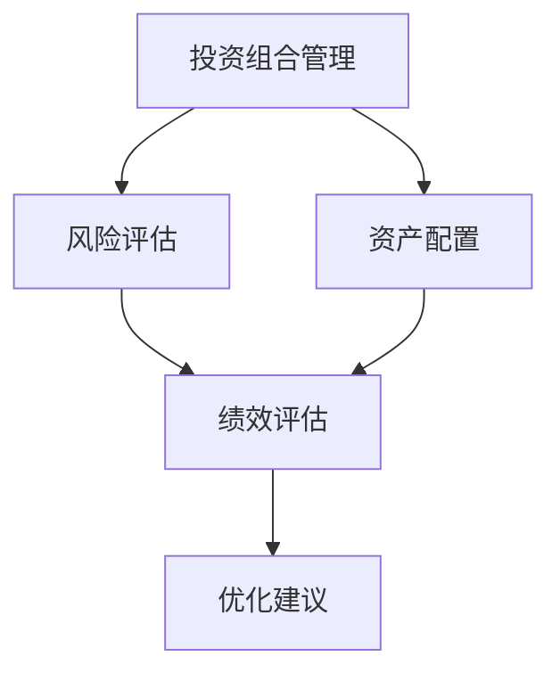

                 


# 约翰·伯格：指数基金之父的价值投资观

> 关键词：指数基金、价值投资、约翰·伯格、被动投资、投资组合

> 摘要：本文深入探讨了指数基金之父约翰·伯格的价值投资观，分析了指数基金的核心原理、与主动投资的对比、数学模型与算法、系统架构与实现，以及如何在实际投资中应用这些理论。通过理论与实践的结合，本文为读者提供了全面的理解和指导。

---

## 第一部分：指数基金的背景与起源

### 第1章：指数基金的发展历程

#### 1.1 指数基金的起源与演变

指数基金作为一种被动投资工具，起源于20世纪70年代。本文将详细探讨指数基金的起源、发展历程及其在现代金融体系中的地位。

**1.1.1 现代金融体系的背景**

现代金融体系的发展为指数基金的诞生奠定了基础。20世纪初，投资理论逐渐成熟，投资者开始寻求更高效的资产配置方式。

**1.1.2 指数投资的概念与特点**

指数投资是指通过跟踪特定市场指数来构建投资组合。其核心理念是分散投资，降低非系统性风险。

**1.1.3 约翰·伯格与指数基金的诞生**

约翰·伯格是 Vanguard 集团的创始人，他在1975年推出了第一只指数基金，标志着指数基金时代的开始。

#### 1.2 价值投资的理论基础

**1.2.1 价值投资的核心理念**

价值投资强调以合理的价格买入优质的资产，长期持有，通过时间的推移实现收益。

**1.2.2 指数基金与价值投资的结合**

指数基金通过跟踪市场指数，实现了价值投资的理念，投资者可以以较低的成本获得市场的平均收益。

**1.2.3 现代投资组合理论的启示**

现代投资组合理论（MPT）指出，通过分散投资可以降低风险，指数基金正是这一理论的实践体现。

---

## 第二部分：指数基金的核心原理

### 第2章：指数基金的构建与运作

#### 2.1 指数基金的跟踪误差

**2.1.1 跟踪误差的定义与计算**

跟踪误差是指数基金的实际收益与跟踪指数收益之间的差异。其计算公式为：

$$\text{跟踪误差} = \sqrt{\text{实际收益} - \text{预期收益}}$$

**2.1.2 跟踪误差的影响因素**

- 指数的构造方法
- 基金的复制成本
- 市场流动性

**2.1.3 如何最小化跟踪误差**

通过优化复制方法和降低交易成本可以有效减少跟踪误差。

#### 2.2 指数基金的复制方法

**2.2.1 完全复制与部分复制**

- 完全复制：完全按照指数成分股进行投资。
- 部分复制：通过优化算法选择部分成分股来降低成本。

**2.2.2 优化复制的策略**

使用数学优化方法（如最小二乘法）选择最优的成分股组合。

**2.2.3 复制误差的控制**

通过动态调整投资组合来减少复制误差。

---

## 第三部分：指数基金与主动投资的对比

### 第3章：主动投资与被动投资的优劣势分析

#### 3.1 主动投资的核心逻辑

**3.1.1 主动投资的定义与特点**

主动投资是指通过精选个股或行业，寻求超额收益。

**3.1.2 主动投资的收益来源**

- 市场预测能力
- 选股能力

**3.1.3 主动投资的风险与成本**

主动投资的高成本和高风险往往导致其收益难以超越市场平均水平。

#### 3.2 被动投资的策略优势

**3.2.1 被动投资的成本优势**

指数基金的管理费用较低，适合长期投资。

**3.2.2 被动投资的风险分散特性**

通过分散投资降低非系统性风险。

**3.2.3 被动投资的长期收益表现**

长期来看，指数基金的收益通常优于大多数主动管理基金。

---

## 第四部分：指数基金的数学模型与算法

### 第4章：指数基金的数学模型

#### 4.1 指数基金的收益模型

**4.1.1 指数基金的收益计算公式**

$$\text{收益} = \sum_{i=1}^{n} w_i \times r_i$$

其中，$w_i$ 是第 $i$ 只股票的权重，$r_i$ 是第 $i$ 只股票的收益率。

**4.1.2 股票指数的构造方法**

使用市值加权法或等权重法构建指数。

**4.1.3 指数基金的收益与市场收益的关系**

$$\text{指数基金收益} = \beta \times \text{市场收益} + \alpha$$

其中，$\beta$ 是beta系数，$\alpha$ 是alpha系数。

#### 4.2 指数基金的风险模型

**4.2.1 风险的定义与衡量指标**

- 方差：衡量收益的波动性。
- 标准差：方差的平方根，表示收益的离散程度。

**4.2.2 指数基金的风险来源**

- 市场风险
- 利率风险
- 流动性风险

**4.2.3 风险调整后的收益评估**

使用夏普比率衡量风险调整后的收益：

$$\text{夏普比率} = \frac{\text{超额收益}}{\text{收益的标准差}}$$

---

## 第五部分：指数基金的系统架构与实现

### 第5章：指数基金投资系统的架构设计

#### 5.1 系统功能设计

**5.1.1 投资组合管理模块**

- 资产配置
- 风险评估
- 绩效评估

**5.1.2 风险评估模块**

- 计算夏普比率
- 评估波动性
- 分析相关性

**5.1.3 绩效评估模块**

- 计算收益
- 评估风险调整后的收益
- 对比主动与被动投资的绩效

#### 5.2 系统架构图



---

## 第六部分：指数基金的项目实战

### 第6章：指数基金组合的构建与优化

#### 6.1 环境安装

- 安装 Python 和相关库（如 pandas、numpy）
- 使用 Jupyter Notebook 进行数据分析

#### 6.2 核心实现源代码

```python
import pandas as pd
import numpy as np

# 假设df为股票数据
def calculate_sharpe_ratio(df, risk_free_rate):
    returns = df['收益']
    excess_returns = returns - risk_free_rate
    sharpe_ratio = excess_returns.mean() / excess_returns.std()
    return sharpe_ratio

# 示例计算
data = {'收益': [0.05, 0.03, 0.04, 0.02, 0.06]}
df = pd.DataFrame(data)
risk_free_rate = 0.02
print(calculate_sharpe_ratio(df, risk_free_rate))
```

#### 6.3 案例分析与解读

通过实际数据计算夏普比率，分析指数基金的绩效表现。

---

## 第七部分：指数基金的最佳实践与总结

### 第7章：指数基金的优势与注意事项

#### 7.1 优势

- 成本低
- 风险分散
- 收益稳定

#### 7.2 注意事项

- 选择合适的指数
- 定期 rebalance
- 考虑税收影响

#### 7.3 小结

指数基金是一种适合长期投资的工具，通过分散投资降低风险，实现稳健的收益。

---

## 作者：AI天才研究院/AI Genius Institute & 禅与计算机程序设计艺术 /Zen And The Art of Computer Programming

---

