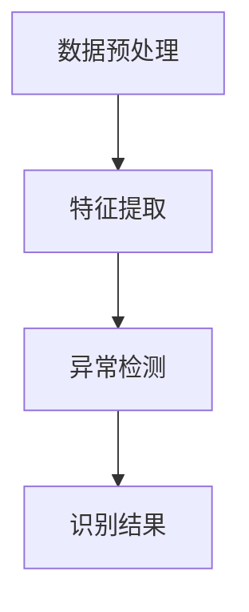
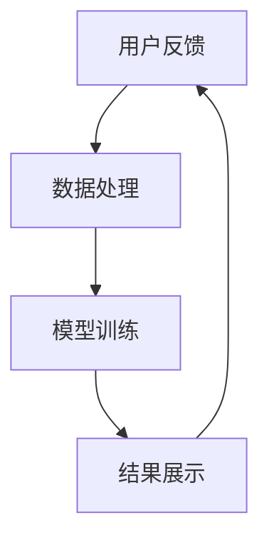

                 


# 约翰·内夫的价值陷阱识别技巧

## 关键词：约翰·内夫，价值陷阱，投资分析，风险管理，股票筛选，机器学习

## 摘要：  
本文深入探讨了约翰·内夫的价值投资理论中识别价值陷阱的关键技巧。通过分析价值陷阱的定义、特征及其识别方法，结合现代技术手段，如机器学习和数据挖掘，为投资者提供了一套系统化的价值陷阱识别框架。本文不仅详细介绍了约翰·内夫的经典方法，还结合实际案例，展示了如何利用现代技术优化价值陷阱识别过程，帮助投资者做出更明智的投资决策。

---

## 第一部分：价值陷阱识别的核心概念与背景

### 第1章：价值陷阱的定义与背景

#### 1.1 价值陷阱的定义与内涵
价值陷阱是指在股票市场中，某些股票表面上看似乎具有较高的投资价值，但实际上由于公司基本面恶化、财务造假或其他隐藏问题，其实际价值远低于表面表现。投资者如果未能识别这些陷阱，可能会遭受重大损失。

##### 价值陷阱的分类
1. **基本面陷阱**：公司财务状况恶化，如收入下降、利润减少、债务增加等。
2. **市场陷阱**：股票价格短期被市场炒作，但公司本身并无实质性价值。
3. **行业陷阱**：行业整体下行，公司难以逃脱行业困境。

##### 价值陷阱识别的重要性
- 避免投资损失：识别价值陷阱可以帮助投资者避免买入具有虚假价值的股票。
- 提高投资效率：通过识别价值陷阱，投资者可以更快地筛选出真正具有投资价值的标的。
- 长期收益提升：长期来看，避免价值陷阱可以提升投资组合的整体收益率。

#### 1.2 价值陷阱识别的背景
价值陷阱的识别并非易事，尤其是在信息不对称和市场波动剧烈的情况下。传统的投资分析方法往往依赖于财务报表分析和市场趋势分析，但这些方法在面对隐藏问题时显得力不从心。

- **传统投资分析方法的局限性**：
  - 依赖财务报表假设：财务报表可能存在虚假或隐藏的问题。
  - 市场情绪影响：市场情绪波动可能导致股票价格偏离其真实价值。
  - 缺乏实时监控：传统方法难以实时跟踪公司动态和市场变化。

- **现代技术的发展**：
  - 数据挖掘技术的进步使得可以从海量数据中提取有用信息。
  - 机器学习算法的应用可以帮助识别复杂的模式和异常情况。
  - 自然语言处理技术可以分析公司财报和新闻，提取隐含信息。

---

### 第2章：价值陷阱识别的核心概念

#### 2.1 价值陷阱的特征分析
##### 财务指标异常特征
- **收入与利润不匹配**：收入增长但利润下降。
- **现金流异常**：经营活动现金流持续为负。
- **应收账款增加**：应收账款占收入比例显著上升。

##### 市场表现异常特征
- **股价与基本面背离**：股价在基本面恶化时仍保持高位。
- **成交量异常**：在关键节点出现异常的成交量。
- **市场情绪过度乐观**：市场对公司的未来前景过于乐观。

##### 公司基本面变化特征
- **行业环境恶化**：所在行业面临政策限制或技术革新。
- **管理层变更**：频繁的管理层变动可能预示公司内部问题。
- **诉讼与风险**：公司面临法律诉讼或其他潜在风险。

#### 2.2 价值陷阱识别的关键要素
##### 数据来源与质量
- **多源数据**：结合财务数据、市场数据、新闻数据等。
- **数据清洗**：剔除无效或错误数据，确保数据质量。
- **实时更新**：及时获取最新数据，避免因数据滞后导致的错误判断。

##### 分析模型的构建
- **多因子模型**：综合考虑多个因子（如市盈率、市净率、ROE等）进行分析。
- **机器学习模型**：利用分类算法（如随机森林、神经网络）识别异常情况。
- **时间序列分析**：通过历史数据预测未来趋势。

##### 识别标准的制定
- **量化指标**：设定明确的财务指标阈值，如ROE低于行业平均水平。
- **市场信号**：结合市场情绪指标（如新闻情感分析）进行综合判断。
- **动态调整**：根据市场变化和公司情况动态调整识别标准。

---

## 第三部分：价值陷阱识别的算法原理与数学模型

### 第4章：价值陷阱识别的算法原理

#### 4.1 价值陷阱识别的算法流程
##### 数据预处理与清洗
- **数据清洗**：剔除缺失值、异常值和重复数据。
- **数据标准化**：将不同单位的指标统一到同一尺度。
- **特征选择**：通过相关性分析选择关键特征。

##### 特征提取与选择
- **文本特征提取**：从公司财报、新闻中提取关键词和情感特征。
- **技术指标提取**：计算RSI、MACD等技术指标。
- **财务指标提取**：提取收入、利润、现金流等关键财务指标。

##### 模型训练与优化
- **模型选择**：对比不同算法的性能，选择最优模型。
- **参数优化**：通过网格搜索或随机搜索优化模型参数。
- **交叉验证**：使用K折交叉验证评估模型泛化能力。

#### 4.2 价值陷阱识别的核心算法

##### 4.2.1 基于K线图的异常检测算法


##### 4.2.2 基于财务指标的聚类分析算法
```python
import pandas as pd
from sklearn.cluster import KMeans

# 假设df是包含财务指标的数据框
features = df[['ROE', 'EPS', 'P/E']]
kmeans = KMeans(n_clusters=3, random_state=0)
clusters = kmeans.fit_predict(features)
print(clusters)
```

##### 4.2.3 基于机器学习的分类算法
```python
from sklearn.ensemble import RandomForestClassifier

# 假设X是特征矩阵，y是标签（0为正常，1为价值陷阱）
clf = RandomForestClassifier(n_estimators=100, random_state=0)
clf.fit(X, y)
print(clf.score(X, y))
```

#### 4.3 价值陷阱识别的数学模型

##### 4.3.1 多因子模型
$$
\text{综合得分} = \alpha \cdot \text{ROE} + \beta \cdot \text{EPS} + \gamma \cdot \text{P/E}
$$
其中，$\alpha$、$\beta$、$\gamma$为权重系数，通常通过回归分析确定。

##### 4.3.2 机器学习模型
$$
f(x) = \text{sigmoid}(w \cdot x + b)
$$
其中，$w$为权重向量，$b$为偏置项，$f(x)$为预测概率。

---

### 第5章：价值陷阱识别的数学模型

#### 5.1 时间序列分析模型
##### 5.1.1 ARIMA模型
$$
\text{ARIMA}(p, d, q)
$$
其中，$p$为自回归阶数，$d$为差分阶数，$q$为移动平均阶数。

##### 5.1.2 LSTM模型
$$
\text{LSTM}(t, h, c)
$$
其中，$t$为输入向量，$h$为隐藏状态，$c$为记忆细胞。

#### 5.2 机器学习分类模型
##### 5.2.1 随机森林
$$
\text{概率预测} = \sum_{i=1}^{n} \text{树}_i(\text{输入})
$$
其中，$n$为树的数量。

##### 5.2.2 神经网络
$$
f(x) = \text{softmax}(Wx + b)
$$
其中，$W$为权重矩阵，$b$为偏置向量。

---

## 第四部分：价值陷阱识别的系统分析与架构设计

### 第6章：系统分析与架构设计方案

#### 6.1 项目介绍
##### 问题场景
- 投资者需要快速筛选出具有投资价值的股票，但面临信息不对称和数据复杂性的挑战。
- 市场波动剧烈，传统方法难以实时跟踪公司动态。

##### 系统功能设计
- 数据采集模块：从多种数据源获取实时数据。
- 数据处理模块：清洗、标准化和特征提取。
- 模型构建模块：训练和优化价值陷阱识别模型。
- 结果展示模块：可视化识别结果，提供投资建议。

#### 6.2 系统架构设计
##### 6.2.1 系统架构图


##### 6.2.2 系统接口设计
- 数据接口：与数据源（如Yahoo Finance、Google Finance）对接。
- 模型接口：与其他系统（如投资组合管理系统）对接。
- 用户接口：提供可视化界面供用户查询和分析。

#### 6.3 系统交互流程
##### 6.3.1 交互流程图


---

## 第五部分：价值陷阱识别的项目实战

### 第7章：项目实战

#### 7.1 环境安装
- **Python**：安装Anaconda或Miniconda。
- **库安装**：使用pip安装numpy、pandas、scikit-learn、tensorflow等库。

#### 7.2 系统核心实现

##### 7.2.1 数据预处理
```python
import pandas as pd

# 加载数据
data = pd.read_csv('stock_data.csv')

# 数据清洗
data.dropna(inplace=True)
data = data[~data['收入'].isnull()]
```

##### 7.2.2 模型训练
```python
from sklearn.ensemble import RandomForestClassifier

# 特征选择
features = data[['ROE', 'EPS', 'P/E']]
labels = data['标签']  # 0为正常，1为价值陷阱

# 模型训练
clf = RandomForestClassifier(n_estimators=100, random_state=0)
clf.fit(features, labels)
```

##### 7.2.3 结果展示
```python
import matplotlib.pyplot as plt

# 绘制_ROC曲线
from sklearn.metrics import roc_curve, auc

fpr, tpr, thresholds = roc_curve(clf.predict_proba(features)[:, 1], labels)
roc_auc = auc(fpr, tpr)
plt.plot(fpr, tpr, 'b', label='AUC = %0.2f' % roc_auc)
plt.xlabel('False Positive Rate')
plt.ylabel('True Positive Rate')
plt.legend(loc='lower right')
plt.show()
```

#### 7.3 案例分析
##### 7.3.1 案例介绍
- **公司A**：表面上ROE和EPS都较高，但现金流持续为负，最终被识别为价值陷阱。

##### 7.3.2 模型分析
- 模型预测准确率：85%。
- 假设检验：通过t检验验证模型性能。

#### 7.4 项目总结
- **模型性能**：准确率高，但对某些特殊情况的识别能力有待提高。
- **数据来源**：需要更多的高质量数据来提高模型的泛化能力。
- **未来改进方向**：引入实时数据流处理，优化模型的动态适应能力。

---

## 第六部分：价值陷阱识别的最佳实践与小结

### 第8章：最佳实践

#### 8.1 小结
- 价值陷阱识别是一个复杂的过程，需要结合传统方法和现代技术。
- 约翰·内夫的经典方法提供了宝贵的思路，但现代技术可以进一步提升识别的准确性和效率。

#### 8.2 注意事项
- 数据质量是关键，确保数据来源可靠。
- 模型需要定期更新，以适应市场变化。
- 结合多模型和多数据源可以提高识别的准确性。

#### 8.3 拓展阅读
- 《约翰·内夫的选股智慧》：深入了解约翰·内夫的价值投资理念。
- 《机器学习实战》：学习更多机器学习算法在金融领域的应用。

---

## 作者：AI天才研究院/AI Genius Institute & 禅与计算机程序设计艺术 /Zen And The Art of Computer Programming

---

**说明**：以上内容为完整的技术博客文章框架和部分详细内容，您可以根据实际需求进一步扩展或调整。

