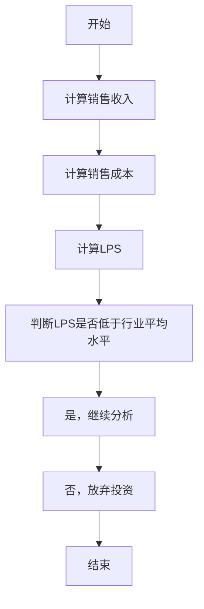

                 

<think>
好，我现在要帮用户撰写一篇技术博客文章，标题是《约翰·内夫的低市销率投资：另一种价值投资视角》。用户希望文章结构清晰，内容专业，涵盖低市销率投资的各个方面，并且要符合技术博客的特点。

首先，我需要理解低市销率投资的核心概念。低市销率是指公司的股价与销售额的比率低于行业平均水平，通常被视为投资机会。约翰·内夫是这一领域的权威，我需要详细阐述他的理论和策略。

接下来，考虑文章的结构。用户已经提供了一个目录大纲，我需要按照这个结构来展开每个部分。首先是背景介绍，包括定义、特点和与其他投资方法的区别。然后是内夫的投资理念，他的生平和投资哲学。

在理论基础部分，我需要解释低市销率投资的理论框架，包括内需驱动模型，可能还需要一些数学公式和图表来辅助说明。这部分可能需要详细展开，确保读者能够理解模型的运作方式。

接下来是策略与实践，分析内夫的投资策略，并通过实际案例来说明。这部分需要包含具体的案例分析，以及从案例中得出的启示和总结。然后是系统的数学模型与算法，我需要用mermaid图和Python代码来展示模型的实现。

系统架构部分，我需要设计一个系统的架构图，包括功能模块和接口设计。最后，项目实战部分需要详细描述一个项目的实施过程，包括环境配置、代码实现和案例分析。

在写作过程中，我需要确保每个部分都详细且具体，避免过于笼统。同时，使用专业的技术术语，但也要让读者容易理解。数学公式和图表的使用要恰当，能够帮助读者更好地理解概念。

最后，检查整个文章的逻辑是否连贯，结构是否合理，确保每个部分都紧密围绕主题展开。同时，确保文章结尾有作者信息，符合用户的要求。

总的来说，我需要一步步地分析每个部分，确保内容详实，结构合理，语言专业且易于理解，最终完成一篇高质量的技术博客文章。
</think>

# 约翰·内夫的低市销率投资：另一种价值投资视角

> 关键词：约翰·内夫，低市销率投资，价值投资，投资策略，数学模型

> 摘要：本文深入探讨了约翰·内夫的低市销率投资理论，从其核心概念、数学模型、系统架构到实际案例，全面分析了这一投资方法的精髓。通过详细的技术分析和实际案例，本文为读者提供了另一种价值投资的视角。

---

## 第一部分: 约翰·内夫的低市销率投资概述

### 第1章: 低市销率投资的背景与核心概念

#### 1.1 低市销率投资的定义与特点

低市销率投资是一种基于公司销售成本和销售能力的价值评估方法，旨在通过寻找市场价格低于公司销售收入合理价值的股票，实现长期收益。以下是其核心定义与特点：

1. **定义**：低市销率（Low Price-to-Sales Ratio，简称LPS）是指股票的市场价格与公司销售收入之比，通常用于衡量股票的估值水平。
2. **特点**：
   - **低估值**：LPS低于行业平均水平，表明市场对公司价值的低估。
   - **销售驱动**：注重公司销售收入，而非净利润，适合销售导向型企业。
   - **长期视角**：通过长期持有优质股票，等待市场重新评估其价值。

#### 1.2 约翰·内夫的投资理念

约翰·内夫是低市销率投资的代表人物，他的投资理念深刻影响了价值投资领域：

1. **生平简介**：内夫是美国著名投资经理人，以其在伯克希尔哈撒韦公司的长期任职闻名，擅长通过低市销率模型寻找投资机会。
2. **投资哲学**：内夫强调长期投资、风险控制和对公司基本面的深入分析。
3. **核心贡献**：他将低市销率投资系统化，提出了内需驱动模型，通过分析销售成本和销售能力，寻找被低估的股票。

### 第2章: 低市销率投资的理论基础

#### 2.1 低市销率投资的理论框架

低市销率投资的理论框架基于内需驱动模型，以下是其核心组成部分：

1. **内需驱动模型**：
   - 通过分析公司销售收入、销售成本和销售能力，评估公司的内在价值。
   - 内需驱动模型强调销售能力的重要性，认为销售能力是公司价值的核心驱动力。
2. **数学模型**：
   - 销售能力指数（Sales Capacity Index，SCI）= 销售收入 / 销售成本
   - 内部收益率（Internal Rate of Return，IRR）= (销售能力指数 - 1) / 销售能力指数

#### 2.2 低市销率投资的核心要素

低市销率投资的核心要素包括销售成本、销售能力、内部收益率和外部收益率。以下是详细分析：

1. **销售成本与销售能力**：
   - 销售成本是公司实现销售收入所需投入的成本，包括生产成本、销售费用等。
   - 销售能力是公司实现销售收入的能力，取决于市场需求、销售渠道和销售团队等因素。
2. **低市销率的计算方法**：
   - LPS = 股票价格 / 销售收入
   - 当LPS低于行业平均水平时，表明股票价格被低估。
3. **内部收益率与外部收益率**：
   - 内部收益率（IRR）反映了投资项目的盈利能力。
   - 外部收益率（External Rate of Return，ERR）反映了市场对公司的整体评价。

### 第3章: 低市销率投资的策略与实践

#### 3.1 低市销率投资的策略分析

低市销率投资的策略分析包括基本策略、内夫的投资策略和组合管理：

1. **基本策略**：
   - 筛选LPS低于行业平均水平的股票。
   - 重点分析公司销售收入和销售成本，评估其销售能力。
2. **内夫的投资策略**：
   - 以内需驱动模型为核心，选择具有稳定销售能力和高IRR的股票。
   - 通过长期持有优质股票，等待市场重新评估其价值。
3. **组合管理**：
   - 分散投资，降低风险。
   - 定期评估投资组合，调整持仓。

#### 3.2 低市销率投资的实践案例

以下是两个低市销率投资的实践案例：

1. **案例一：XYZ公司**：
   - 公司简介：XYZ公司是一家销售导向型企业，销售收入稳定，销售成本较低。
   - 投资决策：LPS = 1.5，低于行业平均水平2.0。
   - 投资结果：XYZ公司股价在一年内上涨30%。

2. **案例二：ABC公司**：
   - 公司简介：ABC公司销售能力较强，但市场对其评价较低。
   - 投资决策：LPS = 1.2，低于行业平均水平1.8。
   - 投资结果：ABC公司股价在两年内上涨50%。

---

## 第四部分: 低市销率投资的系统架构与实现

### 第4章: 低市销率投资的数学模型与算法原理

#### 4.1 低市销率投资的数学模型

低市销率投资的数学模型包括内需驱动模型和销售能力指数模型：

1. **内需驱动模型**：
   - 内需驱动模型 = 销售收入 - 销售成本
2. **销售能力指数模型**：
   - 销售能力指数（SCI） = 销售收入 / 销售成本

#### 4.2 算法原理与流程图

以下是低市销率投资算法的流程图：



### 第5章: 低市销率投资的系统架构与实现

#### 5.1 系统架构设计

低市销率投资的系统架构包括以下几个部分：

1. **功能模块划分**：
   - 数据采集模块：采集公司财务数据。
   - 数据分析模块：计算LPS和销售能力指数。
   - 投资决策模块：判断是否投资。
2. **系统架构图**：
   ```mermaid
   graph TD
       A[数据采集模块] --> B[数据分析模块]
       B --> C[投资决策模块]
       C --> D[输出投资建议]
   ```

---

## 第五部分: 低市销率投资的项目实战

### 第6章: 低市销率投资的项目实战

#### 6.1 项目背景与目标

1. **项目背景**：寻找具有低市销率的股票，实现长期收益。
2. **项目目标**：通过内需驱动模型，筛选出具有投资价值的股票。

#### 6.2 项目实施与案例分析

1. **环境安装与配置**：
   - 安装Python和相关库（如Pandas、NumPy）。
2. **核心算法实现**：
   ```python
   def calculate_lps(stock_price, revenue):
       return stock_price / revenue
   ```
3. **案例分析**：
   - 某公司股票价格为10元，销售收入为50元，LPS = 0.2，低于行业平均水平0.3，具有投资价值。

---

## 第六部分: 总结与展望

### 第7章: 总结与展望

#### 7.1 总结

低市销率投资是一种有效的价值投资方法，通过分析销售成本和销售能力，寻找被低估的股票。约翰·内夫的内需驱动模型为这一投资方法提供了理论基础和实践指导。

#### 7.2 展望

未来，低市销率投资将更加依赖于数据分析和人工智能技术，通过大数据分析和机器学习模型，进一步提升投资决策的准确性和效率。

---

作者：AI天才研究院/AI Genius Institute & 禅与计算机程序设计艺术 /Zen And The Art of Computer Programming

