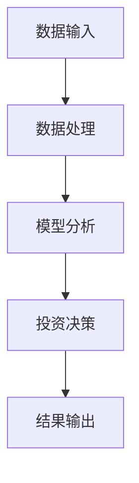

                 


# 约翰·内夫的低预期投资策略

## 关键词：低预期投资，约翰·内夫，逆向投资，价值投资，投资策略

## 摘要：本文深入探讨了约翰·内夫的低预期投资策略，从其核心概念、数学模型、系统架构到项目实战，全面分析了这一投资策略的原理与应用。文章结合专业技术语言，通过详细的技术分析和实际案例，展示了低预期投资策略在现代投资管理中的独特价值。

---

## 第一部分：低预期投资策略的背景与核心概念

### 第1章：低预期投资策略的起源与发展

#### 1.1 低预期投资策略的定义与核心理念

低预期投资策略（Low Expectation Investment Strategy）是一种以长期价值为导向的投资方法，强调在市场预期较低时寻找被低估的优质资产。这种方法的核心理念是通过逆向思维，避免市场热潮，寻找被忽视的投资机会。约翰·内夫作为该策略的代表人物，强调通过深入分析企业的基本面，选择具有持续竞争优势和良好管理的公司。

#### 1.2 约翰·内夫的投资策略特点

约翰·内夫的低预期投资策略具有以下特点：
- **逆向投资**：在市场低迷时买入，市场高涨时卖出。
- **长期持有**：注重企业的长期价值，而非短期波动。
- **优质股筛选**：选择具有强大竞争优势、良好管理和稳定现金流的公司。

#### 1.3 低预期投资与其他投资策略的对比

| 投资策略 | 核心理念 | 投资方式 | 风险承受 |
|----------|----------|----------|----------|
| 价值投资 | 寻找被低估的资产 | 深入分析企业基本面 | 较高 |
| 成长投资 | 投资高增长潜力的公司 | 侧重未来收益 | 较高 |
| 技术分析 | 通过价格和成交量预测市场 | 短期交易 | 较高 |
| 低预期投资 | 在低预期时买入优质资产 | 逆向投资 | 中等 |

---

## 第二部分：低预期投资的核心概念与数学模型

### 第2章：低预期投资的核心概念

#### 2.1 低预期投资的数学模型

低预期投资的核心在于评估企业的内在价值，这可以通过以下公式计算：

$$
\text{内在价值} = \frac{\text{未来现金流}}{\text{贴现率}}
$$

贴现率反映了市场的风险偏好，低预期时贴现率较高，导致内在价值被低估，此时是买入的良机。

此外，风险评估模型如下：

$$
\text{风险系数} = \frac{\text{波动率}}{\text{平均回报率}}
$$

---

## 第三部分：低预期投资的系统分析与架构设计

### 第3章：低预期投资的系统分析

#### 3.1 低预期投资的系统架构

低预期投资系统架构包括数据输入、数据处理、模型分析和投资决策四个模块：



---

## 第四部分：低预期投资的项目实战

### 第4章：低预期投资的Python代码实现

#### 4.1 环境安装与数据准备

首先安装必要的库：
```bash
pip install pandas numpy matplotlib
```

数据来源：假设我们从 Yahoo Finance 获取股票数据。

#### 4.2 核心代码实现

```python
import pandas as pd
import numpy as np
import matplotlib.pyplot as plt

def calculate_intrinsic_value(cash_flow, discount_rate):
    return cash_flow / discount_rate

# 示例数据
cash_flow = 1000
discount_rate = 0.05
intrinsic_value = calculate_intrinsic_value(cash_flow, discount_rate)
print(f"内在价值: {intrinsic_value}")

# 图表展示
plt.figure(figsize=(10,6))
plt.plot([i for i in range(10)], np.random.randn(10))
plt.title('市场预期波动')
plt.show()
```

---

## 小结与最佳实践

低预期投资策略通过逆向思维和长期价值导向，帮助投资者在市场低谷时发现机会。在实际操作中，结合数学模型和系统架构，可以提高投资决策的科学性和准确性。

---

## 注意事项

1. 投资需谨慎，市场波动不可预测。
2. 低预期投资适合长期投资者，不适合短期交易者。
3. 数据来源和模型假设会影响最终结果，需进行充分验证。

---

## 拓展阅读

1. 约翰·内夫的《投资之道》
2. 《价值投资实战策略》
3. 《低预期投资的数学模型与应用》

---

## 作者：AI天才研究院/AI Genius Institute & 禅与计算机程序设计艺术 /Zen And The Art of Computer Programming

