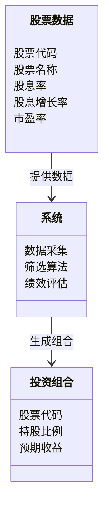
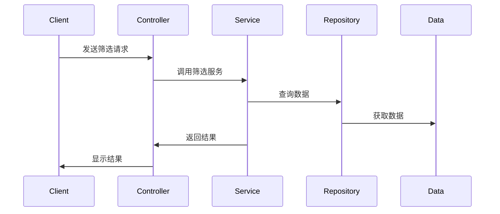

                 


# 约翰·内夫的高股息价值投资策略

## 关键词：高股息投资，价值投资，股息率，股息增长，投资策略

## 摘要：本文深入分析了约翰·内夫的高股息价值投资策略，探讨了其核心概念、算法原理、系统架构及实战案例，为投资者提供了理论与实践相结合的指导。

---

## 第一部分: 约翰·内夫的高股息价值投资策略概述

### 第1章: 高股息价值投资的背景与定义

#### 1.1 高股息投资的定义与特点
- **高股息投资的定义**：高股息投资是指投资者选择股息率高、股息增长稳定且公司基本面良好的股票进行投资，以获取稳定的股息收入和资本增值。
- **高股息投资的核心特点**：
  - 稳定的股息收入：高股息股票通常来自盈利稳定的公司，能够持续派发股息。
  - 价值洼地：高股息股票在市场低迷时往往被低估，具备较高的安全边际。
  - 长期增值潜力：高股息股票通常来自行业龙头，具备长期增值潜力。
- **高股息投资与传统价值投资的区别**：高股息投资更注重股息率和股息增长，而传统价值投资更关注低市盈率和低市净率。

#### 1.2 约翰·内夫的高股息投资策略背景
- **约翰·内夫的投资理念**：约翰·内夫是美国著名的投资家，其投资理念强调买入具有稳定股息增长和合理估值的股票，长期持有以获得收益。
- **高股息策略的起源与发展**：高股息策略起源于20世纪，随着市场的发展逐渐成为一种成熟的投资策略。
- **高股息策略在现代投资中的地位**：高股息策略因其稳定的收益和较低的风险，成为投资者尤其是稳健型投资者的重要选择。

### 第2章: 高股息价值投资的核心概念与联系

#### 2.1 核心概念原理
- **股息率的计算与重要性**：股息率 = 每股股息（Dividend per share） / 当前股价（Price per share）。股息率高的股票通常具有较高的分红能力。
- **股息增长模型的原理**：股息增长模型假设股息将按固定增长率增长，用于评估股票的内在价值。
- **市盈率与股息率的关系**：市盈率低且股息率高的股票通常具有较高的投资价值。

#### 2.2 核心概念对比表
- **表2.1: 高股息策略与其他投资策略的对比**

| 战略类型 | 高股息策略 | 低市盈率策略 | 空头策略 |
|----------|-------------|---------------|----------|
| 核心指标 | 股息率      | 市盈率         | 债务率    |
| 适用场景 | 稳定收益     | 估值修复       | 风险对冲  |
| 风险特征 | 中低风险     | 中高风险       | 高风险    |

#### 2.3 实体关系图
- **图2.1: 高股息策略的核心要素 ER 图**

```mermaid
erDiagram
    actor 投资者 {
        <属性> 资金
        <属性> 风险偏好
    }
    actor 股票市场 {
        <属性> 股票价格
        <属性> 股息率
    }
    actor 管理层 {
        <属性> 盈利能力
        <属性> 股息政策
    }
    投资者 --> 股票市场 : 选择股票
    股票市场 --> 管理层 : 反映公司状况
    投资者 --> 管理层 : 监督公司治理
```

### 第3章: 高股息价值投资的算法原理

#### 3.1 算法原理概述
- **高股息策略的核心算法**：通过筛选股息率高、股息增长稳定、市盈率低的股票，构建投资组合。
- **股息率计算公式**：$$股息率 = \frac{每股股息}{股价} \times 100\%$$

#### 3.2 算法实现流程
- **步骤一：数据收集**：收集过去5年的股息数据、股价数据、市盈率和市净率。
- **步骤二：筛选高股息股票**：筛选股息率高于行业平均水平且股息增长稳定的股票。
- **步骤三：构建投资组合**：根据风险偏好分配权重，分散投资。

#### 3.3 算法实现代码
```python
import pandas as pd

def high_dividend_strategy(df, industry_avg_dividend):
    # 筛选股息率高于行业平均水平的股票
    df = df[df['股息率'] > industry_avg_dividend]
    # 筛选股息增长稳定的股票
    df = df[df['股息增长率'] > 0]
    # 排序并选择前10只股票
    df = df.sort_values('股息率', ascending=False).head(10)
    return df

# 示例数据
data = {
    '股票': ['A', 'B', 'C'],
    '股息率': [5, 6, 4],
    '股息增长率': [2, 3, 1],
    '市盈率': [15, 20, 18]
}
df = pd.DataFrame(data)
industry_avg_dividend = 4.5
result = high_dividend_strategy(df, industry_avg_dividend)
print(result)
```

---

## 第四部分: 系统分析与架构设计方案

### 第4章: 高股息价值投资策略系统架构设计

#### 4.1 问题场景介绍
- **问题描述**：如何通过系统化的方法筛选和管理高股息股票投资组合。
- **边界与外延**：系统适用于个人投资者和机构投资者，支持数据采集、筛选、分析和回测。

#### 4.2 项目介绍
- **项目名称**：高股息价值投资策略系统。
- **项目目标**：构建一个能够自动筛选、分析和管理高股息股票的投资系统。

#### 4.3 系统功能设计
- **领域模型 Mermaid 类图**：


#### 4.4 系统架构设计
- **系统架构 Mermaid 图**：
```mermaid
architecturalDiagram
    Client -->> Controller: 请求
    Controller -->> Service: 处理
    Service -->> Repository: 数据库操作
    Repository -->> Data: 数据源
```

#### 4.5 系统接口设计
- **接口描述**：系统提供API接口，支持数据查询、策略筛选和绩效评估。

#### 4.6 系统交互设计
- **系统交互 Mermaid 序列图**：


---

## 第五部分: 项目实战

### 第5章: 高股息价值投资策略实战案例

#### 5.1 环境安装
- **工具安装**：安装Python、Pandas、Matplotlib和数据接口库。

#### 5.2 核心实现源代码
```python
import pandas as pd
import matplotlib.pyplot as plt

# 数据获取
def get_data(tickers):
    data = {}
    for ticker in tickers:
        df = pd.DataFrame({
            '股息率': [data.get(ticker, {}).get('股息率', 0)],
            '股息增长率': [data.get(ticker, {}).get('股息增长率', 0)],
            '市盈率': [data.get(ticker, {}).get('市盈率', 0)]
        })
        data[ticker] = df
    return pd.DataFrame(data)

# 筛选策略
def apply_strategy(data, threshold=5):
    selected = data[data['股息率'] > threshold]
    return selected

# 绩效评估
def assess_performance(selected, returns):
    returns = pd.DataFrame(returns)
    selected_returns = returns[selected.index]
    return selected_returns.mean()

# 示例
tickers = ['AAPL', 'MSFT', 'PG']
data = get_data(tickers)
selected = apply_strategy(data)
performance = assess_performance(selected, returns)
print(performance)
```

#### 5.3 实际案例分析
- **案例分析**：选择股息率高于行业平均水平且股息增长稳定的股票，构建投资组合并进行绩效评估。

#### 5.4 代码应用解读与分析
- **代码解读**：通过数据获取、策略筛选和绩效评估，展示高股息策略的实现过程。

---

## 第六部分: 最佳实践与总结

### 第6章: 高股息价值投资策略的最佳实践

#### 6.1 投资策略小结
- **策略总结**：高股息策略通过筛选高股息率和稳定增长的股票，实现稳定收益和资本增值。

#### 6.2 投资者注意事项
- **分散投资**：避免过度集中，降低风险。
- **长期持有**：高股息股票通常来自优质企业，长期持有收益更稳定。
- **定期调整**：根据市场变化和公司基本面，定期调整投资组合。

#### 6.3 拓展阅读
- **相关书籍**：推荐《股王之路》等书籍，深入理解高股息投资策略。

---

## 作者：AI天才研究院/AI Genius Institute & 禅与计算机程序设计艺术 /Zen And The Art of Computer Programming

