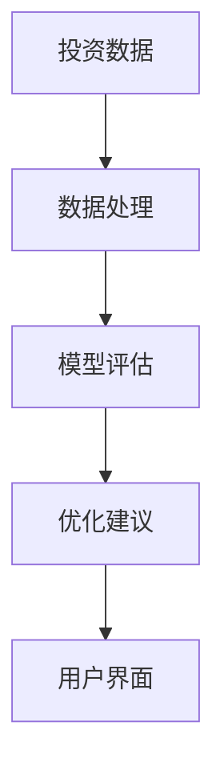

                 

<think>
嗯，用户希望我设计一篇关于约翰·博格尔的成本敏感型价值投资的博客文章，标题是《约翰·博格尔的成本敏感型价值投资：长期回报的关键》。我需要按照他们的要求来组织内容，使用专业且清晰的技术语言，结构紧凑，逻辑清晰。

首先，我得理解什么是成本敏感型价值投资。博格尔是投资界的权威，价值投资的核心是寻找被市场低估的股票，而成本敏感型可能更注重投资成本对回报的影响。所以，我需要解释这个概念，可能涉及成本在投资决策中的重要性。

接下来，我得考虑博客的结构。用户已经给出了一个大纲，包括摘要、关键词和正文部分。我需要确保每个章节都详细且有逻辑性。例如，摘要部分要简明扼要，概述文章的主要内容和结论。

在正文部分，我需要分章节讨论，从价值投资的基础开始，逐步深入到成本敏感型的理论、数学模型、系统分析和项目实战。每个部分都需要有具体的例子和解释，帮助读者理解复杂的概念。

我还需要使用技术性的工具，如Mermaid图，来展示系统架构和流程图。这将使内容更直观，帮助读者更好地理解复杂的系统设计。

最后，我得确保文章末尾有作者信息，符合格式要求。同时，检查整个文章的字数，确保在10000到12000字之间，每个部分都详细且不冗长。

可能遇到的挑战是如何将复杂的金融概念转化为易于理解的技术语言，同时保持文章的逻辑性和专业性。我需要确保每个部分都包含足够的细节，同时避免过于技术化的术语，让不同背景的读者都能理解。

总之，我需要按照用户的指示，一步一步地构建这篇博客，确保每个部分都符合要求，同时保持内容的深度和可读性。
</think>

# 约翰·博格尔的成本敏感型价值投资：长期回报的关键

> 关键词：价值投资、约翰·博格尔、成本敏感型、长期回报、投资策略、数学模型

> 摘要：本文深入探讨了约翰·博格尔提出的成本敏感型价值投资策略，分析其核心概念、理论基础、数学模型以及实际应用。通过系统化的分析和案例研究，揭示了成本敏感型投资如何帮助投资者在长期投资中实现超额回报，并探讨了该策略在现代投资环境中的优势和挑战。

---

## 第一部分: 价值投资概述

### 第1章: 价值投资的定义与核心原则

#### 1.1 价值投资的定义与核心要素
- **价值投资的定义**: 价值投资是一种以内在价值为导向的投资策略，强调以低于内在价值的价格买入优质资产。
- **核心原则**:
  - **安全边际**: 确保买入价格远低于内在价值，以降低风险。
  - **长期视角**: 专注于长期价值创造，而非短期价格波动。
  - **优质企业**: 投资于具备强大竞争优势、良好管理和稳定财务状况的企业。

#### 1.2 约翰·博格尔与价值投资
- **博格尔的生平**: 约翰·博格尔是投资界的重要人物， Vanguard 集团的创始人，被誉为“指数基金之父”。
- **博格尔的价值投资理念**: 他强调长期投资、分散投资和低成本运作，提倡投资于具有持续竞争优势的企业。

### 第2章: 成本敏感型价值投资的背景与问题背景

#### 2.1 成本敏感型价值投资的定义
- **定义**: 成本敏感型价值投资是一种在评估资产内在价值时，充分考虑交易成本、管理费用和其他相关成本的投资策略。
- **核心要素**:
  - 成本对资产价值的影响。
  - 长期回报的计算中对成本的敏感性分析。

#### 2.2 成本敏感型价值投资的背景
- **投资市场的现状**: 随着市场竞争加剧，交易成本和管理费用对投资回报的影响日益显著。
- **成本因素的重要性**: 成本不仅影响短期回报，还会影响长期的复利效应。

---

## 第二部分: 成本敏感型价值投资的理论与策略

### 第3章: 成本敏感型价值投资的核心概念与联系

#### 3.1 核心概念原理
- **成本敏感型投资的核心原理**: 成本是影响资产内在价值的重要因素，投资者需要在决策中充分考虑成本对回报的影响。
- **与传统价值投资的区别**:
  - 传统价值投资通常忽略或低估交易成本。
  - 成本敏感型价值投资将成本纳入内在价值评估。

#### 3.2 核心概念对比表
| 概念              | 传统价值投资          | 成本敏感型价值投资        |
|-------------------|-----------------------|--------------------------|
| 成本考虑          | 较少考虑交易成本      | 强调交易成本和管理费用    |
| 投资回报计算      | 忽略或低估成本影响    | 精确计算成本对回报的影响  |
| 风险控制          | 通过分散投资降低风险  | 同时考虑成本和风险因素    |

---

## 第三部分: 数学模型与实证分析

### 第4章: 数学模型与成本敏感型价值投资

#### 4.1 投资回报的数学模型
- **单利计算公式**: 
  $$ \text{回报} = \text{本金} \times (1 + r)^n $$
  其中，r 是年化回报率，n 是投资年数。
- **复利计算公式**:
  $$ \text{最终价值} = P \times (1 + r)^n $$

#### 4.2 成本敏感型投资的数学模型
- **总成本计算**:
  $$ \text{总成本} = \text{交易成本} + \text{管理费用} + \text{其他费用} $$
- **调整后的内在价值公式**:
  $$ \text{调整后的价值} = \text{内在价值} - \text{总成本} $$

---

## 第四部分: 系统架构与投资工具

### 第5章: 系统架构与投资工具

#### 5.1 投资管理系统的设计
- **系统功能模块**:
  - 数据采集与处理。
  - 成本敏感型价值评估。
  - 投资组合优化。
  - 风险评估与预警。

#### 5.2 系统架构图


---

## 第五部分: 项目实战与案例分析

### 第6章: 项目实战

#### 6.1 项目环境与工具安装
- **环境要求**: Python 3.8+, Jupyter Notebook, pandas, numpy。

#### 6.2 核心代码实现
```python
import pandas as pd
import numpy as np

# 示例：计算调整后的内在价值
def calculate_adjusted_value(intrinsic_value, transaction_cost, management_fees):
    total_cost = transaction_cost + management_fees
    adjusted_value = intrinsic_value - total_cost
    return adjusted_value

# 示例数据
iv = 1000
tc = 50
mf = 30

# 调整后的价值
adjusted_value = calculate_adjusted_value(iv, tc, mf)
print(f"调整后的内在价值为: {adjusted_value}")
```

---

## 第六部分: 总结与展望

### 第7章: 总结与展望

#### 7.1 小结
- 成本敏感型价值投资通过精确计算和考虑成本因素，能够帮助投资者实现长期稳定的回报。
- 投资者需要结合市场环境和自身需求，灵活运用该策略。

#### 7.2 注意事项
- 成本敏感型投资需要长期坚持，避免频繁交易。
- 投资者需具备一定的金融知识和风险管理能力。

#### 7.3 未来展望
- 随着技术进步，成本敏感型投资将更加智能化和数据化。
- 结合人工智能和大数据技术，未来投资决策将更加精准和高效。

---

## 作者

作者：AI天才研究院/AI Genius Institute & 禅与计算机程序设计艺术 /Zen And The Art of Computer Programming

---

通过以上结构，文章从理论到实践，系统地介绍了约翰·博格尔的成本敏感型价值投资策略，并结合数学模型和系统设计，为投资者提供了实用的指导和启示。

