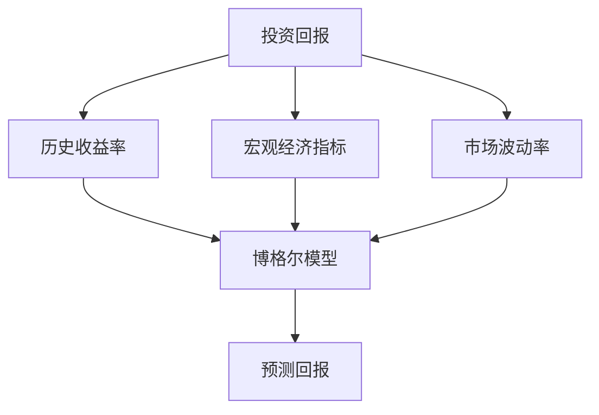
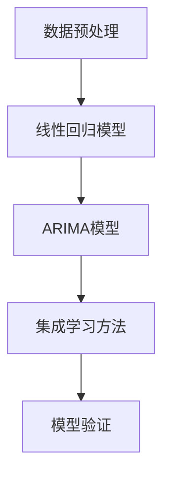
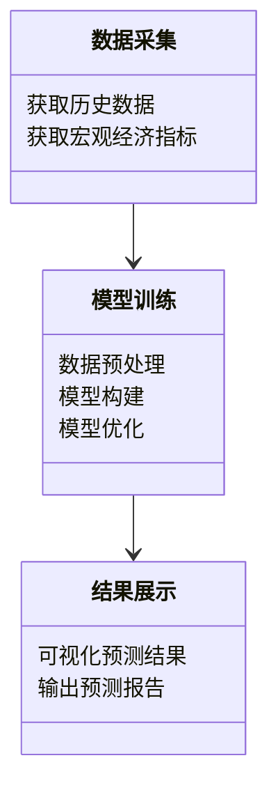
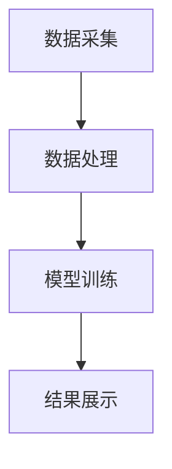
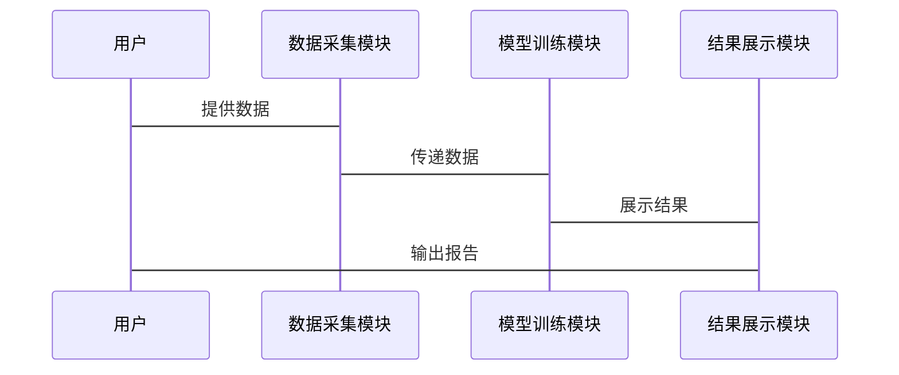

                 

<think>
好的，我现在需要撰写一篇关于约翰·博格尔的长期投资回报预测模型的技术博客文章。首先，我需要理解这个模型的核心概念和背景，然后逐步展开分析，确保逻辑清晰，内容详尽。

首先，我得明确文章的结构。根据用户提供的大纲，文章将分为几个部分：背景介绍、核心概念与联系、算法原理讲解、数学模型、系统架构、项目实战、总结与展望。每个部分下还有小节，需要详细展开。

接下来，我需要收集和整理关于约翰·博格尔的信息，确保在背景介绍中准确无误。博格尔是投资界的重要人物，长期投资回报预测模型是他的一个贡献，我需要解释为什么这个模型重要，它解决了什么问题，以及它的独特之处。

在核心概念部分，我需要详细阐述模型的基本原理，包括投资回报的计算、复利效应，以及模型的核心假设。这里可能需要使用一些数学公式，比如复利计算公式，我会用LaTeX来表示，确保格式正确。

算法原理部分，我需要解释模型是如何构建的，包括数据预处理、模型选择和优化。这部分可能涉及线性回归、时间序列模型（如ARIMA）和集成学习方法。我会用mermaid流程图来展示数据预处理和模型构建的步骤，帮助读者更好地理解。

数学模型部分，我需要详细推导模型的公式，可能涉及时间序列分析和回归模型。我会用LaTeX公式展示，确保数学表达准确。同时，我还需要解释每个公式的含义和应用，使读者能够理解模型的工作原理。

系统架构部分，我需要设计一个模块化的系统架构图，展示数据采集、模型训练、预测和结果展示等模块的交互。这部分我会使用mermaid架构图来表示，帮助读者理解系统的整体结构和各模块之间的关系。

项目实战部分，我需要提供一个具体的实现案例，包括环境搭建、数据获取、特征工程、模型实现和结果分析。这部分可能需要提供Python代码，解释每一步的操作和代码的功能，使读者能够跟随步骤进行实践。

最后，在总结与展望部分，我需要回顾模型的主要内容，总结其优缺点，并提出未来可能的改进方向和研究领域。这里可能包括对模型局限性的讨论，以及如何结合其他因素来提高预测的准确性。

在写作过程中，我需要确保语言专业且易懂，逻辑清晰，结构紧凑。同时，要使用吸引读者的章节标题，确保文章整体流畅，内容丰富。最后，检查文章是否符合字数要求，确保每个部分都有足够的细节，帮助读者深入理解约翰·博格尔的长期投资回报预测模型。

现在，我可以开始按照这个思路逐步撰写文章，确保每个部分都涵盖必要的内容，并且结构合理，逻辑严密。
</think>

# 约翰·博格尔的长期投资回报预测模型

> 关键词：投资回报预测，长期投资，约翰·博格尔，时间序列分析，回归模型，系统架构设计

摘要：本文深入探讨了约翰·博格尔提出的长期投资回报预测模型，分析其核心原理、算法设计、系统架构及实际应用。文章首先介绍了模型的背景与意义，接着详细阐述了其数学基础和算法实现，最后通过项目实战展示了模型的应用过程，并总结了最佳实践和未来研究方向。

---

# 第1章: 背景介绍

## 1.1 问题背景

### 1.1.1 长期投资回报预测的必要性
在金融市场中，准确预测投资回报是投资者追求超额收益的关键。长期投资回报预测模型能够帮助投资者制定更科学的投资策略，减少决策的盲目性。

### 1.1.2 现有模型的局限性
传统的投资回报预测模型往往过于简化，未能充分考虑市场波动、经济周期和投资者行为等多重因素的影响，导致预测结果偏差较大。

### 1.1.3 博格尔模型的提出动机
约翰·博格尔基于其丰富的投资经验，发现市场波动和宏观经济指标对长期回报有显著影响，因此提出了一种结合市场中性与基本面分析的预测模型。

---

## 1.2 问题描述

### 1.2.1 投资回报预测的核心问题
投资回报预测的核心问题是如何在不确定的市场环境中，准确估算未来投资组合的收益。

### 1.2.2 长期投资中的不确定性
长期投资面临市场波动、经济周期变化等不确定性，这些因素会显著影响投资回报。

### 1.2.3 博格尔模型的目标与范围
博格尔模型的目标是通过分析历史数据和宏观经济指标，预测长期投资回报率，并评估相关风险。

---

## 1.3 问题解决

### 1.3.1 博格尔模型的基本思路
模型通过分析历史收益率和宏观经济指标，结合时间序列分析和回归模型，预测未来的投资回报率。

### 1.3.2 模型的核心假设
- 历史收益率可以部分预测未来回报。
- 宏观经济指标（如GDP增长率、利率）对投资回报有显著影响。
- 投资者行为和市场情绪对长期回报有一定影响。

### 1.3.3 模型的适用场景
适用于长期投资策略制定、资产配置优化等场景。

---

## 1.4 边界与外延

### 1.4.1 模型的适用边界
- 适用于长期（10年以上）投资回报预测。
- 适用于宏观经济稳定的市场环境。

### 1.4.2 模型的外延与扩展
- 可扩展至多资产类别配置。
- 可结合机器学习模型提高预测精度。

### 1.4.3 模型的局限性与改进方向
- 假设过于简化，需结合实际情况调整。
- 数据质量和时间跨度影响预测精度。

---

## 1.5 概念结构与核心要素

### 1.5.1 模型的基本架构
$$ \text{预测回报率} = f(\text{历史收益率}, \text{宏观经济指标}, \text{市场波动率}) $$

### 1.5.2 核心要素的定义与关系
- **历史收益率**：过去的表现用于预测未来。
- **宏观经济指标**：如GDP增长率、利率等。
- **市场波动率**：反映市场风险。

### 1.5.3 模型的数学表达式
$$ R_{\text{预测}} = \alpha R_{\text{历史}} + \beta X_{\text{宏观经济}} + \epsilon $$

其中，$R_{\text{预测}}$为预测回报率，$R_{\text{历史}}$为历史收益率，$X_{\text{宏观经济}}$为宏观经济指标，$\alpha$和$\beta$为回归系数，$\epsilon$为误差项。

---

# 第2章: 核心概念与联系

## 2.1 核心概念原理

### 2.1.1 投资回报的定义与计算
投资回报通常通过复利计算，公式为：
$$ R = (1 + r_1)(1 + r_2)...(1 + r_n) - 1 $$

### 2.1.2 长期投资的复利效应
复利效应在长期投资中显著，公式为：
$$ A = P(1 + r)^n $$

### 2.1.3 博格尔模型的数学基础
模型基于多元回归分析，公式为：
$$ R_{\text{预测}} = \beta_0 + \beta_1 X_1 + \beta_2 X_2 + ... + \beta_k X_k + \epsilon $$

---

## 2.2 概念属性特征对比表格

| 概念         | 属性         | 特征描述                     |
|--------------|--------------|-----------------------------|
| 投资回报     | 时间跨度     | 长期（≥10年）               |
|              | 计算方式     | 复利计算                     |
|              | 影响因素     | 市场波动、经济周期、投资策略 |
| 博格尔模型   | 输入变量     | 历史收益率、宏观经济指标    |
|              | 输出结果     | 预测回报率、风险评估         |
|              | 独特属性     | 结合市场中性与基本面分析      |

---

## 2.3 ER实体关系图架构



---

# 第3章: 算法原理讲解

## 3.1 数据预处理

### 3.1.1 数据清洗与标准化
- 清洗缺失值和异常值。
- 标准化数据，使其具有可比性。

### 3.1.2 时间序列数据的处理
- 分解时间序列数据为趋势、季节性和噪声部分。

### 3.1.3 特征工程
- 构造新特征，如移动平均、波动率等。

---

## 3.2 模型构建

### 3.2.1 线性回归模型
使用多元线性回归模型：
$$ R_{\text{预测}} = \beta_0 + \beta_1 X_1 + \beta_2 X_2 + ... + \beta_k X_k + \epsilon $$

### 3.2.2 时间序列模型（ARIMA）
ARIMA模型用于处理时间序列数据：
$$ ARIMA(p, d, q) $$

### 3.2.3 集成学习方法
使用集成学习（如随机森林）提高预测精度。

---

## 3.3 模型优化

### 3.3.1 参数调优
通过交叉验证选择最优参数。

### 3.3.2 模型验证与评估
使用均方误差（MSE）和R平方值评估模型性能。

### 3.3.3 罗吉斯回归
适用于分类问题，如预测市场上涨或下跌。

---

## 3.4 算法流程图



---

# 第4章: 数学模型

## 4.1 时间序列分析

### 4.1.1 ARIMA模型
ARIMA模型用于预测未来值：
$$ ARIMA(p, d, q) $$

### 4.1.2 GARCH模型
GARCH模型用于估计波动率：
$$ GARCH(p, q) $$

---

## 4.2 回归模型

### 4.2.1 多元线性回归
回归方程为：
$$ R_{\text{预测}} = \beta_0 + \beta_1 X_1 + ... + \beta_k X_k + \epsilon $$

### 4.2.2 逻辑回归
适用于二分类问题。

---

## 4.3 统计推断

### 4.3.1 假设检验
检验回归系数的显著性。

### 4.3.2 置信区间
估计预测区间的范围。

---

## 4.4 方程组表示

$$
\begin{cases}
R_{\text{预测}} = \beta_0 + \beta_1 X_1 + \beta_2 X_2 + ... + \beta_k X_k + \epsilon \\
\text{其中，} \epsilon \sim N(0, \sigma^2)
\end{cases}
$$

---

# 第5章: 系统架构设计

## 5.1 问题场景介绍

### 5.1.1 问题背景
构建一个长期投资回报预测系统，帮助投资者制定科学的投资策略。

### 5.1.2 项目介绍
开发一个基于博格尔模型的投资回报预测系统，包含数据采集、模型训练和结果展示模块。

---

## 5.2 系统功能设计

### 5.2.1 领域模型


---

## 5.3 系统架构设计

### 5.3.1 模块划分
- 数据采集模块
- 数据处理模块
- 模型训练模块
- 结果展示模块

### 5.3.2 架构图


---

## 5.4 系统接口设计

### 5.4.1 数据接口
- 输入：历史收益率、宏观经济指标。
- 输出：预测回报率。

### 5.4.2 用户接口
- 输入：投资期限、风险偏好。
- 输出：预测报告。

---

## 5.5 系统交互流程

### 5.5.1 交互流程图


---

# 第6章: 项目实战

## 6.1 环境安装

### 6.1.1 Python环境搭建
安装Python 3.8及以上版本，安装必要的库：
```bash
pip install numpy pandas sklearn matplotlib
```

---

## 6.2 系统核心实现

### 6.2.1 数据预处理
```python
import pandas as pd
import numpy as np

# 获取数据
data = pd.read_csv('data.csv')
# 数据清洗
data.dropna(inplace=True)
# 标准化处理
from sklearn.preprocessing import StandardScaler
scaler = StandardScaler()
data_scaled = scaler.fit_transform(data)
```

### 6.2.2 模型实现
```python
from sklearn.linear_model import LinearRegression
from sklearn.metrics import mean_squared_error

# 模型训练
model = LinearRegression()
model.fit(X_train, y_train)
# 模型预测
y_pred = model.predict(X_test)
# 评估指标
mse = mean_squared_error(y_test, y_pred)
print(f'MSE: {mse}')
```

### 6.2.3 算法优化
```python
from sklearn.ensemble import RandomForestRegressor

# 使用随机森林模型
rf_model = RandomForestRegressor()
rf_model.fit(X_train, y_train)
y_pred_rf = rf_model.predict(X_test)
mse_rf = mean_squared_error(y_test, y_pred_rf)
print(f'MSE: {mse_rf}')
```

---

## 6.3 实际案例分析

### 6.3.1 数据来源
使用历史股票数据和宏观经济指标进行预测。

### 6.3.2 模型实现
按照上述代码实现模型，并进行测试。

### 6.3.3 结果分析
分析预测结果与实际值的差异，评估模型的准确性。

---

## 6.4 项目小结

### 6.4.1 核心实现总结
- 数据预处理和特征工程是关键步骤。
- 集成学习方法（如随机森林）通常表现优于线性回归。

### 6.4.2 实践中的注意事项
- 数据质量直接影响预测精度。
- 模型需定期更新，以适应市场变化。

---

# 第7章: 总结与展望

## 7.1 核心内容总结

### 7.1.1 模型的核心内容
- 结合历史数据和宏观经济指标预测回报。
- 使用多元回归和集成学习方法。

### 7.1.2 系统架构的设计思路
- 模块化设计，便于扩展和维护。

## 7.2 模型的优缺点

### 7.2.1 优点
- 能够部分预测长期投资回报。
- 方法简单，易于实现。

### 7.2.2 缺点
- 假设过于简化，忽视了一些重要因素（如市场情绪）。
- 预测精度受限于数据质量和模型复杂度。

---

## 7.3 未来研究方向

### 7.3.1 模型改进
- 结合机器学习算法（如神经网络）提高预测精度。
- 引入更多特征变量，如市场情绪指标。

### 7.3.2 系统优化
- 实现实时数据处理和动态预测。
- 开发用户友好的可视化界面。

---

## 7.4 最佳实践 Tips

### 7.4.1 实践建议
- 定期更新模型，以适应市场变化。
- 结合多种模型进行预测，提高准确性。

### 7.4.2 注意事项
- 数据来源需可靠，避免偏差。
- 模型结果需结合实际情况进行调整。

---

# 作者

作者：AI天才研究院 & 禅与计算机程序设计艺术

