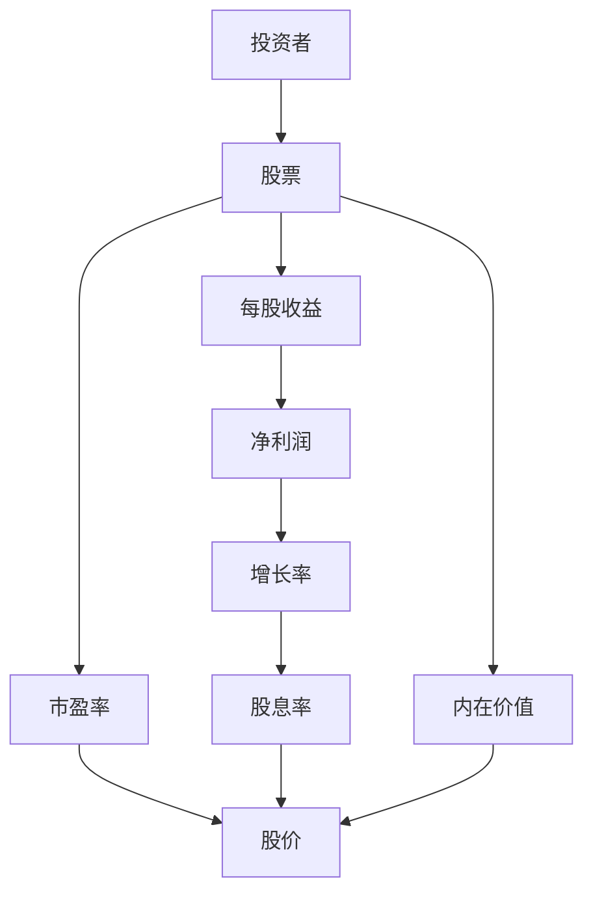
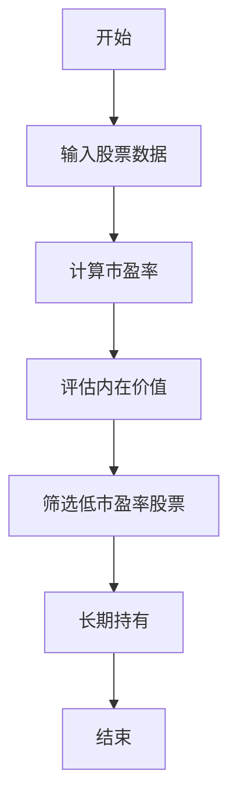

                 

# 约翰·奈夫的低市盈率投资法：简单而有效的价值策略

> 关键词：低市盈率投资法、约翰·奈夫、价值投资、市盈率、内在价值、股票筛选、投资策略

> 摘要：本文深入分析了约翰·奈夫的低市盈率投资法，探讨了其核心理念、数学模型、算法原理和系统架构设计。通过实际案例分析和Python代码实现，展示了低市盈率投资法在实践中的应用，为投资者提供了有效的策略参考。

---

# 第一部分: 低市盈率投资法的背景与基础

## 第1章: 低市盈率投资法的起源与核心理念

### 1.1 低市盈率投资法的起源

低市盈率投资法是一种基于价值投资的策略，其核心思想是寻找市场价格低于其内在价值的股票。这种方法起源于20世纪，由本杰明·格雷厄姆和大卫·多德提出，并由约翰·奈夫进一步发展和完善。

- **本杰明·格雷厄姆的贡献**：格雷厄姆是价值投资的鼻祖，他提出了“安全边际”和“内在价值”的概念，强调以低于内在价值的价格买入股票。
- **约翰·奈夫的贡献**：奈夫在格雷厄姆的基础上，将低市盈率作为筛选股票的重要指标，进一步完善了价值投资策略。

### 1.2 低市盈率投资法的核心理念

低市盈率投资法的核心理念是通过分析股票的市盈率和内在价值，寻找那些市场价格被市场低估的股票。这种方法注重长期投资，避免短期市场波动的干扰。

- **市盈率（P/E Ratio）**：市盈率是衡量股票价格是否合理的重要指标，计算公式为：
  $$ \text{市盈率} = \frac{\text{股价}}{\text{每股收益}} $$
- **内在价值**：内在价值是股票的真实价值，与市场波动无关。计算内在价值时，通常考虑企业的盈利能力、股息率和增长率等因素。

### 1.3 低市盈率投资法的特点

低市盈率投资法具有以下特点：
- **简单易懂**：通过市盈率和内在价值的比较，投资者可以快速筛选出低估股票。
- **长期有效**：低市盈率股票通常具有较高的安全边际，长期表现优异。
- **风险较低**：通过筛选低市盈率股票，投资者可以降低投资风险。

### 1.4 低市盈率投资法的核心要素

低市盈率投资法的核心要素包括：
- **市盈率的计算**：通过市盈率公式计算股票的市盈率。
- **内在价值的评估**：通过股息率、增长率等指标评估股票的内在价值。
- **股票筛选标准**：通常选择市盈率低于行业平均水平且内在价值高于市场价格的股票。

## 第2章: 低市盈率投资法的核心概念与联系

### 2.1 核心概念原理

低市盈率投资法的核心概念包括市盈率、内在价值、股息率和增长率。

- **市盈率与股价的关系**：市盈率反映了股价与每股收益之间的关系，低市盈率意味着股价可能被低估。
- **内在价值与市场价值的差异**：内在价值是股票的真实价值，市场价值是股票的市场价格。低市盈率股票的市场价值通常低于内在价值。
- **股息率与投资回报**：股息率高的股票通常具有较高的投资回报，且股息率与市盈率密切相关。

### 2.2 核心概念属性特征对比表格

以下是低市盈率投资法中核心概念的属性特征对比表：

| 概念       | 定义                           | 计算公式                     |
|------------|--------------------------------|------------------------------|
| 市盈率     | 股价与每股收益的比率           | $$\text{市盈率} = \frac{\text{股价}}{\text{每股收益}}$$ |
| 内在价值   | 股票的合理估值                 | $$\text{内在价值} = \frac{\text{股息率} \times (1 + \text{增长率})^n}{\text{市盈率}}$$ |
| 股息率     | 每股股息与股价的比率           | $$\text{股息率} = \frac{\text{每股股息}}{\text{股价}}$$ |
| 增长率     | 企业净利润的年增长率           | $$\text{增长率} = \frac{\text{今年净利润} - \text{去年净利润}}{\text{去年净利润}}$$ |

### 2.3 ER实体关系图（Mermaid流程图）

以下是低市盈率投资法的核心概念之间的关系图：

---

## 第3章: 低市盈率投资法的算法原理

### 3.1 算法原理概述

低市盈率投资法的算法原理基于市盈率和内在价值的比较。以下是具体的步骤：

1. **计算市盈率**：通过市盈率公式计算股票的市盈率。
2. **评估内在价值**：通过股息率、增长率等指标评估股票的内在价值。
3. **筛选低市盈率股票**：选择市盈率低于行业平均水平且内在价值高于市场价格的股票。
4. **长期持有**：买入筛选出的低市盈率股票并长期持有，等待市场价格回归内在价值。

### 3.2 算法流程图（Mermaid）

以下是低市盈率投资法的算法流程图：

### 3.3 数学模型与公式

低市盈率投资法的核心公式如下：

$$ \text{市盈率} = \frac{\text{股价}}{\text{每股收益}} $$

$$ \text{内在价值} = \frac{\text{股息率} \times (1 + \text{增长率})^n}{\text{市盈率}} $$

### 3.4 示例分析

假设某股票的股价为10元，每股收益为2元，股息率为5%，增长率

