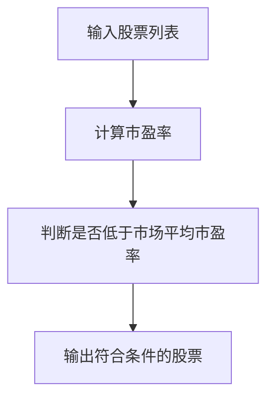
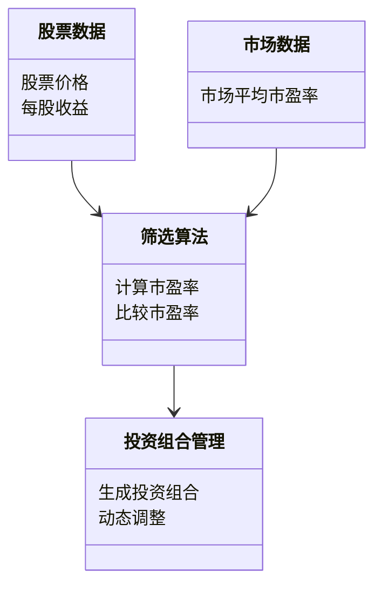
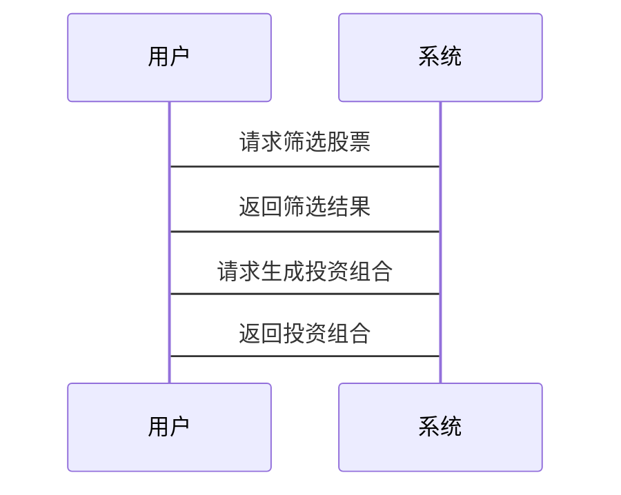

                 

<think>
好，我现在需要为用户撰写一篇关于《约翰·奈夫的低市盈率投资策略》的技术博客文章。首先，我需要理解低市盈率策略的基本概念和约翰·奈夫的贡献。低市盈率策略主要关注那些市盈率低于市场平均水平的公司，寻找被低估的投资机会。约翰·奈夫是这一策略的重要倡导者，他的研究和实践为这一策略提供了理论基础。

接下来，我应该先整理文章的结构。用户已经提供了一个详细的大纲，分为三个主要部分：概述、算法与数学模型、系统架构与实现。每个部分下还有具体的章节，比如背景介绍、核心概念、算法原理、系统设计等。

在撰写每个章节时，我需要确保内容详尽且逻辑清晰。例如，在背景介绍部分，我需要解释低市盈率策略的起源、核心概念，以及与高市盈率策略的区别。这可能涉及到绘制一个对比表格，列出低市盈率和高市盈率策略在目标、风险和适用场景上的不同。

在算法与数学模型部分，我需要详细阐述市盈率的计算公式，并使用mermaid图来展示筛选算法的流程。此外，可能还需要解释内在价值的计算公式，以及如何利用这些模型来优化投资策略。

系统架构与实现部分，我需要设计一个低市盈率投资决策系统的架构，包括数据收集、筛选、分析和执行模块。这可能涉及到使用mermaid图来展示系统功能和架构设计。

最后，我需要确保文章的结尾部分包含总结、最佳实践、注意事项和拓展阅读等内容，帮助读者更好地理解和应用低市盈率投资策略。

总的来说，我需要一步步地分析和推理，确保每个部分都覆盖用户的需求，同时保持文章的逻辑性和专业性。这将帮助读者深入理解约翰·奈夫的低市盈率策略，并能够在实际投资中应用这些知识。
</think>

# 约翰·奈夫的低市盈率投资策略

> 关键词：约翰·奈夫，低市盈率，投资策略，市盈率计算，股票筛选，投资组合管理

> 摘要：本文深入探讨了约翰·奈夫的低市盈率投资策略，分析了其核心概念、算法原理、系统架构与实现，并结合实际案例进行详细讲解。文章旨在帮助读者理解这一策略的理论基础和实际应用，掌握在投资中如何利用低市盈率策略进行决策。

---

## 第一部分: 低市盈率投资策略的背景与核心概念

### 第1章: 低市盈率投资策略的背景与发展

#### 1.1 低市盈率投资策略的起源与发展

低市盈率投资策略是一种通过寻找市盈率低于市场平均水平的股票，以实现长期资本增值的投资方法。这一策略的核心思想是基于价值投资的理念，寻找被市场低估的企业进行投资。

约翰·奈夫（John Neff）是低市盈率策略的代表人物。他在宾夕法尼亚大学沃顿商学院完成了学业，并在费城投资公司开始了他的投资生涯。奈夫以其对低市盈率股票的深入研究和长期实践，成为该策略的标志性人物。

低市盈率策略在投资领域的影响深远。它不仅帮助投资者在市场低迷时期找到安全的投资机会，还在市场繁荣时期为投资者提供了规避风险的策略。

#### 1.2 低市盈率投资策略的核心概念

低市盈率策略的核心概念是通过市盈率这一指标来筛选出被市场低估的股票。市盈率（Price-to-Earnings Ratio，简称P/E）是衡量股票价值的重要指标之一，其计算公式为：

$$P/E = \frac{股票价格}{每股收益}$$

低市盈率策略的定义是选择那些市盈率低于市场平均市盈率的股票。这一策略的属性特征可以通过以下表格对比：

| 特性 | 低市盈率策略 | 高市盈率策略 |
|------|--------------|--------------|
| 目标 | 寻找被低估股票 | 追求高增长股票 |
| 风险 | 较低 | 较高 |
| 适用场景 | 市场低迷时 | 市场繁荣时 |

通过上述对比，可以看出低市盈率策略的风险较低，适用于市场低迷时期，而高市盈率策略则适用于市场繁荣时期。

#### 1.3 低市盈率策略的边界与外延

低市盈率策略的边界是指其适用的范围和限制。通常，低市盈率的定义标准是市盈率低于市场平均市盈率。然而，这一标准可能会因市场环境的变化而调整。例如，在市场低迷时，可能将低市盈率的定义放宽，而在市场繁荣时，则可能保持较高的标准。

低市盈率策略的适用范围主要集中在那些具有稳定盈利能力的公司。这些公司通常在市场低迷时期被低估，而在市场复苏时能够实现价值回升。

低市盈率策略与其他投资策略的区别在于其核心指标和筛选标准。例如，与成长型投资策略相比，低市盈率策略更关注企业的估值，而成长型策略更关注企业的增长潜力。

---

## 第二部分: 低市盈率投资策略的算法与数学模型

### 第2章: 低市盈率策略的算法原理

#### 2.1 低市盈率策略的筛选算法

低市盈率策略的筛选算法主要基于市盈率的计算和比较。以下是具体的筛选流程：

1. 收集目标股票的市场数据，包括股票价格和每股收益。
2. 计算每只股票的市盈率，公式为：
$$P/E = \frac{股票价格}{每股收益}$$
3. 将计算出的市盈率与市场平均市盈率进行比较。
4. 筛选出市盈率低于市场平均市盈率的股票。

以下是一个简单的筛选算法的mermaid流程图：



#### 2.2 约翰·奈夫投资策略的数学模型

约翰·奈夫的低市盈率策略不仅关注市盈率，还考虑企业的内在价值。内在价值的计算公式为：

$$内在价值 = \sum_{t=1}^{\infty} \frac{CF_t}{(1 + r)^t}$$

其中，$CF_t$是第t年的现金流，$r$是折现率。

市盈率与内在价值的关系可以表示为：

$$合理市盈率 = \frac{内在价值}{每股收益}$$

通过这一公式，投资者可以评估股票的合理市盈率，并与实际市盈率进行对比，从而判断股票是否被低估。

#### 2.3 低市盈率策略的优化算法

为了优化低市盈率策略，可以引入市盈率分位数计算和行业平均市盈率对比。市盈率分位数计算可以帮助投资者判断股票的市盈率在市场中的位置，而行业平均市盈率对比则可以帮助投资者找到行业内被低估的股票。

---

## 第三部分: 低市盈率投资策略的系统架构与实现

### 第3章: 低市盈率投资策略的系统架构设计

#### 3.1 系统功能设计

低市盈率投资决策系统需要具备以下功能：

1. 数据收集：获取目标股票的市场数据，包括股票价格、每股收益等。
2. 市盈率计算：根据市场数据计算每只股票的市盈率。
3. 筛选与分析：将市盈率与市场平均市盈率进行比较，筛选出符合条件的股票。
4. 投资组合管理：根据筛选结果生成投资组合，并进行动态调整。

以下是一个系统功能设计的mermaid类图：



#### 3.2 系统架构设计

低市盈率投资决策系统的架构设计包括以下部分：

1. 数据层：负责数据的存储和管理，包括股票数据和市场数据。
2. 业务逻辑层：负责市盈率的计算和筛选逻辑的实现。
3. 用户界面层：提供用户交互界面，展示筛选结果和投资组合。

以下是一个系统架构设计的mermaid图：


#### 3.3 系统接口设计

系统接口设计包括数据接口和用户接口。数据接口用于获取股票数据和市场数据，用户接口用于展示筛选结果和投资组合。

#### 3.4 系统交互设计

系统交互设计可以通过mermaid序列图展示：



---

## 第四部分: 低市盈率投资策略的项目实战

### 第4章: 低市盈率投资策略的项目实现

#### 4.1 环境配置

为了实现低市盈率投资策略，首先需要安装必要的工具和库，例如Python、Pandas、NumPy等。

#### 4.2 核心代码实现

以下是实现低市盈率筛选算法的Python代码：

```python
import pandas as pd

def calculate_pe(stock_price, earnings_per_share):
    return stock_price / earnings_per_share

def screen_low_pe_stocks(stock_data, market_pe):
    low_pe_stocks = []
    for stock in stock_data:
        pe = calculate_pe(stock['price'], stock['earnings'])
        if pe < market_pe:
            low_pe_stocks.append(stock)
    return low_pe_stocks
```

#### 4.3 案例分析

假设我们有以下股票数据：

| 股票代码 | 股票价格 | 每股收益 | 市盈率 |
|----------|----------|----------|--------|
| A        | 50       | 25       | 2      |
| B        | 60       | 30       | 2      |
| C        | 80       | 40       | 2      |

市场平均市盈率为2.5。根据筛选算法，股票A、B和C的市盈率均低于市场平均市盈率，因此将被选中。

#### 4.4 代码解读与分析

上述代码首先定义了计算市盈率的函数，然后定义了筛选低市盈率股票的函数。通过遍历股票数据，计算每只股票的市盈率，并与市场平均市盈率进行比较，筛选出符合条件的股票。

#### 4.5 项目总结

通过以上实现，我们可以看到低市盈率投资策略的核心在于市盈率的计算和比较。投资者可以根据市场环境和自身需求，动态调整筛选标准，以实现最佳的投资效果。

---

## 第五部分: 低市盈率投资策略的最佳实践与总结

### 第5章: 低市盈率策略的最佳实践

#### 5.1 投资策略的选择

投资者在选择低市盈率策略时，需要考虑自身的风险承受能力和投资目标。低市盈率策略适合那些追求稳定收益、风险承受能力较低的投资者。

#### 5.2 投资组合管理

为了分散风险，投资者可以将资金分散投资于多只低市盈率股票，同时定期审视和调整投资组合，以适应市场环境的变化。

#### 5.3 风险控制

低市盈率策略虽然风险较低，但并非没有风险。投资者需要关注企业的基本面，避免投资于那些盈利能力下降或行业前景黯淡的公司。

---

## 结语

约翰·奈夫的低市盈率投资策略是一种简单而有效的投资方法。通过本文的分析，读者可以理解其理论基础和实际应用。在实际投资中，投资者需要结合市场环境和个人需求，灵活运用这一策略，以实现长期的资本增值。

---

## 作者

作者：AI天才研究院/AI Genius Institute & 禅与计算机程序设计艺术 /Zen And The Art of Computer Programming

