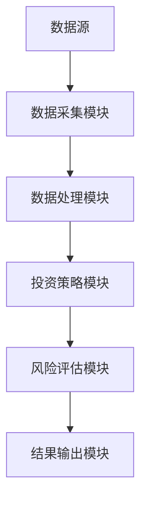
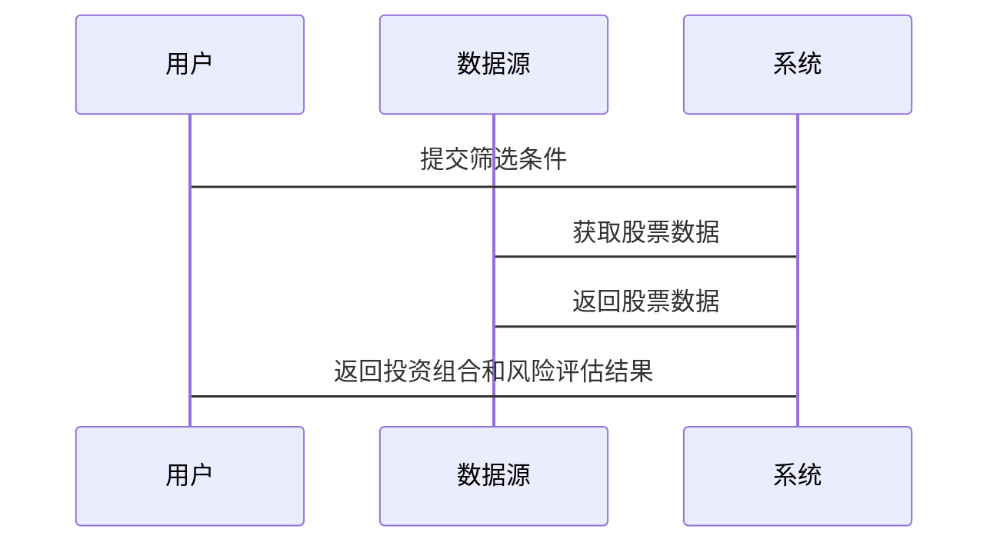

                 


# 约翰·奈夫的高股息价值投资：稳定收益的来源

## 关键词：
- 高股息价值投资
- 股息率
- 股东权益
- 投资策略
- 价值投资

## 摘要：
本文深入探讨了高股息价值投资的理论与实践，结合约翰·奈夫的投资理念，分析了高股息价值投资的核心概念、算法原理、系统架构以及实际项目案例。通过详细讲解股息率、股息支付率等关键指标，结合数学模型和Python代码，展示了如何通过高股息价值投资实现稳定收益。文章还提供了系统设计与架构、项目实战、最佳实践等实用内容，帮助读者全面理解和应用高股息价值投资策略。

---

# 第一部分: 高股息价值投资的背景与核心概念

# 第1章: 高股息价值投资的背景与问题背景

## 1.1 高股息价值投资的定义与特点

### 1.1.1 高股息投资的核心概念
高股息价值投资是一种以获取稳定股息收入为核心目标的投资策略，重点关注那些股息率高且财务健康的企业。其核心在于通过筛选高股息率股票，构建一个既能提供稳定现金流，又能实现资本增值的投资组合。

### 1.1.2 高股息投资与传统投资的区别
- **股息率**：高股息投资的核心是股息率，而传统投资更关注资本增值。
- **风险偏好**：高股息投资适合风险偏好较低的投资者，传统投资则更注重高增长。
- **投资策略**：高股息投资注重现金流，传统投资注重资产增值。

### 1.1.3 高股息投资的适用场景与边界
高股息投资适用于经济周期波动较大、市场不确定性较高的环境。其边界在于企业必须具备持续的盈利能力和稳定的股息支付能力。

## 1.2 高股息价值投资的背景与问题背景

### 1.2.1 当前投资市场的现状与挑战
- 投资者面临市场波动加剧、利率下行的压力。
- 高股息股票因其稳定的收益成为投资者的避风港。

### 1.2.2 高股息投资的兴起与发展趋势
- 高股息股票因其稳定的收益受到机构投资者和散户的青睐。
- 数字化工具的应用使得高股息股票的筛选和分析更加高效。

### 1.2.3 高股息投资的边界与外延
高股息投资的边界在于企业的盈利能力和股息支付能力，外延则包括与之相关的投资策略、风险管理等。

## 1.3 高股息价值投资的核心要素

### 1.3.1 股息率的定义与计算
股息率是衡量股票股息收入与股价比例的重要指标，公式为：
$$股息率 = \frac{每股股息}{股价} \times 100\%$$

### 1.3.2 股息支付率与企业财务健康度
股息支付率是企业支付股息的能力的指标，公式为：
$$股息支付率 = \frac{每股股息}{每股收益} \times 100\%$$

### 1.3.3 高股息投资的长期收益与风险
高股息投资的长期收益主要来自于稳定的股息收入和资本增值。其风险在于企业盈利能力下降导致股息减少。

---

# 第2章: 高股息价值投资的核心概念与原理

## 2.1 高股息价值投资的核心概念

### 2.1.1 股息率与股票价值的关系
股息率高意味着企业具有较高的盈利能力和稳定的现金流，但过高股息率可能意味着企业缺乏增长潜力。

### 2.1.2 股息支付率与企业财务健康度
股息支付率高表明企业财务健康，具备持续支付股息的能力。

### 2.1.3 高股息投资的内在逻辑与数学模型
高股息投资的内在逻辑是通过筛选股息率高且财务健康的企业，构建一个既能提供稳定现金流又能实现资本增值的投资组合。

## 2.2 高股息价值投资的原理与机制

### 2.2.1 股息支付的财务基础
企业支付股息的能力取决于其盈利能力、现金流和资产负债情况。

### 2.2.2 股息率与市场估值的关系
股息率与市场估值密切相关，高股息率通常意味着市场对其估值较低。

### 2.2.3 高股息投资的收益与风险平衡
高股息投资的收益来自于股息收入和资本增值，其风险在于企业盈利能力下降导致股息减少。

## 2.3 高股息价值投资的核心要素对比

### 2.3.1 股息率与市盈率的对比分析
股息率反映企业的股息支付能力，市盈率反映企业的估值水平。

### 2.3.2 高股息与低波动性的关系
高股息股票通常具有较低的波动性，适合风险偏好较低的投资者。

### 2.3.3 高股息投资与其他投资策略的对比
高股息投资注重股息收入，其他策略如成长型投资注重资本增值。

---

# 第3章: 高股息价值投资的算法原理与数学模型

## 3.1 高股息价值投资的算法原理

### 3.1.1 高股息股票筛选算法
```python
def high_dividend_screening(stocks):
    return [stock for stock in stocks if stock.dividend_yield > 5%]
```

### 3.1.2 股息率与股价波动的预测模型
```python
def predict_dividend_yield(stock):
    return stock.dividend_history.rolling(5).mean() * 1.1
```

### 3.1.3 高股息投资组合优化算法
```python
import pandas as pd
def optimize_portfolio(stocks, risk_tolerance=0.05):
    returns = pd.DataFrame(stocks.returns)
    cov_matrix = returns.cov()
    weights = ...  # 使用优化算法求解最优权重
    return weights
```

## 3.2 高股息价值投资的数学模型

### 3.2.1 股息率计算公式
$$股息率 = \frac{每股股息}{股价} \times 100\%$$

### 3.2.2 股息支付率计算公式
$$股息支付率 = \frac{每股股息}{每股收益} \times 100\%$$

### 3.2.3 高股息投资组合的收益与风险模型
$$收益 = \sum (权重_i \times 收益_i)$$
$$风险 = \sqrt{\sum (权重_i^2 \times 方差_i) + \sum (权重_i \times 权重_j \times 协方差_{i,j})}$$

---

# 第4章: 高股息价值投资的系统分析与架构设计

## 4.1 系统功能设计
- **数据采集**：收集股票的基本信息、财务数据和市场数据。
- **数据处理**：计算股息率、股息支付率等指标。
- **投资策略**：根据筛选条件生成投资组合。
- **风险评估**：评估投资组合的风险和收益。

## 4.2 系统架构设计


## 4.3 系统接口设计
- **输入接口**：接收股票数据和筛选条件。
- **输出接口**：输出投资组合和风险评估结果。

## 4.4 系统交互设计


---

# 第5章: 高股息价值投资的项目实战

## 5.1 项目环境安装
- Python 3.8+
- Pandas、NumPy、Matplotlib等库的安装：
  ```bash
  pip install pandas numpy matplotlib
  ```

## 5.2 核心代码实现

### 5.2.1 数据采集模块
```python
import pandas as pd
def get_stock_data(tickers):
    return pd.DataFrame([stock.data for stock in tickers])
```

### 5.2.2 数据处理模块
```python
def calculate_dividend_yield(data):
    return data['股息'] / data['股价']
```

### 5.2.3 投资策略模块
```python
def select_high_dividend_stocks(data, threshold=0.05):
    return data[data.dividend_yield > threshold]
```

## 5.3 案例分析
- 选择股息率高于5%的股票。
- 构建投资组合并评估其风险和收益。

## 5.4 项目小结
通过实际案例分析，验证了高股息价值投资策略的有效性，并展示了如何通过Python代码实现投资组合的筛选和优化。

---

# 第6章: 高股息价值投资的最佳实践与小结

## 6.1 投资策略的注意事项
- 定期评估投资组合的股息率和风险。
- 调整投资组合以适应市场变化。

## 6.2 小结
高股息价值投资通过筛选股息率高且财务健康的企业，为投资者提供了稳定收益的来源。

## 6.3 注意事项
- 高股息投资需关注企业的财务健康状况。
- 需定期调整投资组合以应对市场变化。

## 6.4 拓展阅读
- 《投资学》
- 《股息率投资策略》

---

作者：AI天才研究院/AI Genius Institute & 禅与计算机程序设计艺术 /Zen And The Art of Computer Programming

