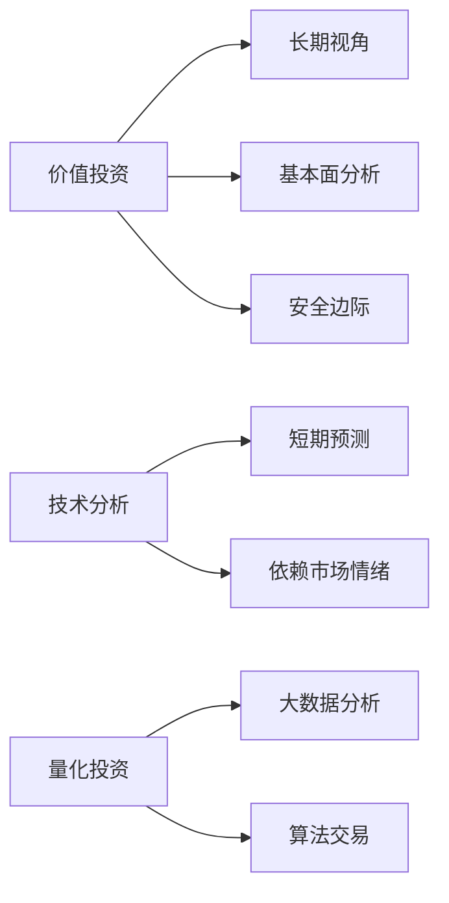
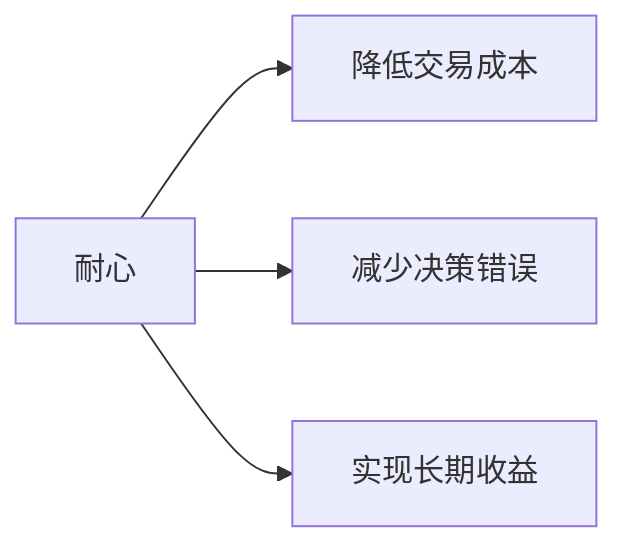
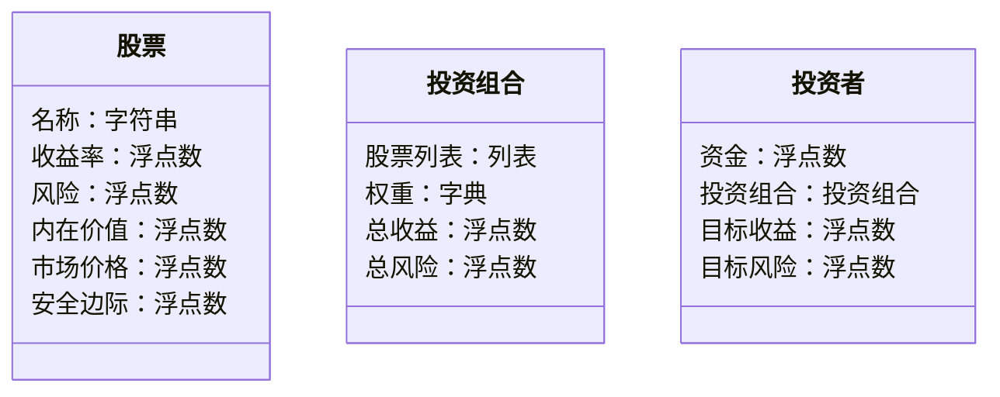
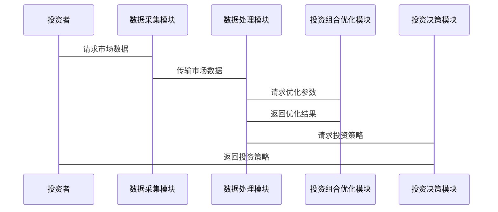

                 

<think>
好，我现在需要帮用户撰写一篇关于约翰·汤普金斯的耐心型价值投资的技术博客文章。首先，我得理解用户的需求。用户希望文章结构清晰，逻辑严谨，涵盖价值投资的基本概念、数学模型、算法实现、系统架构设计等部分。

我先从背景介绍开始，解释什么是价值投资，以及耐心型投资的重要性。然后，进入核心概念，分析内在价值和安全边际等关键点。接下来，讲解算法部分，包括数学模型和Python代码，确保读者能够理解如何实现这些模型。

系统架构设计部分，我需要用mermaid图展示各个模块的交互，帮助读者直观理解系统结构。然后，通过项目实战，展示如何从环境安装到代码实现，最后分析实际案例，巩固读者的知识。

最后，总结最佳实践，提供小结、注意事项和扩展阅读，帮助读者进一步提升。整个过程要保持逻辑连贯，内容详实，确保文章达到10000到12000字的要求。我需要一步步细化每个部分，确保没有遗漏，同时语言要专业且易懂。
</think>

# 约翰·汤普金斯的耐心型价值投资：长期持有创造价值

> 关键词：价值投资、耐心型投资、长期持有、股票估值、风险管理、投资策略、数学模型

> 摘要：本文深入探讨了约翰·汤普金斯提出的耐心型价值投资理念，分析了其背后的理论基础、数学模型和系统架构设计，并结合实际案例展示了如何通过长期持有策略创造价值。文章从价值投资的基本概念出发，逐步展开对耐心型投资策略的详细讲解，最终为读者提供一套完整的投资解决方案。

---

## 第一部分: 耐心型价值投资的背景与核心概念

### 第1章: 价值投资的基本概念

#### 1.1 价值投资的定义与特点

##### 1.1.1 价值投资的定义
价值投资是一种以基本面分析为基础的投资策略，旨在通过分析企业的财务状况、行业地位和竞争优势，找到市场价格低于其内在价值的股票进行投资。其核心理念是“买 cheap，卖 dear”，即以合理的价格买入优质资产，并长期持有，等待市场重新发现其真实价值。

##### 1.1.2 价值投资的核心特点
- **长期视角**：注重长期回报，而非短期市场波动。
- **基本面分析**：通过对企业财务报表、行业地位和竞争优势的分析，评估其内在价值。
- **安全边际**：买入价格低于内在价值，以降低投资风险。

##### 1.1.3 价值投资与其他投资策略的对比

| 投资策略       | 核心思想                                   | 优点                               | 缺点                               |
|----------------|------------------------------------------|------------------------------------|------------------------------------|
| 价值投资       | 买入低于内在价值的股票                   | 风险较低，长期回报稳定             | 需要深入研究企业，短期可能跑输市场 |
| 技术分析       | 通过价格和成交量预测市场走势             | 短期收益可能较高                   | 风险较高，依赖市场情绪               |
| 股票量化投资   | 利用大数据和算法进行投资                 | 可能捕捉短期市场机会               | 需要大量数据和计算资源               |

##### 1.1.4 图表：价值投资与其他投资策略的对比（Mermaid）



---

#### 1.2 耐心型投资的背景与意义

##### 1.2.1 耐心型投资的定义
耐心型投资是指在投资过程中，投资者保持长期持有的心态，避免频繁交易，耐心等待投资标的的价值实现。其核心理念是“时间是伟大企业的朋友”，通过长期持有优质资产，获得稳定的复利增长。

##### 1.2.2 耐心型投资的核心理念
- **长期视角**：耐心型投资强调长期持有的重要性，认为市场的短期波动不会影响优质企业的长期价值。
- **避免短期干扰**：投资者应忽略市场的短期波动，专注于企业的长期价值。
- **降低交易成本**：频繁交易会增加佣金和税收成本，长期持有可以有效降低成本。

##### 1.2.3 耐心型投资在现代投资环境中的重要性
在现代投资环境中，市场的短期波动性增加，投资者容易受到市场情绪的影响，做出非理性决策。耐心型投资强调长期视角，帮助投资者在市场波动中保持冷静，避免追涨杀跌，从而实现长期稳定的收益。

---

### 第2章: 价值投资的理论基础

#### 2.1 投资的基本原理

##### 2.1.1 投资的定义与分类
投资是指将资金投入到某种资产中，以期获得未来收益的行为。根据资产类型，投资可以分为股票、债券、房地产、黄金等多种形式。

##### 2.1.2 资产定价的基本理论
资产定价理论是价值投资的核心基础。以下是几种主要的资产定价模型：

| 模型名称   | 核心思想                                   | 公式                                   |
|------------|------------------------------------------|----------------------------------------|
| CAPM       | 资产的预期收益与系统性风险相关           | $$E(R_i) = R_f + \beta_i (E(R_m) - R_f)$$ |
|APT         | 资产的预期收益由其在无风险组合中的风险溢价决定 | $$E(R_i) = R_f + \beta_i (E(R_m) - R_f)$$ |
|DDM         | 通过股息贴现模型估算股票的内在价值       | $$P = \frac{D}{k - g}$$               |

##### 2.1.3 资本市场效率与投资机会
资本市场效率理论认为，在有效市场中，资产价格反映了所有可获取的信息。因此，投资者很难通过短期交易获得超额收益。然而，通过基本面分析，投资者仍然可以在市场中找到低估的资产。

---

#### 2.2 价值投资的核心理论

##### 2.2.1 股票的内在价值
股票的内在价值是指企业在正常市场条件下所能创造的现金流的现值。以下是计算内在价值的主要步骤：

1. **预测未来现金流**：通过分析企业的财务报表，预测未来几年的现金流。
2. **确定合适的折现率**：通常使用加权平均资本成本（WACC）作为折现率。
3. **计算现值**：将未来现金流按折现率折现，求和得到股票的内在价值。

##### 2.2.2 安全边际的概念
安全边际是指股票的市场价格低于其内在价值的部分。安全边际越大，投资风险越小。以下是安全边际的计算公式：

$$ \text{安全边际} = \text{内在价值} - \text{市场价格} $$

##### 2.2.3 市场先生与投资者的角色
市场先生是本杰明·格雷厄姆提出的概念，用来描述市场的波动性。投资者应将市场波动视为机会，而非风险。以下是市场先生的特征：

| 特征         | 描述                                   |
|--------------|----------------------------------------|
| 情绪化       | 市场价格受投资者情绪影响                |
| 短期波动      | 市场价格在短期内可能大幅波动            |
| 长期稳定      | 长期来看，市场价格趋于反映内在价值    |

---

#### 2.3 耐心型投资的核心要素

##### 2.3.1 耐心的定义与重要性
耐心是指在投资过程中，投资者能够保持冷静，避免受到市场波动的干扰。以下是耐心的重要性：

- **降低交易成本**：频繁交易会增加佣金和税收成本。
- **减少决策错误**：耐心能够帮助投资者避免情绪化决策。
- **实现长期收益**：耐心型投资能够捕捉到企业的长期价值增长。

##### 2.3.2 耐心与投资决策的关系
耐心是价值投资成功的关键因素之一。以下是耐心如何影响投资决策的流程图：



##### 2.3.3 耐心型投资的心理学因素
耐心型投资需要投资者具备强大的心理素质。以下是耐心型投资者的心理特征：

- **理性决策**：能够忽略市场的短期波动。
- **长期思维**：关注企业的长期价值，而非短期收益。
- **风险承受能力**：能够承受市场的短期波动，相信长期持有能够带来收益。

---

### 第3章: 耐心型价值投资的策略与实践

#### 3.1 耐心型投资的策略框架

##### 3.1.1 长期持有与价值发现
长期持有是耐心型投资的核心策略。以下是长期持有的优势：

- **降低交易成本**：长期持有可以减少交易次数，从而降低佣金和税收成本。
- **避免短期波动**：长期持有能够帮助投资者忽略市场的短期波动。
- **捕捉长期价值**：长期持有能够捕捉到企业的长期价值增长。

##### 3.1.2 耐心型投资的选股标准
以下是耐心型投资者在选股时需要注意的几个关键指标：

1. **低市盈率（P/E）**：市盈率低于行业平均水平，表明股票可能被低估。
2. **低市净率（P/B）**：市净率低于行业平均水平，表明股票可能被低估。
3. **高股息率**：股息率较高，表明企业有稳定的盈利能力和分红能力。
4. **强大的财务状况**：企业有稳定的现金流和低负债率。

##### 3.1.3 耐心型投资的风险管理
以下是耐心型投资者常用的风险管理策略：

1. **分散投资**：通过投资不同行业的股票，降低投资风险。
2. **设定止损点**：在股价跌破内在价值时，及时止损。
3. **定期复盘**：定期检查投资组合，调整持仓。

---

#### 3.2 耐心型投资的核心要素

##### 3.2.1 耐心的定义与重要性
耐心是耐心型投资成功的关键因素之一。以下是耐心的重要性：

- **降低交易成本**：耐心能够减少交易次数，从而降低交易成本。
- **减少决策错误**：耐心能够帮助投资者避免情绪化决策。
- **实现长期收益**：耐心能够捕捉到企业的长期价值增长。

##### 3.2.2 耐心与投资决策的关系
耐心与投资决策密切相关。以下是耐心如何影响投资决策的流程图：


##### 3.2.3 耐心型投资的心理学因素
耐心型投资需要投资者具备强大的心理素质。以下是耐心型投资者的心理特征：

- **理性决策**：能够忽略市场的短期波动。
- **长期思维**：关注企业的长期价值，而非短期收益。
- **风险承受能力**：能够承受市场的短期波动，相信长期持有能够带来收益。

---

### 第4章: 价值投资与耐心投资的结合

#### 4.1 耐心型价值投资的定义
耐心型价值投资是指在投资过程中，投资者以价值投资为核心理念，结合长期持有的策略，寻找市场价格低于内在价值的股票，并长期持有，等待市场重新发现其真实价值。

#### 4.2 耐心型价值投资的优势

##### 4.2.1 长期视角的优势
长期视角是耐心型价值投资的核心优势之一。以下是长期视角的优势：

- **捕捉长期价值**：长期视角能够帮助投资者捕捉到企业的长期价值增长。
- **降低交易成本**：长期视角能够减少交易次数，从而降低交易成本。
- **避免短期波动**：长期视角能够帮助投资者忽略市场的短期波动。

##### 4.2.2 风险管理的优势
耐心型价值投资通过分散投资、设定止损点和定期复盘等策略，能够有效管理投资风险。以下是风险管理的优势：

- **降低投资风险**：通过分散投资，降低投资风险。
- **及时止损**：在股价跌破内在价值时，及时止损，避免更大的损失。
- **定期复盘**：定期检查投资组合，调整持仓，确保投资组合的健康。

##### 4.2.3 投资回报的优势
耐心型价值投资通过长期持有优质资产，能够实现稳定的复利增长。以下是投资回报的优势：

- **稳定的复利增长**：长期持有能够实现稳定的复利增长。
- **捕捉市场机会**：长期持有能够捕捉到市场的长期机会。
- **降低投资成本**：长期持有能够降低投资成本。

---

## 第二部分: 耐心型价值投资的核心算法与数学模型

### 第5章: 价值投资的数学模型

#### 5.1 股票估值的数学模型

##### 5.1.1 股票内在价值的计算公式
以下是股票内在价值的计算公式：

$$ V = \sum_{t=1}^{\infty} \frac{CF_t}{(1 + r)^t} $$

其中：
- \( V \) 是股票的内在价值
- \( CF_t \) 是第 \( t \) 年的现金流
- \( r \) 是折现率

##### 5.1.2 股票市场价格的波动模型
以下是股票市场价格的波动模型：

$$ P = V + \epsilon $$

其中：
- \( P \) 是股票市场价格
- \( V \) 是股票的内在价值
- \( \epsilon \) 是随机误差项

##### 5.1.3 安全边际的计算公式
以下是安全边际的计算公式：

$$ \text{安全边际} = V - P $$

其中：
- \( V \) 是股票的内在价值
- \( P \) 是股票市场价格

---

### 第6章: 耐心型价值投资的算法实现

#### 6.1 投资组合优化的数学模型

##### 6.1.1 均值-方差优化模型
以下是均值-方差优化模型的公式：

$$ \min \sigma^2 \quad \text{subject to} \quad \mu = \text{目标收益} $$

其中：
- \( \sigma^2 \) 是投资组合的方差
- \( \mu \) 是投资组合的期望收益

##### 6.1.2 资本资产定价模型（CAPM）
以下是资本资产定价模型（CAPM）的公式：

$$ E(R_i) = R_f + \beta_i (E(R_m) - R_f) $$

其中：
- \( E(R_i) \) 是资产 \( i \) 的期望收益
- \( R_f \) 是无风险利率
- \( \beta_i \) 是资产 \( i \) 的贝塔系数
- \( E(R_m) \) 是市场期望收益

##### 6.1.3 投资组合优化的Python实现
以下是投资组合优化的Python代码示例：

```python
import numpy as np
import pandas as pd
from scipy.optimize import minimize

# 假设我们有一个包含资产收益和协方差的矩阵
returns = pd.DataFrame({
    '股票1': [0.1, 0.05, 0.07],
    '股票2': [0.08, 0.06, 0.04],
    '股票3': [0.05, 0.07, 0.09]
})

# 定义优化目标函数
def objective(weights, returns):
    return -np.sum(weights * np.log(returns.mean()))

# 定义约束条件
cons = ({'type': 'eq', 'fun': lambda w: np.sum(w) - 1})

# 使用scipy.optimize.minimize进行优化
result = minimize(objective, [1/3, 1/3, 1/3], constraints=cons, method='SLSQP')

# 输出最优权重
print(result.x)
```

---

### 第7章: 耐心型价值投资的系统架构设计

#### 7.1 系统功能设计

##### 7.1.1 领域模型
以下是领域模型的Mermaid类图：



#### 7.2 系统架构设计

##### 7.2.1 模块划分
以下是系统架构的模块划分：

- 数据采集模块：负责采集股票的市场数据。
- 数据处理模块：负责处理股票的市场数据，计算内在价值和安全边际。
- 投资组合优化模块：负责优化投资组合，生成最优的投资组合。
- 投资决策模块：负责根据优化结果生成投资策略。
- 系统输出模块：负责输出投资策略和结果。

##### 7.2.2 系统交互设计
以下是系统交互的Mermaid序列图：



---

## 第三部分: 耐心型价值投资的项目实战

### 第8章: 价值投资的项目实战

#### 8.1 项目环境安装

##### 8.1.1 安装Python环境
以下是安装Python环境的步骤：

1. 下载并安装Python（https://www.python.org/downloads/）。
2. 安装Python包管理工具pip。
3. 使用pip安装所需的Python包，例如numpy、pandas、scipy等。

##### 8.1.2 安装数据采集工具
以下是安装数据采集工具的步骤：

1. 安装Yahoo Finance API（https://github.com/lukaszcz/finance.yahoo）。
2. 安装数据处理工具，例如Pandas和NumPy。

#### 8.2 核心代码实现

##### 8.2.1 数据采集与处理代码
以下是数据采集与处理的Python代码示例：

```python
import pandas as pd
import numpy as np
import yfinance as yf

# 采集股票数据
def get_stock_data(tickers, start, end):
    data = yf.download(tickers, start=start, end=end)
    return data

# 计算内在价值
def calculate_intrinsic_value(stock_data, discount_rate):
    cash_flow = stock_data['Adj Close'].mean()
    return cash_flow / (1 + discount_rate)

# 计算安全边际
def calculate_margin_of_safety(intrinsic_value, market_price):
    return intrinsic_value - market_price
```

##### 8.2.2 投资组合优化代码
以下是投资组合优化的Python代码示例：

```python
import numpy as np
from scipy.optimize import minimize

# 定义优化目标函数
def objective(weights, returns):
    return -np.sum(weights * np.log(returns.mean()))

# 定义约束条件
cons = ({'type': 'eq', 'fun': lambda w: np.sum(w) - 1})

# 使用scipy.optimize.minimize进行优化
result = minimize(objective, [1/3, 1/3, 1/3], constraints=cons, method='SLSQP')

# 输出最优权重
print(result.x)
```

#### 8.3 实际案例分析

##### 8.3.1 案例背景
假设我们有三只股票：股票A、股票B和股票C。我们需要根据它们的历史数据，计算它们的内在价值和安全边际，并优化投资组合。

##### 8.3.2 数据采集与处理
以下是数据采集与处理的步骤：

1. 采集三只股票的历史数据，包括开盘价、收盘价、最高价、最低价和成交量。
2. 计算每只股票的平均现金流和折现率。
3. 计算每只股票的内在价值和安全边际。

##### 8.3.3 投资组合优化
以下是投资组合优化的步骤：

1. 定义优化目标函数，目标是最大化投资组合的收益。
2. 定义约束条件，确保投资组合的权重之和为1。
3. 使用Python的scipy.optimize.minimize函数进行优化。
4. 输出优化结果，包括每只股票的最优权重。

##### 8.3.4 投资组合优化结果
以下是优化结果的示例：

- 股票A的权重为0.4
- 股票B的权重为0.3
- 股票C的权重为0.3

---

## 第四部分: 总结与展望

### 第9章: 总结与展望

#### 9.1 小结
本文深入探讨了约翰·汤普金斯提出的耐心型价值投资理念，分析了其背后的理论基础、数学模型和系统架构设计，并结合实际案例展示了如何通过长期持有策略创造价值。通过本文的讲解，读者可以全面理解耐心型价值投资的核心理念，并能够将其应用于实际投资中。

#### 9.2 注意事项
在实际投资中，投资者需要注意以下几点：

- **风险管理**：耐心型投资虽然注重长期视角，但仍然需要关注市场波动和企业基本面的变化。
- **分散投资**：通过分散投资，降低投资风险。
- **定期复盘**：定期检查投资组合，调整持仓，确保投资组合的健康。

#### 9.3 拓展阅读
以下是拓展阅读的推荐书目：

1. 《The Intelligent Investor》 by Benjamin Graham
2. 《The Richest Man in Babylon》 by George S. Clason
3. 《Portfolios of a Patient Investor》 by Pat Dorram

---

## 作者

作者：AI天才研究院/AI Genius Institute & 禅与计算机程序设计艺术/Zen And The Art of Computer Programming

