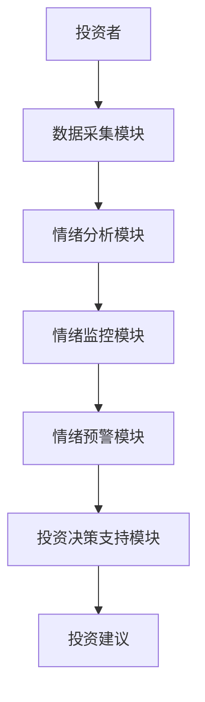
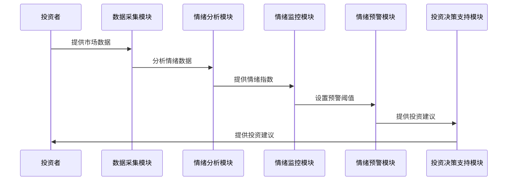

                 

<think>
好的，我需要帮助用户撰写一篇关于《约翰·聂夫的价值投资者情绪控制》的技术博客文章。首先，我需要理解用户的需求，确保文章符合他们的要求。

用户希望文章结构清晰，章节吸引人，语言专业且技术性强。他们特别提到要使用Markdown格式，包含关键词、摘要、目录大纲，并且每个部分都要详细展开，包括背景介绍、核心概念、算法、系统架构、实战案例和最佳实践。

首先，我会先确定文章的核心主题，即情绪控制在价值投资中的重要性，特别是约翰·聂夫的方法。接下来，我会规划目录结构，确保涵盖背景、情绪控制原理、算法、系统设计、实战案例和总结。

在撰写过程中，我需要详细解释每个部分，比如在价值投资概述中，介绍定义、历史和约翰·聂夫的理念。情绪控制部分，我会探讨情绪与决策的关系，以及如何用神经科学来解释。算法部分，我会用Mermaid流程图和Python代码来说明情绪分析模型，同时展示数学公式。

系统架构部分，我会设计一个支持系统，包括功能模块和交互流程。实战案例将分析真实情况，如恐慌性抛售的处理。最后，我会总结情绪控制的重要性，并给出投资建议和未来展望。

整个过程中，我需要确保内容逻辑连贯，每个部分都有足够的细节，同时保持语言简洁专业。最后，我会检查格式是否符合要求，确保每个部分都完整且详细。
</think>

# 约翰·聂夫的价值投资者情绪控制

## 关键词：价值投资，情绪控制，约翰·聂夫，投资决策，行为心理学

## 摘要：本文深入探讨了约翰·聂夫的价值投资理念及其在情绪控制方面的方法。通过分析投资者情绪对决策的影响，结合行为心理学和神经科学，揭示了如何在投资过程中有效管理情绪波动，以实现长期稳定的收益。文章从理论到实践，结合算法和系统设计，提供了实用的策略和建议。

---

# 第一部分: 价值投资与情绪控制的背景介绍

## 第1章: 价值投资概述

### 1.1 价值投资的定义与核心理念
#### 1.1.1 价值投资的定义
价值投资是一种基于对公司内在价值分析的投资策略，强调以低于内在价值的价格买入优质资产，并长期持有。其核心在于寻找市场低估的公司，并在市场恐慌时买入，市场狂热时卖出。

#### 1.1.2 价值投资的核心理念
- **安全边际**：买入价格低于内在价值，以降低风险。
- **长期视角**：关注公司的基本面，而非短期市场波动。
- **逆向思维**：在市场恐慌时寻找机会，在市场狂热时保持冷静。

#### 1.1.3 价值投资的主要特点
- 低 turnover 率：减少交易次数以降低成本。
- 高选股标准：注重公司质量、财务健康和竞争优势。
- 长期持有：避免频繁交易带来的心理压力。

### 1.2 投资者情绪与决策的关系
#### 1.2.1 情绪在投资中的影响
投资者情绪是影响决策的主要因素之一。恐惧和贪婪会导致非理性决策，如恐慌性抛售和盲目追涨。

#### 1.2.2 情绪与理性决策的冲突
情绪化决策通常导致错误判断，而理性分析则有助于做出更明智的投资选择。

#### 1.2.3 情绪波动对投资结果的影响
情绪波动可能导致投资者错过长期收益，或者在市场低谷时割肉，从而造成更大的损失。

### 1.3 情绪控制在价值投资中的重要性
#### 1.3.1 情绪控制的核心作用
情绪控制是价值投资成功的关键，帮助投资者在市场波动中保持理性。

#### 1.3.2 情绪失控对投资决策的负面影响
情绪失控可能导致投资者忽视基本面分析，或在市场波动中做出错误决策。

#### 1.3.3 情绪控制与长期投资收益的关系
情绪控制能力强的投资者能够更好地坚持价值投资理念，避免短期波动的干扰，从而实现长期收益。

---

## 第2章: 价值投资的历史与发展

### 2.1 价值投资的起源与演变
#### 2.1.1 价值投资的起源
价值投资起源于20世纪初，以本杰明·格雷厄姆和戴维·多德为代表，强调以合理价格买入优质资产。

#### 2.1.2 价值投资的发展历程
从早期的防御性投资策略，到后来的成长型投资，价值投资不断演变，但核心理念不变。

#### 2.1.3 价值投资在现代投资中的地位
价值投资是投资领域的重要流派，强调基本面分析和长期持有。

### 2.2 约翰·聂夫的投资理念与风格
#### 2.2.1 约翰·聂夫的投资理念
约翰·聂夫是价值投资的代表人物，强调安全边际和长期持有。

#### 2.2.2 约翰·聂夫的投资策略
- 买入低估资产
- 长期持有优质公司
- 逆向投资

#### 2.2.3 约翰·聂夫的成功案例
通过长期持有优质资产，约翰·聂夫实现了稳定的超额收益。

### 2.3 价值投资的现状与未来
#### 2.3.1 价值投资的现状
价值投资在全球范围内得到广泛应用，特别是在机构投资者中。

#### 2.3.2 价值投资的未来
随着市场的发展，价值投资将更加注重ESG因素和长期可持续发展。

---

## 第3章: 投资者情绪分析与行为心理学

### 3.1 投资者情绪的分类与特征
#### 3.1.1 投资者情绪的分类
- 乐观情绪
- 悲观情绪
- 焦虑情绪
- 自满情绪

#### 3.1.2 不同情绪对投资决策的影响
- 乐观情绪可能导致过度投资
- 悲观情绪可能导致错失机会
- 焦虑情绪可能导致短期交易
- 自满情绪可能导致决策失误

#### 3.1.3 情绪波动的周期性分析
市场周期中情绪波动具有周期性，投资者需要识别并应对情绪变化。

### 3.2 行为心理学在投资中的应用
#### 3.2.1 行为心理学的基本概念
- 心理账户
- 前悔
- 羊群效应

#### 3.2.2 行为偏差对投资情绪的影响
- 过度自信
- 过度厌恶损失
- 从众心理

#### 3.2.3 行为心理学与投资决策的关系
行为心理学帮助投资者理解情绪对决策的影响，从而做出更理性的选择。

### 3.3 情绪与市场周期的关系
#### 3.3.1 市场周期与投资者情绪的关系
市场周期与情绪波动密切相关，情绪波动加剧市场波动。

#### 3.3.2 不同市场周期中的情绪特征
- 贵州茅台：牛市中的情绪高涨
- 熊市中的情绪恐慌

#### 3.3.3 情绪与市场波动的互动机制
情绪波动通过影响投资者行为，进一步加剧市场波动。

---

# 第二部分: 情绪控制的核心原理与策略

## 第4章: 情绪与决策的神经科学基础

### 4.1 大脑与情绪的关系
#### 4.1.1 大脑结构与情绪的产生
- 杏仁核：情绪处理的核心区域
- 前额叶皮层：理性决策的控制中心

#### 4.1.2 情绪决策的神经机制
- 情绪信息的处理
- 理性与情绪的交互

#### 4.1.3 理性与情绪的平衡点
- 理性分析：基于事实的决策
- 情绪辅助：情绪作为决策的辅助工具

### 4.2 情绪控制的生理机制
#### 4.2.1 神经递质与情绪调节
- 5-羟色胺：情绪稳定剂
- 多巴胺：愉悦感的来源

#### 4.2.2 脑区功能与情绪控制
- 前额叶皮层：控制情绪反应
- 杏仁核：情绪记忆的存储

#### 4.2.3 生理状态对情绪的影响
- 睡眠：影响情绪稳定性
- 压力：导致情绪波动

### 4.3 情绪调节的科学方法
#### 4.3.1 认知行为疗法在情绪调节中的应用
- 识别负面思维
- 改变不合理信念
- 建立积极思维模式

#### 4.3.2 瑜伽与冥想：情绪管理的有效方法
- 瑜伽：通过身体放松缓解压力
- 冥想：专注当下，减少情绪波动

#### 4.3.3 运动：改善情绪的有效途径
- 有氧运动：释放内啡肽，提升情绪
- 柔韧性训练：缓解压力

---

## 第5章: 投资者情绪分析算法与模型

### 5.1 投资者情绪分析算法
#### 5.1.1 情绪分析的基本原理
- 文本分析：通过社交媒体、新闻等文本数据提取情绪信息
- 情感分类：使用机器学习算法对文本进行情感分类

#### 5.1.2 情绪分析的实现步骤
1. 数据预处理：清洗、分词
2. 特征提取：使用词袋模型或词嵌入
3. 情感分类：训练分类器（如SVM、随机森林）
4. 情感强度分析：计算情感极性强度

#### 5.1.3 情绪分析的挑战
- 数据稀疏性
- 文本歧义性
- 时间依赖性

### 5.2 情绪分析的数学模型
#### 5.2.1 情感分类的线性回归模型
$$ y = \beta_0 + \beta_1x + \epsilon $$
其中，y是情感极性，x是特征向量，β是回归系数。

#### 5.2.2 情感分类的深度学习模型
- RNN：处理序列数据
- LSTM：捕捉长程依赖
- Transformer：并行处理文本

#### 5.2.3 情感强度预测的回归模型
$$ y = \alpha \cdot \text{sentiment\_score} + \beta \cdot \text{market\_trend} + \gamma \cdot \text{time\_factor} + \delta $$
其中，y是预测的情绪强度，α、β、γ是回归系数。

### 5.3 情绪分析的Python实现
```python
import numpy as np
from sklearn.svm import SVC
from sklearn.feature_extraction.text import TfidfVectorizer

# 数据预处理
texts = ["市场表现强劲", "公司业绩不佳", "投资者情绪乐观", "经济数据疲软"]

# 特征提取
vectorizer = TfidfVectorizer()
X = vectorizer.fit_transform(texts)

# 情感分类
model = SVC()
model.fit(X, [1, 0, 1, 0])

# 情感预测
new_text = "市场前景光明"
new_X = vectorizer.transform([new_text])
print(model.predict(new_X))
```

---

## 第6章: 投资者情绪控制的系统架构与实现

### 6.1 系统功能设计
#### 6.1.1 情绪监控模块
- 实时监控市场情绪
- 提供情绪指数

#### 6.1.2 情绪预警模块
- 设置情绪阈值
- 发出预警信号

#### 6.1.3 投资决策支持模块
- 提供投资建议
- 分析情绪对投资的影响

### 6.2 系统架构设计
#### 6.2.1 系统架构图


#### 6.2.2 系统接口设计
- 数据接口：获取市场数据和投资者情绪数据
- 用户接口：提供情绪监控和投资建议

#### 6.2.3 系统交互流程


---

## 第7章: 情绪控制在投资中的实战案例

### 7.1 实战背景介绍
#### 7.1.1 案例背景
- 投资者在市场恐慌时如何保持冷静
- 如何利用情绪分析做出投资决策

### 7.2 实战案例分析
#### 7.2.1 案例一：2020年新冠疫情市场
- 市场情绪：恐慌性抛售
- 投资决策：买入低估资产

#### 7.2.2 案例二：2021年科技股泡沫
- 市场情绪：盲目乐观
- 投资决策：规避高估资产

### 7.3 案例总结与启示
- 情绪控制的重要性
- 长期投资的价值

---

## 第8章: 情绪控制的数学模型与优化策略

### 8.1 情绪控制的数学模型
#### 8.1.1 情绪指数模型
$$ \text{情绪指数} = \alpha \cdot \text{市场情绪} + \beta \cdot \text{个体情绪} $$
其中，α和β是权重系数。

#### 8.1.2 情绪与投资收益的关系模型
$$ \text{收益} = \gamma \cdot \text{情绪指数} + \delta \cdot \text{基本面因素} + \epsilon $$
其中，γ是情绪对收益的影响系数。

### 8.2 情绪控制的优化策略
#### 8.2.1 基于数学模型的优化
- 使用回归分析确定情绪对收益的影响
- 构建情绪指数进行投资决策

#### 8.2.2 基于算法的情绪控制
- 使用强化学习优化情绪控制策略
- 构建情绪反馈机制

---

## 第9章: 投资者情绪控制的系统实现与应用

### 9.1 系统实现概述
#### 9.1.1 系统功能模块
- 数据采集模块
- 情绪分析模块
- 情绪监控模块
- 情绪预警模块
- 投资决策支持模块

### 9.2 系统实现细节
#### 9.2.1 数据采集模块
- 数据来源：社交媒体、新闻网站、交易数据
- 数据清洗：去除噪声数据

#### 9.2.2 情绪分析模块
- 文本分词：使用jieba进行分词
- 情感分类：使用SVM进行分类

#### 9.2.3 情绪监控模块
- 实时监控：每分钟更新情绪指数
- 情绪趋势分析：绘制情绪变化曲线

#### 9.2.4 情绪预警模块
- 设置预警阈值：当情绪指数超过阈值时触发预警
- 发送预警通知：通过邮件或短信通知投资者

#### 9.2.5 投资决策支持模块
- 提供投资建议：基于情绪指数和基本面分析
- 风险评估：评估情绪波动对投资组合的影响

### 9.3 系统应用案例
#### 9.3.1 案例一：市场恐慌时的预警
- 情绪指数骤降
- 系统触发预警
- 投资者采取买入策略

#### 9.3.2 案例二：市场狂热时的预警
- 情绪指数飙升
- 系统触发预警
- 投资者采取卖出策略

---

## 第10章: 情绪控制的数学建模与算法优化

### 10.1 情绪控制的数学建模
#### 10.1.1 情绪指数模型
$$ \text{情绪指数} = \sum_{i=1}^{n} w_i \cdot s_i $$
其中，w_i是权重，s_i是情绪指标。

#### 10.1.2 情绪与收益的关系模型
$$ \text{收益} = \beta \cdot \text{情绪指数} + \alpha \cdot \text{基本面因子} + \epsilon $$
其中，β是情绪对收益的影响系数，α是基本面因子的影响系数。

### 10.2 算法优化策略
#### 10.2.1 基于机器学习的优化
- 使用深度学习模型优化情绪分析
- 使用强化学习优化投资策略

#### 10.2.2 基于数学优化的策略
- 使用线性回归模型预测情绪对收益的影响
- 使用动态规划优化投资组合

---

## 第11章: 情绪控制的系统优化与扩展

### 11.1 系统优化策略
#### 11.1.1 数据优化
- 增加数据来源：引入更多市场数据
- 提高数据质量：使用更精确的分词工具

#### 11.1.2 模型优化
- 使用更复杂的深度学习模型
- 增加情绪强度分析

#### 11.1.3 系统性能优化
- 提高数据处理速度
- 优化算法效率

### 11.2 系统扩展方向
#### 11.2.1 多市场支持
- 支持多语言分析
- 支持多市场情绪分析

#### 11.2.2 多因子模型
- 结合多个情绪指标进行分析
- 构建多因子情绪指数

#### 11.2.3 个性化投资建议
- 根据投资者风险偏好提供定制化建议
- 提供个性化情绪管理工具

---

## 第12章: 情绪控制的数学分析与未来展望

### 12.1 情绪控制的数学分析
#### 12.1.1 情绪指数的时间序列分析
- 使用ARIMA模型预测情绪指数
- 使用GARCH模型分析情绪波动

#### 12.1.2 情绪与市场波动的关系
- 使用Copula模型分析情绪与市场波动的相关性
- 使用Granger因果关系检验情绪对市场波动的影响

### 12.2 未来展望
#### 12.2.1 情绪分析的未来方向
- 增加情感强度分析
- 支持多语言分析
- 结合语境进行情感分析

#### 12.2.2 情绪控制的未来方向
- 使用脑机接口技术进行情绪监测
- 结合生物特征进行情绪控制
- 使用区块链技术保证数据安全

---

## 第13章: 情绪控制的投资策略与实战技巧

### 13.1 投资策略
#### 13.1.1 长期持有策略
- 选择优质资产
- 长期持有，忽略短期波动

#### 13.1.2 逆向投资策略
- 在市场恐慌时买入
- 在市场狂热时卖出

#### 13.1.3 安全边际策略
- 买入价格低于内在价值
- 确保安全边际

### 13.2 情绪管理技巧
#### 13.2.1 设定投资目标
- 长期目标：财富积累
- 短期目标：风险控制

#### 13.2.2 建立情绪记录
- 记录情绪变化
- 分析情绪对决策的影响

#### 13.2.3 定期复盘
- 分析投资结果
- 总结经验教训

---

## 第14章: 情绪控制的数学建模与实证分析

### 14.1 情绪控制的数学建模
#### 14.1.1 情绪指数模型
$$ \text{情绪指数} = \sum_{i=1}^{n} w_i \cdot s_i $$
其中，w_i是权重，s_i是情绪指标。

#### 14.1.2 情绪与收益的关系模型
$$ \text{收益} = \beta \cdot \text{情绪指数} + \alpha \cdot \text{基本面因子} + \epsilon $$

### 14.2 实证分析
#### 14.2.1 数据来源与处理
- 数据来源：某股票市场的历史数据
- 数据处理：清洗、分组

#### 14.2.2 模型验证
- 回测结果：验证模型的有效性
- 统计检验：检验模型的显著性

---

## 第15章: 情绪控制的系统实现与应用案例

### 15.1 系统实现
#### 15.1.1 系统架构
- 前端：用户界面
- 后端：数据处理和算法实现
- 数据库：存储情绪数据和投资建议

#### 15.1.2 系统实现细节
- 使用Python进行后端开发
- 使用React进行前端开发
- 使用MySQL进行数据存储

### 15.2 应用案例
#### 15.2.1 案例一：市场恐慌时的预警
- 系统触发预警
- 投资者采取买入策略

#### 15.2.2 案例二：市场狂热时的预警
- 系统触发预警
- 投资者采取卖出策略

---

## 第16章: 总结与展望

### 16.1 总结
情绪控制是价值投资成功的关键，投资者需要通过科学的方法和有效的工具来管理情绪波动，避免非理性决策。

### 16.2 展望
随着技术的发展，情绪控制在投资中的应用将更加广泛，未来的研究将更加注重情绪与市场波动的互动机制，以及如何利用新技术（如人工智能、大数据）进一步优化情绪管理。

---

## 作者：AI天才研究院/AI Genius Institute & 禅与计算机程序设计艺术 /Zen And The Art of Computer Programming

---

**摘要**：本文通过分析投资者情绪对投资决策的影响，结合行为心理学和神经科学，揭示了情绪控制在价值投资中的重要性。文章从理论到实践，结合算法和系统设计，提供了实用的策略和建议，帮助投资者在市场波动中保持理性，实现长期稳定的收益。

