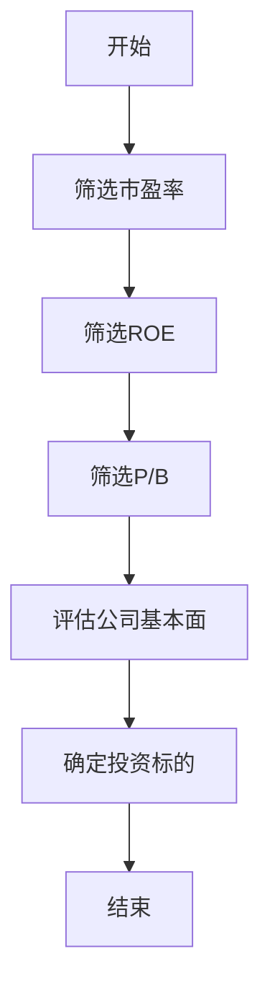

                 


# 约翰·聂夫的小盘股投资策略

> 关键词：约翰·聂夫，小盘股，投资策略，市盈率，价值投资，选股算法

> 摘要：本文深入分析了约翰·聂夫的小盘股投资策略，从其核心理念、选股标准到实际操作中的算法原理和系统架构进行了详细阐述。通过技术化的分析和案例解读，揭示了小盘股投资的内在逻辑和实现方法。

---

## 第一部分: 约翰·聂夫与小盘股投资概述

### 第1章: 约翰·聂夫的生平与投资理念

#### 1.1 约翰·聂夫的早期职业生涯
约翰·聂夫（John Neff）是美国著名投资经理，曾担任邓普顿·诺克斯-莫利顿基金（T. Rowe Price）的投资组合经理，以其独特的小盘股投资策略闻名。他的投资生涯始于20世纪60年代，当时正值美国股市的牛市，但他选择了与主流不同的小盘股投资路径。

#### 1.2 约翰·聂夫的投资理念
约翰·聂夫的投资理念基于价值投资，他坚信市场中存在许多被低估的股票，尤其是小盘股。他的策略注重对公司基本面的分析，寻找那些具有高股东权益收益率（ROE）和合理市盈率的公司。他认为，市场波动为投资者提供了以低于内在价值的价格买入优质股票的机会。

#### 1.3 小盘股的定义与特征
小盘股通常指市值在1亿至10亿美元之间的公司股票。与大盘股相比，小盘股具有以下特征：
- 市场流动性较低，波动性较高。
- 公司规模较小，成长性较强。
- 市盈率通常较低，但市净率可能较高。
- 风险较大，但潜在回报也较高。

#### 1.4 小盘股投资的市场环境
小盘股市场的参与者主要包括散户、机构投资者和对冲基金。由于小盘股流动性较低，市场参与者需要具备一定的风险承受能力和选股能力。此外，小盘股市场的数据来源较为分散，投资者需要通过多种渠道获取信息。

---

### 第2章: 约翰·聂夫的小盘股投资策略

#### 2.1 约翰·聂夫的投资策略概述
约翰·聂夫的小盘股投资策略基于以下核心原则：
1. **价值投资**：寻找市场价格低于内在价值的股票。
2. **基本面分析**：重点分析公司的财务数据，如ROE、市盈率、市净率等。
3. **分散投资**：通过投资多个小盘股构建 diversified portfolio，降低风险。

#### 2.2 约翰·聂夫的选股标准
约翰·聂夫在选股时注重以下几个方面：
- **市盈率（P/E Ratio）**：通常选择市盈率低于市场平均水平的股票。
- **市净率（P/B Ratio）**：市净率较低的股票具有较高的投资价值。
- **股东权益收益率（ROE）**：ROE较高的公司具有较强的盈利能力。
- **股息率**：虽然约翰·聂夫并不特别强调股息，但高股息率的股票通常具有较高的稳定性。

#### 2.3 小盘股投资的组合管理
约翰·聂夫通过以下方式管理投资组合：
1. **定期调整**：根据市场变化和公司基本面调整持仓。
2. **风险控制**：通过分散投资和严格筛选降低风险。
3. **长期持有**：小盘股投资注重长期持有的理念，避免频繁交易。

---

### 第3章: 小盘股投资的核心概念与联系

#### 3.1 核心概念
- **市盈率（P/E Ratio）**：市盈率=股票价格/每股收益，反映了市场对公司未来盈利能力的预期。
- **市净率（P/B Ratio）**：市净率=股票价格/每股净资产，反映了市场对公司资产价值的评估。
- **股东权益收益率（ROE）**：ROE=净利润/股东权益，衡量公司使用股东资金的效率。
- **股息率**：股息率=每股股息/股票价格，反映了股票的分红能力。

#### 3.2 核心概念的对比分析
以下是小盘股与其他类型股票的核心概念对比：

| 指标         | 小盘股         | 大盘股         |
|--------------|----------------|----------------|
| 市盈率（P/E）| 较低           | 较高           |
| 市净率（P/B）| 较高           | 较低           |
| ROE          | 较高           | 较低           |
| 波动性        | 较高           | 较低           |
| 风险          | 较高           | 较低           |
| 潜在回报      | 较高           | 较低           |

#### 3.3 小盘股投资的决策流程图


---

### 第4章: 小盘股投资策略的算法原理

#### 4.1 算法目标
约翰·聂夫的选股算法旨在通过筛选低市盈率、高ROE的小盘股，构建一个具有较高潜在回报的投资组合。

#### 4.2 算法输入
- 公司财务数据（如ROE、P/E、P/B等）
- 市场数据（如行业指数、大盘走势）

#### 4.3 算法步骤
1. 数据收集：获取目标市场中的小盘股数据。
2. 筛选市盈率：选择市盈率低于市场平均水平的股票。
3. 筛选ROE：选择ROE高于行业平均水平的股票。
4. 综合评估：结合其他指标（如P/B、股息率）进行综合评估。
5. 构建投资组合：根据评估结果选择最终的投资标的。

#### 4.4 算法示例
以下是一个简单的Python代码示例，用于计算市盈率：

```python
import pandas as pd

# 假设df是包含股票数据的DataFrame
# 包含"Price"和"Earnings Per Share"两列
df['P_E'] = df['Price'] / df['Earnings Per Share']
print(df.head())
```

---

### 第5章: 小盘股投资策略的系统架构

#### 5.1 系统功能设计
- 数据收集模块：从多种数据源获取小盘股数据。
- 筛选模块：基于约翰·聂夫的选股标准进行筛选。
- 分析模块：对筛选后的股票进行深入分析。
- 决策模块：根据分析结果生成投资建议。

#### 5.2 系统架构图


---

### 第6章: 小盘股投资策略的项目实战

#### 6.1 项目环境安装
- 数据获取工具：Yahoo Finance API
- 数据分析工具：Python、Pandas、NumPy
- 可视化工具：Matplotlib、Seaborn

#### 6.2 核心代码实现
```python
import yfinance as yf
import pandas as pd

# 下载小盘股数据
tickers = ['AAPL', 'MSFT', 'GOOGL', 'AMZN', 'FB']
data = yf.download(tickers, start='2020-01-01', end='2023-01-01')

# 计算市盈率
data['PE'] = data['Close'] / data['EPS']

# 筛选市盈率低于20的股票
filtered_stocks = data[data['PE'] < 20]
print(filtered_stocks)
```

#### 6.3 案例分析
以苹果（AAPL）为例，假设其市盈率为15，ROE为20%。根据约翰·聂夫的选股标准，该股票具有较高的投资价值。

---

### 第7章: 小盘股投资策略的最佳实践

#### 7.1 小结
约翰·聂夫的小盘股投资策略基于价值投资理念，通过严格筛选低市盈率、高ROE的小盘股，构建了一个具有较高潜在回报的投资组合。

#### 7.2 注意事项
- 小盘股市场波动较大，投资者需具备较强的风险承受能力。
- 数据获取和分析是小盘股投资的关键，需确保数据的准确性和及时性。
- 投资组合的构建需结合市场环境和个人风险偏好。

#### 7.3 拓展阅读
- 《The Intelligent Investor》
- 约翰·聂夫的经典投资论文

---

## 作者：AI天才研究院 & 禅与计算机程序设计艺术

---

通过本文的详细分析，我们深入探讨了约翰·聂夫的小盘股投资策略，从理论到实践，从算法到系统，为投资者提供了全面的技术视角和实用的实战指南。

