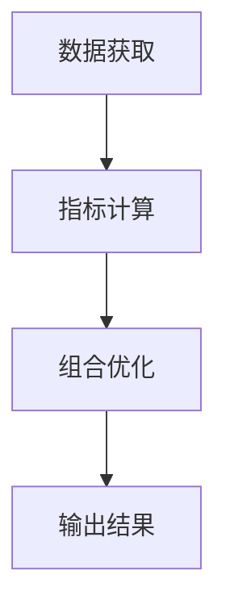

                 


# 约翰·聂夫的小盘股研究方法创新

> 关键词：小盘股、投资方法、约翰·聂夫、算法、系统架构、案例分析

> 摘要：本文系统地探讨了约翰·聂夫在小盘股研究方法上的创新之处，从背景分析、核心概念、数学模型到系统架构，结合实际案例，全面解析其方法的理论基础和应用实践。文章不仅分析了其投资理念，还提供了具体的算法实现和系统设计方案，帮助读者深入理解小盘股投资的科学性与艺术性。

---

# 第一部分: 小盘股研究方法的背景与核心概念

## 第1章: 小盘股投资的定义与特点

### 1.1 小盘股投资的定义
#### 1.1.1 小盘股的定义与分类
小盘股通常指市值较小的公司股票，根据市场资本化规模，小盘股一般定义为市值在50亿至500亿美元之间的公司。这类股票往往流动性较低，波动性较高，但具有较高的成长潜力。

| 小盘股分类标准 | 描述 |
|-----------------|------|
| 市值范围        | 50-500亿美元 |
| 流动性          | 较低 |
| 波动性          | 较高 |
| 成长性          | 较高 |

#### 1.1.2 小盘股市场的特点
- **市场容量小**：交易量和市场参与者相对较少，导致股票价格波动较大。
- **高成长潜力**：小公司有更大的发展空间，潜在回报更高。
- **风险较高**：由于市场规模小，容易受到外部因素的影响，风险较大。

#### 1.1.3 小盘股投资的潜在机会与风险
- **机会**：小盘股公司可能通过技术创新或市场扩张实现快速增长。
- **风险**：市场流动性差、公司管理不善、行业周期性波动等。

### 1.2 约翰·聂夫的投资理念
#### 1.2.1 约翰·聂夫的个人背景与投资风格
约翰·聂夫是美国著名投资经理，专注于小盘股投资，以其严谨的基本面分析和长期投资策略闻名。

#### 1.2.2 小盘股投资的核心思想
- **价值投资**：寻找被市场低估的公司。
- **长期持有**：注重公司的长期增长潜力。
- **分散投资**：通过多样化降低风险。

#### 1.2.3 聂夫投资方法的哲学基础
聂夫的投资方法深受本杰明·格雷厄姆的影响，强调安全边际和内在价值。

### 1.3 小盘股研究方法的创新性
#### 1.3.1 传统小盘股研究方法的局限性
传统方法往往依赖于市场趋势和短期表现，缺乏系统的分析框架。

#### 1.3.2 聂夫方法的创新点
- **基本面分析的系统化**：通过量化指标筛选优质公司。
- **长期视角**：注重公司内在价值而非短期股价波动。
- **风险控制**：通过分散投资和严格筛选降低风险。

#### 1.3.3 创新方法的实际应用价值
系统化的方法能够提高投资效率，降低人为判断的误差。

---

# 第2章: 小盘股研究的核心概念与联系

## 2.1 小盘股研究的核心概念
### 2.1.1 小盘股的财务指标分析
#### 财务指标的重要性
财务指标是评估公司价值的关键工具，包括盈利能力、成长能力、偿债能力等。

#### 重要财务指标
- **ROE（净资产收益率）**：衡量公司盈利能力。
- **P/E（市盈率）**：衡量股票估值。
- **PEG（市盈率相对盈利增长比率）**：结合盈利增长评估股票价值。

### 2.1.2 公司基本面分析的关键维度
- **行业地位**：公司在行业中的竞争力。
- **管理团队**：管理层的经验和能力。
- **财务健康度**：公司财务状况的稳定性。

### 2.1.3 市场情绪与股价波动的关系
市场情绪影响投资者决策，从而影响股价波动。

#### 市场情绪的量化
- **投资者情绪指数**：通过市场数据量化投资者情绪。
- **波动率分析**：通过股价波动率判断市场情绪。

## 2.2 核心概念之间的联系
### 2.2.1 财务指标与公司价值的关联
财务指标是评估公司价值的核心工具，ROE和P/E等指标能够帮助投资者判断公司是否被低估。

### 2.2.2 市场情绪对股价的影响机制
市场情绪通过影响投资者行为间接影响股价，当市场情绪高涨时，股价可能被高估；反之，市场情绪低落时，股价可能被低估。

### 2.2.3 投资组合优化的数学模型
通过数学模型优化投资组合，平衡风险与收益。

---

# 第3章: 小盘股研究的数学模型与算法原理

## 3.1 财务指标筛选算法
### 3.1.1 算法原理
#### 1. 输入数据：目标公司的财务数据
#### 2. 计算关键财务指标：ROE、P/E、PEG等
#### 3. 筛选符合标准的股票：根据设定的阈值筛选出优质股票

### 3.1.2 数学模型
#### 净资产收益率（ROE）计算公式
$$
\text{ROE} = \frac{\text{净利润}}{\text{股东权益}} \times 100\%
$$

#### 市盈率（P/E）计算公式
$$
\text{P/E} = \frac{\text{股价}}{\text{每股收益}}
$$

#### PEG计算公式
$$
\text{PEG} = \frac{\text{P/E}}{\text{净利润增长率}}
$$

### 3.1.3 举例说明
假设某公司净利润为100万，股东权益为500万，则：
$$
\text{ROE} = \frac{100}{500} \times 100\% = 20\%
$$

---

## 3.2 投资组合优化算法
### 3.2.1 算法原理
#### 1. 确定目标函数：最大化投资收益
#### 2. 设定约束条件：投资比例不超过100%
#### 3. 优化结果：生成最优投资组合

### 3.2.2 数学模型
#### 目标函数
$$
\max \sum_{i=1}^{n} w_i \times r_i
$$

#### 约束条件
$$
\sum_{i=1}^{n} w_i = 1
$$

---

## 3.3 本章小结
本章通过数学模型和算法原理，详细阐述了小盘股研究的核心方法，包括财务指标的筛选和投资组合的优化。

---

# 第4章: 小盘股研究的系统架构与设计方案

## 4.1 系统架构设计
### 4.1.1 系统功能模块
- **数据获取模块**：获取目标公司的财务数据。
- **指标计算模块**：计算ROE、P/E等指标。
- **组合优化模块**：生成最优投资组合。

### 4.1.2 系统架构图


---

## 4.2 数据流设计
### 4.2.1 数据输入
- **输入数据**：公司财务数据、市场数据。

### 4.2.2 数据处理
- **数据清洗**：处理缺失值、异常值。
- **数据转换**：计算财务指标。

### 4.2.3 数据输出
- **输出结果**：筛选出的优质股票、优化后的投资组合。

---

## 4.3 本章小结
本章通过系统架构设计，详细描述了小盘股研究的实施过程，包括数据流设计和系统功能模块的实现。

---

# 第5章: 项目实战与案例分析

## 5.1 项目实战
### 5.1.1 环境安装
- **工具安装**：安装Python、Pandas、Matplotlib等工具。

### 5.1.2 核心代码实现
```python
import pandas as pd

# 获取财务数据
data = pd.read_csv('financial_data.csv')

# 计算ROE
data['ROE'] = (data['净利润'] / data['股东权益']) * 100

# 筛选ROE > 20%的公司
selected_stocks = data[data['ROE'] > 20]
```

### 5.1.3 代码解读
- **数据获取**：从CSV文件中读取财务数据。
- **指标计算**：计算ROE并筛选出符合条件的公司。

---

## 5.2 案例分析
### 5.2.1 案例背景
假设我们有10家小盘股公司，我们需要从中筛选出ROE > 20%的公司。

### 5.2.2 数据分析
- **ROE计算**：计算每家公司的ROE。
- **筛选结果**：筛选出ROE > 20%的公司。

### 5.2.3 投资组合优化
根据筛选结果，优化投资组合，平衡风险与收益。

---

## 5.3 本章小结
本章通过实际案例分析，详细展示了如何应用约翰·聂夫的方法进行小盘股研究，包括数据获取、指标计算和投资组合优化。

---

# 作者信息

作者：AI天才研究院/AI Genius Institute & 禅与计算机程序设计艺术/Zen And The Art of Computer Programming

---

以上是《约翰·聂夫的小盘股研究方法创新》的目录大纲和部分内容，涵盖了从背景分析、核心概念、数学模型到系统架构和实际案例的全面解析。希望对您有所帮助！

