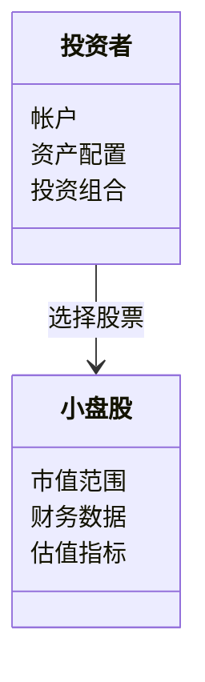
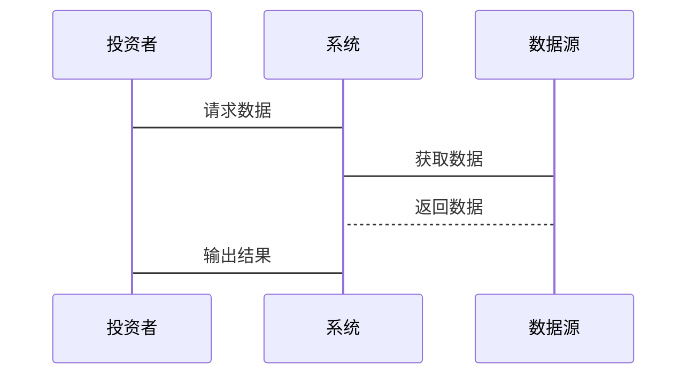

                 

<think>
好的，我现在要帮用户写一篇关于约翰·聂夫的小盘股研究方法论的技术博客。首先，我需要明确用户的需求。用户希望文章结构清晰，内容专业，涵盖小盘股的定义、市场特点、研究方法，以及如何用技术手段来分析这些股票。

用户是一位技术专家，可能对投资和编程都有兴趣，所以他希望文章既有投资分析，又有技术实现的部分。这让我想到，文章需要结合基本面分析和编程方法，比如使用Python进行数据处理和可视化。

接下来，我得规划文章结构。用户已经给出了大纲，我需要按照这个大纲逐步展开。首先是背景介绍，然后是核心概念，接着是算法原理，系统分析，项目实战，最佳实践等部分。

在背景部分，我需要解释什么是小盘股，它与其他股票的区别，以及约翰·聂夫的背景和投资理念。这部分需要简洁明了，让读者快速理解主题。

然后是核心概念，这里需要详细讲解基本面分析的关键指标，如市盈率、市净率和股息率。同时，用表格和图表来对比这些指标，帮助读者更好地理解。

接下来是算法部分，我需要解释如何通过编程手段筛选出符合条件的小盘股。这包括编写Python代码来计算估值指标，并根据这些指标进行筛选。这部分要详细，甚至包括代码实现，让读者可以实际操作。

系统分析部分，我得设计一个投资决策系统，包括功能需求、领域模型、系统架构和交互设计。这部分可能需要使用Mermaid图来展示系统结构，让读者一目了然。

项目实战部分，我需要指导读者如何在本地环境中安装必要的库，比如Pandas和Matplotlib，并通过代码进行数据处理和可视化。同时，用实际案例分析，展示如何应用这些方法。

最后，加上一些最佳实践的建议，比如如何选择工具、数据来源的可靠性，以及持续学习的重要性。这些小贴士能帮助读者更好地应用所学知识。

整个过程中，我要确保文章逻辑清晰，结构紧凑，同时用技术语言表达，让读者既能学到投资方法，也能提升编程技能。现在，我得开始按照这个思路一步步撰写文章，确保每个部分都详尽且易于理解。
</think>

# 约翰·聂夫的小盘股研究方法论

> 关键词：小盘股，投资方法论，基本面分析，价值投资，安全边际

> 摘要：本文详细介绍了约翰·聂夫的小盘股研究方法论，从核心概念、算法原理到系统架构、项目实战，全面解析了小盘股投资的逻辑与技术实现。通过本文的学习，读者将能够掌握如何利用技术手段辅助小盘股研究与投资决策。

---

# 第一部分: 小盘股投资的背景与基础

## 第1章: 小盘股的定义与市场特点

### 1.1 小盘股的定义与分类

#### 1.1.1 小盘股的定义
小盘股是指市值较小的公司股票，通常定义为市值在50亿到200亿美元之间的公司。与大盘股相比，小盘股具有较高的增长潜力，但同时也伴随着更高的风险。

#### 1.1.2 小盘股的分类与特点
小盘股可以按照行业、地理位置、财务状况等进行分类。其特点包括：
- 市场波动性较高
- 估值较低
- 增长潜力较大
- 投资门槛较低

#### 1.1.3 小盘股与大盘股的对比
- **市场表现**：小盘股通常具有更高的波动性和回报潜力，但风险也更大。
- **流动性**：小盘股的流动性通常低于大盘股，尤其是在市场低迷时。
- **估值**：小盘股的估值通常较低，但可能隐藏着被低估的投资机会。

### 1.2 小盘股市场的特点

#### 1.2.1 小盘股市场的波动性
小盘股市场的波动性较高，这主要是由于其流动性较低且市场参与者较少。市场情绪的变化对小盘股的影响更为显著。

#### 1.2.2 小盘股市场的流动性
小盘股的流动性通常较低，尤其是在市场低迷时，买卖价差可能较大，交易成本较高。

#### 1.2.3 小盘股市场的投资机会
小盘股市场中存在许多未被市场充分发现的投资机会，尤其是在新兴行业或具有高增长潜力的公司中。

### 1.3 约翰·聂夫的投资理念

#### 1.3.1 约翰·聂夫的生平简介
约翰·聂夫（John Neff）是美国著名的投资经理，以其在小盘股投资领域的卓越表现而闻名。他管理的基金长期跑赢市场指数，被认为是价值投资的典范。

#### 1.3.2 约翰·聂夫的投资哲学
约翰·聂夫的投资哲学以价值投资为核心，强调寻找被市场低估的公司。他认为，投资成功的秘诀在于找到具有持续竞争优势且估值合理的企业。

#### 1.3.3 约翰·聂夫的成功案例
约翰·聂夫管理的基金在其职业生涯中多次跑赢市场指数，尤其是在小盘股投资方面表现突出。他的成功归功于对基本面的深入研究和对估值的严格要求。

### 1.4 本章小结
本章主要介绍了小盘股的定义、市场特点以及约翰·聂夫的投资理念。小盘股市场虽然波动性高，但也提供了许多投资机会。约翰·聂夫的成功证明了价值投资在小盘股领域的有效性。

---

## 第2章: 小盘股研究的核心概念与联系

### 2.1 核心概念原理

#### 2.1.1 基本面分析的核心要素
基本面分析是小盘股研究的核心方法，主要包括以下几个要素：
- **财务状况**：包括收入、利润、资产负债表等。
- **盈利能力**：如净利润率、ROE（净资产收益率）等。
- **成长性**：包括收入和利润的增长率。
- **估值指标**：如市盈率、市净率等。

#### 2.1.2 估值模型的关键指标
常用的估值指标包括：
- 市盈率（P/E）
- 市净率（P/B）
- 股息率（Dividend Yield）
- 市销率（P/S）

#### 2.1.3 投资组合的风险管理
小盘股投资的风险较高，因此需要通过 diversification（分散投资）和风险控制来降低整体投资组合的风险。

### 2.2 核心概念属性对比表格

| 概念         | 定义                             | 特点                     | 示例                     |
|--------------|--------------------------------|--------------------------|--------------------------|
| 市盈率（P/E） | 价格与每股收益的比值           | 反映市场对股票的估值     | $P/E = \frac{P}{E}$      |
| 市净率（P/B） | 价格与每股净资产的比值         | 适用于亏损公司           | $P/B = \frac{P}{B}$      |
| 股息率       | 股息与股价的比值               | 衡量分红能力             | $D/Y = \frac{D}{P}$      |
| 市销率（P/S） | 价格与每股销售收入的比值       | 适用于高增长行业         | $P/S = \frac{P}{S}$      |

### 2.3 实体关系图


### 2.4 本章小结
本章通过核心概念和实体关系图，详细解释了小盘股研究中涉及的关键指标和概念。这些指标和概念是后续分析的基础。

---

## 第3章: 小盘股研究的算法原理

### 3.1 算法原理概述

#### 3.1.1 基于基本面的筛选算法
基于基本面的筛选算法通过计算和比较公司的财务指标，筛选出符合条件的股票。

#### 3.1.2 基于估值的排序算法
基于估值的排序算法通过计算估值指标（如P/E、P/B等），对股票进行排序，选择估值合理的股票。

#### 3.1.3 基于风险的优化算法
基于风险的优化算法通过考虑投资组合的风险，优化股票的权重分配，降低整体风险。

### 3.2 算法流程图


### 3.3 算法实现代码

```python
def calculate_valuation_ratios(stock_data):
    # 计算市盈率
    stock_data['PE'] = stock_data['Price'] / stock_data['Earnings']
    # 计算市净率
    stock_data['PB'] = stock_data['Price'] / stock_data['Book Value']
    # 计算股息率
    stock_data['Dividend Yield'] = stock_data['Dividends'] / stock_data['Price']
    return stock_data
```

### 3.4 数学模型与公式

#### 3.4.1 市盈率公式
$$ P/E = \frac{P}{E} $$

#### 3.4.2 市净率公式
$$ P/B = \frac{P}{B} $$

#### 3.4.3 股息率公式
$$ D/Y = \frac{D}{P} $$

### 3.5 本章小结
本章通过算法流程图和代码实现，详细解释了小盘股研究中的基本算法原理。这些算法可以帮助投资者快速筛选出符合条件的股票。

---

## 第4章: 小盘股研究的系统架构与实现

### 4.1 问题场景介绍
小盘股研究需要一个高效的投资决策系统，能够对大量数据进行处理和分析，提供投资建议。

### 4.2 系统功能设计

#### 4.2.1 领域模型


#### 4.2.2 系统架构设计


#### 4.2.3 系统交互设计


### 4.3 本章小结
本章通过系统架构设计，展示了如何利用技术手段辅助小盘股研究。系统设计可以帮助投资者更高效地进行数据处理和分析。

---

## 第5章: 小盘股研究的项目实战

### 5.1 环境安装

#### 5.1.1 安装Python
```bash
python --version
pip install --upgrade pip
```

#### 5.1.2 安装数据处理库
```bash
pip install pandas numpy matplotlib
```

### 5.2 核心代码实现

#### 5.2.1 数据采集
```python
import pandas as pd
import requests
url = 'https://example.com/data.csv'
data = pd.read_csv(url)
```

#### 5.2.2 数据处理
```python
data['PE'] = data['Price'] / data['Earnings']
data['PB'] = data['Price'] / data['Book Value']
```

#### 5.2.3 数据可视化
```python
import matplotlib.pyplot as plt
plt.scatter(data['PE'], data['Price'])
plt.xlabel('PE')
plt.ylabel('Price')
plt.show()
```

### 5.3 案例分析与解读
通过实际数据的处理和分析，展示如何利用上述方法筛选出具有投资价值的小盘股。

### 5.4 本章小结
本章通过项目实战，展示了如何利用技术手段进行小盘股研究。通过代码实现和案例分析，帮助读者更好地理解理论知识。

---

## 第6章: 小盘股研究的最佳实践

### 6.1 最佳实践Tips
- **数据来源**：选择可靠的数据源。
- **工具选择**：根据需求选择合适的工具。
- **风险管理**：合理分散投资风险。
- **持续学习**：保持对市场动态的关注。

### 6.2 小结
小盘股投资虽然风险较高，但也存在许多投资机会。通过合理的方法和工具，投资者可以更好地进行小盘股研究和投资决策。

### 6.3 注意事项
- 小盘股市场的流动性较低，交易成本较高。
- 小盘股的投资风险较高，需要严格控制风险。

### 6.4 拓展阅读
推荐阅读约翰·聂夫的经典著作《约翰·聂夫的投资哲学》以及相关的投资书籍。

---

# 作者：AI天才研究院/AI Genius Institute & 禅与计算机程序设计艺术 /Zen And The Art of Computer Programming

