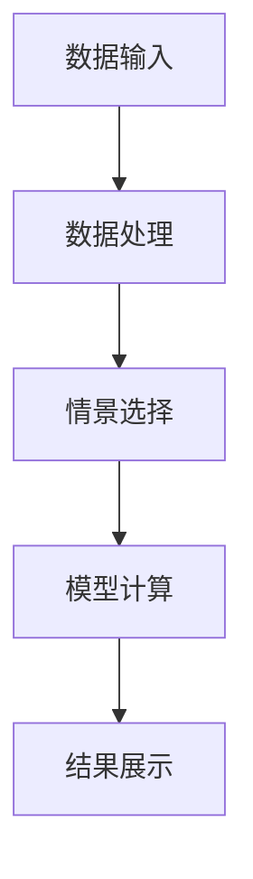
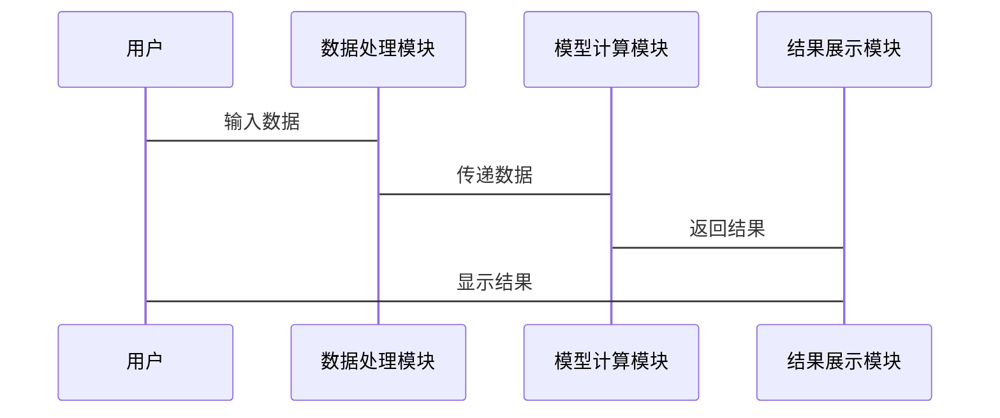

                 


# 约翰伯格的'压力测试'：评估投资组合的抗风险能力

## 关键词：压力测试，投资组合，风险评估，数学模型，系统架构，项目实战

## 摘要：压力测试是一种评估投资组合在极端市场条件下的表现的方法，帮助投资者了解其抗风险能力。本文将从核心概念、数学模型、系统架构、项目实战等多维度深入分析压力测试的原理和应用，帮助读者掌握如何通过压力测试来评估投资组合的抗风险能力。

---

# 引言：压力测试的重要性

在投资领域，压力测试是评估投资组合在极端市场条件下表现的关键工具。它通过模拟可能出现的最坏情况，帮助投资者了解其投资组合在这些情况下的表现，从而做出更明智的投资决策。本文将从压力测试的背景、核心概念、数学模型、系统架构和项目实战等方面，详细探讨如何通过压力测试来评估投资组合的抗风险能力。

---

## 第一部分: 压力测试的背景与基础

### 第1章: 压力测试的定义与重要性

#### 1.1 压力测试的基本概念
压力测试是一种评估投资组合在极端市场条件下的表现的方法。通过模拟各种可能的极端市场情景，压力测试帮助投资者了解其投资组合在这些情景下的表现，从而评估其抗风险能力。

#### 1.2 压力测试的目的与意义
压力测试的主要目的是评估投资组合在极端市场条件下的表现，帮助投资者识别潜在的风险，并采取相应的风险管理措施。压力测试的意义在于它能够帮助投资者在市场波动加剧的情况下做出更明智的投资决策。

#### 1.3 压力测试的历史与发展
压力测试的概念可以追溯到20世纪90年代，随着金融市场的发展和复杂性增加，压力测试逐渐成为评估投资组合抗风险能力的重要工具。近年来，压力测试的方法和技术不断完善，成为投资组合管理中的标准工具。

---

### 第2章: 投资组合抗风险能力的核心概念

#### 2.1 投资组合的风险因素
投资组合的风险因素包括市场风险、利率风险、流动性风险和操作风险等。市场风险是指市场波动对投资组合价值的影响；利率风险是指利率变化对债券等固定收益证券的影响；流动性风险是指投资组合在需要资金时难以迅速变现的风险；操作风险是指由于操作失误或系统故障导致的投资损失风险。

#### 2.2 压力测试中的情景分析
情景分析是压力测试的核心组成部分，通过模拟不同的市场情景，评估投资组合在这些情景下的表现。常见的压力测试情景包括市场崩盘、利率上升、流动性危机等。

#### 2.3 压力测试指标与评估标准
压力测试指标包括风险价值（VaR）、信用风险价值（CVaR）等。这些指标帮助投资者量化投资组合在极端情景下的潜在损失，并评估其抗风险能力。

---

## 第二部分: 压力测试的核心原理

### 第3章: 压力测试的数学模型与算法

#### 3.1 压力测试的数学模型
压力测试的数学模型包括风险价值（VaR）和信用风险价值（CVaR）等。VaR是指在给定置信水平下，投资组合在正常市场条件下可能遭受的最大损失；CVaR是指在VaR基础上，考虑尾部风险的更保守的风险度量。

#### 3.2 压力测试的算法实现
压力测试的算法实现包括蒙特卡洛模拟法、历史模拟法和方差-协方差法等。蒙特卡洛模拟法通过模拟大量随机市场情景，评估投资组合在这些情景下的表现；历史模拟法基于历史市场数据，模拟投资组合在历史极端情景下的表现；方差-协方差法则通过计算资产之间的协方差矩阵，评估投资组合的风险。

#### 3.3 算法的数学公式与实现
风险价值（VaR）的数学公式为：
$$ VaR = \alpha \times \sigma $$
其中，α是置信水平对应的分位数，σ是投资组合的收益率标准差。

蒙特卡洛模拟法的实现步骤如下：
1. 生成大量随机市场情景；
2. 计算投资组合在每种情景下的收益率；
3. 排序收益率，计算VaR或CVaR。

### 第4章: 压力测试的系统架构

#### 4.1 系统架构设计
压力测试的系统架构包括数据采集模块、模型计算模块和结果展示模块。数据采集模块负责获取市场数据和投资组合信息；模型计算模块负责根据压力测试模型计算投资组合在极端情景下的表现；结果展示模块负责将计算结果以可视化形式呈现。

#### 4.2 系统功能设计
系统的功能模块包括数据输入、情景选择、模型计算和结果展示。用户可以通过输入市场数据和投资组合信息，选择不同的压力测试情景，运行模型并查看结果。

#### 4.3 系统架构图


#### 4.4 系统接口设计
系统接口包括数据接口、模型接口和结果接口。数据接口用于获取市场数据和投资组合信息；模型接口用于运行压力测试模型；结果接口用于输出压力测试结果。

#### 4.5 系统交互图


---

## 第三部分: 项目实战

### 第5章: 环境安装与代码实现

#### 5.1 环境安装
压力测试的环境安装包括安装Python、安装NumPy、Pandas和Matplotlib库，以及安装其他可能需要的库。

```bash
pip install numpy pandas matplotlib
```

#### 5.2 核心代码实现
以下是压力测试的Python代码实现：
```python
import numpy as np
import pandas as pd
import matplotlib.pyplot as plt

# 生成随机市场情景
np.random.seed(123)
n = 10000
returns = np.random.normal(0, 1, n)

# 计算VaR
def calculate VaR(returns, alpha=0.05):
    sorted_returns = np.sort(returns)
    VaR = sorted_returns[int(alpha * len(returns))]
    return VaR

VaR = calculate VaR(returns)
print("VaR:", VaR)

# 可视化
plt.hist(returns, bins=50)
plt.xlabel('收益率')
plt.ylabel('频数')
plt.title('收益率分布')
plt.show()
```

### 第6章: 案例分析与项目总结

#### 6.1 案例分析
通过实际案例分析，展示压力测试在投资组合管理中的应用。例如，假设一个投资组合包含股票、债券和商品等资产，通过模拟市场崩盘情景，评估投资组合的潜在损失。

#### 6.2 项目总结
总结压力测试在投资组合管理中的应用价值，指出其优势和局限性，并提出改进建议。

---

## 第四部分: 总结与展望

### 第7章: 压力测试的最佳实践

#### 7.1 最佳实践
压力测试的最佳实践包括选择合适的情景、使用可靠的模型、定期更新数据等。

#### 7.2 小结
压力测试是评估投资组合抗风险能力的重要工具，通过合理选择情景和模型，投资者可以更好地管理投资风险。

#### 7.3 注意事项
在实际应用中，需要注意数据质量、模型选择和结果解释等问题，确保压力测试的有效性和可靠性。

#### 7.4 拓展阅读
推荐一些关于压力测试的经典文献和工具书籍，供读者进一步学习。

---

## 作者：AI天才研究院/AI Genius Institute & 禅与计算机程序设计艺术 /Zen And The Art of Computer Programming

---

这篇文章系统地介绍了压力测试的背景、核心概念、数学模型、系统架构和项目实战，帮助读者全面理解压力测试的原理和应用。通过实际案例分析和代码实现，读者可以掌握如何通过压力测试来评估投资组合的抗风险能力。

