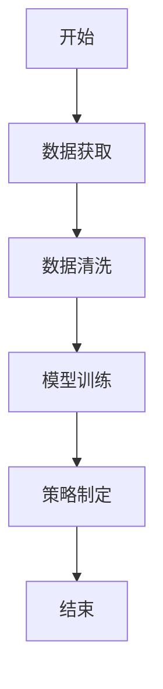
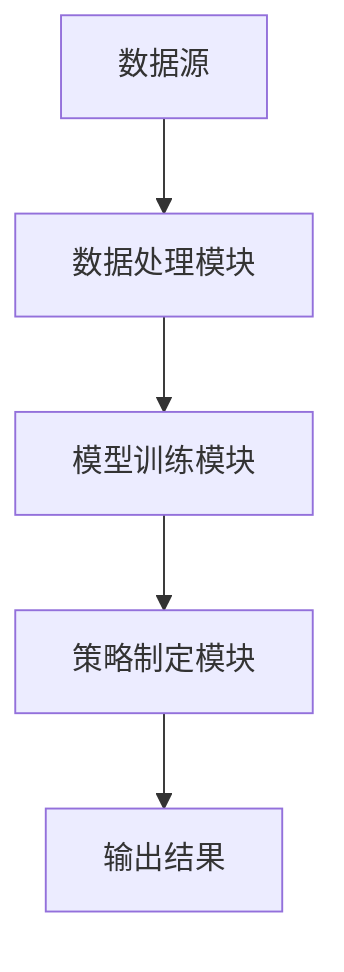
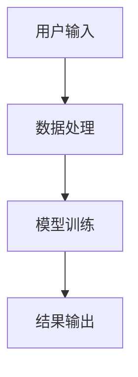

                 


# 约翰伯格的'回归均值'理论：市场长期的自我修正

## 关键词：回归均值、金融市场、自我修正、投资策略、统计学、约翰伯格

## 摘要：回归均值理论是统计学中的一个重要概念，广泛应用于金融市场分析中。本文通过详细阐述约翰伯格的回归均值理论，探讨其在市场自我修正中的应用，结合实际案例和系统架构设计，展示如何利用该理论进行投资策略的制定与优化。

---

## 第一部分：回归均值理论的背景与基础

### #1 约翰伯格与回归均值理论的起源

#### 1.1 约翰伯格的学术背景与贡献
- **1.1.1 约翰伯格的学术成就**
  约翰伯格是统计学领域的先驱，他的工作为现代统计学奠定了基础。
- **1.1.2 约翰伯格对金融学的贡献**
  他在金融市场的数据分析和预测方面做出了重要贡献。
- **1.1.3 约翰伯格与回归均值理论的关联**
  他提出的回归均值理论为金融市场分析提供了理论基础。

#### 1.2 回归均值理论的基本概念
- **1.2.1 什么是回归均值**
  回归均值是指数据点趋向于回归到长期平均值的现象。
- **1.2.2 回归均值的数学表达**
  $$ E[x] = \mu $$，其中$\mu$是长期平均值。
- **1.2.3 回归均值的直观解释**
  数据点不会永远偏离均值，最终会趋向于均值。

### #2 回归均值理论的核心原理

#### 2.1 回归均值的统计学基础
- **2.1.1 统计学中的回归分析**
  回归分析用于研究变量之间的关系。
- **2.1.2 均值回归的概念**
  数据点趋向于长期平均值的回归现象。
- **2.1.3 回归均值与时间序列分析的关系**
  回归均值理论常用于时间序列分析中。

#### 2.2 回归均值的数学模型
- **2.2.1 回归均值的公式推导**
  $$ y_t = \mu + \beta t + \epsilon_t $$
  其中$\epsilon_t$是误差项，服从均值为0的分布。
- **2.2.2 回归均值的假设检验**
  检验$\beta$是否为0，以判断是否存在回归均值现象。
- **2.2.3 回归均值的置信区间**
  计算长期平均值的置信区间，评估回归均值的可靠性。

---

## 第二部分：回归均值理论的金融应用

### #3 金融市场的自我修正机制

#### 3.1 金融市场中的均值回归现象
- **3.1.1 市场波动与均值回归**
  市场价格在剧烈波动后趋向于长期平均值。
- **3.1.2 均值回归在风险管理中的应用**
  利用均值回归预测市场风险，制定风险管理策略。

#### 3.2 回归均值在投资策略中的应用
- **3.2.1 均值回归交易策略**
  基于回归均值理论制定交易策略，捕捉价格偏离均值后的回归机会。
- **3.2.2 均值回归与动量策略的对比**
  均值回归策略与动量策略在策略制定和执行上的差异。
- **3.2.3 均值回归在长期投资中的作用**
  均值回归帮助投资者制定长期投资策略，降低短期波动风险。

---

## 第三部分：回归均值理论的系统分析与架构设计

### #4 系统功能设计

#### 4.1 系统目标与范围
- 系统目标：基于回归均值理论，构建金融市场分析系统。
- 系统范围：涵盖数据获取、分析、预测和策略制定。

#### 4.2 系统功能模块划分
- 数据获取模块：获取金融市场数据。
- 数据处理模块：清洗和转换数据。
- 模型训练模块：建立回归均值模型。
- 策略制定模块：基于模型输出投资策略。

#### 4.3 系统功能流程图


### #5 系统架构设计

#### 5.1 系统架构图


#### 5.2 数据流图


---

## 第四部分：回归均值理论的项目实战

### #6 核心算法实现

#### 6.1 代码实现
```python
import numpy as np

def mean_reversion_strategy(prices, window=20):
    # 计算20天移动平均线
    ma = np.mean(prices[-window:])
    # 计算标准差
    std = np.std(prices[-window:])
    # 判断是否偏离均值
    if prices[-1] < ma - std:
        return "买入信号"
    elif prices[-1] > ma + std:
        return "卖出信号"
    else:
        return "持有信号"

# 示例数据
prices = np.random.normal(100, 5, 100)
print(mean_reversion_strategy(prices))
```

#### 6.2 数据分析与可视化
```python
import matplotlib.pyplot as plt

prices = np.random.normal(100, 5, 100)
plt.plot(prices, label='价格')
ma = np.mean(prices[-20:])
std = np.std(prices[-20:])
plt.axhline(y=ma, color='red', label='均值')
plt.legend()
plt.show()
```

### #7 项目实战总结

#### 7.1 实战案例分析
- 使用回归均值理论分析股票价格数据，制定交易策略。

#### 7.2 实战经验总结
- 回归均值理论在实际应用中需结合其他因素，如市场情绪、宏观经济指标等。
- 数据质量对模型准确性的影响至关重要。

---

## 第五部分：回归均值理论的最佳实践与总结

### #8 最佳实践 tips

#### 8.1 数据质量的重要性
- 使用高质量、完整的数据进行分析。

#### 8.2 模型优化技巧
- 结合其他统计方法或机器学习模型提高预测精度。

#### 8.3 风险管理策略
- 设定止损点，控制投资风险。

### #9 项目小结

- 回归均值理论是金融市场分析的重要工具。
- 结合实际案例，展示了如何利用该理论制定投资策略。
- 强调了数据质量和风险管理在实际应用中的重要性。

### #10 注意事项

- 回归均值理论适用于长期趋势分析，需谨慎处理短期波动。
- 模型需定期更新和优化，适应市场变化。

### #11 拓展阅读

- 推荐阅读《统计学》和《金融市场分析》相关书籍，深入了解回归均值理论的更多应用。

---

## 作者：AI天才研究院/AI Genius Institute & 禅与计算机程序设计艺术 /Zen And The Art of Computer Programming

---

通过以上结构，文章系统地阐述了回归均值理论的背景、原理、应用及系统实现，结合实际案例和最佳实践，帮助读者深入理解这一理论在金融市场中的重要作用。

