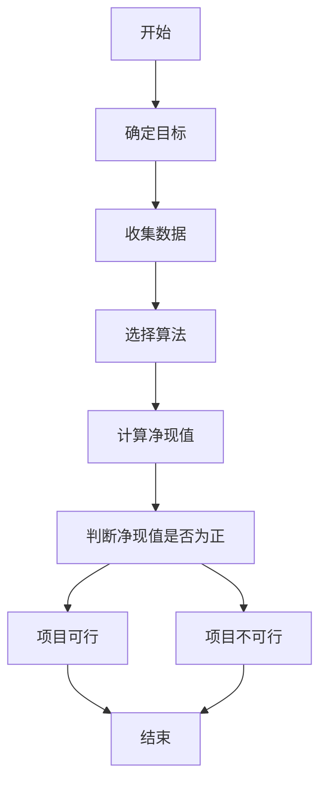

                 


# 约翰伯格的'成本意识'：为什么每一分投资费用都重要

## 关键词：成本意识、投资决策、净现值、内部收益率、资源优化、投资回报

## 摘要：  
本文深入探讨了约翰伯格的“成本意识”概念，分析了其在投资决策中的重要性。通过详细阐述成本意识的核心概念、算法原理、系统分析、项目实战及最佳实践，本文旨在帮助读者理解如何通过优化每一分投资成本，实现资源的最大化利用和投资回报的最大化。从理论到实践，本文提供了全面而深入的解析。

---

## 第一部分：成本意识的核心概念与背景

### 第1章：成本意识的定义与重要性

#### 1.1 成本意识的定义
- **成本意识**是指对资源的使用和投资成本的高度敏感和关注，强调在决策过程中充分考虑每一分投入的经济效益，以实现资源的最优配置和最大化投资回报。

#### 1.2 成本意识的核心要素
| 核心要素 | 描述 |
|----------|------|
| 成本构成 | 包括直接成本和间接成本，如人力、材料、时间等。 |
| 成本分类 | 固定成本、变动成本、 sunk cost 等。 |
| 成本控制 | 通过优化资源配置、技术改进等方式降低不必要的开支。 |

#### 1.3 成本意识与投资决策的关系
- 成本意识是投资决策的基石，直接影响投资项目的可行性和收益潜力。
- 通过成本意识，投资者可以避免盲目投资，确保每一分钱都用在刀刃上。

---

### 第2章：成本意识的核心概念与联系

#### 2.1 成本意识的核心概念原理
- **成本的构成与分类**：成本不仅仅是金钱的投入，还包括时间和资源的消耗。例如，开发一个新产品的成本包括研发费用、材料费用以及时间成本。
- **成本与收益的平衡**：在投资决策中，成本意识要求我们在追求收益的同时，严格控制成本。例如，在选择投资项目时，需要计算净现值（NPV）和内部收益率（IRR）等指标，以确保投资的可行性和收益性。
- **成本优化的边界与外延**：成本优化并非一味追求最低成本，而是在保证质量和效率的前提下，实现成本的最小化。例如，选择供应商时，需要综合考虑价格、质量和服务等因素。

#### 2.2 成本意识与其他概念的对比
| 概念 | 描述 | 区别 |
|------|------|------|
| 预算管理 | 对未来支出的规划与控制 | 更注重预算的制定和执行，而非成本的优化 |
| 风险管理 | 识别和应对潜在风险 | 更关注风险的识别和应对，而非成本的控制 |
| 投资回报率 | 通过 ROI 计算投资回报 | 更关注收益的绝对值，而非成本的投入 |

#### 2.3 成本意识的ER实体关系图
```mermaid
er
    actor 投资者
    actor 管理者
    actor 供应商
    entity 成本
    entity 投资项目
    entity 资源分配
    entity 投资回报
    relation 实施 成本
    relation 影响 投资回报
    relation 管理 资源分配
```

---

## 第二部分：成本意识的算法原理与数学模型

### 第3章：成本分析的基本算法

#### 3.1 净现值法（NPV）
- **定义**：净现值是指将未来现金流量按适当折现率折算到现值后，减去初始投资的现值，得到的差额。
- **公式**：
  $$ NPV = \sum_{t=0}^{n} \frac{C_t}{(1+r)^t} $$
  其中，$C_t$ 表示第 $t$ 年的现金流，$r$ 表示折现率。
- **步骤**：
  1. 确定初始投资和未来现金流。
  2. 选择合适的折现率。
  3. 计算未来现金流的现值之和。
  4. 计算净现值。

#### 3.2 内部收益率法（IRR）
- **定义**：内部收益率是指使净现值为零的折现率。
- **公式**：
  $$ NPV = 0 $$
  求解 $r$ 的方程。
- **步骤**：
  1. 确定初始投资和未来现金流。
  2. 通过试算法或公式求解 IRR。
  3. 比较 IRR 与目标收益率，判断项目可行性。

#### 3.3 成本优化的算法实现


---

## 第三部分：成本意识的系统分析与架构设计

### 第4章：系统功能设计

#### 4.1 项目介绍
- 系统名称：成本意识投资决策支持系统。
- 系统目标：帮助投资者通过成本意识优化投资决策，实现资源的最优配置。

#### 4.2 系统功能模块
| 模块 | 功能描述 |
|------|----------|
| 数据输入 | 收集投资项目的成本和收益数据 |
| 模型计算 | 计算净现值和内部收益率 |
| 决策支持 | 提供投资决策建议和优化方案 |

#### 4.3 系统架构图


---

## 第四部分：成本意识的项目实战

### 第5章：环境安装与代码实现

#### 5.1 环境安装
- 安装 Python 和必要的库（如 numpy 和 pandas）。
- 安装 Mermaid 插件以生成流程图和架构图。

#### 5.2 核心代码实现
```python
import numpy as np

def calculate_npv(cash_flows, discount_rate):
    return np.npv(discount_rate, *cash_flows)

def calculate_irr(cash_flows):
    return np.irr(cash_flows)

# 示例数据
cash_flows = [-100, 30, 30, 40]
discount_rate = 0.1

npv = calculate_npv(cash_flows, discount_rate)
irr = calculate_irr(cash_flows)

print(f"净现值：{npv}")
print(f"内部收益率：{irr}")
```

---

## 第五部分：成本意识的最佳实践

### 第6章：总结与建议

#### 6.1 小结
- 成本意识是投资决策中的核心理念，通过优化每一分投资成本，可以实现资源的最优配置和最大化投资回报。
- 在实际应用中，需要结合净现值和内部收益率等方法，综合评估项目的可行性和收益潜力。

#### 6.2 注意事项
- 投资者应根据实际情况选择合适的算法和模型。
- 在决策过程中，应充分考虑外部环境和市场风险的影响。
- 定期复盘和优化投资策略，以应对变化的市场环境。

#### 6.3 拓展阅读
- 《投资学》——约翰·C·弗伦奇
- 《价值评估：_halves 的风险管理框架》——蒂姆·洛
- 《股票作手回忆录》——埃德温·L·菲奇

---

## 作者：AI天才研究院 & 禅与计算机程序设计艺术

---

本文通过系统化的分析和详细的案例解读，全面阐述了约翰伯格的“成本意识”理念及其在投资决策中的应用。从理论到实践，帮助读者理解如何通过成本意识优化每一分投资，实现资源的最大化利用和投资回报的最大化。

