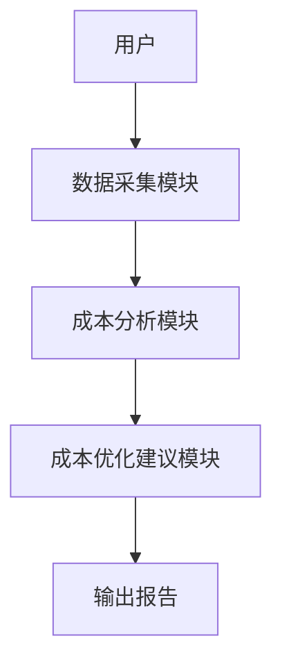

                 


# 约翰伯格的成本意识：为什么每一分钱都很重要

## 关键词：成本意识，资源优化，财务管理，系统架构，算法优化，项目管理

## 摘要：成本意识是有效管理资源和优化决策的关键。本文从约翰伯格的理论出发，探讨成本意识的重要性，分析其核心概念，并通过实际案例展示如何在系统架构和项目管理中应用这些理念，实现资源的最优配置和成本的有效控制。

---

## 第一部分：成本意识的背景与意义

### 第1章：成本意识的定义与重要性

#### 1.1 成本意识的定义

成本意识是指在资源分配和使用过程中，对每一笔支出的敏感度和关注度。它不仅涉及个人的财务管理，还包括企业在经营中的成本控制。成本意识的核心在于识别、评估和优化资源的使用效率，确保在有限资源下实现最大化的价值。

#### 1.2 成本意识的重要性

成本意识的重要性体现在多个方面：

- **个人财务管理**：帮助个体合理规划开支，避免不必要的浪费，实现资产的保值和增值。
- **企业经营**：通过成本意识，企业可以优化生产流程、降低运营成本，提升利润空间和市场竞争力。
- **资源优化配置**：在全球资源有限的情况下，成本意识有助于合理分配资源，避免浪费，促进可持续发展。

### 1.3 成本意识的核心要素

成本意识的核心要素包括：

- **成本结构**：识别和分类不同类型的成本，如固定成本和变动成本。
- **成本效益分析**：评估不同成本的投入与收益的平衡点，确保投入的每一笔资金都能带来最大化的收益。
- **预算管理**：制定和执行预算计划，监控实际支出与预算的偏差，及时调整策略。

---

## 第二部分：成本意识的核心概念与联系

### 第2章：成本结构与成本效益分析

#### 2.1 成本结构的分解

成本结构的分解是成本意识的基础，主要包括以下几种类型：

- **固定成本**：如租金、 salaries，这些成本在一定范围内不会随产量变化而变化。
- **变动成本**：如原材料采购、销售佣金，这些成本会随着产量或销售量的增加而增加。
- **直接成本**与**间接成本**：直接成本可以直接追溯到产品或服务，如原材料；间接成本则无法直接追溯，如管理费用。
- **短期成本**与**长期成本**：短期成本是短期内可以调整的成本，而长期成本则是长期投资的成本，如设备采购。

#### 2.2 成本效益分析的原理

成本效益分析是通过比较不同方案的成本与收益，选择最优方案的过程。其核心在于找到成本与收益的平衡点，确保投入的每一分钱都能带来最大化的回报。

### 成本结构对比表格

| 成本类型 | 定义 | 特点 | 示例 |
|----------|------|------|------|
| 固定成本 | 不随产量变化的成本 | 稳定性高，可预测 | 租金、 salaries |
| 变动成本 | 随产量变化的成本 | 灵活性高 | 原材料采购、销售佣金 |
| 直接成本 | 可直接追溯到产品 | 明确性高 | 原材料 |
| 间接成本 | 无法直接追溯到产品 | 分配复杂 | 管理费用、设备维护 |

### 成本结构ER图

```mermaid
erDiagram
    actor 用户 {
        string 用户ID
        string 用户名
        string 资金
    }
    actor 管理员 {
        string 管理员ID
        string 管理员名
        string 资金
    }
    actor 开发者 {
        string 开发者ID
        string 开发者名
        string 资金
    }
    用户 --> 成本结构 : 查询成本
    管理员 --> 成本结构 : 管理成本
    开发者 --> 成本结构 : 优化成本
```

---

## 第三部分：成本优化的算法原理

### 第3章：成本优化算法的实现

#### 3.1 线性规划模型

线性规划是一种优化技术，用于在满足约束条件下最大化或最小化目标函数。在成本优化中，线性规划常用于资源分配和生产计划的制定。

##### 线性规划的数学模型

目标函数：
$$ \text{最大化} \quad Z = c_1x_1 + c_2x_2 + \dots + c_nx_n $$

约束条件：
$$ \begin{cases} 
a_{11}x_1 + a_{12}x_2 + \dots + a_{1n}x_n \leq b_1 \\
a_{21}x_1 + a_{22}x_2 + \dots + a_{2n}x_n \leq b_2 \\
\vdots \\
a_{m1}x_1 + a_{m2}x_2 + \dots + a_{mn}x_n \leq b_m 
\end{cases} $$

其中，\( x_i \) 是决策变量，\( c_i \) 是目标函数的系数，\( a_{ij} \) 和 \( b_j \) 是约束条件的系数和常数项。

##### 线性规划的求解方法

1. **单纯形法**：通过迭代寻找最优解。
2. **图形法**：适用于二维问题，通过绘制可行域的图形来寻找最优解。
3. **软件求解**：如使用Excel的规划求解工具或Python的`scipy.optimize`库。

#### 3.2 动态规划算法

动态规划是一种用于多阶段决策问题的优化方法。在成本优化中，动态规划常用于解决资源分配和路径规划问题。

##### 动态规划的数学模型

状态转移方程：
$$ dp[i] = \min_{j} (dp[j] + cost(j, i)) $$

其中，\( dp[i] \) 表示到达状态 \( i \) 的最小成本，\( cost(j, i) \) 表示从状态 \( j \) 到状态 \( i \) 的成本。

##### 动态规划的实现步骤

1. **定义状态**：明确每个状态的含义。
2. **定义转移方程**：确定状态之间的转移关系。
3. **初始化边界条件**：设定初始状态的值。
4. **自底向上计算**：从初始状态开始，逐步计算后续状态的值。
5. **回溯路径**：根据计算结果，确定最优路径。

---

## 第四部分：系统分析与架构设计

### 第4章：成本管理体系的构建

#### 4.1 成本管理系统的功能设计

##### 4.1.1 成本数据采集模块

功能：采集和处理来自各个部门的成本数据，确保数据的准确性和完整性。

#### 4.1.2 成本分析模块

功能：对采集到的成本数据进行分析，识别成本节约的机会。

#### 4.1.3 成本优化建议模块

功能：基于分析结果，生成成本优化的建议，并提供实施计划。

##### 4.1.4 系统架构设计

系统架构设计包括以下几个方面：

- **模块划分**：将系统划分为数据采集、分析、优化建议等模块。
- **交互流程**：定义各模块之间的数据流和控制流。
- **实现方式**：选择合适的技术和工具来实现各模块的功能。

### 系统架构图



---

## 第五部分：项目实战与案例分析

### 第5章：成本意识在实际中的应用

#### 5.1 项目环境的搭建

##### 5.1.1 开发环境的安装与配置

- 安装Python和相关库（如`numpy`, `pandas`, `scipy.optimize`）。
- 安装成本管理软件，如ERP系统。

##### 5.1.2 数据采集与处理工具的使用

- 使用Python脚本从数据库中提取成本数据。
- 使用Excel或数据库进行数据清洗和预处理。

##### 5.1.3 成本分析工具的部署

- 部署线性规划和动态规划算法的Python脚本。
- 使用成本管理软件进行数据可视化和报告生成。

#### 5.2 项目核心代码实现

##### 5.2.1 线性规划的Python实现

```python
import numpy as np
from scipy.optimize import linprog

c = [-5, -4]  # 目标函数系数
A = [[2, 3]]     # 约束条件系数
b = [6]          # 约束条件常数项

result = linprog(c, A, b, method='simplex')
print(result)
```

##### 5.2.2 动态规划的Python实现

```python
def dynamic_planning(cost_matrix):
    n = len(cost_matrix)
    dp = [float('inf')] * (n)
    dp[0] = 0
    for i in range(n):
        for j in range(n):
            if i != j:
                if dp[j] > dp[i] + cost_matrix[i][j]:
                    dp[j] = dp[i] + cost_matrix[i][j]
    return dp

cost_matrix = [
    [0, 10, 15],
    [10, 0, 20],
    [15, 20, 0]
]

print(dynamic_planning(cost_matrix))
```

---

## 第六部分：最佳实践与小结

### 第6章：总结与展望

#### 6.1 最佳实践 tips

- 定期审查和调整预算计划，确保成本控制措施的有效性。
- 利用技术工具和算法优化成本管理，提升效率和准确性。
- 培养全员的成本意识，形成节约资源的企业文化。

#### 6.2 小结

成本意识是资源优化和有效决策的核心。通过理解和应用成本意识的理论和方法，我们可以更好地管理资源，提高效率，降低成本，实现可持续发展。

#### 6.3 注意事项

- 成本意识的实施需要全员参与，才能取得最佳效果。
- 在应用算法时，要注意数据的准确性和模型的合理性。
- 定期评估和优化成本管理体系，以适应变化的环境和需求。

#### 6.4 拓展阅读

- 《约翰伯格的成本意识：为什么每一分钱都很重要》
- 《线性规划与动态规划在成本优化中的应用》
- 《系统架构设计与成本管理》

---

## 作者：AI天才研究院/AI Genius Institute & 禅与计算机程序设计艺术/Zen And The Art of Computer Programming

---

以上是《约翰伯格的成本意识：为什么每一分钱都很重要》的完整目录和内容概要，希望对您有所帮助！

