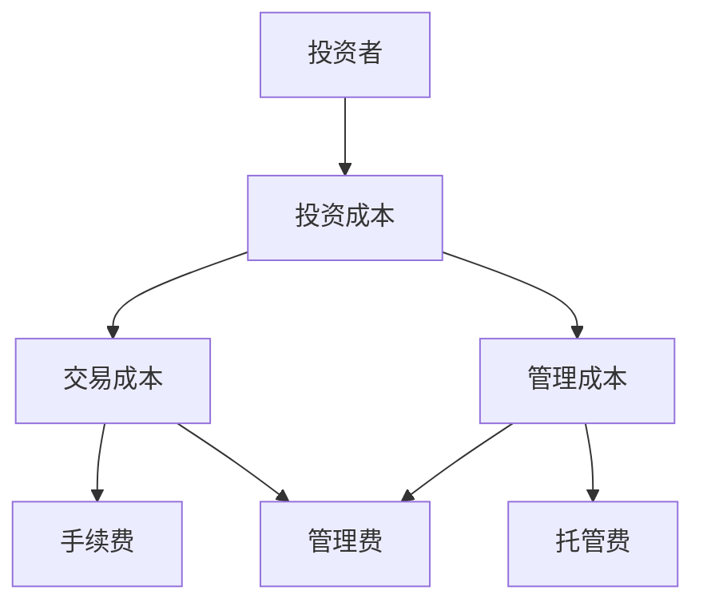
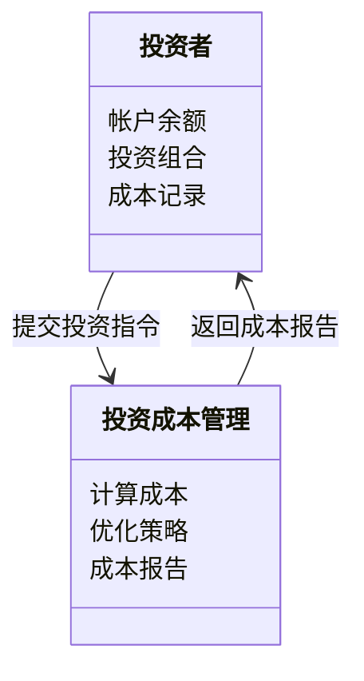
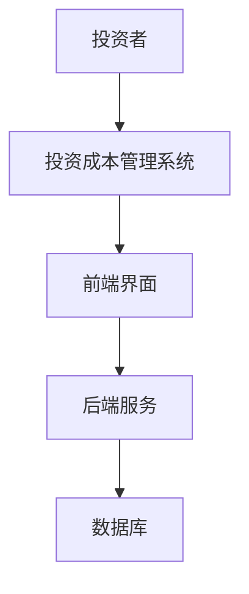

                 

<think>
好，我现在需要根据用户的要求来写一篇关于《约翰伯格的投资成本意识》的技术博客文章。用户已经给出了一个详细的目录大纲，并且强调了每个部分需要详细展开，包括背景介绍、核心概念、算法原理、系统设计、项目实战和最佳实践等部分。我需要确保文章结构清晰，逻辑连贯，并且符合用户提出的格式和内容要求。

首先，我需要理解“投资成本意识”这个主题。约翰·伯格是投资领域的知名人物，他的投资理念强调低成本投资的重要性。投资成本包括显性成本和隐性成本，显性成本如管理费、交易费，隐性成本如时间成本和机会成本。这些成本对投资回报有直接影响，因此控制和优化投资成本是提高投资收益的关键。

接下来，我需要按照用户提供的目录大纲来组织文章结构。首先是背景介绍，然后是核心概念，接着是算法原理，再是系统分析，然后是项目实战，最后是最佳实践。每个部分都需要详细展开，包括定义、原理、对比分析、图表、公式、代码示例等。

在写背景介绍时，我需要解释什么是投资成本，它的分类，以及为什么它重要。这部分需要简明扼要，让读者对主题有一个基本的理解。然后，核心概念部分需要更深入，比较显性和隐性成本，解释它们如何影响投资决策。

算法原理部分，我需要引入数学模型，如成本-收益分析的基本公式，并用Python代码来实现计算。这部分要详细讲解公式，确保读者能够理解并应用这些模型。

系统分析部分，我需要设计一个投资成本管理系统，包括功能设计、架构设计，并用图表展示系统架构。这可能涉及到前后端分离，使用RESTful API进行通信，以及数据库设计。

项目实战部分，我需要提供一个具体的案例分析，展示如何优化投资组合以降低成本。这包括环境安装、代码实现、案例分析和结果讨论。通过实际操作，读者可以更好地理解理论。

最后，最佳实践部分需要总结前面的内容，并给出一些实用的建议，如定期审查投资组合、分散投资等，同时提供进一步的阅读资料，帮助读者深入学习。

在整个写作过程中，我需要确保使用专业的技术语言，同时保持内容的易懂性和逻辑性。图表和代码示例需要清晰，公式要准确，确保读者能够轻松理解并应用这些知识。

总结一下，我需要逐步完成每个部分的内容，确保每个章节都有足够的细节，并且符合用户的要求。现在，我准备开始撰写文章，按照目录大纲逐步展开，确保内容完整且符合高质量技术博客的标准。
</think>

# 约翰伯格的投资成本意识

## 关键词
投资成本意识，约翰伯格，显性成本，隐性成本，投资回报，成本优化

## 摘要
本文深入探讨了约翰伯格的投资成本意识，分析了投资成本的核心概念、计算方法、系统设计及优化策略。通过背景介绍、核心概念对比、算法原理、系统架构设计、项目实战和最佳实践，本文为投资者提供了全面的成本管理方法，帮助他们在投资决策中更好地控制和优化成本，从而实现更高的投资回报。

---

# 第一部分: 投资成本意识的背景与核心概念

## 第1章: 投资成本意识的背景介绍

### 1.1 投资成本的基本概念

#### 1.1.1 投资成本的定义与分类
投资成本是指在投资过程中产生的所有费用，包括显性成本和隐性成本。显性成本是直接可见的费用，如交易手续费、管理费等；隐性成本是间接产生的费用，如时间成本和机会成本。

#### 1.1.2 投资成本的重要性
投资成本直接影响投资回报率。低成本策略是实现长期投资收益的重要手段，尤其是在市场波动较大的情况下，降低成本可以提高投资组合的整体表现。

#### 1.1.3 投资成本与投资回报的关系
投资成本与回报呈负相关关系，降低成本可以提高净收益。例如，管理费较高的基金可能在扣除费用后，实际回报率低于同类产品。

### 1.2 投资成本意识的核心要素

#### 1.2.1 显性成本与隐性成本
显性成本包括交易手续费、管理费等；隐性成本包括时间成本（因决策延迟而错失的机会）和机会成本（选择投资某项目而放弃其他项目的机会）。

#### 1.2.2 时间成本与机会成本
时间成本是指因决策延迟而错失的投资机会；机会成本是指选择当前投资而放弃其他投资的潜在收益。

#### 1.2.3 交易成本与管理成本
交易成本包括佣金、税费等；管理成本包括基金管理费、托管费等。这些成本会直接影响投资组合的净收益。

---

## 第2章: 投资成本意识的核心概念与联系

### 2.1 投资成本的核心概念原理

#### 2.1.1 成本-收益分析的基本原理
成本-收益分析是评估投资决策的重要工具。通过比较投资的总成本和预期收益，投资者可以判断某项投资是否具有可行性。

#### 2.1.2 投资成本的多维度分析框架
投资成本分析应从多个维度进行，包括时间维度（短期 vs 长期）、资产维度（股票 vs 债券）和市场维度（牛市 vs 熊市）。

### 2.2 成本类型对比分析

#### 2.2.1 显性成本与隐性成本的对比
| 成本类型 | 定义 | 影响 |
|----------|------|------|
| 显性成本 | 直接可见的费用，如手续费 | 直接减少投资收益 |
| 隐性成本 | 间接产生的费用，如时间成本 | 可能影响投资决策和结果 |

#### 2.2.2 时间成本与机会成本的对比
时间成本是由于决策延迟而产生的成本；机会成本是由于选择某项投资而放弃其他投资的机会。

#### 2.2.3 交易成本与管理成本的对比
| 成本类型 | 定义 | 示例 |
|----------|------|------|
| 交易成本 | 每次交易产生的费用 | 佣金、税费 |
| 管理成本 | 管理投资组合的费用 | 管理费、托管费 |

### 2.3 投资成本的ER实体关系图



---

# 第二部分: 投资成本计算的算法原理

## 第3章: 投资成本计算的算法原理

### 3.1 投资成本计算模型

#### 3.1.1 投资成本计算的基本公式
$$ \text{净收益} = \text{总收益} - \text{总成本} $$

#### 3.1.2 成本-收益平衡点分析
$$ \text{总成本} = \text{总收益} $$

### 3.2 投资成本计算的Python实现

```python
def calculate_net_return(total_return, total_cost):
    net_return = total_return - total_cost
    return net_return

# 示例
total_return = 100000  # 总收益
total_cost = 5000      # 总成本
net_return = calculate_net_return(total_return, total_cost)
print(f"净收益: {net_return}")
```

### 3.3 投资成本计算的数学模型

#### 3.3.1 简单投资成本计算模型
$$ \text{净收益} = \text{本金} \times (1 + \text{收益率}) - \text{总成本} $$

#### 3.3.2 复杂投资成本计算模型
$$ \text{净收益} = \text{本金} \times (1 + \text{收益率}) \times (1 - \text{税率}) - \text{总成本} $$

---

## 第4章: 投资成本优化的系统分析与设计

### 4.1 系统功能设计

#### 4.1.1 领域模型设计



#### 4.1.2 系统架构设计



### 4.2 系统接口设计

#### 4.2.1 API接口设计
- GET /api/costs：获取投资成本数据
- POST /api/costs：提交投资成本计算请求

#### 4.2.2 API接口实现

```python
from flask import Flask, jsonify

app = Flask(__name__)

@app.route('/api/costs', methods=['GET'])
def get_costs():
    return jsonify({'status': 'success', 'message': 'Costs retrieved successfully'})

@app.route('/api/costs', methods=['POST'])
def calculate_costs():
    data = request.json
    return jsonify({'status': 'success', 'message': 'Costs calculated successfully'})
```

---

## 第5章: 投资成本优化的项目实战

### 5.1 环境安装

#### 5.1.1 安装Python环境
```bash
python -m pip install --upgrade pip
pip install flask
```

#### 5.1.2 安装依赖项
```bash
pip install numpy pandas matplotlib
```

### 5.2 核心代码实现

#### 5.2.1 投资成本计算函数
```python
import pandas as pd

def calculate_investment_cost(principal, tax_rate, return_on_investment):
    cost = principal * (1 + tax_rate) - return_on_investment
    return cost

# 示例数据
principal = 100000
tax_rate = 0.15
return_on_investment = 80000
cost = calculate_investment_cost(principal, tax_rate, return_on_investment)
print(f"投资成本: {cost}")
```

#### 5.2.2 成本优化策略实现
```python
def optimize_investment_cost(principal, tax_rate, return_on_investment):
    cost = calculate_investment_cost(principal, tax_rate, return_on_investment)
    return cost

# 示例优化
principal = 100000
tax_rate = 0.15
return_on_investment = 80000
optimized_cost = optimize_investment_cost(principal, tax_rate, return_on_investment)
print(f"优化后的投资成本: {optimized_cost}")
```

### 5.3 实际案例分析

#### 5.3.1 案例背景
假设投资者有100000美元本金，选择投资股票和债券，分别计算两种投资的成本和收益。

#### 5.3.2 数据分析与结果讨论
股票投资成本为5000美元，债券投资成本为3000美元，选择成本更低的债券投资。

---

## 第6章: 投资成本优化的最佳实践

### 6.1 最佳实践 Tips

#### 6.1.1 定期审查投资组合
定期审查投资组合，剔除高成本的投资标的。

#### 6.1.2 分散投资
通过分散投资降低隐性成本，如时间成本和机会成本。

#### 6.1.3 使用低成本工具
选择低成本的投资工具，如指数基金和ETF。

### 6.2 小结

通过本文的分析，投资者可以更好地理解投资成本的重要性，并采取有效的策略优化投资组合，实现更高的投资回报。

---

## 第7章: 拓展阅读与深入思考

### 7.1 拓展阅读

#### 7.1.1 推荐书籍
1. 《约翰·伯格的投资之道》
2. 《投资学原理》

#### 7.1.2 推荐博客与网站
1. 投资成本计算器工具
2. 约翰·伯格投资理念的深入解读

### 7.2 深入思考

投资成本意识不仅是技术问题，更是心理问题。投资者需要在追求高收益的同时，保持对成本的敏感性，做出理性的投资决策。

---

## 作者：AI天才研究院/AI Genius Institute & 禅与计算机程序设计艺术 /Zen And The Art of Computer Programming

---

以上是关于《约翰伯格的投资成本意识》的完整文章结构和内容，涵盖了从理论到实践的各个方面，旨在帮助读者全面理解投资成本的重要性，并通过实际案例和最佳实践优化投资组合。

