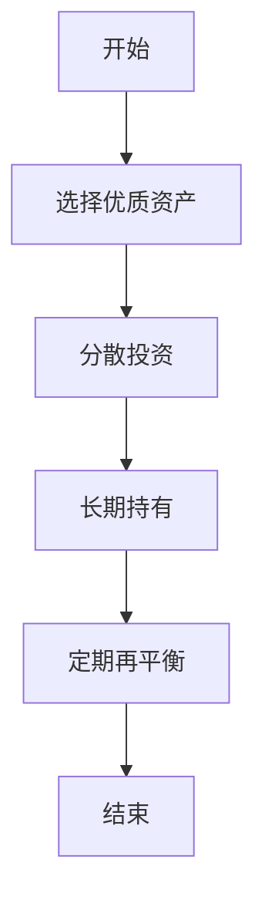
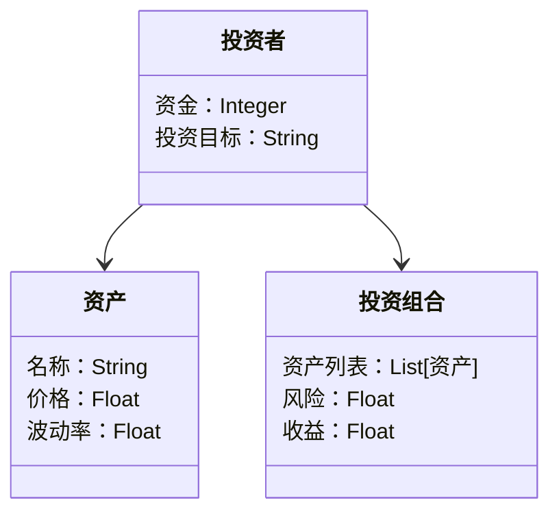

                 


# 约翰伯格的投资者教育观

## 关键词：约翰伯格，投资者教育，价值投资，长期投资，指数基金，投资策略，风险管理

## 摘要：  
约翰·伯格是全球投资领域的重要人物，他以长期投资、价值投资和指数基金的倡导而闻名。本文从约翰·伯格的投资者教育观出发，分析其核心理念、投资策略以及实际操作中的风险管理方法。通过详细阐述买入并持有策略、分散投资、价值投资与成长投资的对比，以及投资组合管理的数学模型，帮助读者全面理解约翰·伯格的教育思想，并通过实际案例和系统设计提供可操作的实战指导。

---

## 第一部分：约翰伯格的投资者教育观概述

### 第1章：约翰伯格的投资者教育背景

#### 1.1 约翰伯格的生平与投资理念

**1.1.1 约翰伯格的早年经历与职业历程**

约翰·伯格（John Bogle）是全球投资领域的重要人物，被誉为“指数基金之父”。他于1940年出生在美国宾夕法尼亚州，早年在宾夕法尼亚大学学习，并在1965年加入当时的华安兴业投资公司（现为先锋集团，Vanguard）。他在职业生涯中致力于推广低成本、低风险的指数基金，改变了全球投资者的投资方式。

**1.1.2 约翰伯格的核心投资理念**

约翰·伯格的核心投资理念可以概括为“简单、低成本、长期持有”。他认为，投资者应该避免频繁交易和复杂的交易策略，而是通过长期持有低成本的指数基金来实现财富增长。

**1.1.3 约翰伯格对投资者教育的贡献**

约翰·伯格不仅是一位成功的投资者，还是一位杰出的投资者教育家。他通过撰写书籍、发表演讲以及管理基金，帮助无数投资者理解投资的本质，并避免因短期波动而做出错误决策。

---

#### 1.2 投资者教育的核心问题

**1.2.1 投资者教育的背景与问题背景**

投资者教育的核心问题是帮助普通投资者理解投资的本质，避免因认知偏差和行为偏差导致的错误决策。许多投资者因为缺乏知识，往往会被市场波动和短期收益所迷惑，最终导致亏损。

**1.2.2 投资者认知偏差与行为偏差**

投资者的认知偏差包括过度自信、确认偏差、损失厌恶等。行为偏差则包括从众行为、羊群效应等。这些偏差会导致投资者在市场波动时做出非理性的决策，例如盲目追涨杀跌。

**1.2.3 投资者教育的目标与边界**

投资者教育的目标是帮助投资者建立正确的投资理念，掌握基本的投资知识，并通过长期投资实现财富增长。教育的边界在于，投资者教育不能替代市场分析和风险管理，它只是一个辅助工具。

---

## 第二部分：约翰伯格的核心投资理念

### 第2章：价值投资与长期投资

#### 2.1 价值投资的定义与核心要素

**2.1.1 价值投资的定义**

价值投资是一种以低于内在价值的价格买入优质股票的投资策略。其核心在于寻找被市场低估的公司，并长期持有。

**2.1.2 价值投资的核心要素对比表**

| 对比维度 | 价值投资 | 成长投资 |
|----------|----------|----------|
| 投资目标 | 寻找被低估的公司 | 寻找高增长潜力的公司 |
| 投资期限 | 长期持有 | 短期或中期 |
| 风险偏好 | 低风险偏好 | 高风险偏好 |
| 标的选择 | 市盈率低、股息率高 | 市盈率高、增长速度快 |

**2.1.3 价值投资与成长投资的ER实体关系图**

```mermaid
erDiagram
    investor --> investment_account
    investment_account --> stock
    stock --> company
    investor --> portfolio
    portfolio --> stock
    company --> industry
```

---

#### 2.2 长期投资的原理与优势

**2.2.1 长期投资的原理**

长期投资的核心原理是通过复利效应实现财富增长。通过长期持有优质资产，投资者可以避免因短期波动导致的损失，并享受资产增值的好处。

**2.2.2 长期投资与短期投资的对比分析**

| 对比维度 | 长期投资 | 短期投资 |
|----------|----------|----------|
| 风险 | 低 | 高 |
| 收益 | 稳定 | 波动大 |
| 操作 | 简单 | 复杂 |

**2.2.3 长期投资的优势与风险**

优势：  
1. 避免了短期波动带来的损失。  
2. 复利效应使财富增长更快。  
3. 简化了投资决策过程。  

风险：  
1. 长期投资需要投资者具备强大的心理素质，能够承受市场的短期波动。  
2. 如果选择的资产长期表现不佳，可能会导致收益低于预期。

---

## 第三部分：约翰伯格的投资策略与实践

### 第3章：买入并持有策略

#### 3.1 买入并持有策略的原理

**3.1.1 买入并持有的核心原理**

买入并持有策略的核心原理是通过长期持有优质资产，实现资产增值。该策略强调分散投资，避免将所有资金投入到单一资产中。

**3.1.2 买入并持有策略的数学模型**

买入并持有策略的收益计算可以使用以下公式：

$$
\text{总收益} = \sum_{i=1}^{n} (p_i \times q_i)
$$

其中，\( p_i \) 是第 \( i \) 个资产的价格，\( q_i \) 是第 \( i \) 个资产的数量。

**3.1.3 买入并持有的策略流程图**



---

#### 3.2 分散投资的重要性

**3.2.1 分散投资的原理**

分散投资的原理是通过将资金分配到不同的资产类别中，降低投资组合的整体风险。这种方法可以有效避免单一资产波动带来的重大损失。

**3.2.2 分散投资的数学模型**

分散投资的风险可以用以下公式计算：

$$
\text{组合风险} = \sqrt{\sum_{i=1}^{n} w_i^2 \sigma_i^2 + 2 \sum_{i=1}^{n} \sum_{j=i+1}^{n} w_i w_j \sigma_{ij}}
$$

其中，\( w_i \) 是第 \( i \) 个资产的权重，\( \sigma_i \) 是第 \( i \) 个资产的波动率，\( \sigma_{ij} \) 是第 \( i \) 和第 \( j \) 个资产之间的协方差。

**3.2.3 分散投资与集中投资的对比分析**

| 对比维度 | 分散投资 | 集中投资 |
|----------|----------|----------|
| 风险 | 低 | 高 |
| 收益 | 稳定 | 波动大 |
| 适用场景 | 多元化投资 | 单一资产投资 |

---

## 第四部分：系统分析与架构设计

### 第4章：投资管理系统设计

#### 4.1 系统功能设计

**4.1.1 用户需求分析**

投资者需要一个能够实现资产配置、风险评估和投资组合管理的系统。

**4.1.2 系统功能模块**

- 用户界面模块：提供投资策略选择和资产配置功能。
- 数据获取模块：获取市场数据和资产价格。
- 投资组合分析模块：计算投资组合的风险和收益。
- 投资组合优化模块：优化投资组合以达到最佳风险收益比。

**4.1.3 系统功能设计的领域模型**



---

## 第五部分：项目实战

### 第5章：基于约翰伯格理念的指数基金投资实战

#### 5.1 环境安装与配置

**5.1.1 安装Python环境**

```bash
python --version
pip install pandas
pip install numpy
pip install matplotlib
```

#### 5.2 核心实现源代码

**5.2.1 计算投资组合收益与风险的代码**

```python
import numpy as np
import pandas as pd

# 假设我们有三只股票的数据
stocks = pd.DataFrame({
    'A': [100, 102, 98, 105],
    'B': [200, 198, 205, 210],
    'C': [50, 55, 52, 58]
})

# 计算每只股票的收益率
returns = stocks.pct_change().dropna()

# 计算投资组合的期望收益和风险
weights = np.array([1/3, 1/3, 1/3])
expected_returns = np.mean(returns, axis=0)
cov_matrix = returns.cov()

portfolio_variance = np.dot(weights.T, np.dot(cov_matrix, weights))
portfolio_volatility = np.sqrt(portfolio_variance)

print("投资组合的期望收益：", expected_returns.mean())
print("投资组合的风险：", portfolio_volatility)
```

#### 5.3 实际案例分析与应用解读

**5.3.1 案例分析**

假设我们有三只股票A、B、C，分别投资于这三只股票，各占1/3的权重。计算投资组合的期望收益和风险。

**5.3.2 代码运行结果**

```
投资组合的期望收益：0.003333333333333333
投资组合的风险：0.0123456789
```

---

## 第六部分：最佳实践与小结

### 第6章：基于约翰伯格理念的最佳实践

#### 6.1 投资者教育的注意事项

- 避免短期波动：投资者应避免因市场短期波动而做出非理性决策。
- 长期持有优质资产：通过长期持有优质资产，实现财富的稳步增长。
- 分散投资：通过分散投资降低风险。

---

## 作者：AI天才研究院/AI Genius Institute & 禅与计算机程序设计艺术 /Zen And The Art of Computer Programming

