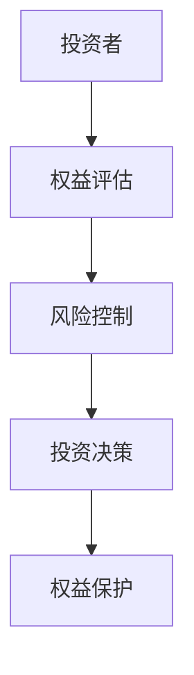
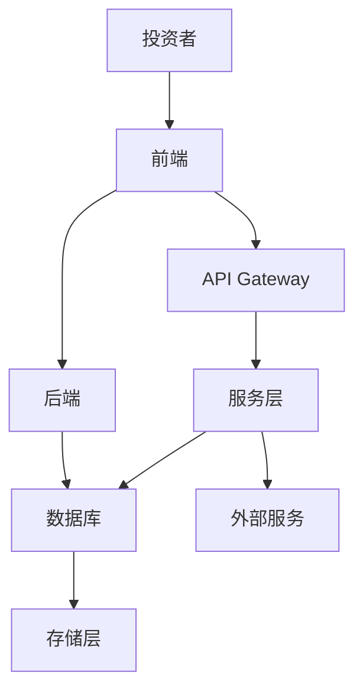

                 


# 约翰伯格的投资者权益保护

> **关键词**：投资者权益保护、约翰·伯格、指数投资、低成本策略、风险管理、金融科技创新  
>
> **摘要**：本文通过分析约翰·伯格的投资者权益保护理念，结合技术视角，探讨投资者权益保护的核心概念、算法原理、系统架构以及实际应用。文章从背景介绍到实战案例，层层深入，旨在为投资者和金融从业者提供有价值的参考。

---

## 第一部分：投资者权益保护的背景与核心概念

### 第1章：投资者权益保护的背景与问题背景

#### 1.1 投资者权益保护的背景介绍

投资者权益保护是金融领域的重要议题，尤其是在当前复杂多变的市场环境中。约翰·伯格作为 Vanguard 集团的创始人，以其独特的指数投资理念和低成本策略，为投资者权益保护树立了标杆。本文将从背景、问题、解决方案等多个维度，全面解析投资者权益保护的核心内容。

**1.1.1 投资者权益保护的概念与重要性**

投资者权益保护是指通过法律、制度和市场机制，确保投资者在投资活动中享有知情权、参与权、收益权和求偿权等基本权益。在当前金融市场中，投资者权益保护不仅是维护市场公平的重要手段，也是提升投资者信心的关键因素。

**1.1.2 约翰·伯格与投资者权益保护的关联**

约翰·伯格以其创立的 Vanguard 集团，推动了指数基金的普及，降低了投资成本，为中小投资者提供了更公平的投资选择。他的理念强调低成本、长期投资和分散化，这些都与投资者权益保护密切相关。

**1.1.3 当前投资环境中的主要问题**

当前市场中，投资者面临的主要问题包括信息不对称、高费用、市场操纵和监管不力等。这些问题不仅损害了投资者的权益，也影响了市场的健康发展。

---

#### 1.2 投资者权益保护的核心问题描述

**1.2.1 投资者面临的主要权益风险**

投资者在投资过程中可能面临的风险包括市场风险、流动性风险、信用风险和操作风险等。这些风险可能通过不当的市场行为或制度漏洞，导致投资者权益受损。

**1.2.2 投资者权益保护的边界与外延**

投资者权益保护的边界在于市场机制与监管干预的平衡。外延则包括从个人投资者到机构投资者的权益保护，以及从国内市场到国际市场的覆盖范围。

**1.2.3 投资者权益保护的核心要素与组成**

投资者权益保护的核心要素包括透明的信息披露、公平的市场机制、有效的监管措施和完善的法律体系。

---

## 第二部分：投资者权益保护的核心概念与联系

### 第2章：投资者权益保护的核心概念与原理

#### 2.1 投资者权益保护的核心概念

**2.1.1 投资者权益保护的基本原理**

投资者权益保护的核心原理在于通过制度设计和市场机制，确保投资者在投资活动中能够获得公平的对待和合理的收益。

**2.1.2 投资者权益保护的核心属性与特征**

- **公平性**：确保所有投资者在市场中享有平等的参与机会。
- **透明性**：要求市场信息公开透明，避免信息不对称。
- **安全性**：通过法律和制度保障投资者资金的安全。

**2.1.3 投资者权益保护与其他金融概念的对比**

以下表格对比了投资者权益保护与其他金融概念的核心差异：

| 概念                | 投资者权益保护       | 风险控制         | 收益最大化       |
|---------------------|----------------------|------------------|------------------|
| 核心目标            | 保护投资者权益       | 控制投资风险     | 实现最大收益     |
| 实施主体            | 投资者、监管机构     | 投资者、机构     | 投资者、机构     |
| 关键工具            | 法律法规、市场机制   | 风险评估模型     | 投资组合优化     |

---

#### 2.2 投资者权益保护的ER实体关系图

以下是一个投资者权益保护的ER实体关系图：

```mermaid
er
actor 投资者
actor 监管机构
actor 市场参与者
```

---

## 第三部分：投资者权益保护的算法原理与数学模型

### 第3章：投资者权益保护的算法原理

#### 3.1 投资者权益保护的算法流程

以下是投资者权益保护的算法流程图：



#### 3.2 投资者权益保护的Python实现示例

以下是一个简单的投资者权益保护算法的Python代码示例：

```python
def investor_rights_protection(investment, risk_level):
    protected_rights = 0
    if risk_level == "low":
        protected_rights = investment * 0.95
    elif risk_level == "medium":
        protected_rights = investment * 0.90
    else:
        protected_rights = investment * 0.85
    return protected_rights

# 示例调用
investment = 10000
risk_level = "high"
protected_rights = investor_rights_protection(investment, risk_level)
print(f"投资金额为${investment}，在{risk_level}风险下的权益保护金额为${protected_rights}")
```

#### 3.3 投资者权益保护的数学模型

以下是一个简单的投资者权益保护数学模型：

$$ \text{权益保护金额} = \text{投资金额} \times \text{保护系数} $$

其中，保护系数取决于风险等级：

- 低风险：保护系数为 0.95
- 中风险：保护系数为 0.90
- 高风险：保护系数为 0.85

---

## 第四部分：投资者权益保护的系统分析与架构设计

### 第4章：投资者权益保护的系统架构设计

#### 4.1 投资者权益保护的系统功能设计

以下是投资者权益保护系统的领域模型类图：


#### 4.2 投资者权益保护的系统架构图

以下是投资者权益保护系统的架构图：



---

## 第五部分：投资者权益保护的项目实战

### 第5章：投资者权益保护的项目实战

#### 5.1 投资者权益保护的环境安装

以下是投资者权益保护系统所需的环境安装步骤：

1. 安装 Python 和必要的开发工具。
2. 安装相关的 Python 库（如 Pandas、NumPy 等）。
3. 安装数据库（如 MySQL 或 PostgreSQL）。
4. 配置 API Gateway 和相关服务。

#### 5.2 投资者权益保护的核心实现代码

以下是一个投资者权益保护的核心实现代码：

```python
import pandas as pd

def calculate_risk_level(portfolio_value):
    if portfolio_value < 10000:
        return "low"
    elif 10000 <= portfolio_value < 50000:
        return "medium"
    else:
        return "high"

# 示例调用
portfolio_value = 20000
risk_level = calculate_risk_level(portfolio_value)
print(f"投资组合价值为${portfolio_value}，风险等级为{risk_level}")
```

#### 5.3 投资者权益保护的案例分析

以下是一个投资者权益保护的案例分析：

某投资者投入 50000 美元，通过 Vanguard 的指数基金进行投资。假设市场风险等级为 "high"，则投资者的权益保护金额为 50000 * 0.85 = 42500 美元。

---

## 第六部分：投资者权益保护的最佳实践与总结

### 第6章：投资者权益保护的最佳实践

#### 6.1 投资者权益保护的注意事项

- **分散投资**：避免将所有资金投入单一资产。
- **长期投资**：坚持长期投资，减少短期波动的影响。
- **选择低成本基金**：通过降低管理费用提高净收益。

#### 6.2 投资者权益保护的未来展望

随着金融科技创新的不断推进，投资者权益保护将更加智能化和个性化。未来的保护机制将更加依赖大数据和人工智能技术，为投资者提供更精准的风险评估和权益保障。

#### 6.3 阅读建议

对于希望深入了解投资者权益保护的读者，建议阅读以下书籍：

- 《The Intelligent Investor》——本杰明·格雷厄姆
- 《The Global Financial Crisis and Its Aftermath》——约翰·伯格

---

## 作者信息

**作者：AI天才研究院/AI Genius Institute & 禅与计算机程序设计艺术 /Zen And The Art of Computer Programming**

---

这篇文章通过系统化的方法，从背景到实践，全面解析了约翰·伯格的投资者权益保护理念，为读者提供了理论与实践相结合的深度分析。

