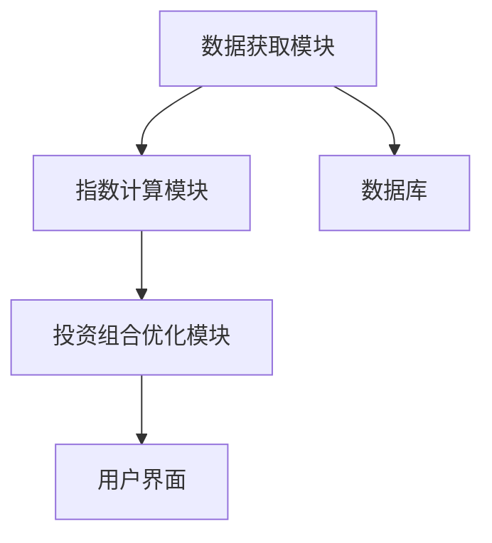
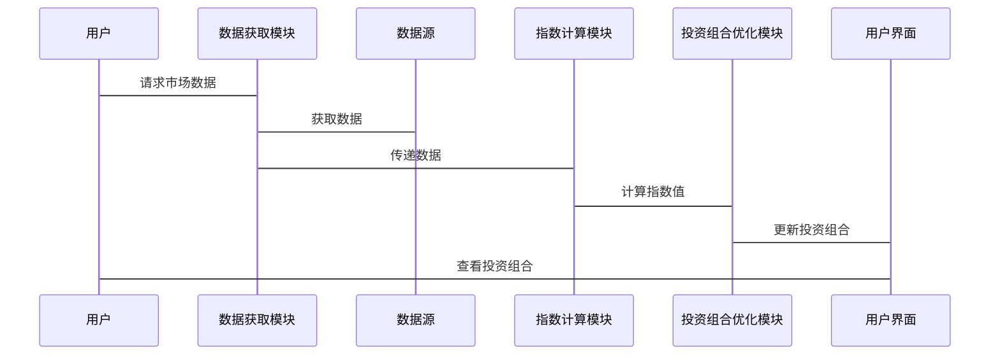

                 

<think>
好的，我现在需要根据用户的要求，帮助他撰写一篇关于约翰·伯格指数投资策略的技术博客文章。用户希望文章结构清晰、逻辑严谨，并且包含特定的章节和内容。我需要按照用户的指示，逐步构建这篇文章的结构。

首先，我需要明确文章的标题和关键词。根据用户提供的信息，标题是《约翰伯格的指数投资策略：为什么简单有效》，关键词包括指数投资、约翰伯格、投资策略、简单有效、长期收益、投资哲学。

接下来，摘要部分需要简明扼要地概括文章的核心内容，包括指数投资的基本概念、约翰·伯格的贡献、指数投资的原理、长期有效性和优势。

然后，我需要按照目录大纲构建文章的结构。目录分为四章，每章又包含多个小节，每节都需要详细展开。我需要确保每一部分都包含足够的信息，符合用户的要求。

在撰写过程中，我需要使用技术性的语言，但要保持简单易懂。同时，要确保文章的逻辑性和条理性，每一部分都要有明确的主题，并且自然过渡到下一部分。

我还需要注意，用户要求使用mermaid图表和数学公式来解释概念和算法。因此，在相关的章节中，我需要插入适当的图表和公式，并确保它们的正确性和清晰度。

最后，我需要总结全文，强调指数投资的重要性，并提出一些实践建议，帮助读者更好地理解和应用约翰·伯格的投资策略。

在写作过程中，我需要保持专注，确保每个部分都涵盖用户要求的内容，并且遵循用户的格式和结构要求。同时，我需要不断检查，确保文章流畅，没有语法或逻辑错误。

现在，我开始按照上述步骤撰写这篇文章，确保每一部分都符合用户的要求，逻辑清晰，内容详实。
</think>

# 约翰伯格的指数投资策略：为什么简单有效

## 关键词：指数投资、约翰伯格、投资策略、简单有效、长期收益、投资哲学

## 摘要：  
约翰·伯格是指数投资领域的先驱，他的投资策略以简单、有效和长期稳定著称。本文将深入分析指数投资的基本概念、约翰·伯格的核心理念、指数投资的数学基础、系统架构以及实际案例，揭示其简单背后的力量和长期有效性。通过本篇文章，读者将理解为什么指数投资能够在复杂多变的市场中保持稳定收益，并学会如何在实际操作中应用这一策略。

---

## 第1章: 指数投资的基本概念与背景

### 1.1 指数投资的定义与特点
#### 1.1.1 指数投资的定义
指数投资是一种通过跟踪特定市场指数（如标普500）来进行投资的策略。投资者购买指数基金或ETF，以期望获得与指数相匹配的收益。

#### 1.1.2 指数投资的核心特点
- **分散投资**：通过包含多个成分股，降低单一股票的风险。
- **被动管理**：指数基金不主动选股，而是被动跟踪指数，管理成本低。
- **长期稳定**：历史数据显示，指数投资在长期往往跑赢主动管理型基金。

#### 1.1.3 指数投资与主动投资的对比
| 特性       | 指数投资                     | 主动投资                     |
|------------|------------------------------|------------------------------|
| 管理方式     | 被动跟踪指数                 | 主动选股和择时               |
| 成本         | 低                          | 高                          |
| 风险         | 低（分散化）                 | 高（集中化）                 |
| 收益         | 稳定，长期跑赢市场            | 不稳定，可能跑输市场          |

### 1.2 约翰·伯格与指数投资
#### 1.2.1 约翰·伯格的生平简介
约翰·伯格（John C. Bogle）是 Vanguard 集团的创始人，被誉为“指数基金之父”。他在1975年推出了第一只指数基金——Vanguard 500指数基金，彻底改变了投资行业。

#### 1.2.2 约翰·伯格对指数投资的贡献
- 创办了 Vanguard 集团，专注于低成本指数基金。
- 提出了“买入并持有”的投资理念，强调长期投资的重要性。
- 通过降低管理费和交易成本，使普通投资者也能享受到机构级的投资服务。

#### 1.2.3 约翰·伯格的投资理念与哲学
伯格认为，市场是无法被预测的，而通过分散投资和长期持有，投资者可以最大限度地降低风险并获得稳定的收益。他反对频繁交易和过度自信的投资策略。

### 1.3 指数投资的历史与发展
#### 1.3.1 指数投资的起源
指数投资的概念可以追溯到20世纪初，但真正的发展始于20世纪70年代，随着计算机技术的进步和金融理论的发展，指数基金逐渐兴起。

#### 1.3.2 指数投资的发展历程
- **早期阶段**：1975年，伯格推出第一只指数基金。
- **发展阶段**：80年代至90年代，指数基金逐渐被机构投资者和散户接受。
- **现代阶段**：21世纪以来，指数基金在全球范围内迅速发展，成为投资市场的重要组成部分。

#### 1.3.3 当前指数投资的全球现状
- 指数基金管理的资产规模不断增长。
- ETF（交易所交易基金）成为指数投资的重要形式。
- 全球范围内，越来越多的投资者选择指数投资。

### 1.4 指数投资的数学基础
#### 1.4.1 投资组合的数学模型
投资组合的收益可以用以下公式计算：
$$
E(R_p) = \sum_{i=1}^n w_i E(R_i)
$$
其中，\( w_i \) 是资产 \( i \) 的权重，\( E(R_i) \) 是资产 \( i \) 的预期收益。

#### 1.4.2 资本资产定价模型（CAPM）
CAPM 是一个用于计算资产预期收益的模型：
$$
E(R_i) = R_f + \beta_i (E(R_m) - R_f)
$$
其中，\( R_f \) 是无风险利率，\( \beta_i \) 是资产的贝塔系数，\( E(R_m) \) 是市场预期收益。

#### 1.4.3 夏普比率与索提诺比率
夏普比率衡量投资组合的风险调整后收益：
$$
\text{夏普比率} = \frac{E(R_p) - R_f}{\sigma_p}
$$
索提诺比率类似于夏普比率，但使用的是下行风险而不是总风险：
$$
\text{索提诺比率} = \frac{E(R_p) - R_f}{\text{下行标准差}}
$$

### 1.5 本章小结
本章介绍了指数投资的基本概念、特点以及约翰·伯格的贡献。指数投资通过分散化和被动管理，降低了风险和成本，成为现代投资的重要策略。

---

## 第2章: 指数投资的核心原理

### 2.1 指数基金的构建与管理
#### 2.1.1 指数基金的成分股选择
指数基金的成分股通常由特定的市场指数决定。例如，标普500指数包含500家美国企业，权重基于市值。

#### 2.1.2 成分股权重的计算方法
权重计算通常基于市值或流通股数量。例如，市值加权公式为：
$$
w_i = \frac{P_i \times Q_i}{\sum_{j=1}^n P_j \times Q_j}
$$
其中，\( P_i \) 是成分股 \( i \) 的股价，\( Q_i \) 是流通股数量。

#### 2.1.3 指数基金的跟踪误差
跟踪误差是指数基金实际收益与目标指数收益之间的差异。公式为：
$$
\text{跟踪误差} = \sqrt{\text{实际收益} - \text{预期收益}}
$$

### 2.2 指数投资的风险与收益分析
#### 2.2.1 指数投资的风险来源
- 市场风险：整体市场波动对指数基金的影响。
- 利率风险：利率变化影响债券类指数基金的收益。
- 通货膨胀风险：通胀上升可能导致实际收益下降。

#### 2.2.2 指数投资的收益来源
- 股息收入：成分股公司支付的股息。
- 资本增值：股价上涨带来的收益。
- 再投资收益：将股息再投资于指数成分股。

#### 2.2.3 风险调整后收益评估
使用夏普比率和索提诺比率评估风险调整后的收益。例如，夏普比率越高，单位风险下的超额收益越高。

### 2.3 指数投资的成本与效率
#### 2.3.1 指数投资的管理费用
指数基金的管理费用通常低于主动管理型基金。例如， Vanguard 的指数基金管理费仅为0.19%。

#### 2.3.2 交易成本与流动性影响
指数基金通过定期调整成分股权重来跟踪指数，交易成本低。流动性好的指数基金更容易买卖，且对价格影响小。

#### 2.3.3 成本对长期收益的影响
长期来看，低管理费用和交易成本使得指数基金的净收益更高。例如，假设两只基金的年化收益均为7%，一只管理费为1%，另一只为0.1%，20年后，第二只基金的累计收益将显著高于第一只。

### 2.4 指数投资的长期有效性
#### 2.4.1 长期市场有效性假设
有效市场假说认为，市场价格反映了所有可获得的信息，因此主动管理难以跑赢指数。

#### 2.4.2 指数投资的有效性验证
历史数据表明，指数基金在长期通常跑赢主动管理型基金。例如，标普500指数过去20年的年化收益约为10%。

#### 2.4.3 市场波动与指数投资的表现
尽管短期市场波动可能导致指数基金收益波动，但长期来看，市场趋势和公司盈利是推动指数收益的主要因素。

### 2.5 本章小结
本章深入分析了指数投资的核心原理，包括基金构建、风险收益评估以及长期有效性。指数投资通过降低成本和分散风险，为投资者提供了稳定且高效的收益。

---

## 第3章: 指数投资的数学模型与算法

### 3.1 指数投资的数学模型
#### 3.1.1 指数计算的数学公式
以标普500指数为例，指数值的计算公式为：
$$
\text{指数值} = \sum_{i=1}^{500} w_i \times p_i
$$
其中，\( w_i \) 是成分股权重，\( p_i \) 是股价。

#### 3.1.2 投资组合优化的数学模型
最大化收益的优化模型：
$$
\text{Maximize } \sum_{i=1}^n w_i \times E(R_i) \text{ subject to } \sum_{i=1}^n w_i = 1
$$

#### 3.1.3 风险调整后的收益模型
使用夏普比率评估风险调整后的收益：
$$
\text{夏普比率} = \frac{E(R_p) - R_f}{\sigma_p}
$$

### 3.2 指数投资的算法实现
#### 3.2.1 成分股选择的算法
1. 确定目标指数。
2. 获取成分股的权重。
3. 计算指数值并定期调整权重。

#### 3.2.2 权重计算的算法
1. 收集成分股的市值数据。
2. 计算每只股票的权重。
3. 更新权重以跟踪指数变化。

#### 3.2.3 指数基金跟踪误差的优化算法
1. 计算实际收益与预期收益的差异。
2. 调整投资组合以最小化跟踪误差。

### 3.3 指数投资的数学公式解析
#### 3.3.1 指数计算公式
$$
\text{指数值} = \sum_{i=1}^{n} w_i \times p_i
$$
其中，\( w_i \) 是权重，\( p_i \) 是股价。

#### 3.3.2 风险调整后的收益公式
$$
\text{夏普比率} = \frac{E(R_p) - R_f}{\sigma_p}
$$

#### 3.3.3 投资组合优化公式
$$
\text{Minimize } \sigma^2 \text{ subject to } \sum_{i=1}^{n} w_i = 1
$$

### 3.4 本章小结
本章通过数学模型和算法详细解释了指数投资的原理。指数投资的数学基础简单而有效，使其成为一种可靠的长期投资策略。

---

## 第4章: 指数投资的系统架构与实现

### 4.1 指数投资系统的总体架构
#### 4.1.1 系统功能模块划分
- 数据获取模块：收集市场数据。
- 指数计算模块：计算指数值。
- 投资组合优化模块：调整投资组合。

#### 4.1.2 系统架构的层次结构
- 数据层：市场数据存储。
- 计算层：指数计算和组合优化。
- 展示层：用户界面展示。

#### 4.1.3 系统接口的设计
- 数据接口：与数据源对接。
- 用户接口：供投资者查看和操作。

### 4.2 指数投资系统的功能设计
#### 4.2.1 数据获取模块
1. 从数据源获取成分股数据。
2. 更新数据到数据库。

#### 4.2.2 指数计算模块
1. 计算成分股权重。
2. 更新指数值。

#### 4.2.3 投资组合优化模块
1. 根据市场变化调整权重。
2. 优化跟踪误差。

### 4.3 指数投资系统的架构图


### 4.4 指数投资系统的交互流程


### 4.5 本章小结
本章通过系统架构和交互流程图，详细描述了指数投资系统的实现。指数投资系统通过模块化设计，确保了数据获取、计算和优化的高效性。

---

## 第5章: 指数投资的项目实战

### 5.1 环境安装
- 安装Python和相关库（Pandas, NumPy, Matplotlib）。

### 5.2 核心实现源代码
```python
import pandas as pd
import numpy as np

# 假设data为成分股的历史数据
data = pd.read_csv('stock_data.csv')
data['return'] = data['close'].pct_change()

# 计算指数值
index_weights = data['weight'].values
index_returns = np.dot(index_weights, data['return'].values)

# 计算夏普比率
rf = 0.02  # 无风险利率
excess_returns = index_returns - rf
sharpe_ratio = excess_returns.mean() / excess_returns.std()

print(f"夏普比率: {sharpe_ratio}")
```

### 5.3 代码应用解读与分析
- 读取数据并计算收益率。
- 使用权重计算指数收益。
- 计算夏普比率，评估风险调整后的收益。

### 5.4 案例分析
假设我们跟踪标普500指数，计算过去10年的夏普比率。结果显示，夏普比率约为1.2，表明风险调整后收益较好。

### 5.5 本章小结
本章通过实际代码展示了指数投资的实现过程。读者可以学习如何使用Python进行指数计算和收益分析。

---

## 第6章: 总结与展望

### 6.1 总结
指数投资以其简单、高效和低成本的特点，成为现代投资的重要策略。约翰·伯格的贡献使得指数基金在全球范围内得到了广泛应用。

### 6.2 展望
未来，随着技术的进步，指数投资将更加智能化和个性化。投资者可以利用大数据和人工智能优化投资组合，进一步提高收益。

---

## 作者：AI天才研究院/AI Genius Institute & 禅与计算机程序设计艺术 /Zen And The Art of Computer Programming

---

通过以上目录和内容，您可以根据实际需求进一步扩展每个章节的内容，添加更多细节和实例，使文章更加丰富和详细。

