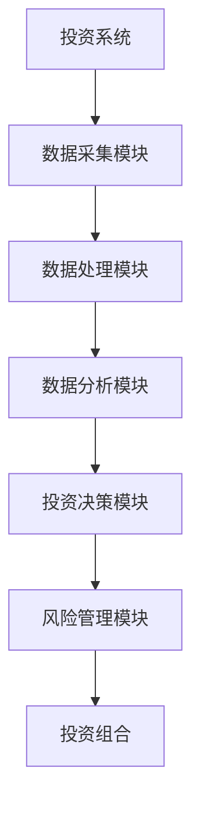

                 

<think>
好的，我现在需要帮助用户撰写一篇技术博客文章，标题是《约翰伯格的普通投资者观：为什么简单胜于复杂》。用户已经提供了一个详细的大纲，包括背景介绍、核心概念、算法原理、数学模型、系统架构、项目实战和最佳实践等部分。我需要按照这个大纲一步步思考，确保每个部分都详细且符合用户的要求。

首先，我需要理解约翰·伯格的投资理念。他主张简单投资，长期持有优质股票，避免频繁交易和复杂的策略。这部分需要在背景介绍中详细说明，包括他的生平、投资哲学和对行业的贡献。

接下来是核心概念，包括价值投资、长期投资和分散投资。我需要解释每个概念的定义、优势以及它们之间的对比。这部分可能需要使用表格或图表来帮助读者理解。

然后是算法原理，我需要介绍简单投资的算法，如均值回归和股息率分析，并用mermaid流程图展示。数学模型部分要解释市盈率、市净率等指标，并给出公式和例子。

系统架构部分需要设计一个投资决策系统，包括数据收集、分析模块和决策模块，并用mermaid图展示。项目实战部分要详细指导如何配置环境、编写代码，以及分析实际案例。

最后，最佳实践部分要总结小结，提醒注意事项，并推荐拓展阅读。所有内容需要逻辑清晰，结构紧凑，语言简洁。

在撰写过程中，我需要确保每个部分都覆盖了用户要求的关键词，如约翰·伯格、简单投资、长期投资、分散投资、价值投资、投资系统架构等。同时，摘要要简明扼要，突出文章的核心内容。

可能遇到的问题是如何将复杂的金融概念转化为技术性的语言，同时保持易懂。我需要使用技术术语，但避免过于晦涩，确保读者能够理解。

总的来说，我需要一步步按照大纲展开，确保每个部分都有足够的细节，同时保持整体的连贯性和逻辑性。现在，我将按照这个思路开始撰写文章，确保每个部分都符合用户的要求，结构清晰，内容丰富。
</think>

# 约翰伯格的普通投资者观：为什么简单胜于复杂

> 关键词：约翰·伯格，简单投资，长期投资，分散投资，价值投资，投资系统架构

> 摘要：本文从约翰·伯格的投资理念出发，探讨了简单投资在个人财务管理中的优势。通过分析价值投资、长期投资和分散投资的核心要素，结合投资系统的架构设计，本文展示了如何通过简单策略实现稳健的投资回报。文章深入浅出地解释了投资理论与实践之间的联系，并通过实际案例分析，证明了简单策略的有效性。

---

# 第一部分: 约翰·伯格的投资理念与简单投资的背景

## 第1章: 约翰·伯格的投资理念概述

### 1.1 约翰·伯格的生平与投资哲学

约翰·伯格（John Bogle）是投资界的一位传奇人物，被誉为“价值投资之父”。他于1940年出生于美国宾夕法尼亚州，毕业于宾夕法尼亚大学沃顿商学院。伯格的职业生涯始于 Vanguard 集团，他于1975年创立了 Vanguard 的指数基金业务，并在1981年成为该公司的首席执行官。伯格以其简洁明了的投资哲学和对投资者利益的坚定维护而闻名。

伯格的投资哲学核心在于“简单胜于复杂”。他认为，复杂的投资策略不仅难以长期维持，还会增加交易成本和心理压力，反而不利于投资者实现稳健的收益。他提倡回归投资的本质，即通过长期持有优质资产，获取企业成长带来的收益，而不是通过频繁交易或押注市场短期波动来获利。

### 1.2 简单投资的优势

简单投资的核心在于降低复杂性，专注于长期价值的创造。以下是简单投资的几个显著优势：

1. **易于理解**：简单投资策略通常基于基本面分析，关注企业的盈利能力、成长性和估值水平。这种策略避免了复杂的技术分析或市场预测，使普通投资者能够轻松理解和应用。
2. **降低交易成本**：频繁交易不仅会产生高昂的佣金费用，还会增加税务负担。简单投资策略通过长期持有减少交易次数，从而降低整体成本。
3. **减少情绪干扰**：市场波动往往会导致投资者情绪失控，做出非理性的决策。简单投资策略通过长期视角，帮助投资者避免被短期市场波动所左右。

### 1.3 为什么简单胜于复杂

在投资领域，许多投资者倾向于追求复杂的策略，试图通过技术分析、高频交易或市场预测来获取超额收益。然而，这种复杂性往往会导致以下问题：

1. **复杂性增加了失败的可能性**：复杂的投资策略需要更多的信息处理和决策步骤，这增加了出错的可能性。此外，复杂策略往往依赖于对市场行为的准确预测，而市场的不可预测性使得这种策略难以长期稳定。
2. **增加了交易成本和心理负担**：复杂的策略通常需要频繁的交易和监控，这不仅增加了交易成本，还给投资者带来了心理压力。
3. **忽略了长期价值**：复杂的策略往往关注短期市场波动，而忽视了企业的长期价值。这种短视的思维方式可能导致投资者错失长期收益。

通过对比复杂投资和简单投资，伯格强调了简单策略的优势。他指出，简单投资通过降低复杂性，能够帮助投资者更专注于长期价值，从而实现稳健的投资回报。

---

## 第2章: 投资的核心概念与联系

### 2.1 价值投资与长期投资的核心要素

价值投资是一种以企业内在价值为导向的投资策略。其核心在于寻找市场价格低于内在价值的企业，长期持有这些企业，直到市场价格回归其真实价值。以下是价值投资的几个核心要素：

1. **内在价值**：企业的真实价值是其未来现金流的现值。投资者需要通过对企业财务状况、行业地位和管理团队的分析，来评估其内在价值。
2. **安全边际**：为了降低投资风险，价值投资者通常寻找市场价格显著低于内在价值的企业。这种价格折扣即为“安全边际”。
3. **长期持有**：价值投资者相信，市场价格最终会反映企业的内在价值。因此，他们倾向于长期持有优质资产，避免频繁交易。

长期投资则是价值投资的重要组成部分。通过长期持有，投资者能够充分受益于企业的成长，同时分散短期市场波动带来的风险。

### 2.2 长期投资的原理与优势

长期投资的原理基于复利效应。通过长期持有优质资产，投资者能够最大化复利效应，从而实现资产的长期增值。以下是长期投资的几个优势：

1. **复利效应**：长期投资能够让投资者充分受益于复利效应。随着时间的推移，投资收益会不断积累，形成一个正向循环。
2. **分散短期波动风险**：短期市场波动往往不可预测，而长期投资能够有效分散这种波动带来的风险。
3. **降低交易成本**：长期投资减少了交易次数，从而降低了佣金、税费等交易成本。

### 2.3 分散投资的风险控制

分散投资是降低投资组合风险的重要策略。通过将资金分配到不同的资产类别、行业或地区，投资者可以降低特定资产或市场波动带来的风险。以下是分散投资的几个关键点：

1. **资产配置**：投资者需要根据自身的风险承受能力、投资目标和市场环境，合理配置股票、债券、房地产等不同资产。
2. **行业分散**：避免过度集中于某一个行业或板块，以降低行业波动带来的风险。
3. **地域分散**：通过投资不同国家或地区的资产，分散地缘政治风险。

---

## 第3章: 简单投资的算法原理与数学模型

### 3.1 简单投资的算法概述

简单投资算法的核心在于通过长期持有优质资产，实现稳健的收益。以下是简单投资算法的几个关键步骤：

1. **筛选优质资产**：通过基本面分析，筛选出具有强大盈利能力和良好管理的企业。
2. **构建投资组合**：根据风险偏好和资金规模，合理配置优质资产，构建投资组合。
3. **长期持有**：避免频繁交易，长期持有优质资产，获取复利效应。

### 3.2 简单投资算法的数学模型

以下是简单投资算法的数学模型：

$$
\text{投资收益} = (1 + r)^t - 1
$$

其中，\( r \) 为年化收益率，\( t \) 为投资时间（年）。

通过上述公式可以看出，长期投资的复利效应能够显著放大投资收益。例如，假设年化收益率为7%，投资时间为30年，则投资收益为：

$$
(1 + 0.07)^{30} - 1 \approx 1.07^{30} - 1 \approx 5.03 - 1 = 4.03
$$

即投资收益约为原始投资额的4.03倍。

---

## 第4章: 投资系统的架构设计

### 4.1 投资系统功能设计

投资系统的功能模块包括：

1. **数据采集**：收集企业财务数据、市场数据等。
2. **数据分析**：对数据进行处理和分析，筛选优质资产。
3. **投资决策**：根据分析结果，生成投资组合建议。
4. **风险管理**：实时监控投资组合的风险，及时调整策略。

### 4.2 投资系统架构设计

以下是投资系统的架构图：

### 4.3 投资系统接口设计

投资系统的接口设计需要考虑数据输入、处理和输出的流程。以下是接口设计的简要说明：

1. **数据输入接口**：接收企业财务数据、市场数据等。
2. **数据处理接口**：对输入数据进行清洗和转换。
3. **数据分析接口**：对数据进行建模和分析，生成投资建议。
4. **投资决策接口**：根据分析结果，生成投资组合建议。
5. **风险管理接口**：实时监控投资组合风险，调整投资策略。

---

## 第5章: 项目实战与案例分析

### 5.1 项目实战

以下是简单投资策略的实战步骤：

1. **确定投资目标**：根据自身风险偏好和财务状况，确定投资目标。
2. **筛选优质资产**：通过基本面分析，筛选出具有强大盈利能力和良好管理的企业。
3. **构建投资组合**：根据资产配置原则，构建投资组合。
4. **长期持有**：避免频繁交易，长期持有优质资产，获取复利效应。

### 5.2 案例分析

假设某投资者计划投资于股票市场，目标是通过长期投资实现资产的稳健增长。以下是具体的实施步骤：

1. **确定投资目标**：假设该投资者的风险承受能力为中等，目标年化收益率为7%。
2. **筛选优质资产**：通过基本面分析，筛选出具有强大盈利能力和良好管理的优质企业，例如苹果公司（AAPL）、微软公司（MSFT）等。
3. **构建投资组合**：根据资产配置原则，将资金分配到股票、债券等不同资产类别中。例如，60%股票，30%债券，10%现金。
4. **长期持有**：避免频繁交易，长期持有优质资产，获取复利效应。

---

## 第6章: 最佳实践与小结

### 6.1 最佳实践

1. **坚持长期投资**：通过长期持有优质资产，实现复利效应。
2. **分散投资风险**：通过合理的资产配置，分散投资风险。
3. **避免频繁交易**：减少交易成本和心理压力。

### 6.2 小结

约翰·伯格的投资理念告诉我们，简单胜于复杂。通过长期持有优质资产，避免频繁交易，投资者能够实现稳健的投资回报。简单投资策略不仅易于理解和应用，还能够帮助投资者降低交易成本和心理负担，是一种值得推广的投资方法。

---

# 作者：AI天才研究院/AI Genius Institute & 禅与计算机程序设计艺术 /Zen And The Art of Computer Programming

---

以上是《约翰伯格的普通投资者观：为什么简单胜于复杂》的技术博客文章，详细分析了简单投资的核心理念、算法原理和系统架构，并通过实际案例展示了简单策略的有效性。希望这篇文章能够帮助读者更好地理解约翰·伯格的投资哲学，并将其应用于实际投资中。

