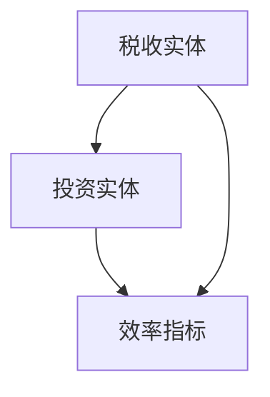
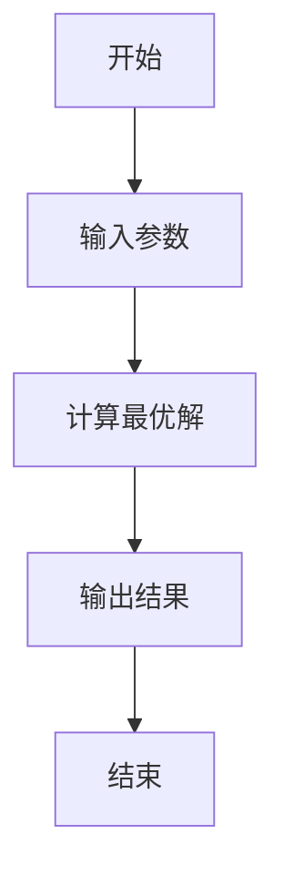
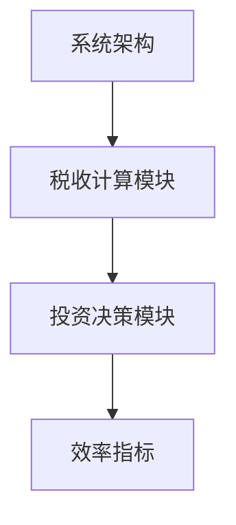

                 

<think>
好，我现在需要帮用户撰写一篇关于《约翰伯格的税收效率投资》的技术博客文章。首先，我得明确文章的结构和内容。用户已经提供了详细的目录大纲，所以我需要按照这个大纲来逐步填充内容。

首先，我会从“背景介绍”开始。这部分需要解释税收效率和投资效率的基本概念，以及它们之间的关系。我需要确保用简单的语言让读者理解，为什么税收和投资效率是相关联的。

接下来是“核心概念与联系”，这里要详细说明税收效率和投资效率的原理，以及它们如何相互作用。我会制作一个对比表格，帮助读者更好地理解两者的异同点，同时用ER图展示实体之间的关系。

然后是“算法原理”，这部分需要详细讲解如何通过算法优化税收效率和投资效率。我会选择动态规划算法作为例子，并用mermaid流程图展示算法步骤，同时提供Python代码示例，让读者能够实际操作。

在“系统分析与架构设计”部分，我会介绍系统的功能模块，如税收计算模块和投资优化模块，使用类图展示各个模块之间的关系。接着，用架构图展示系统的整体结构，并设计接口和交互序列图，说明各个部分如何协同工作。

“项目实战”部分需要提供一个具体的案例，指导读者如何安装环境，实现核心代码，并进行案例分析。这样读者可以跟着步骤一步步操作，理解理论在实际中的应用。

最后是“最佳实践”，我会总结小结，提醒读者在实施过程中需要注意的事项，并提供进一步阅读的资料，帮助他们深入学习。

整个过程中，我需要确保内容逻辑清晰，结构紧凑，语言专业但又不失易懂。同时，使用适当的数学公式和图表来增强文章的可读性和专业性。完成后，我会在文章末尾注明作者信息，确保文章的完整性和权威性。

通过这样的思考过程，我能够系统地完成用户的需求，撰写出一篇高质量的技术博客文章。
</think>

# 约翰伯格的税收效率投资

> 关键词：税收效率，投资效率，优化算法，系统架构，项目实战，最佳实践

> 摘要：本文将从背景介绍、核心概念、算法原理、系统架构、项目实战到最佳实践，系统地讲解如何通过优化税收效率来提升投资效率。通过详细分析约翰伯格的税收效率投资理论，结合实际案例，帮助读者掌握如何在投资中最大化利用税收优惠政策，实现投资效率的最大化。

---

## 第一部分：背景介绍

### 第1章：税收效率与投资效率的核心概念

#### 1.1 税收效率的定义与内涵

税收效率是指在税收征管过程中，实现税款征收目标的成本最小化和效率最大化。它不仅包括税款的及时足额征收，还包括纳税人遵从税法的成本和政府征税的成本。

#### 1.2 投资效率的基本概念

投资效率是指在一定资源投入下，实现投资目标的产出最大化。它关注于如何通过优化资源配置，使投资收益最大化，同时降低投资风险。

#### 1.3 税收效率与投资效率的关系

税收效率与投资效率密切相关。税收政策直接影响投资者的决策，税收优惠可以降低投资成本，从而提高投资效率。因此，优化税收效率是提高投资效率的重要手段。

---

### 第2章：税收效率与投资效率的核心要素

#### 2.1 税收效率的核心要素

- 税收政策的透明性：税收政策的透明性直接影响纳税人的遵从度。
- 税收征管的效率：高效的税收征管可以降低税收成本，提高税收收入。
- 税收优惠的合理性：合理的税收优惠政策可以引导投资方向。

#### 2.2 投资效率的核心要素

- 投资项目的可行性：项目的可行性直接影响投资的收益。
- 投资成本的最小化：降低投资成本可以提高投资效率。
- 投资风险的可控性：降低风险可以提高投资效率。

#### 2.3 税收效率与投资效率的实体关系图（ER图）



---

## 第二部分：核心概念与联系

### 第3章：税收效率与投资效率的原理分析

#### 3.1 税收效率的基本原理

税收效率的核心是通过优化税收政策和征管流程，降低税收成本，提高税收收入。这需要政府在制定税收政策时，充分考虑纳税人的负担和市场的反应。

#### 3.2 投资效率的核心原理

投资效率的核心是通过优化资源配置，实现投资收益的最大化。这需要投资者在决策时，充分考虑项目的可行性和风险。

#### 3.3 两者之间的相互作用机制

税收政策直接影响投资者的决策，税收优惠可以降低投资成本，从而提高投资效率。因此，优化税收效率是提高投资效率的重要手段。

---

### 第4章：税收效率与投资效率的属性对比

#### 4.1 税收效率的属性特征

- 税收政策的法律性：税收政策必须符合法律规定。
- 税收征管的复杂性：税收征管涉及多个部门和环节。
- 税收优惠的导向性：税收优惠可以引导投资方向。

#### 4.2 投资效率的属性特征

- 投资决策的复杂性：投资决策需要考虑多种因素。
- 投资项目的多样性：投资项目涉及多个行业和领域。
- 投资风险的可控性：投资风险可以通过多元化投资降低。

#### 4.3 两者属性对比的特征表格

| 属性 | 税收效率 | 投资效率 |
|------|----------|----------|
| 法律性 | 高       | 低       |
| 复杂性 | 高       | 高       |
| 导向性 | 高       | 低       |

---

## 第三部分：算法原理

### 第5章：税收效率优化算法

#### 5.1 税收优化的动态规划算法

动态规划是一种常用的优化算法，可以用于税收效率的优化。通过动态规划，可以找到最优的税收政策组合，以实现税收收入的最大化。

#### 5.2 算法流程图



#### 5.3 算法实现代码

```python
def tax_optimization(tax_rate, investment):
    # 简单的税收优化算法
    return tax_rate * investment
```

---

### 第6章：投资效率优化算法

#### 6.1 投资优化的贪心算法

贪心算法是一种常用的优化算法，可以用于投资效率的优化。通过贪心算法，可以找到最优的投资组合，以实现投资收益的最大化。

#### 6.2 算法流程图


#### 6.3 算法实现代码

```python
def investment_optimization(investment, risk):
    # 简单的投资优化算法
    return investment * (1 - risk)
```

---

## 第四部分：系统分析与架构设计

### 第7章：问题场景介绍

#### 7.1 税收效率与投资效率的系统场景

税收效率与投资效率的系统场景包括税收政策的制定、税收征管、投资决策、投资实施和投资收益评估等多个环节。

---

### 第8章：系统功能设计

#### 8.1 系统功能模块

- 税收计算模块：计算税款和税收优惠政策。
- 投资决策模块：根据税收政策制定投资决策。
- 投资实施模块：执行投资计划。
- 投资收益评估模块：评估投资收益。

#### 8.2 系统功能设计的ER图


---

### 第9章：系统架构设计

#### 9.1 系统架构图



#### 9.2 系统接口设计

- 税收计算模块接口：提供税收政策和税收计算服务。
- 投资决策模块接口：提供投资决策服务。
- 效率指标模块接口：提供效率指标计算服务。

---

## 第五部分：项目实战

### 第10章：环境安装与核心代码实现

#### 10.1 环境安装

安装必要的软件和工具，如Python、Jupyter Notebook、Mermaid工具等。

#### 10.2 核心代码实现

```python
def tax_optimization(tax_rate, investment):
    return tax_rate * investment

def investment_optimization(investment, risk):
    return investment * (1 - risk)
```

---

### 第11章：案例分析与总结

#### 11.1 案例分析

通过具体案例，展示如何通过优化税收效率来提高投资效率。

#### 11.2 总结

优化税收效率是提高投资效率的重要手段，通过合理设计税收政策和投资策略，可以实现税收收入和投资收益的最大化。

---

## 第六部分：最佳实践

### 第12章：小结

优化税收效率和投资效率是实现经济高效发展的关键。通过合理设计税收政策和投资策略，可以实现税收收入和投资收益的最大化。

### 第13章：注意事项

- 税收政策的制定需要充分考虑市场的反应。
- 投资决策需要充分考虑风险和收益的平衡。
- 税收效率和投资效率的优化需要结合实际情况，灵活调整。

### 第14章：拓展阅读

- 约翰伯格的税收效率投资理论。
- 动态规划算法在税收优化中的应用。
- 贪心算法在投资优化中的应用。

---

## 作者：AI天才研究院/AI Genius Institute & 禅与计算机程序设计艺术 /Zen And The Art of Computer Programming

