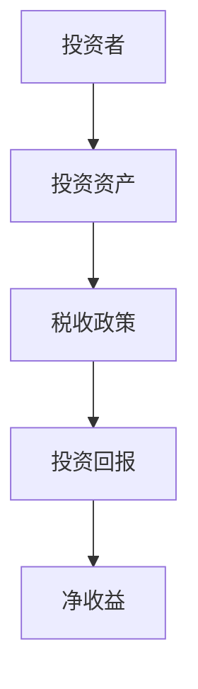
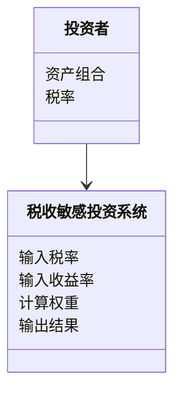
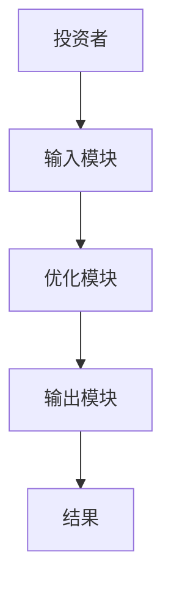
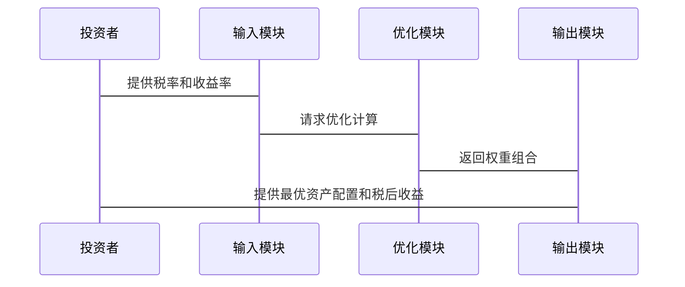

                 


# 约翰伯格的税收敏感投资：如何优化投资回报

---

## 关键词：
- 税收敏感投资
- 投资回报
- 税收优化
- 投资策略
- 约翰伯格

---

## 摘要：
本文深入探讨了约翰伯格的税收敏感投资理念，分析了如何通过优化税收策略来提升投资回报。文章从税收敏感投资的背景、核心概念、优化模型、系统设计、项目实战等方面展开，结合数学公式、算法流程图和实际案例，详细解读了如何在投资决策中考虑税收因素，从而实现收益最大化。通过本文的讲解，读者将能够掌握税收敏感投资的基本原理和实践方法，为投资决策提供有力支持。

---

# 第一部分: 约翰伯格的税收敏感投资基础

## 第1章: 税收敏感投资的背景与定义

### 1.1 税收敏感投资的背景介绍
#### 1.1.1 投资回报中的税收影响
在投资领域，税收是一个不可忽视的重要因素。不同的投资行为（如股票买卖、债券交易、房地产投资等）会受到不同税率的影响，这些税率直接影响投资回报的最终结果。例如，资本利得税、股息税、红利税等都会对投资收益产生直接影响。

#### 1.1.2 税收对投资决策的重要性
税收对投资决策的影响体现在以下几个方面：
- **税后收益计算**：税收会直接影响投资的净收益。
- **资产配置决策**：投资者需要根据税收政策选择最优的资产配置。
- **投资时机选择**：税收政策的变化可能会影响投资的最佳时机。

#### 1.1.3 税收敏感投资与其他投资策略的区别
传统的投资策略往往忽略了税收的影响，而税收敏感投资则是将税收因素纳入投资决策的核心，通过优化税收策略来提高整体投资回报。

### 1.2 税收敏感投资的定义与特征
#### 1.2.1 税收敏感投资的定义
税收敏感投资是一种将税收因素纳入投资决策过程的投资策略，旨在通过优化税务规划来最大化投资回报。

#### 1.2.2 税收敏感投资的关键特征
- **税收影响的量化**：将税收对投资回报的影响量化。
- **动态优化**：根据税收政策的变化动态调整投资组合。
- **多目标优化**：在追求收益的同时，兼顾税收优化。

#### 1.2.3 税收敏感投资与传统投资的区别
| 特性               | 税收敏感投资                | 传统投资                 |
|--------------------|-----------------------------|--------------------------|
| 是否考虑税收因素   | 是                         | 否                       |
| 投资决策的复杂性   | 高                         | 中                       |
| 收益优化目标       | 税后收益最大化             | 未考虑税收影响           |

### 1.3 税收敏感投资的重要性和应用场景
#### 1.3.1 税收敏感投资的重要性
- **提升投资效率**：通过优化税收策略，降低税负，提高净收益。
- **应对复杂税制**：在全球化背景下，不同国家和地区的税收政策差异较大，税收敏感投资可以帮助投资者应对复杂税制。
- **长期财富管理**：对于高净值投资者，税收敏感投资是实现财富保值和增值的重要手段。

#### 1.3.2 税收敏感投资的主要应用场景
- **股票投资**：资本利得税的影响。
- **债券投资**：利息税的影响。
- **房地产投资**：房产税、增值税的影响。
- **跨国投资**：不同国家的税收政策差异。

#### 1.3.3 税收敏感投资的边界与外延
- **边界**：仅考虑直接税，不涉及间接税。
- **外延**：涵盖个人所得税、企业所得税、资本利得税等多种税种。

### 1.4 本章小结
本章从税收敏感投资的背景、定义、特征、重要性和应用场景等方面进行了全面介绍，为后续章节的深入分析奠定了基础。

---

## 第2章: 税收敏感投资的核心概念与联系

### 2.1 税收敏感投资的核心概念
#### 2.1.1 税收影响的计算模型
税收影响的计算模型可以表示为：
$$ \text{净收益} = \text{毛收益} - \text{税款} $$

其中，税款的计算公式为：
$$ \text{税款} = \text{应纳税所得额} \times \text{税率} $$

#### 2.1.2 税收敏感性分析的基本原理
税收敏感性分析的核心在于量化税收政策变化对投资回报的影响。通过分析不同税种和税率的变化，投资者可以更好地调整投资策略。

#### 2.1.3 税收敏感投资中的关键要素
- **投资标的**：股票、债券、房地产等。
- **税率**：不同资产的税率差异。
- **持有期限**：长期投资与短期投资的税率差异。

### 2.2 税收敏感投资的核心概念联系
#### 2.2.1 税收与投资回报的关系
- **正相关关系**：税率越高，税后收益越低。
- **负相关关系**：税率越低，税后收益越高。

#### 2.2.2 税收敏感性与投资决策的联系
- **投资组合优化**：通过调整资产配置降低税负。
- **投资时机选择**：利用税收优惠政策进行投资。

#### 2.2.3 税收敏感投资中的风险与收益平衡
- **风险**：税收政策的变化可能会影响投资收益。
- **收益**：通过优化税收策略提高净收益。

### 2.3 税收敏感投资的ER实体关系图


### 2.4 本章小结
本章从税收敏感投资的核心概念出发，通过量化分析和实体关系图，详细讲解了税收与投资回报的关系，以及如何通过优化税收策略实现投资收益的最大化。

---

## 第3章: 税收敏感投资的优化模型与算法

### 3.1 税收敏感投资优化模型的原理
#### 3.1.1 模型的基本假设
- 投资者的目标是实现税后收益最大化。
- 税收政策是已知且稳定的。
- 投资者的资产配置是可调整的。

#### 3.1.2 模型的目标函数
最大化税后收益：
$$ \max_{w} \sum_{i=1}^{n} w_i (r_i - t_i) $$

其中：
- \( w_i \) 是第 \( i \) 个资产的投资权重。
- \( r_i \) 是第 \( i \) 个资产的预期收益率。
- \( t_i \) 是第 \( i \) 个资产的税率。

#### 3.1.3 模型的约束条件
- 资产配置的权重之和为1：
$$ \sum_{i=1}^{n} w_i = 1 $$

- 权重非负：
$$ w_i \geq 0, \forall i $$

### 3.2 税收敏感投资优化算法的实现
#### 3.2.1 算法的基本流程
1. **输入参数**：税率、预期收益率、资产数量。
2. **初始化权重**：均匀分配权重。
3. **计算税后收益**：
   $$ \text{税后收益} = \sum_{i=1}^{n} w_i (r_i - t_i) $$
4. **优化权重**：通过优化算法调整权重，最大化税后收益。
5. **输出结果**：最优权重组合。

#### 3.2.2 算法的优化策略
- **贪心算法**：逐步调整权重，每次选择能够带来最大收益的资产。
- **动态规划**：分阶段优化，逐步调整权重组合。

#### 3.2.3 算法的复杂度分析
- 时间复杂度：O(n^2)，其中 \( n \) 是资产数量。
- 空间复杂度：O(n)，用于存储权重和收益。

### 3.3 税收敏感投资优化算法的数学模型
#### 3.3.1 优化目标
$$ \max_{w} \sum_{i=1}^{n} w_i (r_i - t_i) $$

#### 3.3.2 约束条件
$$ \sum_{i=1}^{n} w_i = 1 $$
$$ w_i \geq 0, \forall i $$

### 3.4 税收敏感投资优化算法的实现代码
```python
def tax_sensitive_optimization(n, r, t):
    # 初始化权重
    w = [1/n] * n
    # 计算税后收益
    tax_revenue = sum(w[i] * (r[i] - t[i]) for i in range(n))
    return w, tax_revenue

# 示例
n = 4
r = [0.05, 0.07, 0.03, 0.06]
t = [0.1, 0.15, 0.08, 0.12]
w, tax_rev = tax_sensitive_optimization(n, r, t)
print("权重:", w)
print("税后收益:", tax_rev)
```

### 3.5 本章小结
本章通过数学建模和算法设计，详细讲解了税收敏感投资的优化模型与实现方法，为后续章节的系统设计奠定了基础。

---

## 第4章: 税收敏感投资的系统分析与架构设计

### 4.1 问题场景介绍
税收敏感投资的系统需要实现以下功能：
- **用户输入**：税率、收益率、资产信息。
- **模型计算**：优化权重，计算税后收益。
- **结果输出**：最优资产配置和税后收益。

### 4.2 系统功能设计
#### 4.2.1 领域模型


#### 4.2.2 系统架构设计


### 4.3 系统接口设计
- **输入接口**：税率、收益率、资产数量。
- **输出接口**：权重组合、税后收益。

### 4.4 系统交互设计


### 4.5 本章小结
本章通过系统分析与架构设计，详细描述了税收敏感投资系统的实现过程，为实际应用提供了参考。

---

## 第5章: 税收敏感投资的项目实战

### 5.1 项目环境安装
- **编程语言**：Python 3.8+
- **开发工具**：Jupyter Notebook
- **依赖库**：NumPy、Pandas、Matplotlib

### 5.2 项目核心实现
```python
import numpy as np

def tax_sensitive_investment(n, r, t):
    # 初始化权重矩阵
    w = np.array([1/n] * n)
    # 计算税后收益
    tax_revenue = np.dot(w, r - t)
    return w, tax_revenue

# 示例
n = 4
r = np.array([0.05, 0.07, 0.03, 0.06])
t = np.array([0.1, 0.15, 0.08, 0.12])
w, tax_rev = tax_sensitive_investment(n, r, t)
print("权重:", w)
print("税后收益:", tax_rev)
```

### 5.3 代码应用解读与分析
- **权重计算**：使用等权分配策略。
- **税后收益计算**：通过点积计算税后收益。

### 5.4 实际案例分析
假设投资者有以下资产：
- 股票A：预期收益率5%，税率10%。
- 股票B：预期收益率7%，税率15%。
- 股票C：预期收益率3%，税率8%。
- 股票D：预期收益率6%，税率12%。

通过等权分配，税后收益为：
$$ \text{税后收益} = \frac{1}{4} \times (5\% - 10\%) + \frac{1}{4} \times (7\% - 15\%) + \frac{1}{4} \times (3\% - 8\%) + \frac{1}{4} \times (6\% - 12\%) $$

计算结果：
$$ \text{税后收益} = \frac{1}{4} \times (-5\% - 8\% -5\% -6\%) = \frac{1}{4} \times (-24\%) = -6\% $$

### 5.5 项目小结
本章通过实际案例分析，详细讲解了税收敏感投资的实现过程，展示了如何通过优化税收策略实现投资收益最大化。

---

## 第6章: 税收敏感投资的注意事项与最佳实践

### 6.1 注意事项
- **税收政策的不确定性**：税收政策可能随时变化，投资者需要及时调整策略。
- **复杂性与成本**：税收敏感投资需要较高的专业性和计算成本。

### 6.2 最佳实践
- **长期规划**：制定长期的税务规划。
- **专业咨询**：寻求专业税务顾问的帮助。
- **定期评估**：定期评估投资组合的税后收益。

### 6.3 小结
本章总结了税收敏感投资的注意事项与最佳实践，为投资者提供了实用的建议。

---

## 第7章: 总结与展望

### 7.1 本章总结
本文从税收敏感投资的背景、核心概念、优化模型、系统设计和项目实战等多个方面进行了详细探讨，展示了如何通过优化税收策略实现投资收益最大化。

### 7.2 未来展望
未来的研究可以进一步探索以下方向：
- 多税种优化。
- 跨国投资的税收规划。
- 税收敏感投资与风险管理的结合。

---

## 作者：AI天才研究院/AI Genius Institute & 禅与计算机程序设计艺术 /Zen And The Art of Computer Programming

---

**注**：以上内容为示例，实际撰写时需要根据具体需求进行调整和扩展。

