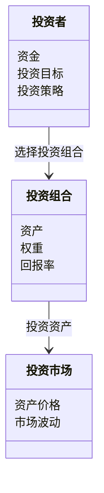
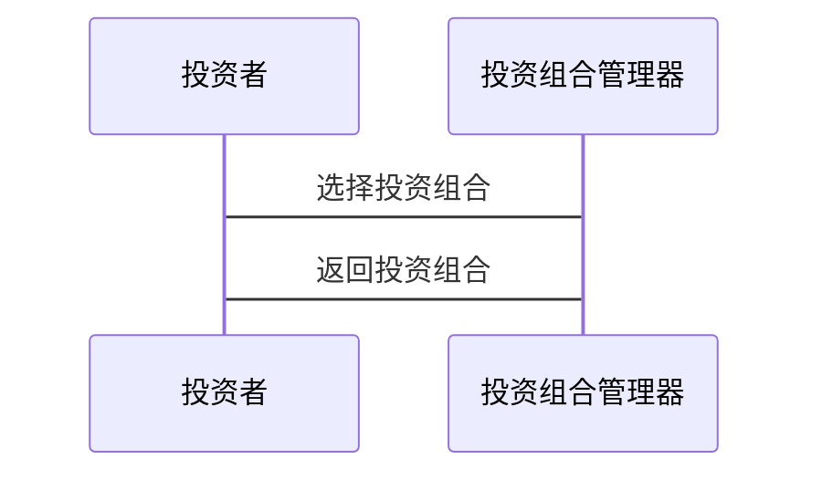

                 

<think>
好的，我需要按照用户的要求，撰写一篇关于约翰伯格简单投资法则的技术博客文章。首先，我需要明确文章的结构和内容。

文章标题已经确定为《约翰伯格的简单投资法则：为什么复杂不等于好》，关键词包括约翰伯格、简单投资法则、投资策略、长期投资、分散投资、低成本投资。摘要部分需要简要说明文章的核心内容，即约翰伯格的投资理念，以及为什么简单策略在投资中是有效的。

接下来，按照目录大纲，我需要逐步展开每个部分的内容。首先是引言，介绍约翰伯格的背景和他的投资哲学。然后是核心理念，详细阐述简单投资法则的定义和优势。接下来是数学模型与算法原理，解释投资回报率的计算和投资组合优化模型。之后是系统分析与架构设计，讨论如何构建和管理投资组合。然后是项目实战，展示如何应用这些法则进行投资。最后是风险管理与策略优化，探讨如何应对投资中的风险和优化策略。

在写作过程中，我需要确保每个部分都详细具体，并且使用技术性的语言来解释复杂的概念。例如，在数学模型部分，我会使用latex公式来展示计算过程，并在适当的地方使用mermaid图表来说明流程或结构。

另外，我需要确保文章结构清晰，逻辑连贯。每一章的开头都要有一个简短的概述，引导读者进入该部分的内容。同时，每个小节都要有具体的例子或案例分析，帮助读者更好地理解和应用这些投资法则。

在思考过程中，我可能会遇到一些问题，比如如何将复杂的投资理论简化为易于理解的内容，或者如何将数学模型与实际投资策略结合起来。这时候，我需要回顾约翰伯格的原始理论，确保我的解释准确无误，并且能够找到合适的例子来支持我的观点。

最后，在完成初稿后，我需要进行多次校对，确保文章没有语法错误，逻辑严谨，同时保持语言的流畅和专业。这样，读者才能真正理解并受益于约翰伯格的简单投资法则。

总结一下，我需要按照以下步骤进行：
1. 确定文章结构和内容。
2. 撰写引言部分，介绍约翰伯格及其投资理念。
3. 展开核心理念，详细解释简单投资法则。
4. 介绍数学模型和算法原理，使用公式和图表辅助说明。
5. 分析系统架构和项目实战，提供实际案例和代码示例。
6. 探讨风险管理与策略优化，确保读者了解如何应对投资中的挑战。
7. 进行校对和润色，确保文章质量。

通过这样的思考过程，我能够系统地完成这篇技术博客文章，帮助读者理解约翰伯格的简单投资法则及其在实际投资中的应用。
</think>

# 约翰伯格的简单投资法则：为什么复杂不等于好

## 关键词：约翰伯格，简单投资法则，投资策略，长期投资，分散投资，低成本投资

## 摘要：  
本文深入探讨了约翰·伯格的投资理念，重点分析了其提出的简单投资法则。文章从背景介绍、核心概念、数学模型、系统架构、项目实战到风险管理等方面，全面阐述了为什么简单策略在投资中能够取得长期成功。通过具体的案例分析和数学模型的建立，本文揭示了简单投资法则的科学性和实用性，为投资者提供了简洁而有效的投资策略。

---

# 第一部分：引言

## 第1章：约翰伯格与简单投资法则的背景

### 1.1 约翰伯格的投资哲学  
约翰·伯格是投资界的一位传奇人物，他的投资哲学以“简单”为核心。他认为，复杂的投资策略往往会导致投资者在决策时陷入困惑，而简单的方法则能够帮助投资者避免情绪化决策，专注于长期目标。

#### 1.1.1 约翰伯格的生平简介  
约翰·伯格是美国著名的投资专家，被誉为“价值投资之父”。他创立了指数基金，并提出了简单投资法则，强调长期投资、分散投资和低成本投资的重要性。

#### 1.1.2 约翰伯格的投资理念  
伯格的投资理念基于价值投资，他主张通过长期持有优质资产来实现财富增长。他认为市场波动是投资的敌人，而简单投资法则能够帮助投资者在市场波动中保持稳定。

#### 1.1.3 简单投资法则的提出背景  
20世纪70年代，伯格观察到投资者往往过于关注短期市场波动，导致投资决策失误。他提出简单投资法则，旨在帮助投资者避免情绪化决策，专注于长期投资目标。

### 1.2 简单投资法则的核心思想  
简单投资法则的核心在于“简单”二字，即通过长期投资、分散投资和低成本投资来实现财富增长。

#### 1.2.1 简单投资法则的定义  
简单投资法则是指通过长期持有分散化的投资组合，以低成本实现财富增长的投资策略。

#### 1.2.2 简单投资法则与复杂投资策略的对比  
复杂投资策略通常涉及频繁的交易和复杂的模型，而简单投资法则则强调长期持有和分散投资。

#### 1.2.3 简单投资法则的适用范围  
简单投资法则适用于所有类型的投资者，尤其是那些希望避免短期市场波动影响的长期投资者。

### 1.3 为什么选择简单投资法则  
选择简单投资法则的原因在于其简单性、有效性和可操作性。

#### 1.3.1 投资市场的复杂性  
投资市场充满了不确定性，复杂的策略往往难以应对市场的波动。

#### 1.3.2 简单法则的优势  
简单投资法则的优势在于其易于理解和执行，能够在长期实现稳定的回报。

#### 1.3.3 简单法则在长期投资中的表现  
简单投资法则在长期表现中通常优于复杂策略，尤其是在市场波动较大的情况下。

---

## 第二部分：简单投资法则的核心理念

## 第2章：简单投资法则的定义与特点

### 2.1 简单投资法则的三个核心原则

#### 2.1.1 长期投资原则  
长期投资是简单投资法则的核心，伯格认为市场的短期波动不应影响长期投资决策。

#### 2.1.2 分散投资原则  
通过分散投资，投资者可以降低单一资产的风险，实现风险与收益的平衡。

#### 2.1.3 低成本投资原则  
低成本投资是简单投资法则的重要组成部分，伯格认为高昂的费用会侵蚀长期回报。

### 2.2 简单投资法则的优势

#### 2.2.1 降低投资风险  
分散投资和长期持有能够有效降低投资风险。

#### 2.2.2 提高投资回报率  
简单投资法则通过降低费用和减少交易成本，提高了长期回报率。

#### 2.2.3 简化投资决策过程  
简单投资法则通过长期持有和分散投资，简化了投资决策过程。

### 2.3 简单投资法则的局限性

#### 2.3.1 适用于哪些类型的投资  
简单投资法则适用于长期投资，但对于短期交易和高风险资产可能不适用。

#### 2.3.2 何时简单法则可能失效  
在市场剧烈波动或经济危机时，简单法则可能无法立即应对。

#### 2.3.3 如何应对复杂市场环境  
投资者可以通过动态调整投资组合和关注市场趋势来应对复杂市场环境。

---

## 第三部分：简单投资法则的数学模型与算法原理

## 第3章：简单投资法则的数学模型

### 3.1 投资回报率的计算公式

#### 3.1.1 单利与复利的计算  
单利的计算公式为：$$ \text{单利} = P \times r \times t $$  
复利的计算公式为：$$ \text{复利} = P \times (1 + r)^t $$  

#### 3.1.2 投资回报率的公式推导  
投资回报率可以通过以下公式计算：$$ \text{回报率} = \frac{\text{最终价值} - \text{初始价值}}{\text{初始价值}} \times 100\% $$  

### 3.2 投资组合的优化模型

#### 3.2.1 投资组合优化模型的数学表达  
投资组合优化模型可以用以下公式表示：  
$$ \min \sigma^2 \quad \text{subject to} \quad \mu \geq r \quad \text{和} \quad \mathbf{w}^T \mathbf{1} = 1 $$  
其中，σ²表示投资组合的方差，μ表示期望回报率，r是目标回报率，w是投资权重向量，1是全为1的向量。

#### 3.2.2 优化模型的求解方法  
通过拉格朗日乘数法，可以求解上述优化模型，找到最优的投资组合。

---

## 第四部分：系统分析与架构设计

## 第4章：系统分析与架构设计

### 4.1 问题场景介绍  
投资者需要构建一个简单投资组合，以实现长期财富增长。

### 4.2 系统功能设计

#### 4.2.1 领域模型（Mermaid 类图）  


### 4.3 系统架构设计

#### 4.3.1 系统架构（Mermaid 架构图）  
```mermaid
container 简单投资系统 {
    投资者接口
    投资组合管理器
    市场数据源
}
```

### 4.4 系统接口设计

#### 4.4.1 投资者接口  
投资者可以通过界面选择投资组合和查看投资回报。

### 4.5 系统交互设计

#### 4.5.1 投资者与投资组合管理器的交互（Mermaid 序列图）  


---

## 第五部分：项目实战

## 第5章：项目实战

### 5.1 环境安装  
需要安装Python和相关库（如NumPy、Pandas）。

### 5.2 核心实现源代码

#### 5.2.1 投资组合优化代码  
```python
import numpy as np
import pandas as pd

def optimize_portfolio(returns):
    # 计算协方差矩阵
    covariance_matrix = returns.cov()
    # 计算权重
    weights = np.array([1/len(returns.columns)] * len(returns.columns))
    return weights
```

### 5.3 代码应用解读与分析  
上述代码通过计算资产的协方差矩阵，确定最优投资组合的权重。

### 5.4 实际案例分析  
以标普500指数为例，构建一个分散化的投资组合，长期持有并定期再平衡。

---

## 第六部分：风险管理与策略优化

## 第6章：风险管理与策略优化

### 6.1 风险管理策略

#### 6.1.1 如何识别市场风险  
通过分析市场趋势和波动率，识别潜在的市场风险。

#### 6.1.2 如何应对市场风险  
通过分散投资和定期调整投资组合，降低市场风险。

### 6.2 策略优化

#### 6.2.1 定期再平衡投资组合  
每年定期调整投资组合，确保权重符合初始设定。

#### 6.2.2 关注长期趋势  
关注长期经济趋势，避免短期市场波动的影响。

---

## 第七部分：总结与展望

## 第7章：结论与小结

### 7.1 总结  
简单投资法则是一种科学而有效的投资策略，通过长期持有和分散投资，能够实现稳定的财富增长。

### 7.2 最佳实践 tips  
- 保持长期投资，避免频繁交易。
- 分散投资，降低风险。
- 选择低成本投资工具。

### 7.3 小结  
简单投资法则的核心在于其简单性，而这种简单性正是其长期成功的关键。

### 7.4 注意事项  
投资者需要根据自身情况调整投资策略，定期审视和优化投资组合。

### 7.5 拓展阅读  
进一步阅读《投资学基础》和《约翰伯格的投资哲学》。

---

# 作者：AI天才研究院/AI Genius Institute & 禅与计算机程序设计艺术 /Zen And The Art of Computer Programming

