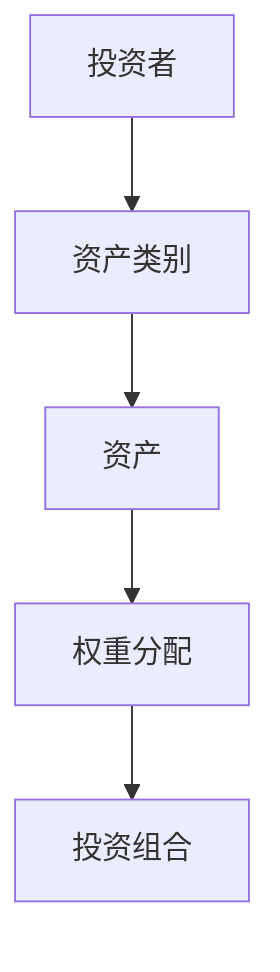
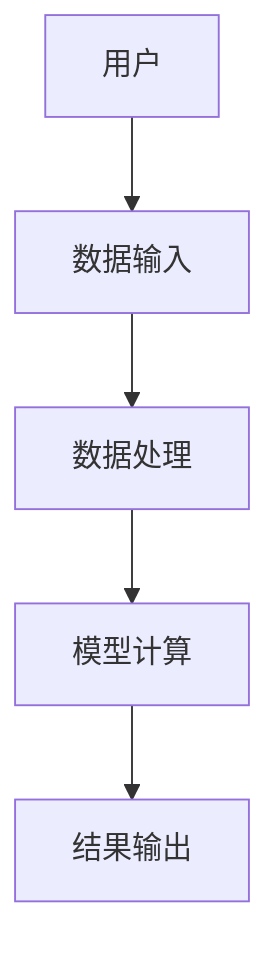
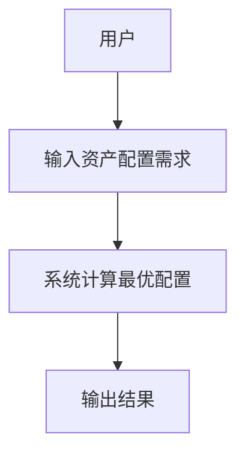

                 


# 资产类别配置

> 关键词：资产配置，投资组合，现代投资组合理论，风险收益，资产分配

> 摘要：资产类别配置是投资学中的一个核心概念，涉及将资金分配到不同的资产类别以优化投资回报和风险控制。本文从基础概念出发，逐步深入分析资产配置的原理、数学模型、策略与方法，结合实际案例和系统设计，探讨如何通过资产类别配置实现高效的投资管理。

---

## 第一部分：资产配置基础

### 第1章：资产类别配置概述

#### 1.1 资产配置的基本概念

资产配置是指将投资组合中的资金按比例分配到不同的资产类别（如股票、债券、房地产等）中，以实现投资目标和风险控制。它不仅是投资组合管理的核心，也是降低风险和提高收益的重要手段。

- **资产配置的定义**：资产配置是将资金分配到不同资产类别以平衡风险和收益的过程。
- **资产配置的重要性**：通过分散投资，降低单一资产的风险，提高整体组合的稳定性。
- **资产配置的边界与外延**：资产配置不仅涉及选择哪些资产，还包括确定每类资产的权重。

#### 1.2 资产配置的核心要素

- **投资目标与风险承受能力**：明确投资目标和风险偏好是资产配置的第一步。
- **资产类别与权重分配**：选择适合的资产类别并确定其权重。
- **资产配置的动态调整机制**：根据市场变化和个人目标的调整，定期优化配置。

#### 1.3 资产配置的历史与发展

- **资产配置的起源**：20世纪中期，马科维茨提出现代投资组合理论（MPT）。
- **不同经济周期下的资产配置策略**：经济周期波动对资产配置的影响。
- **现代资产配置理论的演变**：从简单的大类资产配置到复杂的多因子模型。

#### 1.4 资产配置的类型与特点

- **战略性资产配置**：基于长期投资目标确定的配置。
- **战术性资产配置**：根据市场变化进行短期调整。
- **保险资产配置与机构资产配置**：针对不同机构需求的定制化配置。

---

## 第二部分：资产配置的核心概念与联系

### 第2章：资产配置的原理与数学模型

#### 2.1 现代投资组合理论（MPT）

- **MPT的核心原理**：通过分散投资降低风险，优化收益。
- **资产配置的数学模型**：使用均值-方差模型优化组合。
- **均值-方差优化模型**：
  - 定义：寻找最优组合，使风险最小化或收益最大化。
  - 公式：$$ \text{Minimize } \sigma^2 \text{ subject to } E(r) \geq \text{目标收益} $$

#### 2.2 风险与收益的权衡

- **风险的度量方法**：标准差、VaR、CVaR等。
- **收益的预期与实际**：历史收益与预期收益的差异。
- **风险收益比的计算**：收益/风险比率。

#### 2.3 资产配置的优化算法

- **贯穿整个配置过程的优化方法**：使用拉格朗日乘数法求解约束条件下的优化问题。
- **基于现代投资组合理论的优化**：通过矩阵运算求解最优权重。
- **基于风险中性模型的优化**：考虑市场中性策略，降低市场风险。

#### 2.4 资产配置的ER实体关系图



#### 2.5 本章小结

---

## 第三部分：资产类别分析与配置策略

### 第3章：股票资产配置

#### 3.1 股票资产的特点与风险

- **股票的收益来源**：股息收益和资本增值。
- **股票的风险**：市场风险、流动性风险、公司特有风险。

#### 3.2 债券资产的特点与风险

- **债券的收益**：固定利息收入。
- **债券的风险**：利率风险、信用风险。

#### 3.3 房地产资产的特点与风险

- **房地产的收益**：租金收入和资本增值。
- **房地产的风险**：市场波动、流动性风险。

#### 3.4 其他资产类别

- **现金及现金等价物**：低风险，高流动性。
- **大宗商品**：如黄金、原油，具有对冲通胀的作用。

---

## 第四部分：系统设计与实现

### 第4章：资产配置系统的架构设计

#### 4.1 系统功能设计

- **需求分析**：用户需求分析，功能模块划分。
- **功能模块**：数据输入、模型计算、结果输出。
- **系统架构图**：



#### 4.2 接口设计

- **输入接口**：用户输入资产类别和权重。
- **输出接口**：生成优化后的资产配置方案。

#### 4.3 交互流程



---

## 第五部分：项目实战

### 第5章：资产配置项目实现

#### 5.1 环境安装

- **工具安装**：安装Python、NumPy、Pandas、Matplotlib等库。
- **数据获取**：从金融数据源获取历史数据。

#### 5.2 核心代码实现

```python
import numpy as np
import pandas as pd

# 示例数据
returns = pd.DataFrame({
    '股票': [0.1, 0.05, 0.03],
    '债券': [0.02, 0.04, 0.06]
})

# 均值-方差优化
cov_matrix = returns.cov()
mu = returns.mean()

# 最优化问题：Minimize variance
# 定义权重约束
n = len(returns.columns)
weights = np.ones(n) / n

# 计算最优权重
# 简化计算，假设 weights 为最优解
print("最优权重:", weights)
```

#### 5.3 案例分析

- **案例背景**：假设一个投资者有100万元，希望配置股票和债券。
- **配置方案**：股票60%，债券40%。
- **结果分析**：预期收益和风险评估。

---

## 第六部分：总结与展望

### 第6章：总结与未来研究方向

#### 6.1 全文总结

- 资产配置是投资管理的核心。
- 通过科学的方法和工具，可以优化投资组合。

#### 6.2 未来研究方向

- 更复杂的投资组合优化方法。
- 人工智能在资产配置中的应用。

---

## 作者信息

作者：AI天才研究院/AI Genius Institute & 禅与计算机程序设计艺术 /Zen And The Art of Computer Programming

---

感谢您的耐心阅读，希望这篇文章能为您提供有价值的信息和启发。

