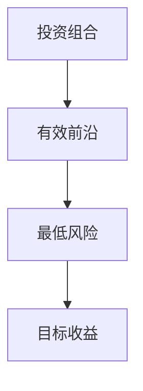
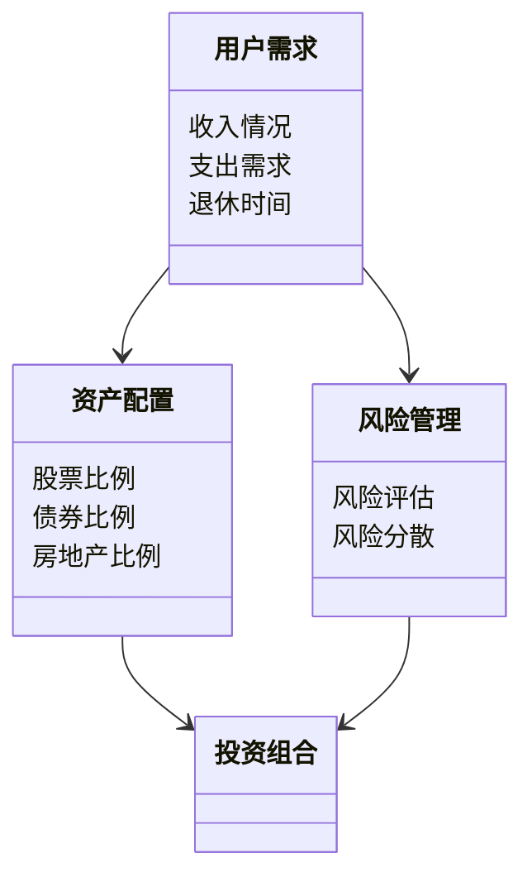

                 

<think>
嗯，我现在需要写一篇关于《约翰伯格的退休投资规划》的技术博客文章。首先，我得理解这个主题。退休投资规划是一个涉及财务、投资和风险管理的领域。约翰·伯格可能是一位著名的投资者，我需要分析他的策略和方法。

接下来，按照目录大纲，我需要从引言开始。引言部分要介绍退休投资规划的重要性，目标读者可能是即将退休或关心财务规划的人。我应该解释为什么退休投资规划如此重要，涉及哪些方面，比如资产配置、风险管理等。

然后是投资基础，资产配置和风险管理是关键。我需要详细解释不同资产类别的特点，比如股票、债券、房地产等，并比较它们的风险和回报。风险管理部分，我需要讨论如何评估和分散风险，这可能涉及数学模型，比如现代投资组合理论。

接下来是投资组合优化的数学模型，尤其是Markowitz有效前沿模型。我需要解释这个模型的原理，使用数学公式和图表来说明。这部分可能需要详细讲解公式，比如有效前沿的方程，并用mermaid画出图形。

然后是系统分析与架构设计，我需要描述如何构建一个退休投资规划系统。这可能包括领域模型，展示不同组件之间的关系，比如用户需求、资产配置、风险管理等。系统架构图可能展示分层结构，比如数据层、业务逻辑层和用户界面层。

项目实战部分，我需要指导读者如何使用工具，比如Excel或Python，来制定自己的退休计划。这可能包括编写代码示例，展示如何进行资产分配和风险评估。

最后，最佳实践部分需要总结关键点，给出小结、注意事项和拓展阅读建议。这有助于读者巩固所学内容，并进一步深入学习。

在写作过程中，我需要确保内容详细，结构清晰，每部分都符合要求。比如，在数学模型部分，使用latex公式，并在mermaid中画出图表。同时，代码示例需要解释清楚，帮助读者理解和应用。

我还需要确保语言专业但易懂，避免过于复杂的术语，但又不失深度。这样，读者无论是专业人士还是普通读者都能受益。

现在，我应该开始按照这个思路撰写文章，确保每个部分都涵盖必要的内容，同时保持逻辑连贯。我需要检查每部分是否满足用户的要求，比如章节标题是否吸引人，内容是否详细，是否符合格式要求。

总的来说，这需要一步步分析和推理，确保每个部分都深入浅出，帮助读者全面理解退休投资规划的核心概念和实际应用。
</think>

# 约翰伯格的退休投资规划

> 关键词：退休投资规划、资产配置、风险管理、投资组合优化、Markowitz有效前沿、投资策略

> 摘要：本文详细探讨了退休投资规划的核心概念与策略，结合约翰·伯格的实践经验，从投资基础、风险管理、数学模型到系统架构，层层剖析，帮助读者制定科学有效的退休投资计划。

---

## 第一部分：退休投资规划的背景与基础

### 第1章：引言：为什么退休投资规划重要？

#### 1.1 退休投资规划的定义与目标
退休投资规划是通过合理配置资产、优化投资策略和风险管理，确保在退休后维持稳定收入和生活质量的计划。其目标是实现资产的保值与增值，应对通货膨胀，满足退休后的各种支出需求。

#### 1.2 退休投资规划的背景与现状
随着人口老龄化加剧，传统养老金体系面临压力，个人退休投资规划的重要性日益凸显。了解和制定退休投资规划已成为保障晚年生活质量的关键。

#### 1.3 退休投资规划的核心要素
- **收入来源**：包括退休金、投资收益等。
- **支出需求**：涵盖生活支出、医疗费用等。
- **投资工具**：如股票、债券、房地产等。
- **风险管理**：评估并分散投资风险，确保资产安全。

---

## 第二部分：退休投资规划的核心概念与联系

### 第2章：投资基础：资产配置与风险管理

#### 2.1 资产配置的核心原理
资产配置是将资金分配到不同资产类别，以平衡风险与收益。以下是几种主要资产类别的特性对比：

| 资产类别 | 风险 | 收益 | 流动性 |
|----------|------|------|--------|
| 股票     | 高   | 高   | 低     |
| 债券     | 中   | 中   | 高     |
| 房地产   | 中   | 高   | 中     |

#### 2.2 风险管理的原理与方法
风险管理是通过识别、评估和控制风险，减少投资损失。常见的风险管理方法包括分散投资、定期再平衡和使用衍生工具。

#### 2.3 资产配置与风险管理的联系
资产配置影响风险，而风险管理优化资产配置。两者相辅相成，共同确保投资目标的实现。

---

## 第三部分：退休投资规划的算法原理与数学模型

### 第3章：投资组合优化的数学模型

#### 3.1 投资组合优化的定义
投资组合优化是通过数学模型寻找最优资产配置，以最大化收益或最小化风险。

#### 3.2 Markowitz有效前沿模型
Markowitz有效前沿模型是投资组合优化的经典方法，其数学公式为：

$$ \text{Minimize } \sigma^2 \text{ subject to } E(r) \geq \text{目标收益} $$

其中，σ²是投资组合的方差（风险），E(r)是期望收益。该模型帮助投资者找到在给定收益下风险最小的组合。

以下用mermaid绘制Markowitz有效前沿的图形：



#### 3.3 算法实现
以下是使用Python实现Markowitz模型的代码示例：

```python
import numpy as np
import pandas as pd
from scipy.optimize import minimize

# 示例数据：资产的期望收益和协方差矩阵
returns = pd.Series([0.05, 0.07, 0.03])
cov_matrix = pd.DataFrame([[0.02, 0.01, 0.005],
                            [0.01, 0.03, 0.01],
                            [0.005, 0.01, 0.02]])

def portfolio Optimization(weights, returns, cov_matrix):
    # 约束条件：权重之和为1
    constraint = ({'type': 'eq', 'fun': lambda w: np.sum(w) - 1})
    # 目标函数：最小化方差
    def objective(w):
        return (w.T @ cov_matrix @ w).item()
    # 使用SLSQP求解
    result = minimize(objective, weights, method='SLSQP', constraints=constraint)
    return result.x

# 调用函数
initial_weights = [1/3, 1/3, 1/3]
optimal_weights = portfolio_Optimization(initial_weights, returns, cov_matrix)
print("最优权重:", optimal_weights)
```

---

## 第四部分：系统分析与架构设计

### 第4章：退休投资规划系统的构建

#### 4.1 领域模型
以下是退休投资规划系统的领域模型类图：



#### 4.2 系统架构
以下是退休投资规划系统的架构图：


---

## 第五部分：项目实战与案例分析

### 第5章：退休投资规划的实战应用

#### 5.1 环境安装
需要安装Python和相关库：

```bash
pip install numpy pandas matplotlib
```

#### 5.2 核心实现
以下是资产配置和风险管理的代码示例：

```python
import numpy as np

def calculate_portfolio_value(assets, weights):
    # 计算投资组合的价值
    return np.dot(assets, weights)

def risk_assessment(assets, weights, cov_matrix):
    # 计算投资组合风险
    return np.sqrt(np.dot(weights.T, np.dot(cov_matrix, weights)))

assets = np.array([100000, 50000, 75000])  # 股票、债券、房地产的初始金额
weights = np.array([0.4, 0.3, 0.3])        # 初始权重
cov_matrix = np.array([[0.02, 0.01, 0.005],
                        [0.01, 0.03, 0.01],
                        [0.005, 0.01, 0.02]])

portfolio_value = calculate_portfolio_value(assets, weights)
portfolio_risk = risk_assessment(assets, weights, cov_matrix)

print("投资组合价值:", portfolio_value)
print("投资组合风险:", portfolio_risk)
```

---

## 第六部分：总结与展望

### 第6章：总结与展望

#### 6.1 本章小结
本文详细探讨了退休投资规划的核心概念、数学模型和系统架构，结合实际案例和代码示例，帮助读者制定科学的投资计划。

#### 6.2 注意事项
- 定期评估和调整投资组合
- 注意市场波动和经济变化
- 建议咨询专业财务顾问

#### 6.3 拓展阅读
- 《投资学》
- 《风险管理》
- 《个人财务规划》

---

作者：AI天才研究院 & 禅与计算机程序设计艺术

