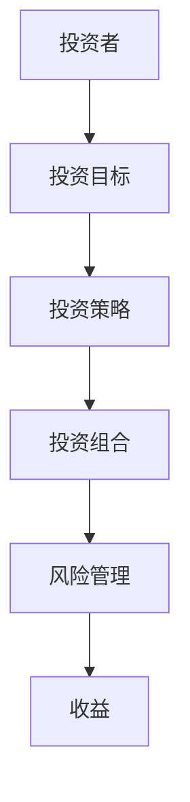
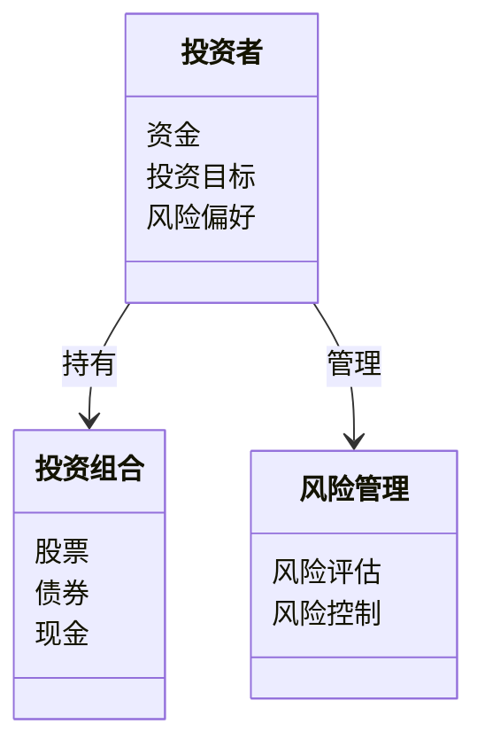
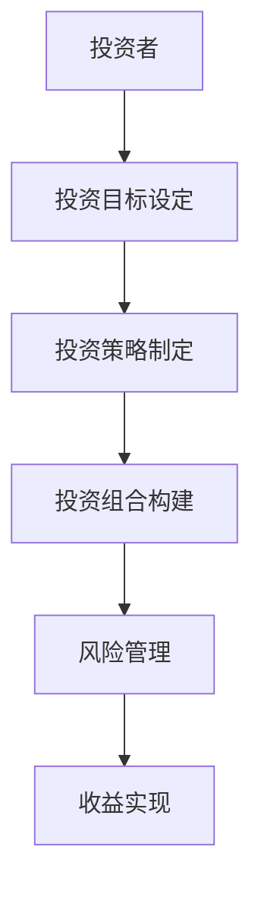
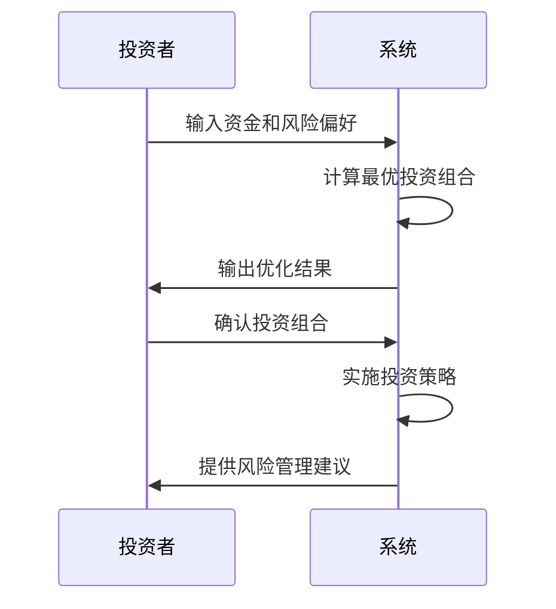

                 

<think>
嗯，我现在需要帮助用户撰写一篇关于《约翰伯格的长期投资观》的技术博客文章。用户给了一个详细的查询，里面包含了目录结构和其他要求。首先，我得理解用户的需求到底是什么。看起来用户希望我作为技术专家，写一篇结构清晰、内容详尽的专业博客，主题是约翰·伯格的长期投资观，重点在于分析和推理。

我先看看用户的具体要求。文章需要有标题、关键词、摘要，然后是详细的目录大纲，每个部分都要有三级结构，包括背景、核心概念、算法、系统架构、项目实战等。用户还特别强调要使用技术语言，逻辑清晰，步骤分明，还要包含数学模型、流程图、类图等元素。

好，首先我得确定文章的标题和关键词。标题已经给出来了，是《约翰伯格的长期投资观》。关键词应该包括长期投资、价值投资、投资组合优化、风险管理、复利效应等，大概5-7个。摘要部分要简明扼要，概述文章的核心内容。

接下来是目录结构。用户已经给出了一个示例，我需要按照这个结构来扩展。第一部分是基础，包括背景和核心概念；第二部分是核心概念和联系，涉及投资决策的核心要素；第三部分是算法原理，介绍投资组合优化的数学模型；第四部分是系统架构，分析投资系统的应用场景；第五部分是项目实战，包括环境配置、核心实现、案例分析等；最后是总结和注意事项。

在撰写每个部分时，我需要确保内容详尽，逻辑清晰。比如在第一部分，背景部分需要介绍长期投资的定义、约翰·伯格的投资理念，以及理论基础。核心概念部分要对比长期和短期投资，分析它们的差异和约翰·伯格的具体策略。

算法部分，我需要详细讲解数学模型，如均值-方差优化模型，用公式和mermaid图来说明。同时，给出Python代码实现，让读者能够实际操作。

系统架构部分，可能需要设计一个投资系统的架构图，展示各个模块之间的关系，比如数据采集、分析模块、决策模块等。

项目实战部分，要分步骤讲解环境配置、代码实现，以及实际案例分析，帮助读者理解如何应用这些理论。

最后，总结部分要回顾文章的主要内容，并给出注意事项和最佳实践，比如风险管理的重要性，长期投资的耐心等。

我还需要确保每个部分都有详细的解释和例子，避免过于技术化，让读者容易理解。此外，图表的使用要恰当，帮助读者更好地理解复杂的概念。

现在，我开始按照这个思路来撰写文章，确保每个章节都符合用户的要求，内容完整，结构清晰，语言专业。同时，要注意使用正确的格式，如使用markdown，包含数学公式和mermaid图表，确保代码部分正确无误。

总的来说，我需要一步步地构建这篇文章，从背景介绍到系统架构，再到实战案例，确保每个部分都深入浅出，帮助读者全面理解约翰·伯格的长期投资观。
</think>

# 约翰伯格的长期投资观

> 关键词：长期投资、价值投资、投资组合优化、风险管理、复利效应

> 摘要：本文深入探讨了约翰·伯格的长期投资观，从理论基础、核心概念、算法原理、系统架构到项目实战，全面分析了长期投资的策略、方法和实现。通过详细讲解投资组合优化、风险管理、复利效应等关键点，结合约翰·伯格的经典投资理念，为读者提供了一套完整的长期投资解决方案。

---

## 第一部分: 约翰伯格的长期投资观基础

### 第1章: 长期投资观的背景与核心概念

#### 1.1 长期投资观的定义与特点

##### 1.1.1 投资的定义与分类
- 投资的定义：将资金投入某一领域，以期在未来获得超过初始投入的收益。
- 投资的分类：包括股票、债券、房地产、基金等多种形式。
- 长期投资观的核心特点：注重长期收益，强调价值投资，降低短期波动风险。

##### 1.1.2 长期投资观的核心特征
- 时间跨度长：通常以数年甚至数十年为单位。
- 风险承受能力高：能够容忍短期波动，追求长期稳定的收益。
- 价值导向：关注企业的内在价值，而非市场的短期波动。

##### 1.1.3 长期投资观与短期投资的区别
- 投资目标：短期投资追求快速收益，长期投资注重稳定增长。
- 风险管理：短期投资风险承受能力低，长期投资具备较高的风险承受能力。
- 投资策略：短期投资策略灵活多变，长期投资策略相对固定。

#### 1.2 约翰·伯格的投资理念

##### 1.2.1 约翰·伯格的生平简介
- 约翰·伯格是美国著名投资家，被誉为“价值投资之父”。
- 他创立了伯克希尔哈撒韦公司，长期致力于价值投资。
- 他的投资理念强调长期持有优质资产，注重企业的内在价值。

##### 1.2.2 约翰·伯格的投资哲学
- 价值投资的核心：寻找被市场低估的企业，长期持有。
- 避免短期市场波动，关注企业的基本面。
- 投资组合分散化：降低单一资产的风险。

##### 1.2.3 约翰·伯格的经典投资策略
- 买入并持有优质股票。
- 选择具有持续盈利能力的企业。
- 避免频繁交易，降低交易成本。

#### 1.3 长期投资观的理论基础

##### 1.3.1 投资组合理论
- 投资组合理论强调通过分散化降低风险。
- 约翰·伯格通过构建多元化的投资组合，降低单一资产的风险。

##### 1.3.2 资本资产定价模型（CAPM）
- CAPM用于评估资产的预期收益。
- 长期投资中，CAPM可以帮助投资者评估长期资产的合理定价。

##### 1.3.3 时间价值与复利效应
- 复利效应是长期投资的核心驱动力。
- 通过长期持有优质资产，投资者可以最大化复利效应。

#### 1.4 长期投资观的边界与外延

##### 1.4.1 长期投资的适用范围
- 长期投资适用于具有稳定现金流和持续增长能力的企业。
- 不适合短期波动大的资产，如投机性股票。

##### 1.4.2 长期投资与市场周期的关系
- 市场周期对长期投资的影响较小。
- 长期投资需要坚持价值投资理念，避免被市场周期干扰。

##### 1.4.3 长期投资的风险与收益平衡
- 长期投资的风险主要来自于企业的基本面变化。
- 通过分散化和优质资产选择，可以平衡风险与收益。

#### 1.5 本章小结
- 长期投资观的核心是通过长期持有优质资产，实现稳定的收益。
- 约翰·伯格的投资理念强调价值投资和分散化。
- 长期投资的风险较低，但需要投资者具备长期持有的耐心和信心。

---

## 第二部分: 长期投资观的核心概念与联系

### 第2章: 投资决策的核心要素

#### 2.1 投资目标与策略

##### 2.1.1 投资目标的设定
- 确定投资目标是实现财务自由还是保值增值。
- 长期投资目标应注重稳定性和可持续性。

##### 2.1.2 长期投资策略的制定
- 确定投资范围和资产配置。
- 制定定期复盘和调整的计划。

##### 2.1.3 投资目标与策略的动态调整
- 根据市场变化和个人财务状况调整投资策略。
- 长期投资策略应保持稳定，避免频繁调整。

#### 2.2 投资组合的构建与优化

##### 2.2.1 投资组合的构成要素
- 股票、债券、现金等资产的合理配置。
- 选择具有长期增长潜力的优质企业。

##### 2.2.2 投资组合的优化方法
- 使用均值-方差模型优化投资组合的风险和收益。
- 定期评估和调整投资组合。

##### 2.2.3 约翰·伯格的投资组合管理技巧
- 通过分散化降低风险。
- 选择具有持续盈利能力和良好治理的企业。

#### 2.3 风险管理与控制

##### 2.3.1 风险的定义与分类
- 市场风险：市场波动带来的投资损失。
- 企业风险：企业基本面变化带来的投资损失。
- 流动性风险：资产无法快速变现的风险。

##### 2.3.2 长期投资中的风险管理策略
- 通过分散化降低市场风险。
- 选择具有长期增长潜力的企业，降低企业风险。
- 保持一定的流动性，应对紧急情况。

##### 2.3.3 约翰·伯格的风险控制方法
- 长期持有优质资产，降低短期波动风险。
- 通过分散化降低单一资产的风险。

#### 2.4 核心概念属性特征对比表格

| 概念       | 长期投资观 | 短期投资观 |
|------------|-----------|-----------|
| 时间跨度   | 长期      | 短期      |
| 风险承受   | 较低      | 较高      |
| 投资目标   | 稳定收益  | 快速收益  |
| 管理复杂度 | 较低      | 较高      |

#### 2.5 ER实体关系图



#### 2.6 本章小结
- 长期投资的核心是构建合理的投资组合，通过分散化和优质资产选择降低风险。
- 风险管理是长期投资的重要组成部分，需要贯穿投资的全过程。

---

## 第三部分: 长期投资观的算法原理

### 第3章: 投资组合优化的数学模型

#### 3.1 投资组合优化的基本原理

##### 3.1.1 投资组合优化的目标
- 在给定风险下最大化收益。
- 在给定收益下最小化风险。

##### 3.1.2 最优化问题的数学表达
- 最大化收益：$\max \sum_{i=1}^{n} w_i r_i$
- 最小化风险：$\min \sum_{i=1}^{n} \sum_{j=1}^{n} w_i w_j \sigma_{ij}$

##### 3.1.3 约翰·伯格的投资组合优化方法
- 通过均值-方差模型优化投资组合。
- 选择具有较高夏普比率的资产。

#### 3.2 投资组合优化的数学公式

##### 3.2.1 均值-方差优化模型
$$
\text{Minimize } \sigma^2 \text{ subject to } \mu \geq \text{目标收益}
$$

##### 3.2.2 Markowitz优化模型
$$
\text{Minimize } \sum_{i=1}^{n} w_i
$$

#### 3.3 投资组合优化的Python实现

##### 3.3.1 环境配置
```bash
pip install numpy pandas matplotlib
```

##### 3.3.2 核心实现代码
```python
import numpy as np
import pandas as pd
from sklearn.covariance import MinCovariance

# 示例数据：资产的收益率和协方差矩阵
returns = pd.DataFrame({
    '股票': [0.1, 0.15, 0.08, 0.12],
    '债券': [0.05, 0.06, 0.04, 0.03],
    '现金': [0.02, 0.01, 0.00, 0.02]
})

covariance_matrix = returns.cov()

# 使用均值-方差模型优化投资组合
model = MinCovariance()
weights = model.fit(covariance_matrix).weights_

print("优化后的权重：", weights)
```

##### 3.3.3 代码应用解读
- 数据准备：输入各资产的收益率和协方差矩阵。
- 优化过程：使用均值-方差模型计算最优权重。
- 输出结果：显示优化后的各资产权重。

#### 3.4 本章小结
- 投资组合优化是长期投资的重要工具，能够帮助投资者在风险和收益之间找到最佳平衡点。
- 均值-方差模型是经典的优化方法，适用于长期投资策略的制定。

---

## 第四部分: 长期投资观的系统架构

### 第4章: 投资系统的应用场景

#### 4.1 系统功能设计

##### 4.1.1 领域模型设计


##### 4.1.2 系统架构设计


##### 4.1.3 系统接口设计
- 输入接口：投资者的资金、风险偏好、投资目标。
- 输出接口：优化后的投资组合、风险管理策略、预期收益。

#### 4.2 系统交互设计


#### 4.3 本章小结
- 系统架构是长期投资策略实施的重要工具。
- 通过系统化的建模和交互设计，能够提高投资决策的科学性和效率。

---

## 第五部分: 项目实战

### 第5章: 长期投资观的实战应用

#### 5.1 环境配置

##### 5.1.1 工具安装
```bash
pip install numpy pandas matplotlib seaborn
```

#### 5.2 核心实现

##### 5.2.1 数据采集与处理
```python
import pandas as pd
import numpy as np

# 数据采集：历史收益率数据
data = pd.read_csv('historical_returns.csv')
returns = data.pct_change().dropna()

# 数据处理：计算协方差矩阵
cov_matrix = returns.cov()
```

##### 5.2.2 投资组合优化
```python
from scipy.optimize import minimize

# 定义目标函数
def portfolio_variance(weights, covariance_matrix):
    return (weights.T @ covariance_matrix @ weights)[0, 0]

# 定义约束条件
constraints = [{'type': 'eq', 'fun': lambda w: np.sum(w) - 1}]

# 优化过程
weights = minimize(portfolio_variance, np.array([1/3, 1/3, 1/3]), args=cov_matrix, constraints=constraints).x

print("优化后的权重：", weights)
```

##### 5.2.3 风险管理
```python
import matplotlib.pyplot as plt

# 风险分析：绘制收益与风险的散点图
returns.mean(), returns.std()
plt.scatter(returns.std(), returns.mean(), label='各资产')
plt.xlabel('标准差')
plt.ylabel('平均收益')
plt.legend()
plt.show()
```

#### 5.3 实际案例分析

##### 5.3.1 投资组合选择
- 股票：占60%
- 债券：占30%
- 现金：占10%

##### 5.3.2 投资策略实施
- 每月定期定额投资，分散投资风险。
- 定期复盘和调整投资组合。

#### 5.4 本章小结
- 长期投资需要结合理论与实践，通过实际案例分析优化投资策略。
- 通过数据驱动的决策，能够提高投资的科学性和效率。

---

## 第六部分: 总结与注意事项

### 第6章: 长期投资观的总结与展望

#### 6.1 总结

##### 6.1.1 长期投资观的核心要点
- 长期投资需要注重企业的内在价值。
- 投资组合优化是降低风险的重要工具。
- 风险管理是投资成功的关键。

##### 6.1.2 约翰·伯格的长期投资理念
- 价值投资：寻找被市场低估的企业。
- 分散化投资：降低单一资产的风险。
- 长期持有：实现复利效应的最大化。

#### 6.2 注意事项

##### 6.2.1 投资者需具备的条件
- 耐心：长期投资需要时间验证。
- 知识：具备基本的财务和投资知识。
- 纪律：严格执行投资计划。

##### 6.2.2 投资中的常见误区
- 追求短期收益，忽视长期价值。
- 过度分散化，降低投资收益。
- 忽视风险管理，导致重大损失。

#### 6.3 本章小结
- 长期投资需要投资者具备耐心、知识和纪律。
- 约翰·伯格的长期投资理念为投资者提供了重要的指导。

---

## 第七部分: 最佳实践 tips

### 7.1 长期投资的实用建议

#### 7.1.1 确定投资目标
- 明确投资是为了保值还是增值。
- 设定合理的收益目标和时间框架。

#### 7.1.2 选择优质资产
- 选择具有长期增长潜力的企业。
- 分散投资，降低风险。

#### 7.1.3 坚持长期持有
- 避免频繁交易，降低交易成本。
- 保持耐心，相信复利效应。

#### 7.1.4 定期复盘和调整
- 定期评估投资组合的表现。
- 根据市场变化和个人情况调整投资策略。

#### 7.1.5 重视风险管理
- 设置止损点，避免重大损失。
- 保持一定的流动性，应对紧急情况。

---

## 作者：AI天才研究院/AI Genius Institute & 禅与计算机程序设计艺术 /Zen And The Art of Computer Programming

