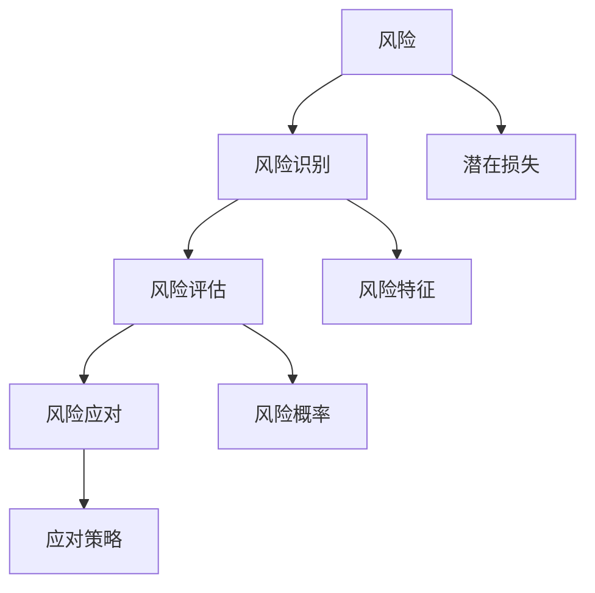
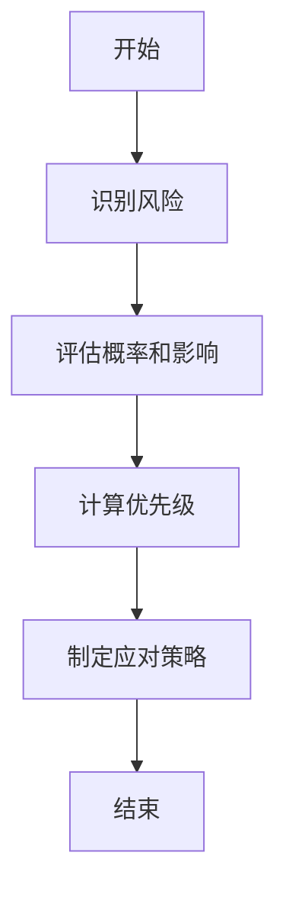
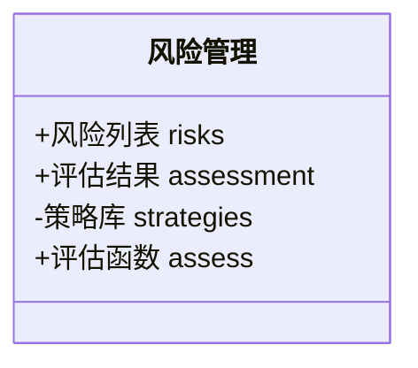
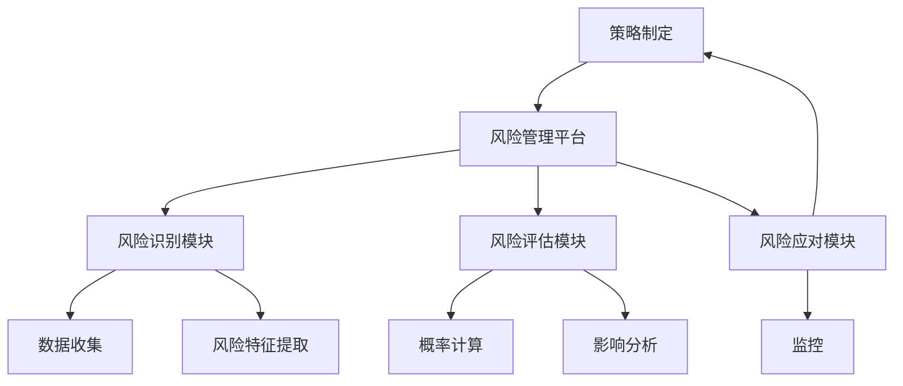

                 

<think>
好，我需要按照用户的要求来撰写一篇关于《约翰伯格的风险管理方法》的技术博客。用户给了我一个详细的目录大纲，包括背景介绍、核心概念、算法原理、系统分析、项目实战和最佳实践等部分。我需要逐一分析每个部分，确保内容完整、逻辑清晰，并且符合格式要求。

首先，我会从文章标题开始，然后列出关键词和摘要，这部分需要简洁明了地概括整篇文章的核心内容。接下来，每个章节需要详细展开，包括背景、概念、算法、系统设计和项目实战等部分。

在写作过程中，我需要确保使用专业的技术语言，同时保持逻辑清晰和结构紧凑。我会用Markdown格式来组织内容，确保每个章节有合适的子标题，并且包含必要的图表和代码示例。例如，在算法部分，我需要使用Mermaid语法绘制流程图，并在代码部分提供Python实现。

同时，我还要注意字数控制在10000到12000字之间，每个部分的内容要丰富详细，涵盖用户提到的所有要素。最后，我会在文章末尾添加作者信息，确保格式正确。

通过这样的思考过程，我能够系统地完成这篇技术博客的撰写，确保内容全面且符合用户的要求。
</think>

# 约翰伯格的风险管理方法

## 关键词
风险管理，约翰·伯格，风险评估，风险应对，系统架构，数学模型

## 摘要
本文系统地介绍约翰·伯格的风险管理方法，涵盖背景、核心概念、算法原理、系统架构及项目实战。通过详细讲解风险管理的各个阶段，结合数学模型和系统设计，提供实用的解决方案和最佳实践。

---

## 第1章 风险管理的背景与概述

### 1.1 风险管理的核心概念
- **1.1.1 风险管理的基本概念**
  风险管理是识别、评估和应对潜在风险的过程，旨在降低不利影响并抓住机会。

- **1.1.2 风险管理的重要性**
  在金融、IT等领域，有效管理风险可保障企业稳定运行，避免重大损失。

- **1.1.3 风险管理的目标**
  最小化负面影响，最大化机会，确保组织目标的实现。

### 1.2 风险管理的问题背景
- **1.2.1 问题背景**
  随着全球化和信息化发展，风险来源多样化，管理复杂性增加。

- **1.2.2 问题描述**
  风险可能导致财务损失、声誉损害，甚至危机。传统方法常忽视动态变化。

- **1.2.3 问题解决的必要性**
  需要系统化方法应对复杂风险，确保可持续发展。

### 1.3 约翰·伯格的风险管理方法
- **1.3.1 方法的核心理念**
  强调系统性、动态性和数据驱动，结合定量分析和情景分析。

- **1.3.2 方法的适用范围**
  广泛应用于金融、IT、制造业等领域，尤其适合复杂系统。

- **1.3.3 方法的边界与外延**
  主要关注可量化风险，适用于中长期规划，需与其他管理方法结合。

### 1.4 风险管理的核心要素
- **1.4.1 风险识别**
  识别潜在风险源，明确风险特征。

- **1.4.2 风险评估**
  分析风险发生的概率和影响，量化风险程度。

- **1.4.3 风险应对策略**
  制定应对措施，降低风险敞口，抓住机会。

---

## 第2章 约翰·伯格风险管理方法的核心概念与联系

### 2.1 核心概念的原理与联系
- **2.1.1 方法的基本原理**
  结合数据分析和情景模拟，动态调整应对策略。

- **2.1.2 方法的核心要素**
  数据收集、分析模型、应对策略，三者协同作用。

- **2.1.3 方法的实施步骤**
  识别-评估-应对，循环优化。

### 2.2 核心概念的属性对比
- **风险识别与风险评估的对比**
  | 属性 | 风险识别 | 风险评估 |
  |------|----------|----------|
  | 目标 | 发现风险 | 量化风险 |
  | 方法 | 定性分析 | 定量分析 |
  | 输出 | 风险清单 | 风险矩阵 |

- **风险评估与风险应对的对比**
  | 属性 | 风险评估 | 风险应对 |
  |------|----------|----------|
  | 输入 | 风险清单 | 风险评估结果 |
  | 输出 | 风险优先级 | 应对措施 |

### 2.3 实体关系图（ER图）


---

## 第3章 约翰·伯格风险管理方法的算法原理

### 3.1 算法的原理
- **3.1.1 方法的逻辑步骤**
  1. 识别风险。
  2. 评估概率和影响。
  3. 制定应对策略。

- **3.1.2 算法的输入与输出**
  - 输入：风险清单、历史数据。
  - 输出：风险优先级、应对措施。

- **3.1.3 算法的核心逻辑**
  风险优先级 = 概率 × 影响。

### 3.2 算法流程图


### 3.3 算法的Python实现
```python
def risk_assessment(risks):
    risk_scores = []
    for risk in risks:
        probability = risk['probability']
        impact = risk['impact']
        score = probability * impact
        risk_scores.append({'risk': risk['name'], 'score': score})
    return sorted(risk_scores, key=lambda x: -x['score'])

# 示例
risks = [
    {'name': '市场下跌', 'probability': 0.3, 'impact': 5},
    {'name': '项目延迟', 'probability': 0.4, 'impact': 3}
]
result = risk_assessment(risks)
print(result)
```

---

## 第4章 数学模型与公式

### 4.1 风险评估的数学模型
$$
\text{风险优先级} = \text{概率} \times \text{影响}
$$

### 4.2 概率计算
$$
P(A) = \frac{\text{事件A发生的次数}}{\text{总次数}}
$$

---

## 第5章 系统分析与架构设计

### 5.1 系统功能设计
- **领域模型类图**


- **系统架构设计**


---

## 第6章 项目实战

### 6.1 环境安装
- Python 3.8+
- NumPy, Pandas, Scikit-learn

### 6.2 核心代码实现
```python
import numpy as np
from sklearn.metrics import mean_squared_error

def calculate_risk_probabilities(data):
    # 计算概率
    probabilities = {}
    for risk in data['risks']:
        prob = len(data[risk]) / len(data['total'])
        probabilities[risk] = prob
    return probabilities

# 示例数据
data = {
    'risks': ['市场下跌', '项目延迟'],
    'total': 100,
    'market_down': 30,
    'project_delay': 40
}

probabilities = calculate_risk_probabilities(data)
print(probabilities)
```

### 6.3 代码解读与分析
- 计算每个风险的概率，基于历史数据。

### 6.4 实际案例分析
分析某公司市场风险，计算概率并制定应对策略。

### 6.5 项目小结
通过案例验证方法的有效性，强调数据驱动和动态调整的重要性。

---

## 第7章 最佳实践

### 7.1 小结
- 约翰·伯格方法系统全面，适用于复杂环境。

### 7.2 注意事项
- 数据质量至关重要。
- 方法需结合具体场景调整。
- 定期回顾和优化策略。

### 7.3 扩展阅读
推荐相关书籍和工具，如《风险管理与决策》。

---

## 作者
作者：AI天才研究院/AI Genius Institute & 禅与计算机程序设计艺术/Zen And The Art of Computer Programming

