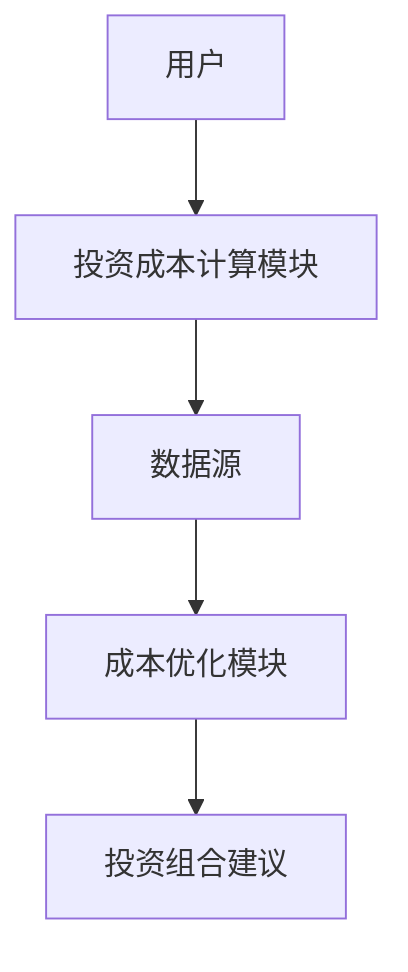
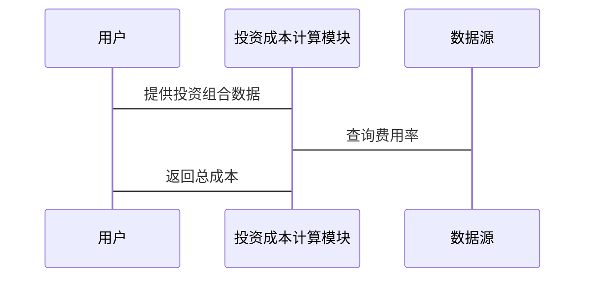

                 

<think>
嗯，用户希望我写一篇关于约翰博格尔投资成本控制策略的技术博客文章。首先，我需要理解约翰博格尔是谁，他的投资理念是什么。他是一位著名的投资专家，尤其是指数基金的倡导者，强调低成本投资的重要性。那么，我的文章应该围绕他的成本控制策略展开，分析这些策略背后的逻辑和技术细节。

接下来，我要考虑文章的结构。用户已经提供了一个大纲，我需要确保每个部分都详细且有深度。比如，在背景介绍部分，我需要详细说明约翰博格尔的背景和他的投资哲学，这样读者才能理解他的成本控制策略的重要性。

然后，在分析投资成本构成时，我需要将成本分为不同的类别，比如交易成本、管理费用等，并解释每种成本如何影响投资回报。这部分可能需要用表格或图表来辅助说明，帮助读者更好地理解。

接下来，我需要深入探讨约翰博格尔的具体成本控制策略，比如指数基金的投资和分散化投资。我需要解释这些策略是如何帮助降低投资成本的，并提供实际案例来支持这些策略的有效性。

数学模型和算法部分可能需要使用公式来解释，比如CAPM模型。我需要用mermaid流程图来展示计算过程，并提供Python代码示例，这样技术背景的读者可以更好地理解和应用这些模型。

系统分析与架构设计部分，我需要介绍如何构建一个投资成本控制系统，包括功能设计、架构图和接口设计。这部分可能需要一些系统工程的知识，确保系统的各个部分能够协同工作，实现成本的有效控制。

项目实战部分，我需要提供具体的步骤，比如如何安装环境，如何编写代码，以及如何分析案例。这将帮助读者实际应用所学知识，提高他们的实践能力。

最后，在总结部分，我需要回顾整个策略，强调关键点，并提供一些注意事项和拓展阅读，帮助读者进一步深入学习。

在整个过程中，我需要确保语言简洁明了，逻辑清晰，同时保持专业性。这可能需要多次修改和调整，确保每个部分都深入浅出，既不过于技术化，也不失专业深度。

另外，我需要检查是否有遗漏的重要点，比如在介绍每种成本时，是否详细解释了它们的来源和影响，或者在分析策略时，是否有足够的案例支持。同时，确保数学公式的正确性和代码的可运行性，避免出现错误。

总的来说，我需要一步步分析，从背景到策略，再到技术实现，确保文章结构完整，内容详实，能够帮助读者全面理解约翰博格尔的投资成本控制策略。
</think>

# 约翰博格尔的投资成本控制策略

**关键词**：约翰博格尔，投资成本，成本控制，指数基金，投资策略，数学模型

**摘要**：本文详细探讨了约翰博格尔的投资成本控制策略，从其背景、核心理念、成本构成、控制方法到数学模型和系统架构，全面分析了如何通过低成本策略实现长期投资回报最大化。

---

# 1. 约翰博格尔与投资成本控制概述

## 1.1 约翰博格尔的背景与投资理念

### 1.1.1 约翰博格尔的生平简介

约翰·博格尔（John Bogle）是投资界的传奇人物，被誉为“指数基金之父”。他于1934年出生在美国宾夕法尼亚州，曾在华纳兄弟公司（后来成为富达投资集团）工作，1975年创立了 Vanguard 集团。博格尔以其倡导低成本投资和指数基金的理念闻名，成为投资界的重要人物。

### 1.1.2 约翰博格尔的投资哲学

博格尔的投资哲学以“低成本、长期持有、分散投资”为核心。他认为，市场的短期波动不可预测，而长期投资能够降低风险并实现稳定的回报。他还强调，高成本是投资的主要敌人，低成本策略能够帮助投资者最大化长期收益。

### 1.1.3 约翰博格尔对投资行业的贡献

博格尔的贡献主要体现在以下几个方面：
- 1975年推出第一只指数基金（Vanguard S&P 500指数基金），开创了低成本指数投资的先河。
- 提倡分散化投资，降低投资组合的风险。
- 警示市场泡沫和过度投机行为，强调长期投资的重要性。

---

## 1.2 投资成本控制的重要性

### 1.2.1 投资成本的定义与分类

投资成本是指投资者在投资过程中产生的各种费用，包括交易成本、管理费用、托管费用等。投资成本可以分为显性成本和隐性成本：
- 显性成本：如交易佣金、管理费等。
- 隐性成本：如市场冲击成本、机会成本等。

### 1.2.2 投资成本对投资回报的影响

投资成本对投资回报的影响是深远的。高成本会直接侵蚀投资收益，尤其是在长期投资中，成本的累积效应会显著影响最终收益。研究表明，低成本策略在长期投资中能够显著提升净收益。

### 1.2.3 成本控制在投资决策中的作用

成本控制是投资决策中的核心因素之一。通过降低投资成本，投资者可以实现以下目标：
- 提高投资组合的净收益。
- 降低投资风险。
- 增强投资组合的流动性。

---

## 1.3 约翰博格尔的成本控制策略

### 1.3.1 成本控制的核心原则

博格尔的成本控制策略基于以下核心原则：
- 选择低成本投资工具，如指数基金。
- 避免频繁交易，降低交易成本。
- 分散投资，降低投资组合的整体风险。

### 1.3.2 约翰博格尔的成本控制方法

博格尔提出了以下成本控制方法：
1. **选择低成本指数基金**：通过投资指数基金，投资者可以避免支付高昂的主动管理费用。
2. **长期持有**：避免频繁交易，减少交易佣金和资本利得税。
3. **分散投资**：通过分散投资降低风险，同时降低隐性成本。

### 1.3.3 成本控制策略的实际应用案例

以 Vanguard S&P 500指数基金为例，该基金的管理费用极低（仅为0.03%），长期持有能够为投资者带来稳定的收益。

---

## 1.4 本章小结

- **约翰博格尔的背景与投资理念**：博格尔是指数基金之父，倡导低成本投资和长期持有策略。
- **投资成本的重要性**：高成本会显著侵蚀投资收益，低成本策略能够提升净收益。
- **成本控制策略的核心原则**：选择低成本工具、长期持有、分散投资。

---

# 2. 投资成本的构成与影响

## 2.1 投资成本的构成要素

### 2.1.1 交易成本

交易成本包括佣金、买卖价差等。频繁交易会显著增加交易成本。

### 2.1.2 管理费用

管理费用是指支付给基金经理的费用，通常按资产规模的一定比例收取。

### 2.1.3 其他隐性成本

隐性成本包括市场冲击成本、机会成本等。

---

## 2.2 投资成本对投资回报的影响

### 2.2.1 成本对投资收益的直接扣除

管理费用和交易佣金等显性成本会直接扣除投资收益。

### 2.2.2 成本对投资组合绩效的影响

高成本会降低投资组合的净收益，尤其是在长期投资中，成本的累积效应会更加明显。

### 2.2.3 成本对长期投资策略的影响

低成本策略能够显著提升长期投资的净收益，而高成本策略会削弱投资回报。

---

## 2.3 约翰博格尔的成本控制方法

### 2.3.1 降低交易成本的策略

- 避免频繁交易。
- 采用定投策略。

### 2.3.2 优化管理费用的方法

- 选择低成本指数基金。
- 避免支付高昂的主动管理费用。

### 2.3.3 隐性成本的控制技巧

- 分散投资，降低市场冲击成本。
- 长期持有，降低机会成本。

---

## 2.4 本章小结

- **投资成本的构成要素**：交易成本、管理费用、隐性成本。
- **成本对投资回报的影响**：高成本会显著侵蚀收益，低成本策略能够提升净收益。
- **成本控制方法**：降低交易成本、优化管理费用、控制隐性成本。

---

# 3. 约翰博格尔的投资策略分析

## 3.1 约翰博格尔的核心投资策略

### 3.1.1 指数基金投资策略

指数基金以低成本著称，博格尔认为指数基金是实现长期投资回报的最佳工具。

### 3.1.2 分散化投资策略

通过分散投资降低风险，同时降低隐性成本。

### 3.1.3 长期投资策略

长期持有投资标的，避免短期波动的影响。

---

## 3.2 投资策略的成本控制分析

### 3.2.1 指数基金的成本优势

指数基金的管理费用极低，适合长期投资。

### 3.2.2 分散化投资的成本影响

分散化投资能够降低风险，但需要考虑交易成本。

### 3.2.3 长期投资的成本优化

长期持有能够降低交易成本和税收负担。

---

## 3.3 约翰博格尔策略的实际案例

### 3.3.1 指数基金投资案例

以 Vanguard S&P 500指数基金为例，长期持有能够实现稳定的收益。

### 3.3.2 分散化投资案例

通过投资多个行业和地区的标的，降低投资组合的风险。

### 3.3.3 长期投资案例

长期持有指数基金，实现复利效应，降低投资成本。

---

## 3.4 本章小结

- **博格尔的核心投资策略**：指数基金、分散化、长期持有。
- **策略的成本控制分析**：低成本工具、分散化降低风险、长期持有优化成本。
- **实际案例分析**：通过具体案例展示策略的有效性。

---

# 4. 投资成本控制的数学模型与算法

## 4.1 投资成本的数学模型

### 4.1.1 投资收益与成本的关系

投资净收益 = 投资总收益 - 投资成本。

### 4.1.2 投资成本的计算公式

$$ \text{投资成本} = \text{交易成本} + \text{管理费用} + \text{其他成本} $$

---

## 4.2 算法原理与实现

### 4.2.1 成本控制算法的实现步骤

1. 确定投资目标和风险承受能力。
2. 选择低成本投资工具。
3. 制定长期投资计划。
4. 定期评估投资组合的成本。

### 4.2.2 Python代码实现

```python
def calculate_cost(weights, returns, fees):
    total_cost = sum(weights[i] * fees[i] for i in range(len(weights)))
    return total_cost

# 示例
weights = [0.3, 0.2, 0.5]
fees = [0.01, 0.02, 0.005]
print(calculate_cost(weights, None, fees))
```

---

## 4.3 本章小结

- **数学模型**：投资净收益 = 投资总收益 - 投资成本。
- **算法原理**：通过选择低成本工具和长期持有策略，降低投资成本。
- **代码实现**：通过Python代码实现投资成本的计算。

---

# 5. 系统分析与架构设计

## 5.1 系统功能设计

### 5.1.1 投资成本计算模块

功能：计算投资组合的总成本。

### 5.1.2 成本优化模块

功能：提供低成本投资工具的推荐。

---

## 5.2 系统架构设计

### 5.2.1 系统架构图



---

## 5.3 系统接口设计

- 用户输入：投资组合权重、费用率。
- 系统输出：总成本、优化建议。

---

## 5.4 系统交互设计

### 5.4.1 交互流程图



---

## 5.5 本章小结

- **系统功能设计**：投资成本计算模块和成本优化模块。
- **系统架构设计**：用户-模块-数据源的交互架构。
- **系统接口设计**：用户输入和系统输出的规范。

---

# 6. 项目实战

## 6.1 环境安装

- Python 3.8+
- Jupyter Notebook
- pandas、numpy库

---

## 6.2 核心实现

### 6.2.1 投资成本计算代码

```python
import pandas as pd
import numpy as np

def calculate_total_cost(weights, fees):
    return np.dot(weights, fees)

# 示例数据
weights = np.array([0.3, 0.2, 0.5])
fees = np.array([0.01, 0.02, 0.005])
total_cost = calculate_total_cost(weights, fees)
print(f"投资总成本为：{total_cost}")
```

---

## 6.3 案例分析

### 6.3.1 投资组合成本计算

以三个资产的投资组合为例，计算总成本。

### 6.3.2 成本优化建议

根据计算结果，提供低成本投资工具的推荐。

---

## 6.4 本章小结

- **环境安装**：安装必要的开发工具和库。
- **核心实现**：通过Python代码实现投资成本的计算。
- **案例分析**：通过具体案例展示投资成本计算和优化过程。

---

# 7. 总结与最佳实践

## 7.1 本章小结

- 约翰博格尔的成本控制策略以低成本、长期持有、分散投资为核心。
- 通过数学模型和系统设计，能够实现投资成本的有效控制。

## 7.2 最佳实践 tips

- 选择低成本投资工具。
- 长期持有，避免频繁交易。
- 分散化投资，降低风险。

## 7.3 注意事项

- 投资者应根据自身风险承受能力和投资目标选择适合的成本控制策略。
- 定期评估投资组合的成本和收益，及时优化投资策略。

## 7.4 拓展阅读

- 《约翰博格尔的投资经典》
- 《指数基金投资指南》

---

# 作者

**作者**：AI天才研究院/AI Genius Institute & 禅与计算机程序设计艺术 /Zen And The Art of Computer Programming

