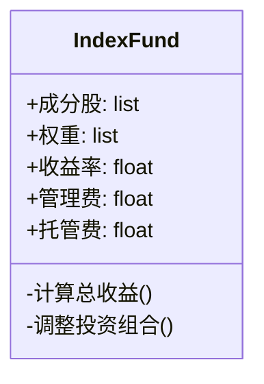
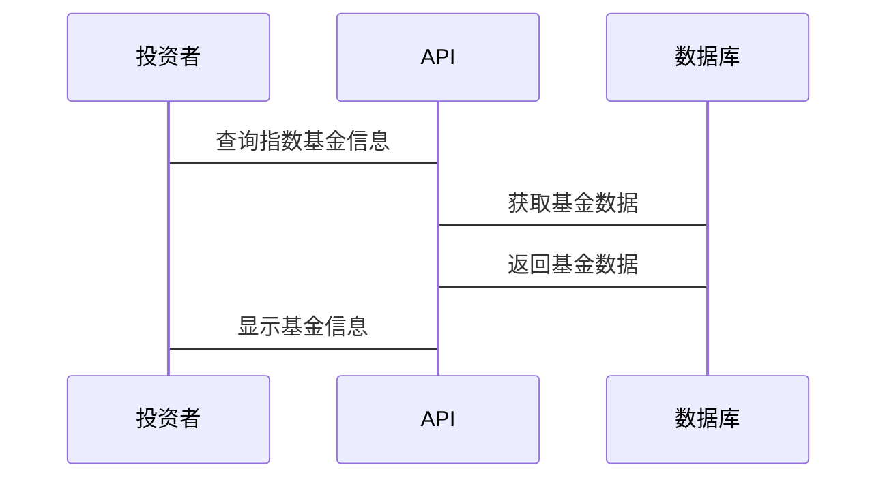

                 


# 约翰博格尔的指数化投资优势

## 关键词：指数化投资，约翰·博格尔，指数基金，投资策略，风险管理，长期收益

## 摘要：指数化投资是一种通过投资指数基金来跟踪市场表现的投资方式，由约翰·博格尔倡导，强调长期投资和分散风险。本文深入探讨指数化投资的核心概念、数学模型、系统架构及实际应用，帮助读者理解其优势和应用场景。

---

# 第一部分: 指数化投资的背景与核心概念

## 第1章: 指数化投资的起源与发展

### 1.1 指数化投资的定义与特点

#### 1.1.1 指数化投资的定义
指数化投资是指通过投资指数基金，以复制特定市场指数的表现，从而获得与市场相同收益的投资策略。其核心在于分散投资，避免过度依赖单一资产或市场波动带来的风险。

#### 1.1.2 指数化投资的核心特点
- **分散投资**：通过投资包含多个资产的指数基金，降低单一资产的风险。
- **低成本**：指数基金的管理费用通常低于主动管理型基金。
- **长期稳定**：指数基金长期表现通常优于主动管理型基金，尤其是考虑费用后。

#### 1.1.3 指数化投资与传统投资的区别
| 特性 | 指数化投资 | 主动管理型投资 |
|------|------------|----------------|
| 管理方式 | 跟踪指数 | 主动选股/择时 |
| 费用 | 低 | 高 |
| 风险 | 分散 | 集中 |

### 1.2 约翰·博格尔的贡献

#### 1.2.1 约翰·博格尔的生平简介
约翰·博格尔（John C. Bogle）是指数基金的创始人，被誉为“指数基金之父”。他在 Vanguard 集团工作期间，于1975年推出第一只指数基金。

#### 1.2.2 博格尔对指数化投资的贡献
- 创立了Vanguard集团。
- 推出了第一只低成本指数基金。
- 提倡长期投资和价值投资理念。

#### 1.2.3 博格尔的投资理念与哲学
博格尔强调：
1. 长期投资，避免频繁交易。
2. 分散投资，降低风险。
3. 低成本，确保收益最大化。

### 1.3 指数化投资的历史发展

#### 1.3.1 指数基金的起源
指数基金的概念最早出现在20世纪60年代，但真正发展起来是在博格尔推出第一只指数基金之后。

#### 1.3.2 指数化投资的发展历程
1. 20世纪70年代：第一只指数基金诞生。
2. 20世纪80年代：指数基金开始被广泛接受。
3. 20世纪90年代至今：指数基金在全球范围内快速发展，成为主要投资方式之一。

#### 1.3.3 当前指数化投资的现状
- 指数基金在全球资产管理中占据重要地位。
- 机构和个人投资者广泛采用指数化投资策略。

---

## 第2章: 指数化投资的核心原理

### 2.1 指数构建的原理

#### 2.1.1 市值加权指数
市值加权指数是根据成分股的市值大小来计算权重。例如，标准普尔500指数就是一种市值加权指数。

- **公式**：$$ R_{index} = \sum_{i=1}^{n} w_i R_i $$
  其中，$w_i$ 是第i只股票的权重，$R_i$ 是第i只股票的收益率。

#### 2.1.2 等权重指数
等权重指数是将每只股票赋予相同的权重，不论其市值大小。

- **公式**：$$ R_{index} = \frac{1}{n} \sum_{i=1}^{n} R_i $$

#### 2.1.3 其他指数构建方法
- 比例加权：根据行业或经济指标分配权重。
- 等级加权：根据信用评级分配权重。

### 2.2 指数复制与跟踪误差

#### 2.2.1 指数复制的原理
指数复制是指通过投资指数成分股，尽可能复制指数的表现。跟踪误差是指数基金实际收益率与指数收益率之间的差异。

- **公式**：$$ \text{跟踪误差} = \sqrt{\text{实际收益率} - \text{指数收益率}} $$

#### 2.2.2 跟踪误差的定义与计算
跟踪误差反映了指数基金与目标指数之间的差异，通常用标准差衡量。

#### 2.2.3 影响跟踪误差的因素
- 成分股数量：成分股越多，跟踪误差越小。
- 成分股权重：成分股权重分布越均匀，跟踪误差越小。
- 交易成本：交易成本增加会增加跟踪误差。

### 2.3 指数基金的运作机制

#### 2.3.1 指数基金的管理方式
指数基金通常采用被动管理，即定期调整投资组合以跟踪指数。

#### 2.3.2 指数基金的费用结构
指数基金的费用主要包括管理费、托管费和交易费。

#### 2.3.3 指数基金的收益分配
指数基金的收益通常按季度或年度分配给投资者。

---

## 第3章: 指数化投资的优势与劣势

### 3.1 指数化投资的优势

#### 3.1.1 分散风险
通过投资多个资产，降低单一资产的风险。

#### 3.1.2 低成本投资
指数基金的管理费用低于主动管理型基金。

#### 3.1.3 长期稳定收益
长期来看，指数基金的表现优于大多数主动管理型基金。

### 3.2 指数化投资的劣势

#### 3.2.1 短期波动风险
指数基金的收益率可能短期内波动较大。

#### 3.2.2 无法捕捉市场上涨机会
指数基金只能复制市场表现，无法超越市场。

#### 3.2.3 指数表现不佳的风险
如果指数表现不佳，指数基金也会表现不佳。

### 3.3 指数化投资与主动管理的对比

#### 3.3.1 主动管理的优势
- 可能捕捉市场上涨机会。
- 专业管理团队。

#### 3.3.2 指数化投资的优势
- 低成本。
- 分散风险。

#### 3.3.3 选择投资策略的考虑因素
- 风险承受能力。
- 投资期限。
- 市场环境。

---

## 第4章: 指数化投资的数学模型与公式

### 4.1 指数收益率的计算

#### 4.1.1 市值加权指数收益率公式
$$ R_{index} = \sum_{i=1}^{n} w_i R_i $$

#### 4.1.2 等权重指数收益率公式
$$ R_{index} = \frac{1}{n} \sum_{i=1}^{n} R_i $$

### 4.2 指数基金的夏普比率

夏普比率衡量基金在承担每单位风险时的超额收益。

- **公式**：$$ \text{夏普比率} = \frac{R_p - R_f}{\sigma_p} $$
  其中，$R_p$ 是基金收益，$R_f$ 是无风险收益率，$\sigma_p$ 是基金收益的标准差。

---

## 第5章: 指数化投资的系统分析与架构设计

### 5.1 系统功能设计

#### 5.1.1 领域模型（Mermaid类图）


#### 5.1.2 系统架构设计（Mermaid架构图）
```mermaid
architectural {
    title 指数基金系统架构
    Data Layer: 数据库
    Logic Layer: 业务逻辑
    Presentation Layer: 用户界面
    Interface: API
}
```

### 5.2 系统接口设计

#### 5.2.1 投资者接口
- 查询指数基金信息。
- 下单购买或赎回。

#### 5.2.2 管理员接口
- 维护指数成分股。
- 调整基金费用。

### 5.3 系统交互设计（Mermaid序列图）


---

## 第6章: 项目实战

### 6.1 环境安装

#### 6.1.1 安装Python
```bash
# 在终端运行以下命令安装Python
sudo apt-get install python3
```

#### 6.1.2 安装必要的库
```bash
pip install numpy pandas matplotlib
```

### 6.2 核心实现源代码

#### 6.2.1 指数收益率计算
```python
import numpy as np
import pandas as pd

# 假设我们有成分股的收益率数据
returns = pd.Series([0.1, 0.05, -0.02, 0.08, 0.03])

# 计算等权重指数的收益率
equal_weighted_return = returns.mean()

print("等权重指数收益率:", equal_weighted_return)
```

#### 6.2.2 计算夏普比率
```python
import numpy as np

def calculate_sharpe_ratio(returns, risk_free_rate):
    excess_returns = returns - risk_free_rate
    sharpe_ratio = excess_returns.mean() / excess_returns.std()
    return sharpe_ratio

returns = [0.1, 0.05, -0.02, 0.08, 0.03]
risk_free_rate = 0.02

print("夏普比率:", calculate_sharpe_ratio(returns, risk_free_rate))
```

### 6.3 案例分析与解读

#### 6.3.1 案例分析
假设我们有一个包含5只股票的指数，收益率分别为10%、5%、-2%、8%和3%。计算等权重指数的收益率。

### 6.4 项目小结

---

## 第7章: 最佳实践与注意事项

### 7.1 最佳实践 tips
- 定期审视投资组合。
- 避免频繁交易。
- 考虑税收影响。

### 7.2 小结
指数化投资是一种简单有效的投资方式，尤其适合长期投资者。

### 7.3 注意事项
- 确保选择合适的指数基金。
- 注意市场波动。
- 考虑经济周期的影响。

### 7.4 拓展阅读
- 《The Intelligent Investor》 by Benjamin Graham
- 《The Elements of Statistical Learning》 by Trevor Hastie, Robert Tibshirani, and Jerome Friedman

---

## 作者：AI天才研究院/AI Genius Institute & 禅与计算机程序设计艺术 /Zen And The Art of Computer Programming

---

通过以上结构，文章详细探讨了指数化投资的核心概念、数学模型、系统架构及实际应用，帮助读者全面理解其优势和应用场景。

