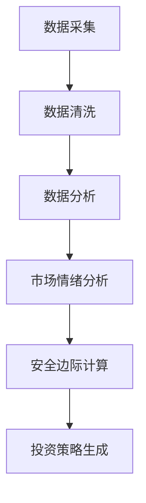

                 


# 约翰·聂夫的Contrarian投资法

> 关键词：约翰·聂夫，Contrarian投资法，逆向思维，安全边际，投资策略

> 摘要：本文详细介绍了约翰·聂夫的Contrarian投资法，从其核心理念、策略到实际应用，结合技术分析和案例研究，深入剖析了这一投资方法的精髓。文章内容涵盖市场逆向思维、安全边际计算、投资组合管理、技术分析与Contrarian策略的结合，以及约翰·聂夫的经典投资案例。

## 第1章: Contrarian投资法的背景与核心理念

### 1.1 投资市场的基本问题

#### 1.1.1 投资市场的波动性与不确定性
投资市场本质上是一个充满波动性和不确定性的环境。市场的波动性来源于投资者情绪的变化、经济基本面的波动以及外部不可预测的事件。传统投资方法往往难以应对这些不确定性，尤其是在市场剧烈波动时，投资者容易受到恐慌或贪婪情绪的影响，做出非理性的决策。

#### 1.1.2 传统投资方法的局限性
传统投资方法通常依赖于趋势跟踪、技术分析或基本面分析。然而，这些方法在市场底部或顶部时往往失效，因为市场情绪的极端波动会导致这些方法失效。例如，在市场底部时，基本面分析可能显示某些股票具有投资价值，但由于市场的恐慌情绪，这些股票的价格可能被过度低估。

#### 1.1.3 Contrarian投资法的提出背景
Contrarian投资法作为一种逆向投资策略，起源于对传统投资方法局限性的反思。该方法强调在市场恐慌时寻找机会，在市场狂热时保持冷静。约翰·聂夫作为这一方法的代表人物，通过长期实践证明了Contrarian投资法的有效性。

### 1.2 Contrarian投资法的核心概念

#### 1.2.1 逆向思维的定义与特征
逆向思维是一种与市场情绪相反的思考方式。在市场恐慌时，逆向思维者会寻找低估的资产；在市场狂热时，逆向思维者会寻找高估的资产。这种思维方式的核心在于利用市场的非理性波动，寻找价格与价值的错配机会。

#### 1.2.2 Contrarian投资法的核心要素
Contrarian投资法的核心要素包括：
1. **市场逆向思维**：在市场恐慌时买入，在市场狂热时卖出。
2. **安全边际**：通过计算股票的内在价值，确保买入价格低于其真实价值。
3. **长期视角**：坚持长期投资，不被短期市场波动所干扰。

#### 1.2.3 Contrarian与传统投资方法的对比
与传统投资方法相比，Contrarian投资法更注重逆向思维和安全边际。传统方法可能过于依赖趋势分析，而Contrarian方法则更关注价格与价值的偏离。此外，Contrarian方法强调在市场底部时寻找机会，而传统方法可能在市场顶部时发出买入信号。

### 1.3 约翰·聂夫的投资哲学

#### 1.3.1 聂夫的投资理念与风格
约翰·聂夫的投资理念可以概括为“逆市而行”。他坚信市场的非理性波动为投资者提供了套利机会。他的投资风格以稳健著称，注重安全边际和长期价值。

#### 1.3.2 聂夫的投资策略与方法
聂夫的投资策略主要包括：
1. **价值投资**：寻找具有低估价格的股票。
2. **逆向投资**：在市场恐慌时买入，在市场狂热时卖出。
3. **长期持有**：避免频繁交易，减少交易成本。

#### 1.3.3 聂夫投资成功的关键因素
聂夫成功的关键因素包括：
1. **长期视角**：坚持长期投资，不被短期波动干扰。
2. **逆向思维**：在市场底部时寻找机会。
3. **安全边际**：确保买入价格低于股票的内在价值。

## 第2章: Contrarian投资法的核心原理

### 2.1 市场逆向思维的原理

#### 2.1.1 市场情绪与投资者行为分析
市场情绪可以分为乐观和悲观两种状态。在市场乐观时，投资者倾向于高估资产价值；在市场悲观时，投资者倾向于低估资产价值。Contrarian投资法利用市场情绪的极端波动，寻找价格与价值的错配机会。

#### 2.1.2 逆向思维在投资决策中的应用
逆向思维在投资决策中的应用包括：
1. **市场恐慌时买入**：当市场因恐慌情绪下跌时，寻找具有低估价格的资产。
2. **市场狂热时卖出**：当市场因乐观情绪上涨时，寻找高估的资产并卖出。

#### 2.1.3 市场周期与Contrarian策略的关系
市场周期包括繁荣、衰退、萧条和复苏四个阶段。在衰退和萧条阶段，市场情绪通常较为悲观，此时是Contrarian策略的最佳应用时机。在复苏和繁荣阶段，市场情绪通常较为乐观，此时是卖出的时机。

### 2.2 安全边际的概念与应用

#### 2.2.1 安全边际的定义与计算
安全边际是指股票的市场价格与内在价值之间的差距。计算安全边际的方法包括：
1. **市盈率法**：计算股票的市盈率，并与行业平均水平进行比较。
2. **股息率法**：计算股票的股息率，并与行业平均水平进行比较。

#### 2.2.2 安全边际在股票估值中的作用
安全边际在股票估值中的作用包括：
1. **降低投资风险**：通过确保买入价格低于内在价值，降低投资风险。
2. **提供缓冲空间**：在市场波动时，安全边际可以提供缓冲空间，保护投资本金。

#### 2.2.3 安全边际与风险控制的关系
安全边际与风险控制密切相关。通过确保买入价格低于内在价值，投资者可以有效控制投资风险。此外，安全边际还可以帮助投资者在市场波动中保持投资组合的稳定性。

### 2.3 Contrarian投资法的数学模型与算法

#### 2.3.1 市场情绪指数的计算
市场情绪指数可以通过以下公式计算：
$$
\text{市场情绪指数} = \frac{\text{市场当前价格} - \text{市场长期趋势线}}{\text{市场波动范围}}
$$
其中，市场长期趋势线可以通过移动平均线（MA）计算得出。

#### 2.3.2 安全边际的计算公式
安全边际的计算公式如下：
$$
\text{安全边际} = \text{内在价值} - \text{市场价格}
$$
内在价值可以通过基本面分析计算得出，而市场价格则可以通过当前市场价获得。

## 第3章: Contrarian投资法的策略与技巧

### 3.1 价值投资与Contrarian策略的结合

#### 3.1.1 价值投资的基本原则
价值投资的基本原则包括：
1. **寻找低估资产**：通过基本面分析寻找市场价格低于内在价值的资产。
2. **长期持有**：避免频繁交易，减少交易成本。
3. **分散投资**：通过分散投资降低投资风险。

#### 3.1.2 Contrarian策略在价值投资中的应用
Contrarian策略在价值投资中的应用包括：
1. **市场恐慌时买入**：在市场因恐慌情绪下跌时，寻找具有低估价格的资产。
2. **市场狂热时卖出**：在市场因乐观情绪上涨时，卖出高估的资产。

#### 3.1.3 价值评估与市场情绪的关系
价值评估与市场情绪密切相关。在市场恐慌时，资产价格可能被低估，此时是价值投资者的良好机会。在市场狂热时，资产价格可能被高估，此时是价值投资者卖出的时机。

### 3.2 市场恐慌与抄底机会

#### 3.2.1 市场恐慌的定义与特征
市场恐慌是指投资者因市场下跌而产生恐慌情绪，导致资产价格非理性下跌。市场恐慌的特征包括：
1. **市场下跌速度快**：资产价格短期内大幅下跌。
2. **市场成交量低**：交易量显著减少，显示市场缺乏流动性。

#### 3.2.2 抄底机会的识别与判断
抄底机会的识别与判断可以通过以下步骤进行：
1. **计算市场情绪指数**：通过市场情绪指数判断市场的恐慌程度。
2. **计算安全边际**：通过安全边际判断资产价格是否被低估。
3. **分析基本面**：通过基本面分析确认资产的内在价值。

#### 3.2.3 市场恐慌中的投资策略
市场恐慌中的投资策略包括：
1. **逐步建仓**：在市场恐慌时，逐步买入具有低估价格的资产。
2. **分散投资**：通过分散投资降低风险。
3. **长期持有**：避免频繁交易，保持投资策略的稳定性。

### 3.3 技术分析与Contrarian策略的结合

#### 3.3.1 技术分析的基本原则
技术分析的基本原则包括：
1. **价格反映一切信息**：市场价格反映了所有相关信息。
2. **价格走势具有延续性**：价格走势具有延续性，可以通过技术指标预测未来走势。

#### 3.3.2 Contrarian策略在技术分析中的应用
Contrarian策略在技术分析中的应用包括：
1. **反向指标法**：当市场出现极端的技术指标时，采取反向操作。
2. **超买超卖指标**：当市场出现超卖信号时，寻找买入机会；当市场出现超买信号时，寻找卖出机会。

#### 3.3.3 技术指标与市场情绪的关系
技术指标与市场情绪密切相关。例如，相对强弱指数（RSI）可以反映市场的超买或超卖状态。当RSI低于30时，市场可能处于超卖状态，此时是买入机会；当RSI高于70时，市场可能处于超买状态，此时是卖出机会。

## 第4章: Contrarian投资法的系统架构

### 4.1 投资决策系统的构成

#### 4.1.1 数据采集与分析模块
数据采集与分析模块负责采集市场数据，并进行初步分析。主要包括：
1. **市场数据采集**：采集股票价格、成交量等市场数据。
2. **数据清洗**：对采集的数据进行清洗，去除异常值。
3. **数据分析**：通过数据分析模块计算市场情绪指数、技术指标等。

#### 4.1.2 市场情绪分析模块
市场情绪分析模块负责分析市场情绪，并生成市场情绪指数。主要包括：
1. **市场情绪指数计算**：通过市场情绪指数公式计算市场情绪指数。
2. **市场情绪分类**：将市场情绪分为乐观、中性、悲观等类别。

#### 4.1.3 投资策略生成模块
投资策略生成模块负责根据市场情绪和安全边际生成投资策略。主要包括：
1. **安全边际计算**：计算股票的安全边际。
2. **投资策略生成**：根据市场情绪和安全边际生成买入或卖出信号。

### 4.2 系统架构设计

#### 4.2.1 系统功能模块划分
系统功能模块划分为：
1. 数据采集与分析模块
2. 市场情绪分析模块
3. 投资策略生成模块
4. 投资组合管理模块

#### 4.2.2 系统流程图设计
以下是系统流程图的mermaid图：



#### 4.2.3 系统交互设计
系统交互设计包括：
1. 用户输入市场数据。
2. 系统进行数据清洗和分析。
3. 系统生成市场情绪指数和安全边际。
4. 系统生成投资策略。

## 第5章: Contrarian投资法的数学模型与算法

### 5.1 市场情绪指数的计算

#### 5.1.1 市场情绪指数的定义
市场情绪指数是衡量市场情绪的指标，通常用0-100表示，0表示极度悲观，100表示极度乐观。

#### 5.1.2 市场情绪指数的计算公式
市场情绪指数的计算公式如下：
$$
\text{市场情绪指数} = \frac{\text{当前市场价} - \text{长期趋势线}}{\text{市场波动范围}}
$$
其中，长期趋势线可以通过移动平均线（MA）计算得出，市场波动范围可以通过标准差计算得出。

### 5.2 安全边际的计算

#### 5.2.1 安全边际的计算公式
安全边际的计算公式如下：
$$
\text{安全边际} = \text{内在价值} - \text{市场价格}
$$
其中，内在价值可以通过基本面分析计算得出，市场价格则通过当前市场价获得。

#### 5.2.2 安全边际与股票估值的关系
安全边际与股票估值的关系如下：
1. 当安全边际为正时，股票价格低于其内在价值，此时是买入机会。
2. 当安全边际为负时，股票价格高于其内在价值，此时是卖出机会。

### 5.3 Contrarian策略的算法实现

#### 5.3.1 算法步骤
1. **数据采集**：采集股票价格和市场数据。
2. **数据清洗**：去除异常值。
3. **市场情绪分析**：计算市场情绪指数。
4. **安全边际计算**：计算股票的安全边际。
5. **投资策略生成**：根据市场情绪和安全边际生成买入或卖出信号。

#### 5.3.2 算法实现代码
以下是Contrarian策略的Python实现代码：

```python
import pandas as pd
import numpy as np

# 数据采集与清洗
data = pd.read_csv('market_data.csv')
data = data.dropna()

# 市场情绪指数计算
def calculate_market_sentiment(data):
    long_term_trend = data['price'].rolling(window=20).mean()
    market_volatility = data['price'].std()
    market_sentiment = (data['price'] - long_term_trend) / market_volatility
    return market_sentiment

# 安全边际计算
def calculate_margin_of_safety(data):
    intrinsic_value = data['intrinsic_value']
    market_price = data['price']
    margin_of_safety = intrinsic_value - market_price
    return margin_of_safety

# 投资策略生成
def generate_investment_strategy(market_sentiment, margin_of_safety):
    strategy = []
    for i in range(len(market_sentiment)):
        if market_sentiment[i] < 30 and margin_of_safety[i] > 0:
            strategy.append('买入')
        elif market_sentiment[i] > 70 and margin_of_safety[i] < 0:
            strategy.append('卖出')
        else:
            strategy.append('持有')
    return strategy

# 主程序
market_sentiment = calculate_market_sentiment(data)
margin_of_safety = calculate_margin_of_safety(data)
strategy = generate_investment_strategy(market_sentiment, margin_of_safety)
print(strategy)
```

### 5.4 算法实现的详细解释

#### 5.4.1 数据采集与清洗
数据采集与清洗是Contrarian策略的第一步。通过读取CSV文件并去除异常值，确保数据的完整性和准确性。

#### 5.4.2 市场情绪指数计算
市场情绪指数通过计算当前市场价与长期趋势线的偏离程度，判断市场的乐观或悲观情绪。长期趋势线通常用移动平均线（MA）计算得出，而市场波动范围则用标准差计算。

#### 5.4.3 安全边际计算
安全边际是通过计算股票的内在价值与市场价格的差值，判断股票是否被低估或高估。内在价值通常通过基本面分析计算得出，而市场价格则通过当前市场价获得。

#### 5.4.4 投资策略生成
投资策略生成是Contrarian策略的核心部分。通过判断市场情绪指数和安全边际，生成买入、卖出或持有信号。当市场情绪指数低于30且安全边际为正时，生成买入信号；当市场情绪指数高于70且安全边际为负时，生成卖出信号；其他情况下生成持有信号。

## 第6章: Contrarian投资法的案例分析

### 6.1 经典投资案例

#### 6.1.1 约翰·聂夫的经典投资案例
约翰·聂夫在其投资生涯中成功运用Contrarian策略，以下是一个经典案例：
- **案例背景**：2008年全球金融危机期间，市场因恐慌情绪大幅下跌，许多优质股票被严重低估。
- **聂夫的操作**：在市场恐慌时，聂夫大量买入具有低估价格的股票，如苹果公司（Apple Inc.）。
- **结果**：随着市场的复苏，这些股票价格大幅回升，聂夫的投资获得了丰厚的回报。

#### 6.1.2 技术分析与Contrarian策略的结合
以下是一个技术分析与Contrarian策略结合的案例：
- **案例背景**：某股票在市场恐慌时价格大幅下跌，技术指标显示超卖信号。
- **聂夫的操作**：根据Contrarian策略，聂夫在市场恐慌时买入该股票。
- **结果**：随着市场的复苏，该股票价格回升，聂夫的投资获得了丰厚的回报。

### 6.2 案例分析的详细步骤

#### 6.2.1 数据采集与分析
1. 采集目标股票的历史价格数据。
2. 计算市场情绪指数和安全边际。
3. 分析技术指标，如RSI、MACD等。

#### 6.2.2 投资决策
1. 当市场情绪指数低于30且安全边际为正时，生成买入信号。
2. 当市场情绪指数高于70且安全边际为负时，生成卖出信号。
3. 其他情况下，保持持有。

#### 6.2.3 投资结果
通过分析市场情绪和安全边际，聂夫在市场恐慌时买入低估股票，成功获得超额收益。

## 第7章: 投资心态与Contrarian策略的结合

### 7.1 投资心态的重要性

#### 7.1.1 长期视角
长期视角是Contrarian策略的核心要素之一。通过长期持有投资，投资者可以避免短期市场波动的干扰，实现资产的长期增值。

#### 7.1.2 耐心与纪律
耐心与纪律是Contrarian策略成功的关键。投资者需要在市场恐慌时保持冷静，耐心等待市场恢复。

### 7.2 Contrarian策略中的心理陷阱

#### 7.2.1 过度自信
过度自信是投资者常见的心理陷阱之一。投资者可能因过度自信而忽视市场风险，导致投资失败。

#### 7.2.2 情绪化决策
情绪化决策是Contrarian策略的天敌。投资者因市场波动而产生恐慌或贪婪情绪，可能导致非理性决策。

#### 7.2.3 忽视风险
忽视风险是另一种心理陷阱。投资者可能因追求高收益而忽视潜在风险，导致投资失败。

### 7.3 克服心理障碍的方法

#### 7.3.1 建立投资纪律
通过制定严格的投资纪律，避免情绪化决策。例如，设定明确的投资策略和买入卖出规则。

#### 7.3.2 保持耐心
在市场波动时，保持耐心，避免频繁交易。通过长期持有投资，实现资产的稳定增长。

#### 7.3.3 定期复盘
定期复盘投资决策，分析投资结果，总结经验教训。通过不断学习和改进，提升投资能力。

## 第8章: 总结与展望

### 8.1 总结
本文详细介绍了约翰·聂夫的Contrarian投资法，从其核心理念、策略到实际应用，结合技术分析和案例研究，深入剖析了这一投资方法的精髓。Contrarian投资法作为一种逆向投资策略，强调在市场恐慌时寻找机会，在市场狂热时保持冷静。通过计算市场情绪指数和安全边际，投资者可以有效识别投资机会和风险。

### 8.2 展望
未来，随着人工智能和大数据技术的发展，Contrarian投资法将更加智能化和自动化。投资者可以通过机器学习算法，更准确地预测市场情绪和计算安全边际，从而提高投资决策的效率和准确性。此外，Contrarian策略还可以与其他投资策略相结合，形成更加多元化和灵活的投资方法。

## 作者：AI天才研究院/AI Genius Institute & 禅与计算机程序设计艺术/Zen And The Art of Computer Programming

