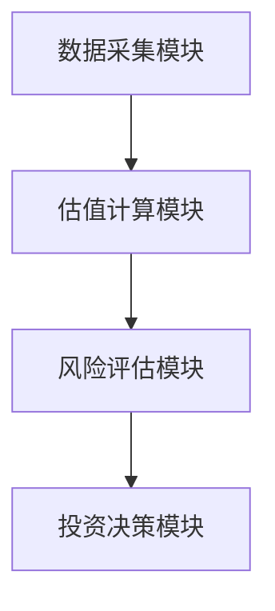

                 

<think>
好的，我需要分析用户的查询并生成相应的回复。用户希望我以《约翰·聂夫的价值投资实践经验》为标题，撰写一篇技术博客文章。他们提供了详细的目录结构，并要求使用技术语言，逻辑清晰，结构紧凑，语言简单易懂。

首先，我注意到用户希望文章包含背景介绍、核心概念、算法、系统架构、项目实战等多个部分，并且每个部分都有三级目录。用户还特别指出，文章需要使用技术术语，但又要通俗易懂。此外，文章需要包含数学公式、mermaid图和代码示例，这表明用户希望内容既有深度又实用。

接下来，我需要确定文章的结构。从目录来看，文章分为七个部分，每个部分都有详细的子主题。我需要确保每个章节都有足够的细节，同时保持整体连贯性。例如，在核心概念部分，我需要解释安全边际和内在价值，并提供数学公式和对比表格。

然后，我要考虑如何将价值投资与技术分析结合起来。用户希望文章具有技术深度，因此我需要引入量化方法，如财务指标分析和决策模型。这部分可能需要使用mermaid图来展示流程和系统架构。

在项目实战部分，我需要选择具体的案例，如苹果公司，分析其财务数据，并展示如何应用约翰·聂夫的策略。同时，提供代码示例，帮助读者理解如何实现这些分析。

最后，我需要确保文章的总结部分回顾关键点，并给出实践建议。同时，结尾要加上作者信息，符合用户的要求。

总的来说，我需要将约翰·聂夫的价值投资理念与技术分析方法相结合，确保文章内容详实、结构清晰，并满足用户的所有格式和内容要求。
</think>

# 约翰·聂夫的价值投资实践经验

> 关键词：价值投资，约翰·聂夫，投资策略，安全边际，内在价值，低市盈率，成长股

> 摘要：本文系统地分析了约翰·聂夫的价值投资理念，从其核心概念、策略分析、量化方法、系统架构到实际案例进行了深入探讨。文章结合技术语言和量化方法，详细阐述了价值投资的数学模型、算法原理和系统架构，为投资者提供了从理论到实践的全面指导。

---

# 第1章 价值投资的背景与发展

## 1.1 价值投资的起源

价值投资是一种基于对公司内在价值评估的投资策略，其核心理念是寻找市场价格低于内在价值的股票。这一理念起源于20世纪初，由本杰明·格雷厄姆和戴维·多德共同提出，并在后来的投资实践中得到了进一步发展。约翰·聂夫作为格雷厄姆的忠实追随者，将价值投资的理念进一步发扬光大。

### 1.1.1 投资学的起源与演变

- **投资学的起源**：投资学可以追溯到古代的商业活动，但真正系统化的发展始于20世纪初。
- **价值投资的形成**：格雷厄姆和多德提出了“安全边际”和“内在价值”等核心概念，为价值投资奠定了理论基础。
- **现代发展**：随着金融市场的复杂化，价值投资逐渐与量化分析、风险管理等现代技术结合，形成了更加系统化的方法论。

## 1.2 约翰·聂夫的投资理念

约翰·聂夫是价值投资领域的标志性人物，他的投资理念以以下几个方面为核心：

### 1.2.1 低市盈率策略

- 约翰·聂夫认为，低市盈率股票往往具有较高的安全边际，能够为投资者提供保护。
- 他偏好那些市盈率低于市场平均水平且具有成长性的公司。

### 1.2.2 内在价值计算

- 约翰·聂夫强调通过对企业财务数据的深入分析，计算其内在价值。
- 他关注企业的盈利能力、成长性和财务健康状况。

### 1.2.3 长期投资与风险控制

- 约翰·聂夫主张长期持有优质股票，避免频繁交易。
- 他注重风险控制，避免过度集中在单一行业或个股。

## 1.3 价值投资的核心原则

### 1.3.1 安全边际

安全边际是价值投资的核心概念之一。通过计算股票的内在价值，投资者可以确定其市场价格是否低于内在价值，从而决定是否买入。安全边际的存在为投资者提供了风险保护。

### 1.3.2 内在价值评估

内在价值是企业未来现金流的现值，计算公式如下：

$$
\text{内在价值} = \sum_{t=1}^{n} \frac{\text{现金流}_t}{(1+r)^t}
$$

其中，$r$ 是折现率，$n$ 是预测的现金流期限。

---

# 第2章 价值投资的核心概念与分析框架

## 2.1 安全边际的概念与计算

### 2.1.1 安全边际的定义

安全边际是指股票市场价格与内在价值之间的差距，即：

$$
\text{安全边际} = \text{内在价值} - \text{市场价格}
$$

### 2.1.2 安全边际的重要性

- 提供了风险保护，避免因市场价格波动而产生损失。
- 在市场恐慌时，安全边际为投资者提供了买入机会。

## 2.2 内在价值的评估与分析

### 2.2.1 内在价值的计算步骤

1. **预测未来现金流**：基于企业的盈利能力和成长性，预测未来5-10年的现金流。
2. **确定折现率**：使用适当的折现率（如无风险利率加上企业风险溢价）。
3. **计算现值**：将未来现金流折现，计算内在价值。

### 2.2.2 财务指标分析

以下表格展示了几个关键财务指标及其计算公式：

| 指标名称      | 计算公式                            | 用途                 |
|---------------|------------------------------------|----------------------|
| 市盈率（P/E）  | $\text{P/E} = \frac{\text{股价}}{\text{每股收益}}$ | 评估股票估值合理性   |
| 市净率（P/B）  | $\text{P/B} = \frac{\text{股价}}{\text{每股净资产}}$ | 评估股票是否被低估   |
| 净利润率       | $\text{净利润率} = \frac{\text{净利润}}{\text{营业收入}}$ | 评估企业盈利能力     |

---

# 第3章 价值投资的策略与实践

## 3.1 低市盈率投资策略

### 3.1.1 低市盈率策略的实施步骤

1. **筛选低市盈率股票**：选择市盈率低于市场平均水平的公司。
2. **分析企业基本面**：评估企业的盈利能力和财务健康状况。
3. **计算安全边际**：比较市场价格与内在价值，确认买入机会。

### 3.1.2 低市盈率策略的风险

- **市场周期风险**：低市盈率股票可能在市场低迷时表现不佳。
- **公司特异性风险**：部分低市盈率公司可能面临财务困境。

## 3.2 高质量成长股的投资策略

### 3.2.1 高质量成长股的特征

- **稳定的盈利增长**：企业过去几年的净利润持续增长。
- **合理的估值**：市盈率和市净率均低于行业平均水平。
- **强大的竞争优势**：企业在行业内具有显著的竞争优势。

### 3.2.2 高质量成长股的筛选标准

- **盈利能力**：净利润率高于行业平均水平。
- **成长性**：收入和利润连续多年保持增长。
- **财务健康**：低负债率，健康的现金流状况。

---

# 第4章 价值投资的量化分析

## 4.1 量化分析的核心工具

### 4.1.1 数据分析工具

- **Python**：使用Pandas和NumPy进行数据清洗和计算。
- **Excel**：用于简单的财务数据计算和图表绘制。

### 4.1.2 估值模型

- **DCF模型**：通过现金流折现计算内在价值。
- **相对估值法**：基于市盈率、市净率等指标进行估值。

## 4.2 量化分析的实现步骤

### 4.2.1 数据收集

- 收集目标公司的财务报表数据，包括收入、利润、现金流等。

### 4.2.2 数据清洗与处理

- 使用Python对数据进行清洗，处理缺失值和异常值。

### 4.2.3 估值计算

- 使用DCF模型计算企业内在价值，并与市场价格进行对比。

---

# 第5章 系统架构与风险管理

## 5.1 系统架构设计

### 5.1.1 系统功能模块

- 数据采集模块：从数据库中获取企业财务数据。
- 估值计算模块：基于DCF模型计算内在价值。
- 风险评估模块：评估投资组合的风险敞口。

### 5.1.2 系统架构图

## 5.2 风险管理策略

### 5.2.1 风险分散

- 通过投资不同行业和地区的股票，降低投资组合的整体风险。

### 5.2.2 风险对冲

- 使用衍生品（如期权和期货）对冲市场波动风险。

---

# 第6章 项目实战：约翰·聂夫策略的应用

## 6.1 实战背景

我们选择一家成长性良好且市盈率较低的公司作为案例，应用约翰·聂夫的价值投资策略进行分析。

## 6.2 数据分析与估值计算

### 6.2.1 数据来源

- 公司财务报表：收入、利润、现金流等数据。

### 6.2.2 估值计算

使用DCF模型计算公司内在价值：

$$
\text{内在价值} = \frac{\text{现金流}_1}{(1+r)^1} + \frac{\text{现金流}_2}{(1+r)^2} + \cdots + \frac{\text{现金流}_n}{(1+r)^n}
$$

假设现金流和折现率分别为：

$$
\text{现金流}_1 = 100, \text{现金流}_2 = 120, r = 8\%
$$

计算结果如下：

$$
\text{内在价值} = \frac{100}{1.08} + \frac{120}{(1.08)^2} \approx 92.59 + 104.87 = 197.46
$$

---

# 第7章 总结与展望

## 7.1 总结

约翰·聂夫的价值投资策略以安全边际为核心，强调低市盈率和高质量成长股的投资。通过量化分析和系统架构设计，投资者可以更好地应用这一策略，实现长期稳健的投资回报。

## 7.2 展望

随着人工智能和大数据技术的发展，价值投资策略将更加量化和系统化。未来的研究可以进一步结合机器学习算法，优化内在价值计算和风险评估过程。

---

# 作者：AI天才研究院 & 禅与计算机程序设计艺术

