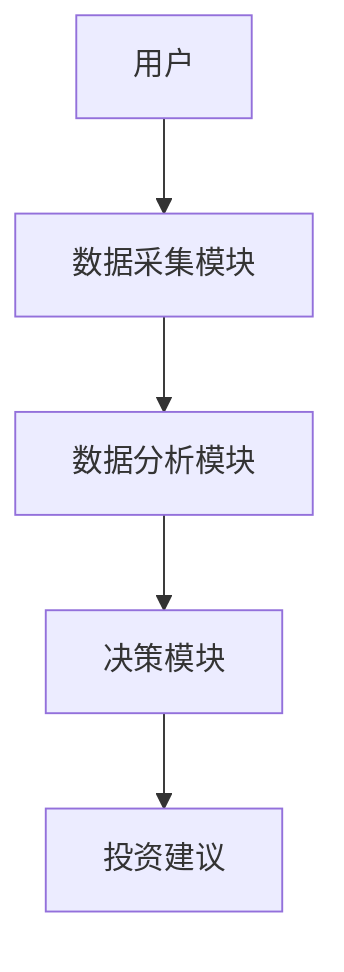

                 


# 《约翰·聂夫的反向投资理念》

## 关键词：反向投资，约翰·聂夫，投资策略，大数据分析，机器学习

## 摘要：本文探讨了约翰·聂夫的反向投资理念，结合投资哲学、策略、数学模型和系统架构，分析其在现代金融中的应用。通过技术手段辅助决策，揭示反向投资的深层逻辑。

---

## 第一部分：引言

### 第1章：反向投资的基本概念与背景

#### 1.1 投资的基本概念
- **投资定义**：指将资金投入特定资产，以期获得收益的行为。
- **投资分类**：包括股票、债券、房地产等多种形式。
- **反向投资**：在市场低迷时买入，市场繁荣时卖出，逆市场情绪操作。

#### 1.2 反向投资的背景与重要性
- **传统投资的局限性**：市场波动和情绪影响决策，传统方法难以捕捉低估机会。
- **反向投资的兴起**：基于价值发现，寻找市场忽视的标的，降低风险。

---

## 第二部分：约翰·聂夫的反向投资理论

### 第2章：约翰·聂夫的投资哲学

#### 2.1 聂夫的生平与成就
- **个人经历**：作为投资界的重要人物，聂夫以其长期投资策略闻名。
- **投资业绩**：长期跑赢市场，证明了反向投资的有效性。

#### 2.2 聂夫的反向投资策略
- **价值投资核心**：寻找基本面良好但被市场低估的股票。
- **独特方法**：结合定量分析，通过市盈率等指标筛选股票。

### 第3章：聂夫的投资策略与实践

#### 3.1 投资哲学的深度解析
- **长期视角**：强调耐心和纪律，避免短期波动干扰。
- **安全边际**：确保买入价格远低于内在价值，降低风险。

---

## 第三部分：反向投资的核心概念与联系

### 第4章：反向投资的核心概念

#### 4.1 市场行为分析
- **市场情绪**：贪婪和恐惧驱动市场，反向投资在市场恐慌时寻找机会。
- **市场周期**：识别市场的周期性波动，利用低谷期进行投资。

#### 4.2 投资者心理
- **认知偏差**：投资者常受心理影响，反向投资需克服这些偏差。
- **行为经济学**：理解投资者行为有助于制定有效策略。

#### 4.3 市场效率与无效性
- **市场有效理论**：反向投资基于市场无效性，寻找价格与价值偏差。
- **价值发现**：识别市场未充分反映的信息，抓住投资机会。

---

## 第四部分：反向投资的算法与数学模型

### 第5章：反向投资的算法原理

#### 5.1 简单反向投资模型
- **目标**：通过筛选低市盈率股票，寻找低估机会。
- **步骤**：
  1. 数据收集：获取股票的历史数据。
  2. 计算市盈率：使用公式（股价/每股收益）。
  3. 筛选股票：选择市盈率低于市场平均值的股票。

#### 5.2 基于大数据的筛选
- **数据收集**：利用网络爬虫获取股票数据。
- **数据预处理**：清洗数据，处理缺失值。
- **筛选逻辑**：设定多个筛选条件，如低市盈率、高股息率。

#### 5.3 代码实现
```python
import pandas as pd
import numpy as np

# 假设我们有一个包含股票数据的DataFrame df
# 包含'Price'和'Earnings'列

# 计算市盈率
df['PE Ratio'] = df['Price'] / df['Earnings']

# 筛选市盈率小于平均值的股票
average_pe = df['PE Ratio'].mean()
selected_stocks = df[df['PE Ratio'] < average_pe]
```

#### 5.4 数学模型
- **市盈率公式**：$ \text{PE Ratio} = \frac{\text{Price}}{\text{Earnings}} $
- **筛选条件**：$ \text{PE Ratio} < \text{Average PE} $

---

## 第五部分：系统分析与架构设计

### 第6章：反向投资分析系统的架构

#### 6.1 系统架构设计
- **模块划分**：
  - 数据采集模块：收集股票数据。
  - 数据分析模块：计算市盈率，筛选股票。
  - 决策模块：生成投资建议。

#### 6.2 Mermaid系统架构图


#### 6.3 接口与交互设计
- **API接口**：数据采集模块通过API获取数据。
- **用户交互**：用户输入筛选条件，系统输出建议。

---

## 第六部分：项目实战

### 第7章：反向投资实战

#### 7.1 项目环境与工具
- **工具安装**：安装Python、Pandas、BeautifulSoup等库。
- **数据来源**：使用Yahoo Finance API获取数据。

#### 7.2 核心代码实现
```python
import yfinance as yf
import pandas as pd

# 下载股票数据
tickers = ['AAPL', 'GOOGL']
data = yf.download(tickers, start='2020-01-01', end='2023-01-01')

# 计算市盈率
data['PE'] = data['Close'] / data['EPS']
```

#### 7.3 实战案例分析
- **选择股票**：筛选市盈率低于市场平均值的股票。
- **投资建议**：生成买入信号，提供投资组合建议。

---

## 第七部分：最佳实践与小结

### 第8章：最佳实践和注意事项

#### 8.1 最佳实践
- **长期视角**：保持耐心，避免频繁交易。
- **风险管理**：分散投资，控制仓位。
- **持续学习**：关注市场变化，更新策略。

#### 8.2 注意事项
- **数据准确性**：确保数据来源可靠。
- **市场变化**：定期重新评估投资组合。
- **情绪控制**：避免情绪化决策。

---

## 结论

反向投资是一种有效的投资策略，通过技术手段增强其科学性。本文结合约翰·聂夫的理论和现代技术，提供了系统的分析框架，帮助投资者在实践中应用反向投资理念。

---

## 作者信息

作者：AI天才研究院 & 禅与计算机程序设计艺术

--- 

这篇文章系统地探讨了约翰·聂夫的反向投资理念，结合了投资理论、技术方法和系统架构，为读者提供了全面的视角和实际应用指导。

