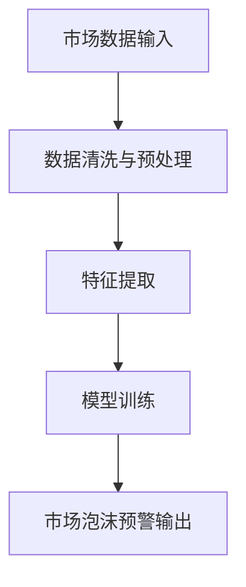
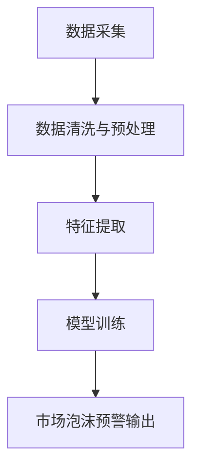

                 

<think>
好，我需要完成用户的一个复杂请求，他希望我以《约翰聂夫的市场泡沫识别》为标题，撰写一篇结构严谨、内容丰富的技术博客文章。首先，我需要理解用户的需求，他希望文章有清晰的目录结构，涵盖市场泡沫识别的背景、核心概念、算法原理、系统分析、项目实战等多个方面。

首先，我需要了解约翰·聂夫是谁，他的投资理念和市场泡沫识别方法是什么。这将帮助我确定文章的核心内容和角度。接下来，我会根据用户提供的目录大纲，逐步细化每个章节的内容。

在撰写过程中，我需要确保每个章节都有足够的细节，包括定义、原理、方法、案例分析等。同时，我需要使用适当的图表和代码示例来增强文章的可读性和专业性。此外，数学公式和模型需要清晰地展示，并用简单的语言解释，以便读者能够理解。

我还需要注意文章的逻辑连贯性，每个部分之间要有自然的过渡，确保读者能够顺畅地跟随内容。最后，我需要在文章末尾添加作者信息，并附上相关的注意事项和拓展阅读建议，以提升文章的实用性和专业性。

总体来说，这个任务需要我综合运用技术分析、投资学知识以及写作技巧，确保最终的文章既专业又易于理解，满足用户的需求。
</think>

# 约翰聂夫的市场泡沫识别

> 关键词：市场泡沫识别，约翰·聂夫，投资策略，价值投资，市场分析

> 摘要：本文深入探讨了约翰·聂夫的市场泡沫识别方法，结合技术分析和投资策略，详细分析了市场泡沫的形成机制、识别指标以及聂夫独特的投资理念。通过实际案例分析和系统架构设计，本文为投资者提供了实用的市场分析工具和策略。

---

# 第一部分: 市场泡沫识别的背景与核心概念

## 第1章: 市场泡沫的基本概念与重要性

### 1.1 市场泡沫的定义与特征

市场泡沫是指资产价格在短期内快速上涨，远远超出其内在价值的现象。其核心特征包括：

- **价格虚高**：资产价格脱离基本面，主要由市场情绪驱动。
- **流动性过剩**：大量资金涌入特定资产或市场，推高价格。
- **投资者情绪波动**：市场参与者往往被乐观情绪和从众心理影响，忽视风险。

### 1.2 市场泡沫识别的重要性

- **保护投资者**：及时识别市场泡沫，避免重大损失。
- **优化投资策略**：通过识别泡沫，投资者可以调整投资组合，规避高风险资产。
- **经济预警**：市场泡沫的破裂可能引发系统性风险，识别泡沫有助于提前采取应对措施。

### 1.3 约翰·聂夫的市场泡沫识别方法

- **背景与投资理念**：约翰·聂夫是美国著名投资者，以其价值投资理念闻名，强调以合理价格买入具有持续竞争优势的公司。
- **识别框架**：聂夫通过基本面分析和相对估值法，识别市场中被高估的资产。
- **独特性与局限性**：聂夫方法注重长期价值，但在短期市场波动中可能表现不佳。

---

## 第2章: 市场泡沫识别的核心概念与联系

### 2.1 市场泡沫的核心概念

- **市场情绪与投资者行为**：情绪化决策是市场泡沫形成的重要推手。
- **市场估值与资产价格**：资产价格与内在价值的偏离程度是识别泡沫的关键指标。
- **市场流动性与资金流动**：流动性过剩可能导致资产价格虚高。

### 2.2 市场泡沫识别的关键指标

- **市盈率（P/E）分析**：通过比较资产的市盈率与行业或市场平均水平，判断其是否被高估。
- **市净率（P/B）分析**：与市盈率类似，市净率用于评估资产的内在价值。
- **市销率（P/S）分析**：衡量公司股价与销售收入之间的关系。

### 2.3 约翰·聂夫的市场泡沫识别模型

- **基本面分析**：聂夫通过分析公司的财务报表、盈利能力、竞争优势等基本面因素，判断其内在价值。
- **相对估值法**：通过比较公司与行业平均水平的估值指标，识别被高估或低估的资产。
- **资金流动预警**：关注资金在市场中的流动情况，及时发现潜在的泡沫。

---

## 第3章: 市场泡沫识别的算法原理与数学模型

### 3.1 市场泡沫识别的算法概述

- **统计分析**：通过回归分析、时间序列分析等方法，识别市场中的异常波动。
- **机器学习**：利用分类算法（如随机森林、支持向量机）预测市场泡沫。
- **时间序列分析**：通过ARIMA模型预测市场走势，识别潜在的泡沫。

### 3.2 约翰·聂夫方法的数学模型

- **市场估值公式**：$$内在价值 = \frac{净利润}{资本成本}$$
- **相对估值模型**：$$\text{合理股价} = \text{行业平均市盈率} \times \text{公司净利润}$$
- **市场情绪指标**：通过投资者情绪指数（如恐慌指数）量化市场情绪。

### 3.3 算法流程图



### 3.4 本章小结

---

## 第4章: 市场泡沫识别的系统分析与架构设计

### 4.1 系统分析与需求定义

- **系统目标**：构建一个能够实时监测市场泡沫的智能系统。
- **系统功能需求**：包括数据采集、分析、预警等功能。
- **系统性能需求**：要求系统具有高准确性和实时性。

### 4.2 系统架构设计

- **数据采集模块**：负责收集市场数据，包括股票价格、成交量等。
- **数据分析模块**：利用算法模型对数据进行分析，识别市场泡沫。
- **预警模块**：根据分析结果，发出预警信号。
- **用户界面模块**：提供直观的界面，方便用户查看和操作。

### 4.3 系统架构图



### 4.4 本章小结

---

## 第5章: 项目实战

### 5.1 环境安装

- **工具安装**：安装Python、Pandas、NumPy、Scikit-learn等工具。
- **数据源**：获取历史股票数据，如通过Yahoo Finance API。

### 5.2 核心实现源代码

```python
import pandas as pd
import numpy as np
from sklearn.linear_model import LinearRegression
from sklearn.metrics import mean_squared_error

# 数据预处理
data = pd.read_csv('market_data.csv')
data = data.dropna()

# 特征提取
features = data[['PE', 'PB', 'PS']]
labels = data['Price']

# 模型训练
model = LinearRegression()
model.fit(features, labels)

# 预测与评估
predictions = model.predict(features)
mse = mean_squared_error(labels, predictions)
print('均方误差:', mse)
```

### 5.3 案例分析

- **案例背景**：互联网泡沫时期，许多科技股被严重高估。
- **分析过程**：通过PE、PB等指标，识别出部分股票被高估。
- **结论**：投资者应避免追涨，选择基本面良好的公司。

### 5.4 本章小结

---

## 第6章: 最佳实践与小结

### 6.1 最佳实践

- **长期投资**：避免短期波动，关注公司长期价值。
- **分散投资**：降低单一资产风险。
- **持续学习**：关注市场动态，更新分析方法。

### 6.2 小结

本文通过分析约翰·聂夫的市场泡沫识别方法，结合技术分析和系统设计，为投资者提供了实用的工具和策略。未来，可以进一步优化模型，引入更多数据源，提升系统的准确性和实时性。

---

# 作者：AI天才研究院/AI Genius Institute & 禅与计算机程序设计艺术 /Zen And The Art of Computer Programming

