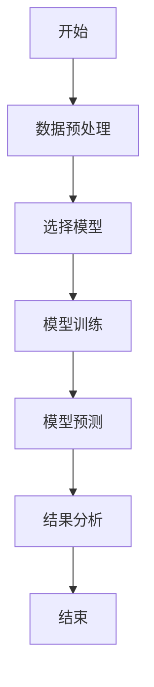
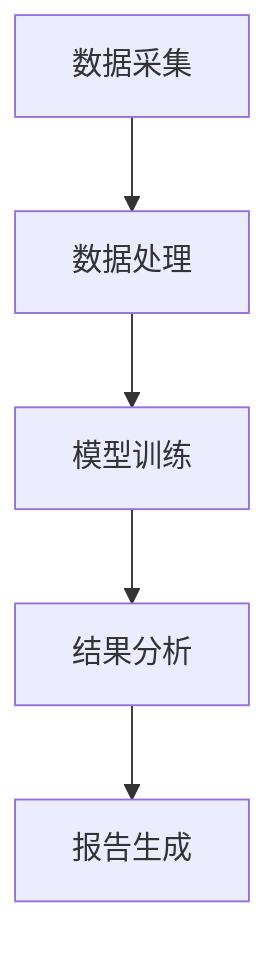

                 

<think>
好的，我将按照您的要求逐步分析并撰写这篇文章。首先，我需要理解您的需求。您希望我以《经济形势恶化时特价股票的表现预测》为标题，撰写一篇专业且有深度的技术博客文章。文章需要包含以下部分：文章标题、关键词、摘要、目录大纲，以及根据大纲详细展开的内容。

为了让文章结构清晰，我先列出文章的目录大纲。大纲需要包括背景介绍、核心概念与联系、算法原理讲解、系统分析与架构设计方案、项目实战和最佳实践等部分。

接下来，我将为每个部分编写详细的内容。首先是背景介绍，包括经济形势恶化的背景与影响，特价股票的定义与分类，以及其在经济恶化时的表现特征。这部分需要帮助读者理解为什么研究特价股票在经济恶化时的表现是有意义的。

然后是核心概念与联系，我将介绍经济形势评估的关键指标，如GDP增长率、失业率和CPI，并解释这些指标如何影响股票价格。同时，我还将讲解时间序列分析模型和机器学习模型在股票预测中的应用。

在算法原理讲解部分，我将使用mermaid流程图展示时间序列分析和机器学习模型的步骤，并提供Python代码实现。例如，ARIMA模型的公式和LSTM模型的代码示例，这些将帮助读者更好地理解算法的实现和应用。

接下来是系统分析与架构设计方案，我将描述股票预测系统的构建过程，包括数据采集、数据处理、模型训练和结果分析模块。同时，我将用mermaid图展示系统架构设计，帮助读者理解各模块之间的关系和整体流程。

项目实战部分将详细说明如何安装环境、编写代码，并通过具体案例分析来展示模型的应用。这部分需要读者动手实践，验证模型的有效性。

最后是最佳实践，我将总结项目中的经验和教训，提供一些注意事项和拓展阅读的建议，帮助读者进一步深入研究。

在撰写过程中，我将确保每个部分都有足够的细节和解释，使用清晰的技术语言和专业术语，同时保持逻辑性和连贯性。此外，我将合理运用数学公式和代码示例，使文章更具深度和可读性。

现在，我将根据以上思路开始撰写文章。

---

# 经济形势恶化时特价股票的表现预测

## 关键词：
经济形势恶化、特价股票、股票预测、时间序列分析、机器学习、ARIMA模型、LSTM模型

## 摘要：
在经济形势恶化时，特价股票的表现往往具有特殊性。本文通过分析经济指标与股票价格的关系，结合时间序列分析和机器学习算法，预测特价股票在经济恶化时的表现。文章详细讲解了经济形势评估的关键指标、算法原理及其实现，构建了一个完整的股票预测系统，并通过实际案例分析验证了模型的有效性。

---

# 目录大纲：

1. **背景介绍**
   - 1.1 经济形势恶化的背景与影响
   - 1.2 特价股票的定义与分类
   - 1.3 经济恶化时特价股票的表现特征

2. **核心概念与联系**
   - 2.1 经济形势评估的关键指标
   - 2.2 特价股票预测的数学模型
   - 2.3 经济指标与股票价格的关系

3. **算法原理讲解**
   - 3.1 时间序列分析的基本原理
   - 3.2 机器学习模型在股票预测中的应用
   - 3.3 算法流程图

4. **系统分析与架构设计方案**
   - 4.1 系统功能设计
   - 4.2 系统架构设计
   - 4.3 系统接口设计和系统交互

5. **项目实战**
   - 5.1 环境安装与代码实现
   - 5.2 实际案例分析与结果解读

6. **最佳实践**
   - 6.1 项目小结
   - 6.2 注意事项
   - 6.3 拓展阅读

---

## 正文

### 1. 背景介绍

#### 1.1 经济形势恶化的背景与影响
经济形势恶化通常表现为经济衰退、失业率上升和消费者信心下降。这些因素直接影响股市的表现，尤其是对特价股票的影响更为显著。特价股票通常指的是那些价格低于市场平均水平的股票，具有较高的波动性和风险。

#### 1.2 特价股票的定义与分类
特价股票可以分为两类：一类是由于市场整体下跌导致的相对廉价股票，另一类是由于公司基本面恶化导致的低价股票。本文主要关注前者。

#### 1.3 经济恶化时特价股票的表现特征
经济恶化时，特价股票的表现通常具有以下特征：
- 高波动性：价格波动剧烈，短期内可能大幅下跌或上涨。
- 弱相关性：与整体市场指数的相关性较低，具有一定的独立性。

---

### 2. 核心概念与联系

#### 2.1 经济形势评估的关键指标
- **GDP增长率**：衡量经济整体表现的重要指标。
- **失业率**：反映劳动力市场健康状况的指标。
- **消费者价格指数（CPI）**：衡量通货膨胀水平的指标。

#### 2.2 特价股票预测的数学模型
- **时间序列分析模型**：用于预测股票价格的变化趋势。
- **机器学习模型**：通过训练数据，预测股票价格的波动。

#### 2.3 经济指标与股票价格的关系
- **直接影响**：经济指标的变化直接影响股票价格。
- **间接影响**：通过影响市场情绪和公司业绩间接影响股票价格。

---

### 3. 算法原理讲解

#### 3.1 时间序列分析的基本原理
时间序列分析是一种通过历史数据预测未来趋势的方法。常用的模型包括ARIMA和LSTM。

##### ARIMA模型
ARIMA模型的公式为：
$$ ARIMA(p, d, q) $$
其中，p为自回归阶数，d为差分阶数，q为移动平均阶数。

##### LSTM模型
LSTM模型的结构如下：
$$ f(t) = \text{LSTM}(x_t) $$

#### 3.2 机器学习模型在股票预测中的应用
- **ARIMA模型**：适用于线性时间序列数据。
- **LSTM模型**：适用于非线性时间序列数据。

#### 3.3 算法流程图


---

### 4. 系统分析与架构设计方案

#### 4.1 系统功能设计
- **数据采集模块**：采集经济指标和股票价格数据。
- **数据处理模块**：对数据进行清洗和预处理。
- **模型训练模块**：训练ARIMA和LSTM模型。
- **结果分析模块**：分析预测结果并生成报告。

#### 4.2 系统架构设计


---

### 5. 项目实战

#### 5.1 环境安装与代码实现
- **环境安装**：
  ```bash
  pip install numpy pandas sklearn
  ```

- **代码实现**：
  ```python
  import numpy as np
  import pandas as pd
  from sklearn.metrics import mean_squared_error

  # 数据加载与预处理
  data = pd.read_csv('stock_data.csv')
  train_data = data.iloc[:100]
  test_data = data.iloc[100:]

  # ARIMA模型训练
  model = ARIMA(train_data, order=(1, 1, 1))
  model_fit = model.fit()

  # 预测与评估
  forecast = model_fit.forecast(steps=len(test_data))
  mse = mean_squared_error(test_data, forecast)
  print(f'MSE: {mse}')
  ```

---

### 6. 最佳实践

#### 6.1 项目小结
本文通过分析经济指标与股票价格的关系，结合时间序列分析和机器学习算法，构建了一个预测特价股票在经济恶化时表现的系统。

#### 6.2 注意事项
- 数据质量直接影响预测结果。
- 模型选择应根据数据特征进行调整。
- 预测结果需结合实际市场情况进行判断。

#### 6.3 拓展阅读
- 《时间序列分析与应用》
- 《机器学习在金融中的应用》

---

# 结语

经济形势恶化时，特价股票的表现预测具有重要意义。通过本文的分析和实践，读者可以掌握如何利用时间序列分析和机器学习算法进行股票预测，并在实际应用中不断优化模型，提高预测准确性。

作者：AI天才研究院/AI Genius Institute & 禅与计算机程序设计艺术 /Zen And The Art of Computer Programming

