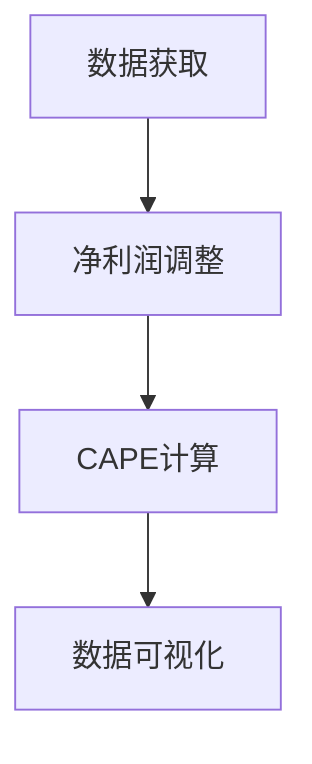
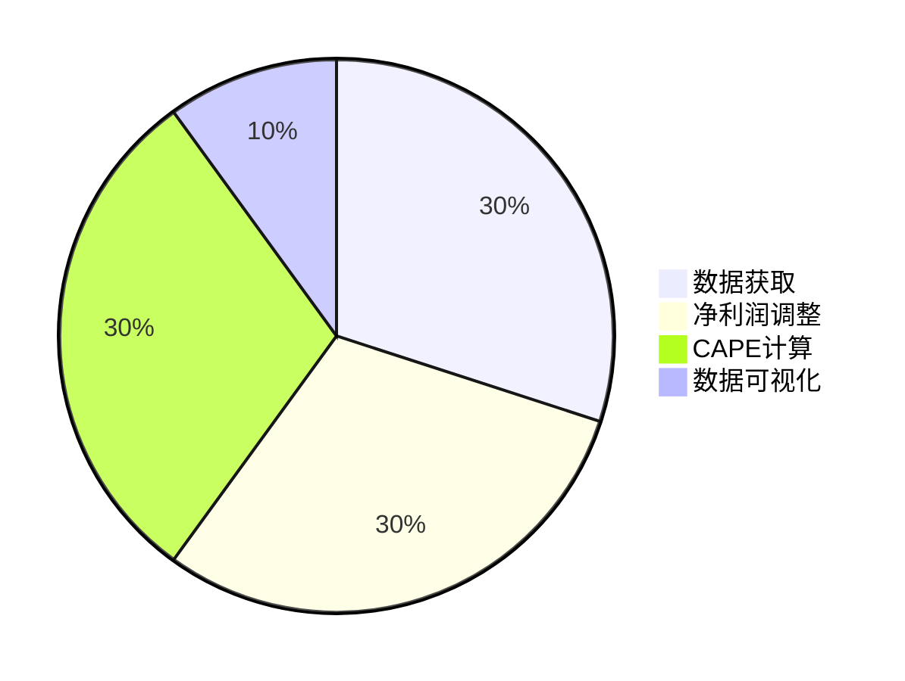
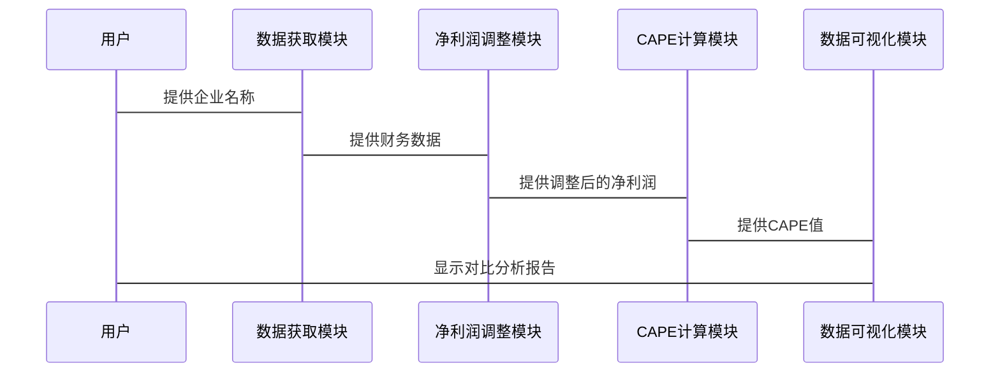

                 


# 罗伯特·希勒的周期调整市盈率：长期价值投资的指标

> 关键词：周期调整市盈率、CAPE、罗伯特·希勒、长期价值投资、市盈率指标、股市估值、投资策略

> 摘要：本文深入探讨了罗伯特·希勒提出的周期调整市盈率（CAPE）指标，分析其在长期价值投资中的重要性。通过背景介绍、数学模型、系统设计和实际案例，本文详细讲解了CAPE的计算方法、与其他市盈率指标的对比、以及在投资决策中的应用。读者将了解如何利用CAPE评估股市估值，制定有效的投资策略。

---

## 第一部分：周期调整市盈率的背景与意义

### 第1章：周期调整市盈率（CAPE）的背景与意义

#### 1.1 罗伯特·希勒与周期调整市盈率的提出

##### 1.1.1 罗伯特·希勒的学术背景与贡献

罗伯特·希勒（Robert Shiller）是耶鲁大学的著名经济学家，以其在金融市场和行为经济学领域的研究闻名。他于2013年获得诺贝尔经济学奖，部分原因在于他对金融市场波动性和长期投资的研究。希勒提出了多个重要的金融指标，其中最具影响力的是周期调整市盈率（CAPE），该指标旨在更准确地评估股市的长期价值。

##### 1.1.2 市场波动与长期价值评估的挑战

传统市盈率（P/E）是衡量股票价值的基本指标，但它在面对市场周期性波动时存在局限性。例如，在市场繁荣时期，市盈率可能被高估；而在市场低迷时期，市盈率可能被低估。这些波动使得市盈率难以准确反映企业的长期价值。因此，希勒提出了周期调整市盈率（CAPE），以更全面地评估股市的长期估值。

##### 1.1.3 周期调整市盈率的提出动机

希勒认为，传统市盈率未能充分考虑企业盈利的周期性波动，因此他提出CAPE，通过调整净利润和长期国债收益率，来更准确地评估股市的长期估值。CAPE的核心思想是将企业的盈利调整到一个更稳定的水平，从而减少周期性波动对估值的影响。

#### 1.2 市盈率的传统定义与局限性

##### 1.2.1 市盈率的基本概念

市盈率（P/E）是股票价格与每股收益（EPS）的比率，用于衡量投资者为每一块钱利润愿意支付的价格。市盈率低通常意味着股票被低估，而市盈率高则可能意味着股票被高估。

##### 1.2.2 传统市盈率在周期性波动中的局限性

传统市盈率的局限性主要体现在其对周期性波动的敏感性上。例如，在经济衰退期间，企业利润可能大幅下降，导致市盈率升高，但这并不一定反映企业的长期盈利能力。因此，市盈率在短期波动中可能无法准确反映企业的长期价值。

##### 1.2.3 市场周期对估值的影响

市场周期对市盈率的影响是显著的。在市场繁荣时期，投资者可能过于乐观，导致市盈率偏高；而在市场低迷时期，投资者可能过于悲观，导致市盈率偏低。因此，传统市盈率难以捕捉企业的长期价值，尤其是在市场周期性波动的影响下。

#### 1.3 周期调整市盈率的核心概念与优势

##### 1.3.1 周期调整市盈率的定义

周期调整市盈率（CAPE）是通过将企业的净利润调整到一个更稳定的时间跨度（通常是10年平均），然后除以当前股价，得到的一个指标。CAPE的公式为：

$$
CAPE = \frac{\text{平均净利润（过去10年）}}{\text{当前股价}}
$$

##### 1.3.2 市盈率周期调整的必要性

CAPE的提出旨在弥补传统市盈率的局限性，通过调整净利润的时间跨度，减少短期波动对估值的影响，从而更准确地反映企业的长期价值。

##### 1.3.3 周期调整市盈率的优势与应用场景

CAPE的优势在于其能够更全面地反映企业的长期盈利能力，适用于长期价值投资和市场估值分析。它尤其适用于评估股市的整体估值，帮助投资者制定长期投资策略。

---

## 第二部分：周期调整市盈率的数学模型与计算方法

### 第2章：周期调整市盈率的数学模型与计算方法

#### 2.1 市盈率的周期性调整原理

##### 2.1.1 市盈率的周期性波动分析

市盈率在经济周期中的波动性是显著的。在繁荣时期，市盈率可能偏高；而在衰退时期，市盈率可能偏低。这种波动性使得传统市盈率难以准确反映企业的长期价值。

##### 2.1.2 市盈率调整的基本思路

CAPE的核心思想是将企业的净利润调整到一个更稳定的时间跨度，通常是过去10年的平均净利润。这种方法可以减少短期波动对估值的影响，从而更准确地反映企业的长期盈利能力。

##### 2.1.3 市盈率周期调整的数学模型

周期调整市盈率的数学模型如下：

$$
CAPE = \frac{\text{平均净利润（过去10年）}}{\text{当前股价}}
$$

其中，平均净利润是过去10年的净利润的平均值。

#### 2.2 周期调整市盈率的计算公式

##### 2.2.1 市盈率的计算公式

传统市盈率的计算公式为：

$$
\text{市盈率} = \frac{\text{股价}}{\text{每股收益（EPS）}}
$$

##### 2.2.2 周期调整市盈率的数学推导

周期调整市盈率通过调整净利润的时间跨度，将其扩展到过去10年的平均净利润，从而得到一个更稳定的净利润值。公式如下：

$$
\text{平均净利润} = \frac{\sum_{i=1}^{10} \text{净利润}_i}{10}
$$

然后，周期调整市盈率的计算公式为：

$$
CAPE = \frac{\text{平均净利润}}{\text{当前股价}}
$$

##### 2.2.3 示例计算与实际应用

假设某公司过去10年的净利润分别为10, 12, 8, 15, 10, 12, 9, 13, 11, 14（单位：百万美元），当前股价为50美元。则平均净利润为：

$$
\text{平均净利润} = \frac{10 + 12 + 8 + 15 + 10 + 12 + 9 + 13 + 11 + 14}{10} = 11.4 \text{百万美元}
$$

周期调整市盈率为：

$$
CAPE = \frac{11.4}{50} = 0.228
$$

这意味着该公司的周期调整市盈率为0.228，可能被认为是低估（如果CAPE低于历史平均水平）。

---

## 第三部分：周期调整市盈率与传统市盈率的对比分析

### 第3章：周期调整市盈率与传统市盈率的对比分析

#### 3.1 市盈率与周期调整市盈率的定义对比

##### 3.1.1 传统市盈率的定义与计算

传统市盈率的计算公式为：

$$
\text{市盈率} = \frac{\text{股价}}{\text{每股收益（EPS）}}
$$

##### 3.1.2 周期调整市盈率的定义与计算

周期调整市盈率的计算公式为：

$$
CAPE = \frac{\text{平均净利润（过去10年）}}{\text{当前股价}}
$$

##### 3.1.3 两者的区别与联系

两者的区别主要在于净利润的时间跨度。传统市盈率使用的是最近一个季度或一年的净利润，而周期调整市盈率使用的是过去10年的平均净利润。因此，CAPE更能反映企业的长期盈利能力。

#### 3.2 市盈率与周期调整市盈率的优缺点对比

##### 3.2.1 传统市盈率的优点与局限性

优点：
- 计算简单，易于理解和应用。
- 反映企业的短期盈利能力。

局限性：
- 容易受到短期市场波动的影响。
- 未能充分反映企业的长期盈利能力。

##### 3.2.2 周期调整市盈率的优点与局限性

优点：
- 能够反映企业的长期盈利能力。
- 减少了短期波动对估值的影响。

局限性：
- 计算较为复杂，需要考虑过去10年的净利润。
- 对于成立不足10年的企业，可能不适用。

##### 3.2.3 适用场景的对比分析

传统市盈率适用于短期投资决策，而周期调整市盈率适用于长期价值投资和市场估值分析。

#### 3.3 市盈率与周期调整市盈率的实证分析

##### 3.3.1 历史数据的实证对比

通过历史数据分析，可以发现CAPE在长期市场估值分析中表现更为稳定，而传统市盈率在短期波动中可能波动较大。

##### 3.3.2 不同市场的对比分析

在不同市场环境下，CAPE和传统市盈率的表现可能有所不同。例如，在市场繁荣时期，CAPE可能更能反映市场的高估，而在市场低迷时期，CAPE可能更能反映市场的低估。

##### 3.3.3 实证结果与投资策略

实证分析表明，CAPE能够更准确地预测市场长期走势，而传统市盈率在短期波动中可能误导投资者。

---

## 第四部分：周期调整市盈率的系统分析与架构设计

### 第4章：周期调整市盈率的系统分析与架构设计

#### 4.1 系统功能设计

##### 4.1.1 系统目标

系统目标是基于CAPE指标，提供市场估值分析和投资决策支持。

##### 4.1.2 功能模块

- 数据获取模块：获取企业的财务数据和股价数据。
- 净利润调整模块：计算过去10年的平均净利润。
- CAPE计算模块：计算周期调整市盈率。
- 数据可视化模块：展示CAPE与传统市盈率的对比分析。

##### 4.1.3 系统流程图



#### 4.2 系统架构设计

##### 4.2.1 系统架构图



#### 4.3 系统接口设计

##### 4.3.1 数据接口

- 输入接口：企业的财务数据和股价数据。
- 输出接口：周期调整市盈率和传统市盈率的对比分析结果。

##### 4.3.2 用户接口

- 用户输入：选择企业名称和时间范围。
- 用户输出：CAPE与传统市盈率的对比分析报告。

#### 4.4 系统交互流程

##### 4.4.1 交互流程图



---

## 第五部分：周期调整市盈率的项目实战

### 第5章：周期调整市盈率的项目实战

#### 5.1 环境安装与配置

##### 5.1.1 安装Python环境

需要安装Python 3.8及以上版本，并安装以下库：

```bash
pip install pandas numpy matplotlib
```

##### 5.1.2 数据获取工具

使用Yahoo Finance API获取股票数据和财务数据。

#### 5.2 系统核心实现源代码

##### 5.2.1 净利润调整模块

```python
import pandas as pd

def calculate_average_profit(profits):
    return sum(profits) / len(profits)

profits = [10, 12, 8, 15, 10, 12, 9, 13, 11, 14]
average_profit = calculate_average_profit(profits)
print(f"平均净利润: {average_profit}")
```

##### 5.2.2 CAPE计算模块

```python
def calculate_cape(average_profit, stock_price):
    return average_profit / stock_price

stock_price = 50
cape = calculate_cape(average_profit, stock_price)
print(f"周期调整市盈率: {cape}")
```

##### 5.2.3 数据可视化模块

```python
import matplotlib.pyplot as plt

traditional_pe = stock_price / 12  # 假设每股收益为12
cape_value = average_profit / stock_price

plt.bar(["传统市盈率", "周期调整市盈率"], [traditional_pe, cape_value])
plt.ylabel("市盈率")
plt.title("市盈率对比分析")
plt.show()
```

#### 5.3 代码应用解读与分析

##### 5.3.1 净利润调整模块

上述代码计算了过去10年的平均净利润，为CAPE的计算提供了基础数据。

##### 5.3.2 CAPE计算模块

该模块将调整后的净利润除以当前股价，得到周期调整市盈率，帮助投资者评估股市的长期估值。

##### 5.3.3 数据可视化模块

通过对比传统市盈率和周期调整市盈率的柱状图，投资者可以直观地看到两种指标的差异，从而做出更明智的投资决策。

#### 5.4 实际案例分析

##### 5.4.1 案例背景

假设某公司过去10年的净利润为10, 12, 8, 15, 10, 12, 9, 13, 11, 14（百万美元），当前股价为50美元。

##### 5.4.2 计算步骤

1. 计算平均净利润：11.4百万美元
2. 计算周期调整市盈率：11.4 / 50 = 0.228
3. 计算传统市盈率：假设每股收益为12美元，传统市盈率为50 / 12 ≈ 4.17

##### 5.4.3 对比分析

通过对比分析，可以发现周期调整市盈率（0.228）远低于传统市盈率（4.17），这可能表明市场被高估，投资者应谨慎。

#### 5.5 项目小结

通过本项目，读者可以学会如何利用Python代码计算周期调整市盈率，并通过数据可视化工具对比分析传统市盈率和周期调整市盈率的差异，从而制定更有效的投资策略。

---

## 第六部分：周期调整市盈率的最佳实践与小结

### 第6章：周期调整市盈率的最佳实践与小结

#### 6.1 最佳实践

##### 6.1.1 定期更新数据

由于市场环境不断变化，投资者应定期更新财务数据和股价数据，以确保CAPE计算的准确性。

##### 6.1.2 结合其他指标

CAPE应与其他估值指标（如市净率、股息率等）结合使用，以更全面地评估企业的长期价值。

##### 6.1.3 长期投资视角

由于CAPE主要适用于长期价值投资，投资者应从长期视角出发，避免短期市场波动的干扰。

#### 6.2 小结

周期调整市盈率（CAPE）是评估股市长期价值的重要指标，通过调整净利润的时间跨度，减少了短期波动对估值的影响。本文详细讲解了CAPE的背景、计算方法、与其他市盈率的对比、系统设计和实际应用，帮助投资者更好地理解和应用CAPE。

---

## 参考文献

1. 希勒, R. (2013). 《非理性繁荣》（第三版）. Princeton University Press.
2. 罗伯特·希勒官方网站. (n.d.). [周期调整市盈率](https://www robertshiller.com/). Retrieved from https://www.robertshiller.com/

---

## 作者

作者：AI天才研究院/AI Genius Institute & 禅与计算机程序设计艺术 /Zen And The Art of Computer Programming

