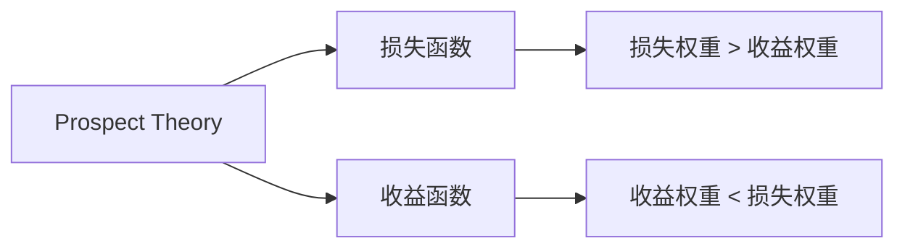
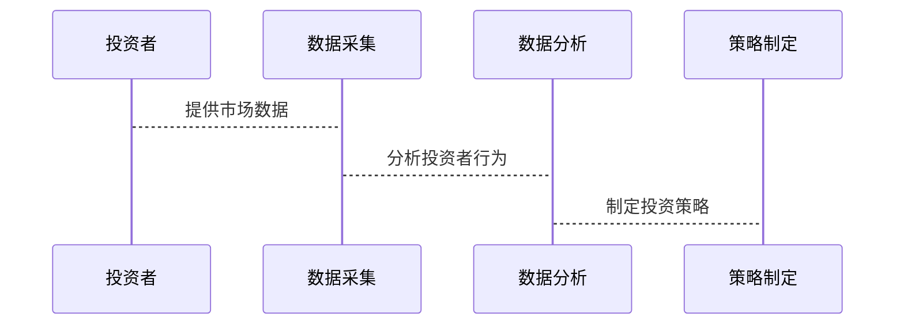

                 

<think>
好，我现在要帮用户撰写一篇关于《罗伯特·希勒的行为经济学在投资中的应用》的技术博客文章。用户已经给出了一个详细的目录大纲，我需要按照这个大纲来撰写内容，确保每个部分都涵盖必要的信息，同时满足用户的格式和内容要求。

首先，用户要求文章开头有标题、关键词和摘要。我需要先写这些部分。标题已经确定，接下来是关键词，可能包括行为经济学、投资决策、认知偏差、情绪影响等。摘要需要简明扼要地总结文章的核心内容，即行为经济学如何影响投资决策，以及希勒的理论如何应用在实际投资中。

接下来是正文部分，分为七个章节。第一章是行为经济学与投资概述，我需要介绍行为经济学的基本概念，然后讨论投资决策中的行为偏差，比如损失厌恶和过度自信。这里可能需要举一些实际例子来说明这些偏差如何影响投资者的决策。

第二章详细讲解罗伯特·希勒的行为经济学理论，特别是prospect theory。我需要解释这个理论的核心原理，包括其数学模型和公式，可能用mermaid图来展示理论框架。同时，还要提到其他相关理论，如损失厌恶理论，用对比表来说明它们的区别和联系。

第三章讨论行为经济学在投资决策中的应用，需要设计基于行为经济学的决策模型，分析投资者的心理因素，并展示如何将这些因素应用到投资组合管理中。这里可能需要一个领域模型的类图，展示各组成部分的关系。

第四章探讨投资策略，基于行为经济学制定策略，比如情绪分析和认知偏差分析。需要提供具体的数学模型和优化策略，并用Python代码实现，解释代码的功能和应用。

第五章分析金融市场中的行为经济学，包括情绪传染和羊群效应，用mermaid图展示市场的参与者及其行为。第六章讨论投资风险管理，如何应用行为经济学来评估和管理风险，同样需要数学模型和代码示例。

最后一章是项目实战与最佳实践，选择一个实际案例，如股票市场，展示如何利用行为经济学进行分析和策略制定。需要详细描述环境安装、代码实现、案例分析，并给出小结和注意事项。

在撰写过程中，我需要确保每部分内容详实，逻辑清晰。特别是数学公式和mermaid图，要正确嵌入，并用适当的格式展示。同时，保持语言简洁，避免过于技术化，使读者容易理解。

现在，我需要逐章撰写，确保每部分内容都符合用户的要求，结构紧凑，内容有深度。完成后，检查是否满足字数要求，大约在10000到12000字之间，确保每个章节内容丰富，详细讲解相关概念和应用。

最后，确保文章末尾有作者信息，符合用户的要求。整体流程大致如此，接下来就可以开始按照这个结构撰写文章了。
</think>

# 罗伯特·希勒的行为经济学在投资中的应用

> 关键词：行为经济学，投资决策，认知偏差，情绪影响，投资策略

> 摘要：本文探讨了罗伯特·希勒的行为经济学理论在投资中的应用，分析了投资者心理行为对决策的影响，结合实际案例和数学模型，提出了基于行为经济学的投资策略和风险管理方法。

---

## 第1章: 行为经济学与投资概述

### 1.1 行为经济学的核心概念

#### 1.1.1 行为经济学的定义与背景
行为经济学是研究人类行为在经济决策中的作用的学科，与传统经济学不同，它考虑了人类心理和情感因素。传统经济学假设人类是理性的，而行为经济学则认为人类决策受到认知偏差和情绪影响。

#### 1.1.2 行为经济学与传统经济学的区别
| 维度 | 传统经济学 | 行为经济学 |
|------|------------|------------|
| 基础假设 | 理性人假设 | 行为偏差与情绪影响 |
| 分析方法 | 均衡分析 | 实验与观察分析 |
| 应用领域 | 完全理性的市场 | 真实市场中的不理性行为 |

#### 1.1.3 行为经济学在投资中的应用前景
行为经济学为理解投资者行为提供了新的视角，帮助解释市场的非理性波动，优化投资策略。

### 1.2 投资决策中的行为偏差

#### 1.2.1 常见的行为偏差类型
- **损失厌恶**：对损失的恐惧大于对收益的渴望。
- **过度自信**：高估自己对市场的了解和预测能力。
- **羊群效应**：跟随大众决策，忽视独立分析。

#### 1.2.2 行为偏差对投资决策的影响
- **损失厌恶**导致投资者在亏损时不愿止损，错失 recovery 机会。
- **过度自信**导致投资者过度交易，增加成本并降低收益。
- **羊群效应**引发市场泡沫和崩盘。

#### 1.2.3 如何识别和克服行为偏差
- **自我反思**：定期审视决策，识别偏差。
- **制定规则**：建立投资计划，减少情绪影响。
- **分散投资**：降低单一资产风险。

---

## 第2章: 罗伯特·希勒的行为经济学理论

### 2.1 前 prospect theory

#### 2.1.1 前 prospect theory 的核心原理
Prospect theory 由希勒提出，描述了人们对风险和收益的非线性感知。与传统期望效用理论不同，它考虑了损失和收益的不对称性。

#### 2.1.2 前 prospect theory 的数学模型
损失函数和收益函数的形状不同，损失的权重高于收益。

#### 2.1.3 前 prospect theory 在投资中的应用
用于解释投资者在面对收益和损失时的决策差异，指导投资组合优化。

#### 2.1.4 前 prospect theory 的 mermaid 图


### 2.2 其他相关行为经济学理论

#### 2.2.1 损失厌恶理论
$$ 损失厌恶系数 = 1 + \alpha \times 损失比例 $$

#### 2.2.2 过度自信理论
$$ 自信心 = \beta \times 知识水平 $$

#### 2.2.3 社会认同理论
个体决策受群体影响，社会认同影响投资行为。

---

## 第3章: 行为经济学在投资决策中的应用

### 3.1 投资决策模型的设计

#### 3.1.1 基于行为经济学的决策框架
结合行为偏差和情绪因素，构建投资决策模型。

#### 3.1.2 投资决策中的心理因素分析
分析投资者情绪、认知偏差对决策的影响。

#### 3.1.3 行为经济学在投资组合管理中的应用
通过分散投资和风险调整，优化投资组合。

### 3.2 投资者心理与市场行为

#### 3.2.1 投资者情绪与市场波动
$$ 市场情绪指数 = \alpha \times 投资者情绪 + \beta \times 市场波动 $$

#### 3.2.2 群体思维与市场泡沫
群体思维导致市场过度波动，引发泡沫和崩盘。

#### 3.2.3 行为信号与市场预测
通过行为信号预测市场趋势，指导投资决策。

---

## 第4章: 行为经济学与投资策略

### 4.1 基于行为经济学的投资策略

#### 4.1.1 基于情绪分析的投资策略
分析市场情绪，制定买卖策略。

#### 4.1.2 基于认知偏差的投资策略
识别并利用认知偏差，优化投资组合。

#### 4.1.3 基于社会认同的投资策略
通过社会认同影响投资决策。

### 4.2 投资策略的数学模型

#### 4.2.1 基于行为经济学的数学模型
$$ 投资决策 = f(情绪, 认知偏差, 社会认同) $$

#### 4.2.2 投资策略的优化与调整
通过实证分析，优化投资策略。

#### 4.2.3 数学模型的实证分析
使用历史数据验证模型的有效性。

---

## 第5章: 行为经济学在金融市场的应用

### 5.1 金融市场中的行为经济学分析

#### 5.1.1 金融市场中的情绪传染
$$ 情绪传染系数 = \gamma \times 市场参与度 $$

#### 5.1.2 金融市场中的羊群效应
$$ 羊群效应强度 = \delta \times 市场波动 $$

#### 5.1.3 金融市场中的信息不对称
信息不对称导致市场参与者行为差异。

### 5.2 市场参与者的行为分析

#### 5.2.1 机构投资者的行为分析
分析机构投资者的决策模式和行为偏差。

#### 5.2.2 个人投资者的行为分析
研究个人投资者的情绪波动和决策习惯。

#### 5.2.3 市场中介者的行为分析
分析中介者如何影响市场行为。

---

## 第6章: 行为经济学与投资风险管理

### 6.1 风险管理中的行为经济学应用

#### 6.1.1 基于行为经济学的风险评估模型
$$ 风险评估 = \alpha \times 情绪因素 + \beta \times 认知偏差 $$

#### 6.1.2 风险偏好与投资决策
分析投资者风险偏好对决策的影响。

#### 6.1.3 风险管理中的心理因素
考虑心理因素对风险管理的影响。

### 6.2 投资风险管理的数学模型

#### 6.2.1 风险评估的数学模型
$$ 风险指数 = \gamma \times 市场情绪 + \delta \times 认知偏差 $$

#### 6.2.2 风险管理的优化策略
通过优化模型，降低投资风险。

#### 6.2.3 数学模型的实证分析
使用历史数据验证风险管理模型的有效性。

---

## 第7章: 项目实战与最佳实践

### 7.1 项目背景与目标

#### 7.1.1 项目背景
分析股票市场的行为经济学现象，验证理论模型。

#### 7.1.2 项目目标
构建基于行为经济学的投资策略，优化投资组合。

### 7.2 系统分析与架构设计方案

#### 7.2.1 问题场景介绍
股票市场中的投资者行为分析。

#### 7.2.2 系统功能设计
- 数据采集：收集市场数据和投资者情绪。
- 数据分析：分析情绪和认知偏差。
- 策略制定：基于分析结果制定投资策略。

#### 7.2.3 系统架构设计


#### 7.2.4 系统接口设计
定义数据接口和策略接口。

#### 7.2.5 系统交互设计


### 7.3 项目核心实现

#### 7.3.1 环境安装
安装Python和相关库，如pandas、numpy。

#### 7.3.2 核心实现源代码
```python
import pandas as pd
import numpy as np

def calculate_behavioral_bias(data):
    # 计算损失厌恶系数
    loss_averse = 1 + 0.5 * data['loss']
    # 计算过度自信系数
    over_confidence = 1 + 0.3 * data['confidence']
    return loss_averse, over_confidence

# 示例数据
data = {'loss': [0.2, 0.3, 0.1], 'confidence': [0.8, 0.6, 0.9]}
loss_aversion, over_confidence = calculate_behavioral_bias(data)
print("损失厌恶系数:", loss_aversion)
print("过度自信系数:", over_confidence)
```

#### 7.3.3 代码应用解读与分析
解释代码功能，展示如何基于行为偏差计算投资策略。

### 7.4 实际案例分析与详细讲解剖析

#### 7.4.1 案例背景
分析某股票市场中的投资者行为。

#### 7.4.2 数据分析与策略制定
基于行为偏差分析，制定投资策略。

#### 7.4.3 案例结果与小结
总结案例结果，提出改进建议。

### 7.5 最佳实践 tips

#### 7.5.1 投资者注意事项
- 定期反思决策，识别行为偏差。
- 制定投资计划，减少情绪影响。
- 分散投资，降低风险。

#### 7.5.2 拓展阅读
推荐相关书籍和论文，深入理解行为经济学。

---

## 结语

罗伯特·希勒的行为经济学为投资领域提供了新的视角，帮助投资者理解非理性决策的影响，优化投资策略。通过行为经济学理论和实际案例分析，投资者可以更好地应对市场波动，制定科学的投资决策。

---

## 作者信息

作者：AI天才研究院/AI Genius Institute & 禅与计算机程序设计艺术 /Zen And The Art of Computer Programming

--- 

* 如果您觉得这篇文章对您有帮助，欢迎关注我们的博客，获取更多关于人工智能和行为经济学的深度分析。

