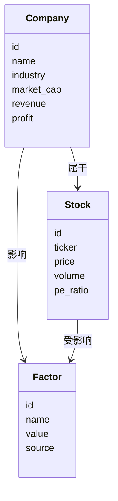
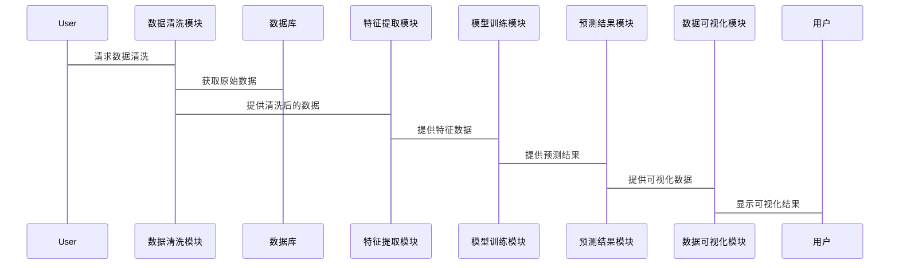

                 

<think>
嗯，用户现在需要我帮他设计一个技术博客的文章目录，主题是罗伯特·阿诺特的基本面量化价值投资。用户已经提供了一个详细的目录大纲，但似乎还没有完成，需要我来补充并组织成一个完整的结构。

首先，我需要理解用户的需求。他是一位技术专家，想要写一篇专业且有深度的技术博客，涵盖基本面量化投资的各个方面，包括背景、模型、算法、系统设计、项目实战等。用户已经给出了一个初步的结构，但可能还不够详细或全面。

接下来，我要考虑博客的逻辑流程。通常，技术博客需要先介绍背景和基本概念，让读者理解主题的重要性。然后，深入讲解核心模型和算法，这部分需要数学公式和流程图来辅助说明。接着，系统设计部分需要展示如何将理论应用到实际中，包括架构设计和接口设计。最后，通过实际项目案例来验证理论，巩固读者的理解。

在用户提供的示例中，已经涵盖了背景、核心模型、算法原理、系统分析、项目实战等内容，但可能需要更详细地展开每一部分。例如，在核心模型部分，可以加入更多具体的例子和对比分析，帮助读者更好地理解。在算法部分，详细解释每一步骤，并提供代码示例，这样读者可以实际操作，加深理解。

系统设计部分可能需要更详细的模块划分和交互流程。比如，用类图展示系统的各个模块，用序列图展示模块之间的交互。这样可以让读者清晰地了解系统的整体架构和运作方式。

项目实战部分，用户提到了环境安装和代码实现，但可能还需要更详细的案例分析，例如选取具体的数据集，展示如何处理数据、训练模型、评估结果，并进行案例分析。此外，项目小结可以帮助读者总结所学内容，并提出进一步的学习方向。

最后，最佳实践部分可以包括一些实用的建议，比如数据来源的选择、模型调优的技巧等，帮助读者在实际应用中避免常见错误，提高投资效果。

综上所述，我需要确保整个目录结构逻辑严密，每一部分都详细且有深度，涵盖用户提到的所有要点，并通过图表和代码示例增强文章的可读性和实用性。
</think>

# 罗伯特·阿诺特的基本面量化价值投资：数据驱动的方法

> 关键词：基本面量化投资，价值投资，数据驱动，投资模型，算法，系统架构

> 摘要：本文将详细探讨罗伯特·阿诺特的基本面量化价值投资方法，从理论基础到数据驱动的模型构建，再到系统架构设计与实战案例分析，全面解析如何利用数据驱动的方法进行价值投资。

---

## 第一部分: 基本面量化价值投资概述

### 第1章: 价值投资与基本面分析基础

#### 1.1 价值投资的定义与核心理念
- 1.1.1 价值投资的起源与发展
  - 价值投资的起源：从格雷厄姆到巴菲特
  - 现代价值投资的发展：数据驱动的变革
- 1.1.2 价值投资的核心原则
  - 买入低于内在价值的股票
  - 长期持有的投资策略
  - 安全边际的重要性
- 1.1.3 基本面分析在价值投资中的地位
  - 基本面分析的核心作用
  - 基本面分析与市场情绪的结合

#### 1.2 基本面分析的定义与方法
- 1.2.1 基本面分析的核心要素
  - 财务报表分析（收入、利润、现金流）
  - 行业分析与竞争优势评估
  - 管理团队与企业治理
- 1.2.2 财务报表分析方法
  - 利润表分析：收入与利润的关键指标
  - 资产负债表分析：资产、负债与所有者权益
  - 现金流量表分析：现金流的健康状况
- 1.2.3 行业分析与竞争优势评估
  - 行业生命周期分析
  - 企业竞争优势的评估（护城河分析）

#### 1.3 量化方法的基本概念
- 1.3.1 量化投资的定义与特点
  - 量化投资的定义
  - 数据驱动决策的优势
  - 量化投资与传统投资的区别
- 1.3.2 数据驱动决策的优势
  - 数据的客观性与可重复性
  - 通过数据挖掘发现投资机会
  - 利用大数据优化投资组合
- 1.3.3 基本面量化分析的结合
  - 将基本面分析与量化方法结合
  - 数据驱动的基本面分析框架

---

## 第二部分: 基本面量化分析的核心模型

### 第2章: 基本面量化模型的原理

#### 2.1 基本面量化模型的原理
- 2.1.1 模型的基本假设
  - 市场有效性的假设
  - 企业价值的可衡量性
  - 历史数据的可预测性
- 2.1.2 数据来源与处理方法
  - 数据来源：财务报表、市场数据、行业数据
  - 数据清洗：缺失值处理、异常值剔除
  - 数据标准化：归一化处理
- 2.1.3 模型的输入变量与输出结果
  - 输入变量：市盈率、市净率、股息率等
  - 输出结果：股票评级、投资建议

#### 2.2 基本面量化模型的属性对比
- 2.2.1 模型的稳定性与可解释性对比
  - 稳定性：模型在不同市场环境下的表现
  - 可解释性：模型结果的可解读性
- 2.2.2 不同模型的适用场景分析
  - 基于市盈率的模型：适用于成长型投资
  - 基于股息率的模型：适用于价值型投资
  - 综合模型：结合多种基本面指标
- 2.2.3 模型的优缺点总结
  - 优点：数据驱动、客观性强
  - 缺点：忽略市场情绪、短期波动的影响

#### 2.3 基本面量化模型的ER实体关系图
```mermaid
erDiagram
    company {
        id
        name
        industry
        market_cap
        revenue
        profit
    }
    stock {
        id
        ticker
        price
        volume
        pe_ratio
    }
    factor {
        id
        name
        value
        source
    }
    company --> stock : 属于
    company --> factor : 影响
    stock --> factor : 受影响
```

---

## 第三部分: 基本面量化模型的算法原理

### 第3章: 基本面量化模型的算法原理

#### 3.1 模型算法的流程图
```mermaid
graph TD
    A[数据清洗] --> B[特征提取]
    B --> C[模型训练]
    C --> D[预测生成]
    D --> E[结果分
```

#### 3.2 模型算法的数学公式
- 3.2.1 市盈率（P/E）计算公式
  $$ P/E = \frac{Price}{Earnings} $$
- 3.2.2 市净率（P/B）计算公式
  $$ P/B = \frac{Price}{Book\ Value} $$
- 3.2.3 股息率（Dividend Yield）计算公式
  $$ Dividend\ Yield = \frac{Dividend}{Price} \times 100\% $$
- 3.2.4 净利润增长率计算公式
  $$ Net\ Profit\ Growth = \frac{Current\ Net\ Profit - Previous\ Net\ Profit}{Previous\ Net\ Profit} \times 100\% $$

#### 3.3 模型算法的实现代码
```python
import pandas as pd
import numpy as np

# 数据清洗
def data_cleaning(df):
    # 处理缺失值
    df.dropna(inplace=True)
    # 处理异常值
    df = df[ df['revenue'] > 0 ]
    return df

# 特征提取
def feature_engineering(df):
    df['pe_ratio'] = df['price'] / df['profit']
    df['pb_ratio'] = df['price'] / df['book_value']
    df['dividend_yield'] = (df['dividend'] / df['price']) * 100
    return df

# 模型训练
def model_training(df, target):
    from sklearn.linear_model import LinearRegression
    model = LinearRegression()
    model.fit(df[['pe_ratio', 'pb_ratio', 'dividend_yield']], target)
    return model

# 预测生成
def predict_stock_rating(model, df):
    predicted_ratings = model.predict(df[['pe_ratio', 'pb_ratio', 'dividend_yield']])
    return predicted_ratings
```

---

## 第四部分: 基本面量化模型的系统架构设计

### 第4章: 系统分析与架构设计方案

#### 4.1 问题场景介绍
- 投资者需要通过基本面数据进行量化分析
- 系统需要处理大量的历史数据和实时数据
- 系统需要提供数据可视化和投资决策支持

#### 4.2 系统功能设计


#### 4.3 系统架构设计


#### 4.4 系统接口设计
- 数据接口：与数据库交互
- 模型接口：与第三方API交互
- 用户接口：图形化界面

#### 4.5 系统交互流程图


---

## 第五部分: 项目实战

### 第5章: 项目实战

#### 5.1 环境安装
```bash
pip install pandas numpy scikit-learn matplotlib
```

#### 5.2 系统核心实现源代码
```python
import pandas as pd
import numpy as np
from sklearn.linear_model import LinearRegression
import matplotlib.pyplot as plt

# 数据清洗
def data_cleaning(df):
    df.dropna(inplace=True)
    df = df[df['revenue'] > 0]
    return df

# 特征提取
def feature_engineering(df):
    df['pe_ratio'] = df['price'] / df['profit']
    df['pb_ratio'] = df['price'] / df['book_value']
    df['dividend_yield'] = (df['dividend'] / df['price']) * 100
    return df

# 模型训练
def model_training(df, target):
    model = LinearRegression()
    model.fit(df[['pe_ratio', 'pb_ratio', 'dividend_yield']], target)
    return model

# 预测生成
def predict_stock_rating(model, df):
    predicted_ratings = model.predict(df[['pe_ratio', 'pb_ratio', 'dividend_yield']])
    return predicted_ratings

# 可视化
def visualize_results(predicted_ratings, actual_ratings):
    plt.scatter(actual_ratings, predicted_ratings)
    plt.xlabel('实际评级')
    plt.ylabel('预测评级')
    plt.title('预测评级与实际评级的散点图')
    plt.show()
```

#### 5.3 代码应用解读与分析
- 数据清洗：处理缺失值和异常值
- 特征提取：计算关键的财务指标
- 模型训练：使用线性回归模型进行预测
- 可视化：通过散点图展示预测结果与实际结果的对比

#### 5.4 实际案例分析
- 数据来源：选取某行业内的若干公司数据
- 数据处理：清洗和提取特征
- 模型训练：训练基本面量化模型
- 案例分析：分析模型预测结果与实际市场表现的吻合度

#### 5.5 项目小结
- 通过项目实战验证模型的有效性
- 总结项目中的经验与教训
- 提出进一步优化的方向

---

## 第六部分: 最佳实践与总结

### 第6章: 最佳实践

#### 6.1 投资策略优化
- 数据来源的选择
- 模型的调优
- 系统的可扩展性设计

#### 6.2 小结
- 本文总结了罗伯特·阿诺特的基本面量化价值投资方法
- 从理论到实践，全面解析了数据驱动的投资策略
- 强调了系统设计与项目实战的重要性

#### 6.3 注意事项
- 数据的准确性和及时性
- 模型的可解释性与稳定性
- 市场环境的变化对模型的影响

#### 6.4 拓展阅读
- 推荐相关书籍和论文
- 提供进一步学习的资源

---

## 作者：AI天才研究院/AI Genius Institute & 禅与计算机程序设计艺术 /Zen And The Art of Computer Programming

---

希望这篇文章的目录结构和内容能满足您的需求！如果需要进一步调整或补充，请随时告知。

