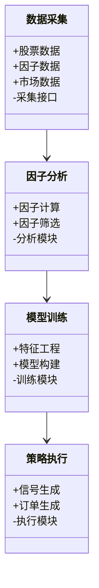

                 


# 罗伯特·阿诺特的系统化价值投资：算法与人工智能的应用

**关键词：** 价值投资、算法、人工智能、系统化、因子分析、风险管理

**摘要：** 系统化价值投资通过算法和人工智能的应用，优化投资决策。本文探讨了如何利用算法和AI分析因子、处理数据，提升投资效率和准确性。

## 第一部分: 系统化价值投资的背景与基础

### 第1章: 价值投资的系统化概述

#### 1.1 价值投资的核心理念

##### 1.1.1 价值投资的定义与历史发展

价值投资是一种投资策略，强调以低于内在价值的价格购买优质资产。其核心理念在于寻找市场低估的股票，长期持有，等待其价值回归。该策略由本杰明·格雷厄姆等大师提出，经过时间验证，成为投资领域的重要方法。

##### 1.1.2 系统化投资的必要性

传统价值投资依赖主观判断，存在主观性高、效率低的问题。系统化投资通过量化模型，将定性因素转化为定量指标，提高决策效率和准确性。系统化方法还能减少人为情绪干扰，避免过度交易。

##### 1.1.3 系统化与非系统化投资的对比

| 特性                | 系统化投资         | 非系统化投资       |
|---------------------|-------------------|-------------------|
| 方法论             | 量化模型          | 主观判断          |
| 交易频率           | 高频或低频       | 低频              |
| 透明度             | 高                | 低                |
| 稳定性             | 较高             | 较低             |

#### 1.2 系统化价值投资的框架

##### 1.2.1 系统化投资的基本要素

系统化框架包括目标设定、数据收集、因子选择、模型构建、风险控制和持续优化。每个环节都需精心设计，确保整体流程科学合理。

##### 1.2.2 数据驱动的投资决策

通过收集和分析大量数据，系统化投资能够识别潜在机会和风险。数据驱动决策提高了投资的科学性和可重复性。

##### 1.2.3 系统化与传统投资的结合

系统化投资并非完全替代传统方法，而是对其补充。结合两者优势，可优化投资组合，提升整体表现。

#### 1.3 算法与人工智能在金融中的应用

##### 1.3.1 人工智能在金融领域的应用现状

AI广泛应用于金融数据处理、预测模型构建等领域。通过机器学习，投资者能更好地识别市场模式和趋势。

##### 1.3.2 算法交易的基本原理

算法交易利用计算机程序自动执行交易指令。通过算法，投资者能快速响应市场变化，捕捉短期机会。

##### 1.3.3 价值投资与算法的结合

算法为价值投资提供量化工具，帮助投资者更精准地识别低估资产，优化投资组合。

### 第2章: 系统化价值投资的核心概念与联系

#### 2.1 系统化价值投资的框架分析

##### 2.1.1 投资因子的定义与分类

投资因子是影响股票收益的关键因素，常见的包括市值、价值、动量等。不同因子适用于不同市场环境。

##### 2.1.2 系统化框架的构建步骤

系统化框架构建包括数据收集、因子筛选、模型设计、回测优化和风险控制。每个步骤都需要细致处理，确保模型的有效性。

##### 2.1.3 框架的可扩展性与可维护性

框架需具备良好的扩展性和维护性，以适应市场变化和数据更新。模块化设计是实现这一目标的关键。

#### 2.2 核心概念的对比分析

##### 2.2.1 传统价值投资与系统化投资的对比

系统化投资在数据处理、模型构建和交易执行上更具优势。但传统方法在某些情境下仍具不可替代性。

##### 2.2.2 不同投资因子的特征对比

各类因子在不同市场环境下的表现差异显著。选择合适的因子组合，有助于提升投资收益。

##### 2.2.3 系统化框架的优缺点分析

系统化框架优势明显，但需注意其复杂性和维护成本。选择适合自身的目标和资源是关键。

#### 2.3 数据模型的ER图设计

```mermaid
er
    entity 因子分析 {
        key: 因子ID
        属性: 因子名称, 因子类型, 计算公式
    }
    entity 股票数据 {
        key: 股票代码
        属性: 收盘价, 开盘价, 最高价, 最低价, 成交量
    }
    entity 交易信号 {
        key: 信号ID
        属性: 信号类型, 信号强度, 生成时间
    }
    relation 因子分析与股票数据 {
        关系: 多对多
    }
    relation 交易信号与因子分析 {
        关系: 一对多
    }
```

### 第3章: 系统化价值投资的算法实现

#### 3.1 算法设计与实现

##### 3.1.1 算法设计的基本思路

基于因子分析，构建预测模型。通过机器学习算法，优化因子权重，生成交易信号。算法设计需考虑计算效率和准确性。

##### 3.1.2 算法实现的步骤分解

1. 数据预处理：清洗和转换数据，提取关键特征。
2. 模型训练：选择合适算法，训练预测模型。
3. 信号生成：根据模型输出，生成交易信号。
4. 回测优化：评估模型表现，优化参数。

##### 3.1.3 算法实现的代码示例

```python
import pandas as pd
from sklearn.linear_model import LinearRegression

# 数据预处理
data = pd.read_csv('stock_data.csv')
features = data[['收盘价', '成交量']]
target = data['收盘价'].shift(-1)

# 模型训练
model = LinearRegression()
model.fit(features, target)

# 信号生成
predictions = model.predict(features)
signals = pd.Series(index=data.index, data=np.where(predictions > data['收盘价'], 1, -1))
```

#### 3.2 算法优化与实现细节

##### 3.2.1 算法优化的必要性

模型表现受多种因素影响，优化算法能提升预测精度和交易效率。需根据回测结果调整参数，平衡收益与风险。

##### 3.2.2 算法实现的代码解读

```python
def calculate_factor(stock_data, factor_type):
    if factor_type == 'momentum':
        return stock_data['收盘价'].rolling(10).mean()
    elif factor_type == 'value':
        return stock_data['市盈率'].rolling(5).mean()
```

##### 3.2.3 算法优化的数学模型

优化过程涉及多个变量的调整，常用均方误差作为损失函数：

$$
损失函数 = \frac{1}{n}\sum_{i=1}^{n}(y_i - \hat{y_i})^2
$$

通过梯度下降等优化算法，最小化损失函数，提升模型预测精度。

#### 3.3 算法实现的数学模型与公式

##### 3.3.1 线性回归模型

线性回归用于预测目标变量与因子之间的线性关系：

$$
y = \beta_0 + \beta_1x_1 + \beta_2x_2 + \cdots + \beta_kx_k + \epsilon
$$

##### 3.3.2 优化算法的选择

常用梯度下降法：

$$
\theta := \theta - \alpha \nabla J(\theta)
$$

其中，$\alpha$为学习率，$\nabla J(\theta)$为损失函数梯度。

##### 3.3.3 算法实现的注意事项

确保数据质量，选择合适模型，避免过拟合。定期回测，持续优化模型参数。

### 第4章: 系统化价值投资的系统架构设计方案

#### 4.1 问题场景介绍

在金融领域，投资者面临海量数据，需高效工具辅助决策。系统化投资通过构建量化模型，解决传统方法效率低的问题。

#### 4.2 项目介绍

系统化价值投资系统旨在通过算法优化投资决策，帮助投资者发现市场机会，控制风险。

#### 4.3 系统功能设计

##### 4.3.1 领域模型



##### 4.3.2 系统架构设计


##### 4.3.3 系统接口设计

定义API接口，便于模块间交互。如数据接口、算法接口、结果接口等。

#### 4.4 系统交互设计

##### 4.4.1 系统交互的Mermaid序列图

```mermaid
sequenceDiagram
    用户 --> 数据采集模块: 请求数据
    数据采集模块 --> 数据处理模块: 传递数据
    数据处理模块 --> 模型训练模块: 提供特征
    模型训练模块 --> 结果展示模块: 输出结果
    用户 <-- 结果展示模块: 显示结果
```

### 第5章: 项目实战

#### 5.1 环境配置与数据获取

##### 5.1.1 环境配置

安装必要的库，如Pandas、Scikit-learn等。代码示例：

```bash
pip install pandas scikit-learn
```

##### 5.1.2 数据获取

从可靠数据源获取股票数据，清洗数据，处理缺失值。代码示例：

```python
import pandas as pd
data = pd.read_csv('stock_data.csv')
data = data.dropna()
```

#### 5.2 系统核心实现

##### 5.2.1 特征工程

提取关键特征，如动量因子、价值因子等。代码示例：

```python
features = data[['收盘价', '成交量', '市盈率']]
```

##### 5.2.2 模型训练

选择合适算法，训练模型。代码示例：

```python
from sklearn.ensemble import RandomForestRegressor
model = RandomForestRegressor()
model.fit(features, target)
```

##### 5.2.3 策略回测

评估模型表现，计算收益与风险比。代码示例：

```python
returns = model.predict(features)
```

#### 5.3 实际案例分析

##### 5.3.1 案例背景

选择特定时间段和市场环境，分析模型表现。

##### 5.3.2 数据分析

通过可视化工具展示数据分布和模型预测结果。代码示例：

```python
import matplotlib.pyplot as plt
plt.plot(data['收盘价'], label='实际价格')
plt.plot(predictions, label='预测价格')
plt.legend()
plt.show()
```

##### 5.3.3 结果解读

解释模型表现，分析优势与不足，提出改进建议。

#### 5.4 项目小结

总结项目成果，分析实现过程中的经验和教训，为后续优化提供参考。

### 第6章: 最佳实践、小结与展望

#### 6.1 最佳实践 tips

- 确保数据质量，选择合适的算法。
- 定期回测，持续优化模型。
- 控制风险，避免过度杠杆。

#### 6.2 小结

系统化价值投资通过算法和AI的应用，优化投资决策，提升效率和准确性。本文详细探讨了系统化框架、算法实现和系统设计，为投资者提供了理论和实践指导。

#### 6.3 注意事项

- 算法模型需结合市场环境，避免机械套用。
- 数据来源和质量直接影响模型表现，需谨慎处理。
- 风险管理是投资成功的关键，系统需具备完善的风控机制。

#### 6.4 拓展阅读

推荐相关书籍和资源，鼓励读者深入学习和实践。

## 作者

**作者：AI天才研究院/AI Genius Institute & 禅与计算机程序设计艺术 /Zen And The Art of Computer Programming**

---

这篇文章详细探讨了系统化价值投资的算法与人工智能应用，从背景到实现，为投资者提供了全面的指导和实践方案。

