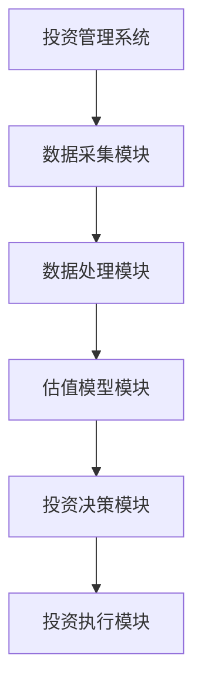

                 

# 罗伯特哈格斯特朗的成长型价值投资

---

## 关键词：
- 罗伯特·哈格斯特朗
- 成长型投资
- 股息贴现模型（DDM）
- 价值投资
- 股票估值

---

## 摘要：
本文深入探讨了罗伯特·哈格斯特朗的成长型价值投资理念，结合其投资策略的核心算法和数学模型，分析了成长型投资的系统架构设计，并通过实际案例展示了如何在实践中应用这些理论。文章内容涵盖背景介绍、算法原理、系统设计、项目实战以及最佳实践，帮助读者全面理解成长型价值投资的理论与实践。

---

# 第1章: 成长型价值投资的背景与核心概念

## 1.1 成长型投资的定义与特点

### 1.1.1 成长型投资的定义
成长型投资是一种以追求企业长期增长潜力为核心的投资策略。与价值投资不同，成长型投资更关注企业的未来盈利能力和市场份额的扩展，而非仅仅依赖于当前的低估值。

### 1.1.2 成长型投资的核心特点
- **高增长潜力**：选择那些未来盈利有望快速增长的企业。
- **高市盈率**：成长型企业通常市盈率较高，因为市场预期其未来盈利能力将显著提升。
- **高风险与高回报**：由于成长型企业未来的不确定性较高，因此风险也相对较大，但潜在回报丰厚。

### 1.1.3 成长型投资与价值投资的区别
| 属性         | 成长型投资                 | 价值投资                 |
|--------------|--------------------------|--------------------------|
| 核心关注点   | 未来的增长潜力             | 当前的低估与安全边际     |
| 适用场景     | 高增长行业（如科技、创新行业） | 低估值行业（如成熟行业）  |
| 投资期限     | 中长期                     | 中长期                   |
| 风险承受能力 | 较高                      | 较低                     |

## 1.2 罗伯特·哈格斯特朗的投资理念

### 1.2.1 罗伯特·哈格斯特朗的生平简介
罗伯特·哈格斯特朗（Robert H. Hagstrom）是成长型投资领域的权威人物，以其独特的投资理念和长期的市场实践闻名。他强调通过深入研究企业的基本面，寻找那些能够持续创造价值的企业。

### 1.2.2 罗伯特·哈格斯特朗的成长型投资策略
哈格斯特朗的投资策略基于以下核心理念：
- **长期视角**：投资于那些具有持续增长潜力的企业。
- **基本面分析**：通过分析企业的财务报表和行业地位，评估其未来的盈利能力。
- **分散投资**：通过投资于多个具有不同增长潜力的企业，降低投资风险。

### 1.2.3 罗伯特·哈格斯特朗的投资哲学
哈格斯特朗认为，成功的投资不仅仅是对市场的理解，更是对企业内在价值的深刻洞察。他强调，投资者需要具备对企业未来发展的预见能力，而不仅仅是关注当前的市场表现。

## 1.3 成长型价值投资的理论基础

### 1.3.1 股票估值的基本原理
股票的估值是成长型投资的核心，通过对企业未来现金流的折现，评估其内在价值。常用的估值方法包括股息贴现模型（DDM）和现金流折现模型（DCF）。

### 1.3.2 股东权益和企业价值的关系
企业价值（Enterprise Value, EV）是衡量企业整体价值的重要指标，包括企业的股权价值和债权价值。股东权益则是企业价值的重要组成部分，反映了股东对企业净资产的拥有程度。

### 1.3.3 股息贴现模型（DDM）的介绍
股息贴现模型（DDM）是一种用于估算股票内在价值的方法，通过将未来股息的现值折现，得到股票的公允价值。

---

# 第2章: 股息贴现模型（DDM）的原理与应用

## 2.1 股息贴现模型的基本原理

### 2.1.1 DDM的数学公式
$$ V = \frac{D_1}{r - g} $$
其中：
- \( V \)：股票的内在价值
- \( D_1 \)：下一期的股息
- \( r \)：折现率
- \( g \)：股息增长率

### 2.1.2 DDM的假设条件
- 股息将以固定增长率 \( g \) 持续增长。
- 折现率 \( r \) 保持不变。
- 企业永续经营，且股息支付率稳定。

### 2.1.3 DDM的应用场景
- 适用于股息稳定的成熟企业。
- 适用于股息增长率可预测的企业。

## 2.2 股息贴现模型的实现步骤

### 2.2.1 确定股息增长率（g）
股息增长率可以通过历史股息增长率和行业平均增长率进行估算。

### 2.2.2 确定折现率（r）
折现率通常采用无风险利率加上市场风险溢价。

### 2.2.3 计算股票的内在价值
通过公式 \( V = \frac{D_1}{r - g} \) 计算股票的内在价值。

## 2.3 股息贴现模型的优缺点

### 2.3.1 DDM的优点
- 计算简单，易于理解。
- 能够反映股息支付率的变化。

### 2.3.2 DDM的缺点
- 假设股息增长率固定，可能与实际情况不符。
- 适用于股息稳定的公司，不适用于高增长但不支付股息的企业。

### 2.3.3 DDM的改进方法
- 引入多阶段股息贴现模型，考虑股息增长率的变化。
- 结合现金流折现模型（DCF）进行综合评估。

## 2.4 本章小结
本章详细介绍了股息贴现模型的原理、实现步骤及优缺点，为后续的投资策略提供了理论基础。

---

# 第3章: 投资系统的架构设计

## 3.1 投资系统的需求分析

### 3.1.1 系统目标
构建一个能够自动化的成长型价值投资决策支持系统，帮助投资者进行股票估值和投资组合优化。

### 3.1.2 系统功能需求
- 数据采集与处理模块
- 股票估值模块
- 投资组合优化模块
- 风险管理模块

### 3.1.3 系统性能需求
- 高效的数据处理能力
- 精准的估值模型
- 灵活的投资组合优化算法

## 3.2 投资系统的架构设计

### 3.2.1 系统架构图

### 3.2.2 模块之间的关系
- 数据采集模块负责获取股票的财务数据。
- 数据处理模块对数据进行清洗和转换。
- 估值模型模块基于DDM等模型进行股票估值。
- 投资决策模块根据估值结果制定投资策略。
- 投资执行模块根据决策结果执行交易指令。

## 3.3 系统的实现步骤

### 3.3.1 数据采集与处理
- 使用API接口获取股票的财务数据。
- 对数据进行清洗和标准化处理。

### 3.3.2 模型实现
- 实现股息贴现模型（DDM）的代码。
- 对比不同模型的估值结果，选择最优模型。

### 3.3.3 系统集成与测试
- 将各个模块集成到系统中。
- 进行系统测试和优化。

## 3.4 本章小结
本章从系统架构的角度，详细设计了成长型价值投资的支持系统，为后续的项目实战奠定了基础。

---

# 第4章: 实战案例分析

## 4.1 案例背景介绍

### 4.1.1 案例选择标准
- 选择具有高增长潜力的科技企业。
- 确保企业具备稳定的股息支付能力。

### 4.1.2 案例的基本情况
以某科技公司为例，假设其历史股息增长率为5%，折现率为10%。

## 4.2 数据采集与处理

### 4.2.1 数据来源
- 企业财务报表
- 行业研究报告

## 4.3 投资模型的实现

### 4.3.1 模型选择
采用股息贴现模型（DDM）进行股票估值。

### 4.3.2 模型参数设置
- 下一期股息 \( D_1 = 2 \) 元
- 折现率 \( r = 10\% \)
- 股息增长率 \( g = 5\% \)

### 4.3.3 模型运行与结果分析
计算股票的内在价值：
$$ V = \frac{2}{0.10 - 0.05} = 40 \text{元} $$

## 4.4 投资决策与执行

### 4.4.1 投资策略制定
- 买入价格：40元
- 目标收益率：15%

### 4.4.2 投资组合优化
- 将投资组合分散到多个具有类似增长潜力的企业。

### 4.4.3 投资风险控制
- 设置止损点，控制最大亏损比例。

## 4.5 案例结果与总结

### 4.5.1 投资收益分析
- 股票价格达到目标价后卖出，实现15%的收益率。

### 4.5.2 投资风险评估
- 市场波动对成长型企业的影响较大，需密切监控企业的基本面变化。

### 4.5.3 案例总结与经验分享
- 成长型投资需要长期关注企业的基本面变化。
- 系统化的投资模型能够提高投资决策的科学性。

## 4.6 本章小结
本章通过实际案例，详细展示了如何在实践中应用成长型价值投资的理论和模型，为读者提供了宝贵的经验。

---

# 第5章: 投资策略的优化与调整

## 5.1 投资策略的优化方法

### 5.1.1 定期复盘与评估
- 每季度对投资组合进行复盘，评估模型的准确性。
- 根据市场变化调整模型参数。

### 5.1.2 根据市场变化调整策略
- 在高增长周期中，适当增加对成长型企业的配置。
- 在低增长周期中，转向价值投资策略。

### 5.1.3 引入新的数据源和模型
- 结合机器学习算法，提升模型的预测能力。

## 5.2 本章小结
本章总结了成长型价值投资策略的优化方法，强调了动态调整和引入新技术的重要性。

---

# 作者：AI天才研究院/AI Genius Institute & 禅与计算机程序设计艺术 /Zen And The Art of Computer Programming

---

以上是《罗伯特哈格斯特朗的成长型价值投资》的技术博客文章的完整内容，涵盖从理论到实践的各个方面，帮助读者全面理解成长型价值投资的策略和方法。

