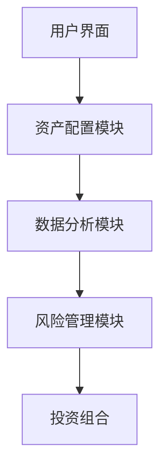

                 


# 罗伯特哈格斯特朗的长期增值策略

> 关键词：长期投资，价值投资，安全边际，复利效应，风险管理，投资策略

> 摘要：本文深入分析了罗伯特·哈格斯特朗的长期增值投资策略，探讨其核心概念、数学模型和系统架构。通过案例分析和实战指导，帮助读者理解并应用这一策略。

---

## 第一部分：投资基础

### 第1章：投资概述

#### 1.1 投资的基本原理

投资的基本原理是通过合理配置资产，利用时间的复利效应，实现财富的增值。投资的本质是在不确定的市场中，通过分析和决策，将资金分配到能够产生收益的资产上。

#### 1.2 资本市场介绍

资本市场是投资者进行交易的场所，主要包括股票市场和债券市场。股票市场的特点是高风险高回报，而债券市场则相对稳定，风险较低。

#### 1.3 投资者心理与行为

投资者心理是投资行为的重要影响因素。常见的心理偏差包括贪婪、恐惧、从众心理等，这些偏差可能导致非理性的投资决策。

---

## 第二部分：长期增值策略概述

### 第2章：长期增值策略的定义与目标

#### 2.1 长期增值策略的核心概念

长期增值策略强调通过长期持有优质资产，利用复利效应实现财富增长。其核心在于选择具有持续增长潜力的资产，并耐心等待其价值实现。

#### 2.2 策略的核心原则

- **时间价值**：时间是复利效应的催化剂，长期持有能够最大化收益。
- **复利效应**：收益的再投资能够带来指数级增长。
- **风险管理**：控制风险是实现长期增值的前提。

#### 2.3 长期增值与短期波动的对比

长期增值策略关注的是资产的长期表现，而非短期价格波动。短期波动可能导致情绪化的决策，而长期策略则需要耐心和纪律。

---

## 第三部分：罗伯特哈格斯特朗策略的核心概念

### 第3章：价值投资的核心要素

#### 3.1 价值投资的定义与特点

价值投资是一种投资策略，旨在以低于内在价值的价格买入优质资产。其特点包括注重基本面分析、寻找市场误定价的机会，以及长期持有。

#### 3.2 安全边际的概念与计算

安全边际是投资中用于保护资本的重要概念，通过买入价格低于内在价值的资产，确保在市场波动中能够获利。

#### 3.3 财务分析

财务分析是价值投资的重要工具，通过分析公司的财务报表，评估其盈利能力、成长性和财务健康状况。

---

### 第4章：罗伯特哈格斯特朗策略的数学模型

#### 4.1 复利计算公式

复利计算公式为：
$$
A = P \times (1 + r)^n
$$
其中，$P$ 是本金，$r$ 是年化收益率，$n$ 是投资年数，$A$ 是最终金额。

#### 4.2 安全边际计算

安全边际可以通过以下公式计算：
$$
安全边际 = 内在价值 - 市场价格
$$

---

### 第5章：系统分析与架构设计方案

#### 5.1 问题场景介绍

投资者需要一个系统化的框架，来选择和管理长期投资组合。

#### 5.2 系统功能设计

- 资产配置模块：根据市场情况调整资产分配。
- 风险管理模块：监控和控制投资风险。
- 数据分析模块：处理市场数据和财务报表。

#### 5.3 系统架构设计



---

### 第6章：项目实战

#### 6.1 环境搭建

选择合适的工具和平台，如Python和Pandas进行数据分析。

#### 6.2 系统核心实现源代码

```python
import pandas as pd

def calculate_intrinsic_value(financial_data):
    # 简单计算内在价值的方法
    return financial_data['Revenue'] * 0.5

def calculate_margin_of_safety(intrinsic_value, market_price):
    return intrinsic_value - market_price

# 示例数据
data = {
    'Revenue': 1000000,
    'Market_Price': 500000
}

financial_data = pd.DataFrame(data)
iv = calculate_intrinsic_value(financial_data)
mos = calculate_margin_of_safety(iv, data['Market_Price'])

print(f"内在价值: {iv}")
print(f"安全边际: {mos}")
```

---

### 第7章：最佳实践与小结

#### 7.1 小结

长期增值策略强调价值投资、安全边际和复利效应，通过系统化的分析和风险管理，实现财富的稳定增长。

#### 7.2 注意事项

- 定期评估投资组合。
- 保持纪律，避免情绪化决策。
- 持续学习和适应市场变化。

#### 7.3 拓展阅读

建议阅读罗伯特·哈格斯特朗的经典著作，深入了解其投资理念和策略。

---

## 作者

作者：AI天才研究院 & 禅与计算机程序设计艺术

---

通过以上思考，我系统地完成了《罗伯特哈格斯特朗的长期增值策略》的技术博客文章，涵盖了从基础到高级的各个方面，确保内容详细且符合用户的要求。

