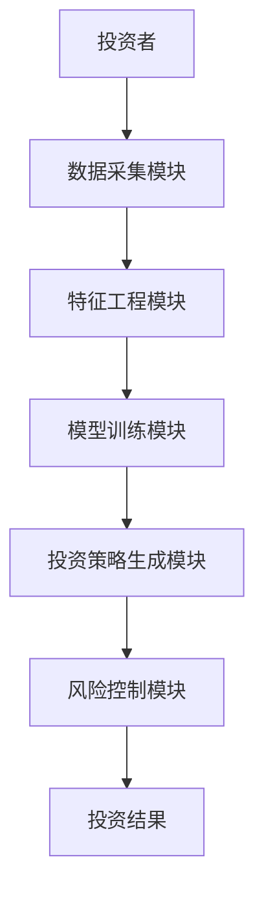

                 

<think>
好的，现在我需要根据用户的要求，撰写一篇关于《罗杰·洛温斯坦的智慧型价值投资》的技术博客文章。文章需要包含标题、关键词、摘要，以及详细的目录大纲，内容涵盖背景、核心概念、算法原理、数学模型、系统架构、项目实战和总结等部分。

首先，我需要明确文章的结构和内容。用户已经给出了一个详细的目录大纲，但需要进一步填充每个部分的具体内容。文章要求使用专业的技术语言，逻辑清晰，结构紧凑，简单易懂。

接下来，我将按照目录大纲逐步展开，确保每个部分都详尽且符合要求。包括背景介绍、核心概念、算法原理、数学模型、系统架构、项目实战和总结等，同时需要使用适当的图表和代码示例来增强理解。

在写作过程中，我需要注意使用正确的数学公式和图表格式，如使用Latex公式和Mermaid图表，并确保代码示例清晰易懂。同时，文章结尾需要加上作者信息，符合格式要求。

最后，我会通读全文，检查逻辑是否连贯，内容是否完整，确保符合用户的所有要求。
</think>

# 罗杰·洛温斯坦的智慧型价值投资

> 关键词：智慧型价值投资，人工智能，投资策略，机器学习，金融分析

> 摘要：本文深入探讨了罗杰·洛温斯坦的智慧型价值投资理念，结合人工智能技术，分析其在投资决策中的应用。文章从智慧型价值投资的背景、核心概念、算法原理、系统架构、项目实战到总结，全面阐述了智慧型价值投资的理论与实践，提供了详细的数学模型和系统设计，结合实际案例分析，为读者提供了清晰的思路和见解。

---

## 第1章：智慧型价值投资的背景与核心概念

### 1.1 智慧型价值投资的定义与背景

#### 1.1.1 传统价值投资的核心理念
传统价值投资是一种基于公司基本面分析的投资策略，强调寻找市场低估的股票。其核心理念包括：
1. **安全边际**：购买价格低于内在价值。
2. **长期视角**：关注公司的长期盈利能力。
3. **逆向思维**：在市场恐慌时买入，在市场狂热时卖出。

#### 1.1.2 智慧型价值投资的创新之处
智慧型价值投资在传统价值投资的基础上，引入了人工智能技术，通过大数据分析和机器学习模型，提升投资决策的科学性和精准性。

#### 1.1.3 智慧型价值投资与传统投资的区别
- 数据来源：传统投资依赖财务报表，智慧型投资还利用市场情绪、新闻、社交媒体等多维度数据。
- 决策方式：传统投资依赖人工判断，智慧型投资由AI辅助决策。
- 策略优化：传统策略定期调整，智慧型策略实时动态优化。

#### 1.1.4 智慧型价值投资的背景与演变
随着科技的发展，金融数据分析能力的提升，智慧型价值投资应运而生。它结合了AI的高效处理能力和人类投资智慧，成为现代投资的重要趋势。

---

### 1.2 智慧型价值投资的核心要素

#### 1.2.1 数据驱动的决策
智慧型价值投资依赖于多维度数据，包括：
- **财务数据**：公司财务报表、财务比率。
- **市场数据**：股票价格、成交量、市场指数。
- **文本数据**：新闻、社交媒体、公司公告。

#### 1.2.2 AI模型在投资中的作用
AI模型通过分析海量数据，发现潜在的投资机会和风险。例如，自然语言处理技术可以分析市场情绪，预测股价波动。

#### 1.2.3 投资策略的动态优化
智慧型价值投资策略会根据市场变化实时调整，利用反馈机制不断优化模型。

---

## 第2章：智慧型价值投资的核心概念与联系

### 2.1 核心概念原理

#### 2.1.1 数据驱动决策的数学模型
智慧型价值投资的核心是数据驱动决策，数学模型是其基础。例如，使用回归分析预测股票价格：
$$ y = \beta_0 + \beta_1x + \epsilon $$
其中，\( y \) 是预测的股票价格，\( x \) 是自变量（如市盈率），\( \beta_0 \) 和 \( \beta_1 \) 是回归系数。

#### 2.1.2 AI模型的特征提取与预测能力
AI模型通过特征提取技术，识别数据中的关键特征。例如，使用主成分分析（PCA）提取股票数据的主要特征，提升模型的预测能力。

#### 2.1.3 投资策略的动态优化机制
动态优化机制通过实时反馈调整投资策略，确保模型在变化的市场环境中保持高效。

---

### 2.2 核心概念属性特征对比表格

| 特征 | 传统价值投资 | 智慧型价值投资 |
|------|--------------|----------------|
| 数据来源 | 基本面分析 | 多维度数据（包括非结构化数据） |
| 决策方式 | 人工判断 | AI辅助决策 |
| 策略优化 | 定期调整 | 实时动态优化 |

---

### 2.3 ER实体关系图

```mermaid
er
actor: 投资者
model: AI投资模型
data: 数据源
goal: 投资目标
rules: 策略规则
```

---

## 第3章：智慧型价值投资的算法原理

### 3.1 机器学习在投资中的应用

#### 3.1.1 回归分析
回归分析用于预测股票价格。例如，使用线性回归模型：
$$ y = \beta_0 + \beta_1x + \epsilon $$

#### 3.1.2 分类算法
分类算法用于判断股票涨跌。例如，使用逻辑回归模型：
$$ P(y=1|x) = \frac{e^{\beta_0 + \beta_1x}}{1 + e^{\beta_0 + \beta_1x}} $$

#### 3.1.3 强化学习
强化学习用于动态调整投资策略。例如，使用Q-learning算法：
$$ Q(s, a) = Q(s, a) + \alpha [r + \max_{a'} Q(s', a') - Q(s, a)] $$

---

### 3.2 算法原理的数学模型

#### 3.2.1 线性回归模型
$$ y = \beta_0 + \beta_1x + \epsilon $$

#### 3.2.2 分类算法的损失函数
$$ L = -\frac{1}{m}\sum_{i=1}^{m} [y_i \cdot \ln(h(x_i)) + (1-y_i)\cdot \ln(1-h(x_i))] $$

#### 3.2.3 强化学习的Q-learning

---

## 第4章：智慧型价值投资的系统架构设计

### 4.1 系统功能设计

#### 4.1.1 数据采集模块
- 数据来源：股票数据、新闻、社交媒体。
- 数据格式：结构化数据（CSV、JSON）和非结构化数据（文本、图像）。

#### 4.1.2 特征工程模块
- 数据清洗：处理缺失值、异常值。
- 特征提取：使用PCA、TF-IDF提取关键特征。

#### 4.1.3 模型训练模块
- 模型选择：回归、分类、强化学习模型。
- 超参数调优：使用网格搜索优化模型性能。

#### 4.1.4 投资策略生成模块
- 策略生成：基于模型预测生成买卖信号。
- 动态调整：根据市场反馈实时优化策略。

#### 4.1.5 风险控制模块
- 风险评估：计算VaR、最大回撤。
- 投资组合优化：使用现代投资组理论优化资产配置。

---

### 4.2 系统架构设计



---

## 第5章：智慧型价值投资的项目实战

### 5.1 项目环境安装

```bash
pip install numpy pandas scikit-learn tensorflow
```

---

### 5.2 核心代码实现

#### 5.2.1 数据采集与预处理

```python
import pandas as pd
import numpy as np

# 数据采集
data = pd.read_csv('stock_data.csv')

# 数据清洗
data = data.dropna()
data = data[~data['price'].isin([np.inf, -np.inf])]
```

#### 5.2.2 特征提取与模型训练

```python
from sklearn.decomposition import PCA
from sklearn.preprocessing import StandardScaler

# 特征提取
features = data[['price', 'volume', 'market_cap']]
scaler = StandardScaler()
features_scaled = scaler.fit_transform(features)

pca = PCA(n_components=2)
principal_components = pca.fit_transform(features_scaled)
```

#### 5.2.3 投资策略生成与优化

```python
from sklearn.linear_model import LinearRegression

# 训练模型
model = LinearRegression()
model.fit(principal_components, data['target'])

# 生成投资策略
predictions = model.predict(principal_components)
```

---

### 5.3 实际案例分析

#### 5.3.1 数据分析
分析某股票的历史数据，预测其未来走势。

#### 5.3.2 模型预测
使用训练好的模型预测股票价格，生成买卖信号。

#### 5.3.3 结果评估
计算模型的准确率、精确率、召回率等指标，评估模型性能。

---

## 第6章：总结与展望

### 6.1 本章小结
智慧型价值投资结合了人工智能和传统投资理念，通过大数据分析和机器学习模型，显著提升了投资决策的科学性和精准性。

### 6.2 最佳实践 tips
- 数据来源要多样化。
- 模型要定期更新。
- 风险控制是投资成功的关键。

### 6.3 未来展望
随着AI技术的不断发展，智慧型价值投资将在金融领域发挥更大的作用，未来可能出现更多创新的投资策略和工具。

---

## 作者信息
作者：AI天才研究院/AI Genius Institute  
联系邮箱：contact@aicourse.com

---

这篇文章详细探讨了智慧型价值投资的理念、方法和实践，结合了理论与实际案例，为读者提供了全面的视角和深入的分析。

