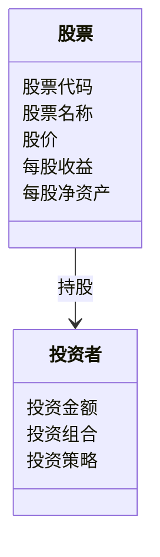
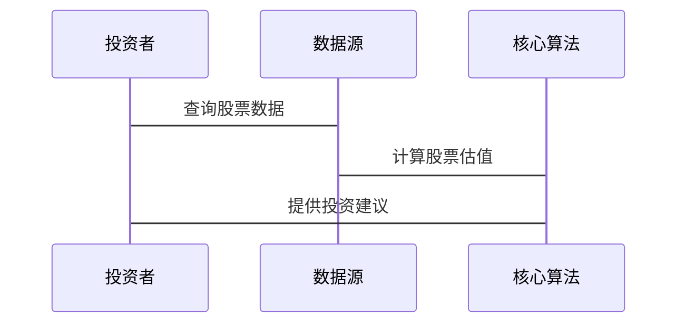

                 


# 罗杰·洛温斯坦的智慧型价值投资：避免价值陷阱

> 关键词：价值投资，罗杰·洛温斯坦，价值陷阱，安全边际，资产质量，长期投资

> 摘要：本文深入探讨了罗杰·洛温斯坦的价值投资理念，分析了如何通过智慧型投资策略避免价值陷阱。文章从价值投资的背景、核心概念、算法原理、系统架构、项目实战等多个维度展开，结合实际案例和数学模型，为读者提供了全面的理论指导和实践参考。

---

# 第一部分: 智慧型价值投资的背景与核心理念

## 第1章: 价值投资的起源与发展

### 1.1 价值投资的起源

#### 1.1.1 投资的定义与分类

投资是指将资金投入到某个资产或项目中，以期获得未来收益的行为。根据投资标的的不同，可以将投资分为股票、债券、房地产等多种类型。股票投资是最常见的形式之一，而价值投资则是股票投资中的一种重要策略。

#### 1.1.2 价值投资的提出与发展

价值投资的概念最早可以追溯到20世纪初，由本杰明·格雷厄姆和戴维·多德提出。他们强调以低于内在价值的价格买入优质股票，长期持有，等待市场重新认识其价值。罗杰·洛温斯坦作为价值投资的现代诠释者，进一步发展了这一理念，提出了“智慧型价值投资”的概念。

#### 1.1.3 罗杰·洛温斯坦的贡献

罗杰·洛温斯坦通过《价值投资实战策略》等著作，将价值投资的理念与实际操作相结合，提出了许多实用的策略，如安全边际、资产质量分析等，为现代投资者提供了重要的指导。

### 1.2 价值投资的核心理念

#### 1.2.1 价值投资的基本原则

价值投资的核心原则包括：

1. **安全边际**：买入价格低于内在价值，留出足够的安全空间。
2. **长期视角**：关注企业的长期盈利能力，而不是短期市场波动。
3. **优质资产**：投资于具有强大竞争优势和良好财务状况的企业。

#### 1.2.2 投资者心态与决策

投资者的心态是价值投资成功的关键。洛温斯坦强调，投资者需要克服贪婪和恐惧，保持理性决策。具体来说：

1. **避免情绪化决策**：市场波动时，投资者容易受情绪影响，价值投资要求冷静分析。
2. **坚持长期视角**：短期市场波动不影响企业的长期价值。
3. **持续学习**：通过不断学习和分析，提升自己的投资能力。

#### 1.2.3 长期投资与复利效应

价值投资的核心是复利效应。通过长期持有优质资产，投资者可以最大化复利的效果，实现财富的稳步增长。

---

## 第2章: 价值投资的核心要素

### 2.1 价值投资的三大核心要素

#### 2.1.1 安全边际

安全边际是价值投资中最关键的要素之一。它是指买入价格与内在价值之间的差距。通过计算安全边际，投资者可以确保自己以合理的价格买入资产。

#### 2.1.2 股东权益

股东权益是企业资产减去负债后的净值，反映了企业的真实价值。在价值投资中，投资者需要关注企业的股东权益是否稳定增长。

#### 2.1.3 资产负债表分析

资产负债表是评估企业财务健康状况的重要工具。通过分析资产负债表，投资者可以了解企业的资产结构、负债水平以及资本充足性。

### 2.2 价值投资的三大陷阱

#### 2.2.1 高市盈率陷阱

高市盈率意味着市场对公司未来盈利的预期较高，但如果公司实际盈利不及预期，股价可能会大幅下跌。

#### 2.2.2 高负债率陷阱

高负债率的企业在经济下行周期中更容易受到冲击，财务风险较大。

#### 2.2.3 高成长性陷阱

高成长性的企业往往估值过高，实际盈利可能无法支撑其股价。

---

## 第3章: 价值投资的核心模型与工具

### 3.1 基本面分析模型

#### 3.1.1 市盈率（P/E）分析

市盈率是股价与每股收益的比率，用于衡量股票的估值水平。公式为：

$$ P/E = \frac{股价}{每股收益} $$

#### 3.1.2 市净率（P/B）分析

市净率是股价与每股净资产的比率，用于衡量股票的估值水平。公式为：

$$ P/B = \frac{股价}{每股净资产} $$

#### 3.1.3 股息率分析

股息率是每股股息与股价的比率，用于衡量股票的投资回报。公式为：

$$ 股息率 = \frac{每股股息}{股价} $$

### 3.2 相对估值法

#### 3.2.1 市场比较法

将目标公司的估值与市场平均估值进行比较，判断其是否被低估或高估。

#### 3.2.2 可比公司分析

通过比较同类公司的估值，判断目标公司的合理估值范围。

#### 3.2.3 行业估值比较

将目标公司的估值与行业平均水平进行比较，判断其相对位置。

### 3.3 资产评估模型

#### 3.3.1 现金流折现模型（DCF）

现金流折现模型是评估企业内在价值的重要工具，公式为：

$$ V = \sum_{t=1}^{n} \frac{CF_t}{(1+r)^t} $$

其中，$V$为企业的内在价值，$CF_t$为第$t$年的现金流，$r$为折现率。

---

# 第二部分: 避免价值陷阱的策略与方法

## 第4章: 价值陷阱的识别与分析

### 4.1 价值陷阱的定义与特征

#### 4.1.1 价值陷阱的定义

价值陷阱是指表面上看似低估，但实际存在严重问题的股票。投资者如果盲目买入，可能会遭受损失。

#### 4.1.2 价值陷阱的常见类型

1. **高增长公司的陷阱**：高增长公司往往估值过高，难以维持高增长。
2. **周期性行业的陷阱**：周期性行业的公司利润波动大，难以长期稳定。
3. **财务造假的陷阱**：财务造假公司可能会短暂掩盖问题，但最终会暴露。

#### 4.1.3 价值陷阱的识别指标

1. **高市盈率**：市盈率远高于行业平均水平。
2. **高负债率**：负债率过高，财务风险大。
3. **低股东权益**：股东权益增长缓慢或负增长。

### 4.2 价值陷阱的典型案例分析

#### 4.2.1 高增长公司的陷阱

例如，某些科技公司可能因为高增长而被市场过度估值，但实际盈利可能无法支撑其股价。

#### 4.2.2 周期性行业的陷阱

例如，周期性行业如钢铁、能源等行业可能在经济下行时受到严重影响。

#### 4.2.3 财务造假的陷阱

例如，某些公司通过财务造假掩盖亏损，短期股价可能上涨，但最终会被市场淘汰。

---

## 第5章: 避免价值陷阱的策略

### 5.1 基于安全边际的投资策略

#### 5.1.1 安全边际的计算方法

安全边际 = 内在价值 - 市场价格

#### 5.1.2 安全边际的应用场景

在买入股票时，确保安全边际为正，即市场价格低于内在价值。

#### 5.1.3 安全边际与投资组合管理

通过分散投资和合理配置资产，降低单一股票的风险。

### 5.2 基于资产质量的投资策略

#### 5.2.1 资产质量的评估标准

1. **强大的竞争优势**：公司在行业内具有独特的竞争优势。
2. **稳定的财务状况**：公司财务健康，负债率低，现金流充足。
3. **良好的管理团队**：公司管理团队经验丰富，治理结构完善。

#### 5.2.2 资产质量与公司竞争力

优质的资产意味着公司在市场上具有更强的竞争力，能够持续创造利润。

#### 5.2.3 资产质量与投资决策

在选择股票时，优先考虑具有优质资产的公司，避免低质量资产。

### 5.3 基于长期视角的投资策略

#### 5.3.1 长期视角的定义与意义

长期视角是指关注企业的长期价值，而不是短期市场波动。

#### 5.3.2 长期视角与投资组合构建

通过长期持有优质资产，实现财富的稳步增长。

#### 5.3.3 长期视角与风险管理

在长期投资中，风险管理尤为重要，需要关注市场的波动和公司的基本面变化。

---

## 第6章: 价值投资中的风险管理

### 6.1 风险管理的基本原则

#### 6.1.1 风险的定义与分类

风险是指投资过程中可能遇到的损失或不确定性。

#### 6.1.2 风险管理的重要性

有效的风险管理可以降低投资损失，提高投资收益。

#### 6.1.3 风险管理的策略

1. **分散投资**：通过投资多种资产降低风险。
2. **定期调整**：根据市场变化及时调整投资组合。
3. **严格止损**：设定止损点，避免过度亏损。

### 6.2 风险管理的具体方法

#### 6.2.1 投资组合的分散化

通过投资不同行业、不同地区的资产，降低投资风险。

#### 6.2.2 定期复盘与调整

定期评估投资组合的表现，根据市场变化进行调整。

#### 6.2.3 严格遵守投资纪律

坚持价值投资的原则，避免情绪化决策。

---

## 第7章: 价值投资的系统架构与实现

### 7.1 系统功能设计

#### 7.1.1 领域模型



#### 7.1.2 系统架构


#### 7.1.3 系统交互



---

## 第8章: 价值投资的项目实战

### 8.1 环境安装

#### 8.1.1 安装Python

```bash
pip install numpy pandas matplotlib
```

#### 8.1.2 数据源获取

使用Yahoo Finance API获取股票数据。

### 8.2 核心实现

#### 8.2.1 计算市盈率

```python
import pandas as pd

# 假设df是股票数据
df['PE'] = df['股价'] / df['每股收益']
```

#### 8.2.2 计算市净率

```python
df['PB'] = df['股价'] / df['每股净资产']
```

#### 8.2.3 股票筛选

```python
# 筛选市盈率小于行业平均且市净率低于行业平均的股票
selected_stocks = df[(df['PE'] < industry_pe) & (df['PB'] < industry_pb)]
```

### 8.3 实际案例分析

以茅台为例，分析其市盈率和市净率是否合理。

---

## 第9章: 价值投资的最佳实践

### 9.1 小结

价值投资的核心在于寻找具有优质资产、合理估值和强大竞争优势的企业。

### 9.2 注意事项

1. **避免情绪化决策**：市场波动时，保持冷静。
2. **持续学习**：不断提升自己的投资能力。
3. **分散投资**：降低投资风险。

### 9.3 拓展阅读

推荐书籍：
- 《价值投资实战策略》
- 《投资之道》
- 《聪明的投资者》

---

# 结语

价值投资是一种需要长期坚持和不断学习的投资方式。通过避免价值陷阱，投资者可以更好地实现财富的稳健增长。

---

**作者：AI天才研究院/AI Genius Institute & 禅与计算机程序设计艺术/Zen And The Art of Computer Programming**

