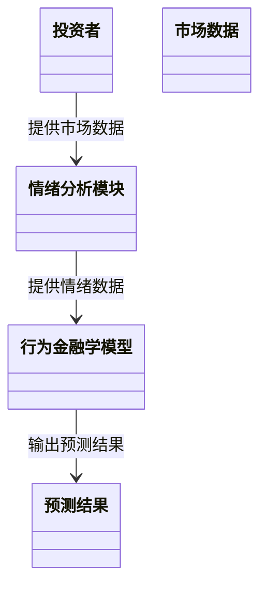
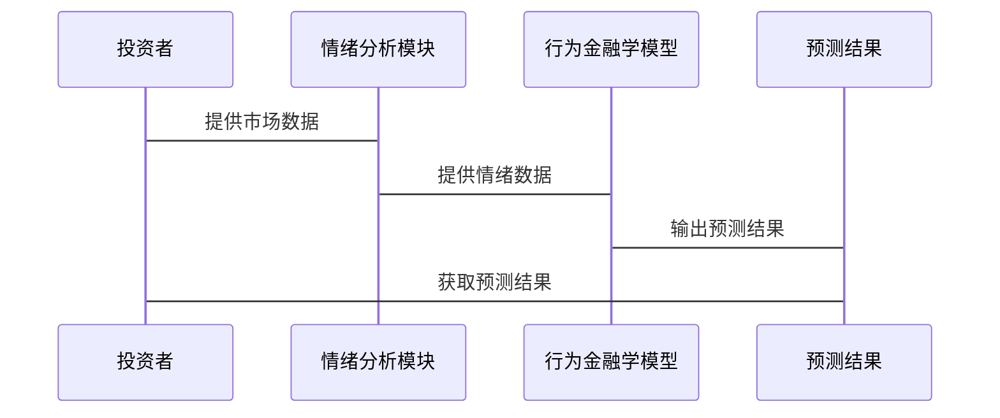

                 

<think>
嗯，我现在需要帮用户设计《罗杰·洛温斯坦的行为金融学与投资决策》这本书的目录大纲。首先，我得了解这本书的主题是什么。行为金融学主要研究投资者心理如何影响决策，而罗杰·洛温斯坦可能在这本书中深入探讨这些心理因素在投资中的应用。

用户希望目录大纲详细且逻辑清晰，覆盖从背景到实战的各个方面。根据示例，我需要分为几个部分，每个部分有章节，章节下有小节，甚至三级目录。首先，我应该考虑结构是否合理，是否涵盖用户提到的所有要求。

用户的要求包括背景介绍、核心概念、算法原理、数学模型、系统分析、项目实战、最佳实践等。我得确保每个部分都有对应的章节，并且细化到三级目录。比如，背景介绍可能需要一章，涵盖基本概念和理论基础。

接下来，我需要考虑每个章节的内容。第一章可能是行为金融学的概述，介绍基本概念和理论基础，包括人类决策的偏差、投资者心理与市场行为，以及行为金融学的基本理论。这样读者可以逐步了解相关知识。

然后，第二章可以深入探讨行为偏差与认知偏差，分析它们如何影响投资决策，比如过度自信、损失厌恶等。这部分需要详细的小节，每个偏差类型单独讨论。

接下来，可能需要一章专门分析投资者心理与市场行为，探讨群体心理、市场情绪和情绪周期，以及投资者认知偏差对市场的影响。这部分帮助读者理解市场中的实际应用。

然后，数学模型和算法原理是关键部分。我需要设计一章，介绍行为金融学中的数学模型，如 prospect theory 和 regret theory，并用mermaid流程图展示。同时，用Python代码实现这些模型，帮助读者理解。

系统分析与架构设计部分可能需要讨论投资决策系统的构建，包括系统架构、功能模块、数据流和交互设计。这部分可能需要使用mermaid的架构图和序列图，展示系统的运作流程。

项目实战部分，我需要指导读者如何安装环境，实现核心功能，分析案例，并给出代码解读。这部分要详细，确保读者能够实际操作。

最后，最佳实践和小结部分，总结全书内容，给出投资决策中的注意事项和未来趋势。同时，可能需要一些拓展阅读建议，帮助读者深入学习。

现在，我需要确保每个章节都细化到三级目录，并且涵盖所有要求的内容。比如，数学模型部分要有公式和代码，系统架构要有图表，项目实战要有代码和案例分析。

可能遇到的挑战是如何将理论与实际案例结合起来，确保目录结构既全面又不冗杂。我需要合理安排章节顺序，从基础到高级，逐步深入，让读者能够循序渐进地理解内容。

总之，我需要按照用户的要求，构建一个结构清晰、内容详实的目录大纲，确保涵盖所有必要的部分，并且符合2000字以内的限制。现在，我可以开始按照这个思路来组织目录了。
</think>

# 罗杰·洛温斯坦的行为金融学与投资决策

## 关键词
- 行为金融学
- 投资决策
- 投资者心理
- 市场情绪
- 认知偏差

## 摘要
本文系统阐述了罗杰·洛温斯坦的行为金融学理论及其在投资决策中的应用。通过分析投资者心理偏差、市场情绪、群体心理及其对投资决策的影响，结合数学模型和算法实现，探讨了行为金融学的核心理论与实践应用。文章深入分析了前景理论、后悔理论等行为金融学数学模型，通过Python代码实现案例分析，为投资决策系统的设计提供了理论支持和实践指导。

---

# 第一部分: 行为金融学与投资决策概述

# 第1章: 行为金融学的核心概念与理论基础

## 1.1 行为金融学的基本概念

### 1.1.1 传统金融学的局限性
- 传统金融学假设投资者是理性的，但现实中投资者常受情绪影响。
- 传统模型无法解释市场异常现象，如“价格非理性波动”。

### 1.1.2 行为金融学的定义与研究范围
- 行为金融学：研究投资者心理和行为如何影响金融市场决策的学科。
- 研究范围：认知偏差、情绪波动、群体行为等对投资决策的影响。

### 1.1.3 行为金融学与投资决策的关系
- 行为金融学揭示了投资者非理性行为的规律。
- 帮助投资者理解自身偏差，优化决策。

## 1.2 投资者心理与行为偏差

### 1.2.1 人类决策的基本偏差
- 确认偏差：倾向于寻找支持自己观点的信息。
- 过度自信：过高估计自己的判断能力。

### 1.2.2 投资者心理偏差的分类
- 认知偏差：包括确认偏差、过度自信等。
- 情感偏差：如损失厌恶、从众心理。

### 1.2.3 行为偏差对投资决策的影响
- 认知偏差导致错误判断。
- 情感偏差引发非理性交易。

## 1.3 行为金融学的基本理论

### 1.3.1 基础理论框架
- 结合心理学和经济学，解释市场现象。

### 1.3.2 行为金融学的核心假设
- 投资者行为受心理因素影响，非完全理性。

### 1.3.3 行为金融学与传统金融学的对比
- 传统金融学：假设理性人。
- 行为金融学：强调心理因素。

## 1.4 本章小结
本章介绍了行为金融学的核心概念，分析了投资者心理偏差及其对决策的影响，为后续分析奠定基础。

---

# 第2章: 投资者心理与市场行为

## 2.1 投资者心理的多样性

### 2.1.1 理性投资者与非理性投资者
- 理性投资者：基于逻辑和数据做决策。
- 非理性投资者：受情绪和认知偏差影响。

### 2.1.2 不同类型投资者的心理特征
- 风险厌恶型：偏好稳定收益。
- 风险寻求型：追求高风险高回报。

### 2.1.3 投资者心理与市场波动的关系
- 投资者情绪波动引发市场波动。

## 2.2 市场情绪与群体心理

### 2.2.1 市场情绪的定义与测量
- 市场情绪：投资者整体情绪状态。
- 测量方法：通过市场指标如VIX指数。

### 2.2.2 群体心理对市场行为的影响
- 羊群效应：投资者跟随市场趋势，引发价格泡沫或崩盘。

### 2.2.3 市场情绪周期分析
- 市场情绪周期：从乐观到恐慌再到乐观。

## 2.3 投资者认知偏差与决策错误

### 2.3.1 认知偏差的类型与表现
- 确认偏差：忽视不利信息。
- 损失厌恶：对损失的恐惧大于对收益的追求。

### 2.3.2 认知偏差对投资决策的影响
- 导致过度交易和错误判断。

### 2.3.3 如何减少认知偏差的影响
- 提高自我认知，制定严格的投资计划。

## 2.4 本章小结
本章分析了投资者心理多样性、市场情绪和认知偏差对投资决策的影响，揭示了群体心理和市场情绪周期的重要性。

---

# 第3章: 行为金融学中的数学模型与算法原理

## 3.1 基于行为偏差的数学模型

### 3.1.1 前景理论（Prospect Theory）

#### 前景理论的核心假设
- 人们对收益和损失的敏感度不同。
- 损失厌恶：对损失的恐惧大于对收益的追求。

#### 前景理论的数学公式
$$
V = \text{max}(p \cdot u(r), l \cdot u(r))
$$

#### 前景理论的实现代码
```python
def prospect_theory(gains, losses, utility_func):
    pt = []
    for g in gains:
        pt.append(max(p * utility_func(g), l * utility_func(g)))
    for l in losses:
        pt.append(min(p * utility_func(l), l * utility_func(l)))
    return pt
```

### 3.1.2 后悔理论（Regret Theory）

#### 后悔理论的核心假设
- 投资者决策基于对后悔的规避。

#### 后悔理论的数学公式
$$
R = \text{max}(g - l, 0)
$$

#### 后悔理论的实现代码
```python
def regret_theory(profits, losses):
    regret = []
    for p in profits:
        regret.append(max(p - l, 0))
    return regret
```

### 3.1.3 基于概率的决策模型

#### 概率决策模型的核心假设
- 投资者基于概率评估风险。

#### 概率决策模型的数学公式
$$
E = \sum p_i \cdot x_i
$$

#### 概率决策模型的实现代码
```python
def probabilistic_model(probabilities, returns):
    expected_return = sum(p * r for p, r in zip(probabilities, returns))
    return expected_return
```

## 3.2 投资者情绪的量化模型

### 3.2.1 投资者情绪指数的构建
- 情绪指数：通过市场数据计算投资者情绪。

### 3.2.2 基于情绪的市场预测模型
- 情绪对价格的影响：情绪高涨引发价格泡沫。

### 3.2.3 情绪与市场波动的关系模型
$$
VIX = f(\text{market mood})
$$

## 3.3 行为金融学中的算法实现

### 3.3.1 情绪分析算法

#### 情绪分析算法的实现代码
```python
def情绪分析算法(市场数据):
    情绪指数 = 计算情绪指数(市场数据)
    预测价格变动 = 基于情绪指数预测价格
    返回预测价格变动
```

---

# 第4章: 系统分析与架构设计方案

## 4.1 问题场景介绍

### 4.1.1 投资决策系统的目标
- 提供基于行为金融学的投资建议。

### 4.1.2 系统功能设计
- 数据采集：收集市场数据和投资者情绪数据。
- 情绪分析：分析投资者情绪。
- 模型计算：使用行为金融学模型预测价格。

### 4.1.3 领域模型（Mermaid类图）


### 4.1.4 系统架构设计（Mermaid架构图）
```mermaid
container 投资决策系统 {
    投资者界面
    情绪分析模块
    行为金融学模型
    数据库
}
```

### 4.1.5 系统交互设计（Mermaid序列图）


## 4.2 本章小结
本章设计了投资决策系统的架构和交互流程，展示了如何将行为金融学理论应用于实际系统中。

---

# 第5章: 项目实战

## 5.1 环境安装与配置

### 5.1.1 安装Python和相关库
- Python 3.8+
- 库：pandas, numpy, matplotlib, seaborn

## 5.2 系统核心实现

### 5.2.1 行为金融学模型的实现
```python
import pandas as pd
import numpy as np

def计算情绪指数(data):
    return np.mean(data['收盘价'].diff().abs())

def行为金融学模型(data):
    情绪指数 = 计算情绪指数(data)
    预测价格 = data['收盘价'].iloc[-1] * (1 + 情绪指数/100)
    return 预测价格

data = pd.read_csv('market_data.csv')
预测价格 = 行为金融学模型(data)
print(预测价格)
```

### 5.2.2 情绪分析模块实现
```python
import matplotlib.pyplot as plt

def绘制情绪指数图(data):
    plt.plot(data['情绪指数'])
    plt.title('情绪指数变化')
    plt.xlabel('时间')
    plt.ylabel('情绪指数')
    plt.show()

绘制情绪指数图(data)
```

## 5.3 代码应用解读与分析

### 5.3.1 行为金融学模型解读
- 计算情绪指数：通过收盘价的波动率衡量市场情绪。
- 预测价格：基于情绪指数调整收盘价预测。

### 5.3.2 情绪分析模块解读
- 绘制情绪指数变化图：帮助投资者直观了解市场情绪。

## 5.4 实际案例分析与详细讲解

### 5.4.1 案例分析
- 数据来源：真实市场数据。
- 实施步骤：
  1. 数据清洗：处理缺失值和异常值。
  2. 计算情绪指数：分析市场情绪。
  3. 模型预测：预测未来价格。
  4. 结果可视化：展示预测结果。

### 5.4.2 案例结果解读
- 情绪指数上升：市场情绪高涨。
- 预测价格上升：预计未来价格会上涨。

## 5.5 本章小结
本章通过实际案例展示了如何使用行为金融学模型进行投资决策，帮助投资者更好地理解市场情绪和价格预测。

---

# 第6章: 最佳实践、小结与展望

## 6.1 最佳实践 tips

### 6.1.1 投资决策中的注意事项
- 定期回顾和调整投资策略。
- 保持理性，减少认知偏差的影响。

### 6.1.2 情绪管理技巧
- 避免情绪化交易。
- 设置止损和止盈点。

## 6.2 小结
本文系统介绍了罗杰·洛温斯坦的行为金融学理论，分析了投资者心理和市场情绪对投资决策的影响，结合数学模型和算法实现了投资决策系统的设计与实战。

## 6.3 展望
未来，行为金融学将结合人工智能和大数据技术，进一步提升投资决策的科学性和准确性。

---

# 作者：AI天才研究院/AI Genius Institute & 禅与计算机程序设计艺术 /Zen And The Art of Computer Programming

